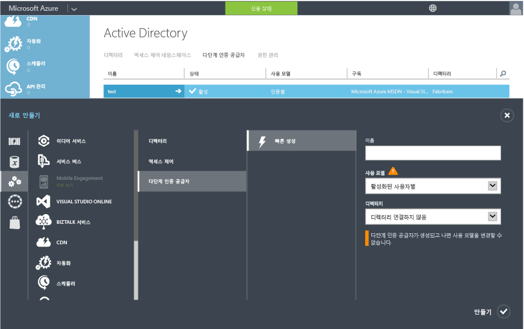

<properties 
	pageTitle="클라우드에서 Azure Multi-Factor Authentication 시작" 
	description="클라우드에서 Azure MFA 시작 방법을 설명하는 Azure Multi-Factor Authentication 페이지입니다." 
	services="multi-factor-authentication" 
	documentationCenter="" 
	authors="billmath" 
	manager="stevenpo" 
	editor="curtand"/>

<tags 
	ms.service="multi-factor-authentication" 
	ms.workload="identity" 
	ms.tgt_pltfrm="na" 
	ms.devlang="na" 
	ms.topic="get-started-article" 
	ms.date="12/10/2015" 
	ms.author="billmath"/>

# 클라우드에서 Azure Multi-Factor Authentication 시작

클라우드에서 다단계 인증을 사용하기로 결정했으므로 작업을 진행해 보겠습니다. Office 365용 Multi-Factor Authentication 또는 Azure 관리자를 위한 Multi-Factor Authentication을 사용하는 경우 3단계로 건너뛸 수 있습니다. 또한 이 문서에서는 다음 내용을 다룹니다.

1. [Azure 구독에 등록](https://azure.microsoft.com/pricing/free-trial/)
	- 아직 Azure 구독이 없는 경우 등록해야 합니다. Azure MFA를 시작하고 사용 방법을 간단히 알아보려면 평가판 구독을 사용할 수 있습니다.
2. [Multi-Factor Auth 공급자 만들기](#creating-an-azure-multi-factor-auth-provider) 또는 [Azure AD Premium 또는 Enterprise Mobility Suite 라이선스를 사용자에게 할당](#assigning-an-azure-ad-premium-or-enterprise-mobility-license-top-users)
	- Azure Multi-Factor Auth Provider를 만든 후 디렉터리에 할당하거나 Azure AD Premium 또는 EMS 사용자에게 라이선스를 할당해야 합니다. Azure Multi Factor Authentication은 Azure Active Directory Premium에 포함되어 있으므로 결과적으로는 Enterprise Mobility Suite에도 포함되어 있는 것입니다. Azure AD Premium 또는 EMS가 있고, Multi-Factor Auth 공급자를 만들 필요가 없으며 Azure AD Premium 또는 EMS 사용자에 대해 MFA를 사용하도록 설정하면 될 경우 Azure AD Premium 또는 EMS 라이선스를 해당 사용자에게 할당하면 됩니다. 그러면 관리자가 관리 포털을 통해 사용자에게 MFA를 할당할 수 있습니다. 사용자에게 라이선스를 할당하는 방법은 아래 섹션을 참조하세요.
3. [사용자를 위해 다단계 인증 켜기](#turn-on-multi-factor-authentication-for-users)
	- Office 365 또는 Azure 포털을 통해 사용자에게 Azure MFA를 사용하도록 설정합니다. 이 작업을 수행하는 방법에 자세한 내용은 아래 섹션을 참조하세요.
4. [최종 사용자에게 MFA에 대해 알리는 메일 보내기](#send-email-to-end-users)
	- 사용자의 계정에 대해 다단계 인증이 설정되어 있으면 이 사실을 알리는 메일을 보내는 것이 좋습니다. 이 사용자는 미리 알고 있는 상태에서 다음번에 로그인할 때 이 프로세스를 완료하라는 메시지가 표시되므로 당황하지 않을 수 있습니다. 메일 템플릿의 예는 아래 섹션을 참조하세요.

## Azure Multi-Factor Auth 공급자 만들기
다단계 인증은 기본적으로 Azure Active Directory 테넌트가 있는 전역 관리자를 위해 사용할 수 있습니다. 그렇지만 다단계 인증을 모든 사용자에게 확장하고 전역 관리자가 관리 포털, 사용자 지정 인사말, 보고서 등의 기능을 활용할 수 있게 하려면 Multi-Factor Auth 공급자를 구입하고 구성해야 합니다.

### Multi-Factor Auth 공급자를 만들려면
--------------------------------------------------------------------------------

1. 관리자 권한으로 Azure 포털에 로그온합니다.
2. 왼쪽 창에서 Active Directory를 선택합니다.
3. Active Directory 페이지 위쪽에서 Multi-Factor Authentication 공급자를 선택합니다. 아래쪽에서 **새로 만들기**를 클릭합니다.
4. 앱 서비스에서 활성 인증 공급자를 선택하고 빠른 생성을 선택합니다.
5. 다음 필드를 채우고 만들기를 선택합니다.
	1. 이름 – 활성 인증 공급자의 이름입니다.
	2. 사용 모델 – Multi-Factor Authentication 공급자의 사용 모델입니다.
		- 인증당 - 인증 단위로 요금이 청구되는 구매 모델입니다. 일반적으로 응용 프로그램에서 Azure Multi-Factor Authentication을 사용하는 시나리오에 사용됩니다.
		- 활성화된 사용자별 – 활성화된 사용자 단위로 요금이 청구되는 구매 모델입니다. 일반적으로 Office 365와 같은 시나리오에 사용됩니다.
	2. 디렉터리 – Multi-Factor Authentication 공급자와 연결된 Azure Active Directory 테넌트입니다. 다음에 주의하세요.
		- Multi-Factor Auth 공급자를 만드는 데 Azure AD 디렉터리가 필요하지는 않습니다. Azure Multi-factor Authentication 서버 또는 SDK를 사용하려는 경우 이 디렉터리는 비워 둘 수 있습니다.
		- 다단계 인증을 모든 사용자에게 확장하고 전역 관리자가 관리 포털, 사용자 지정 인사말, 보고서 등의 기능을 활용할 수 있게 하려면 Multi-Factor Auth 공급자를 Azure AD 디렉터리에 연결해야 합니다.
		- DirSync 또는 AAD Sync는 온-프레미스 Active Directory 환경을 Azure AD 디렉터리와 동기화하는 경우에만 필요합니다. Active Directory의 온-프레미스 인스턴스와 동기화되지 않은 Azure AD 디렉터리만 사용하는 경우에는 DirSync 또는 AAD 동기화가 필요하지 않습니다.
		

5. 만들기를 클릭하면 Multi-Factor Authentication 공급자가 생성되고 Multi-Factor Authentication 공급자를 만들었다는 메시지가 표시됩니다. 확인을 클릭합니다.

## 사용자에게 Azure AD Premium 또는 Enterprise Mobilitiy Suite 라이선스 할당

Azure AD Premium 또는 Enterprise Mobility Suite가 있으면 Multi-Factor Auth 공급자를 만들 필요가 없습니다. 사용자에게 라이선스를 할당하기만 하면 사용자에 대한 MFA를 켤 수 있습니다.

### Azure AD Premium 또는 엔터프라이즈 이동성 제품군 라이선스를 할당하려면
--------------------------------------------------------------------------------
<ol>

<li>관리자 권한으로 Azure 포털에 로그인합니다.</li>
<li>왼쪽 창에서 **Active Directory**를 선택합니다.</li>
<li>Active Directory 페이지에서 사용하도록 설정하려는 사용자가 있는 디렉토리를 두 번 클릭합니다.</li>
<li>디렉토리 페이지의 맨 위에서 **라이센스**를 선택합니다.</li>
<li>라이선스 페이지에서 Active Directory Premium 또는 엔터프라이즈 이동성 제품군을 선택한 후 **할당**을 클릭합니다.</li>

<li>대화 상자에서 라이선스를 할당하려는 사용자를 선택 하고 확인 표시 아이콘을 클릭하여 변경 내용을 저장합니다.</li>

## 사용자를 위해 다단계 인증 켜기

Azure Multi-Factor Authentication의 사용자 계정은 다음과 같은 3가지 상태를 갖습니다.

시스템 상태 | 설명 |영향 받는 비브라우저 앱| 참고 
:-------------: | :-------------: |:-------------: |:-------------: |
사용 안 함 | 다단계 인증에 등록되지 않은 새 사용자에 대한 기본 상태입니다.|아니요|사용자가 현재 다단계 인증을 사용하고 있지 않습니다.
사용 |사용자가 다단계 인증에 등록되었습니다.|아니요. 등록 프로세스가 완료될 때까지 계속 작업합니다.|사용자가 활성화되었지만 등록 프로세스를 완료하지 않았습니다. 다음 로그인 시 프로세스를 완료하라는 메시지가 표시됩니다.
적용|사용자가 등록되었으며 다단계 인증을 사용하기 위한 등록 프로세스를 완료했습니다.|예. 앱 암호가 생성되고 사용될 때까지 작업하지 않습니다. | 사용자가 등록을 완료했을 수도 있고 그렇지 않았을 수도 있습니다. 등록 프로세스를 완료한 경우 다단계 인증을 사용합니다. 그렇지 않은 경우 다음 로그인 시 프로세스 완료하라는 메시지가 표시됩니다.
인증 공급자가 있거나 사용자에게 라이선스를 할당했으므로 다음으로 해당 디렉터리의 사용자에 대해 MFA를 설정해야 합니다. 다음 절차를 사용하여 사용자에 대해 MFA를 사용하도록 설정하세요.

### 다단계 인증을 설정하려면
--------------------------------------------------------------------------------
1.  관리자 권한으로 Azure 관리 포털에 로그인합니다.
2.  왼쪽에서 Active Directory를 클릭합니다.
3.  디렉터리 아래에서 사용하도록 설정하려는 사용자에 대한 디렉터리 클릭합니다.
4.  위쪽에서 사용자를 클릭합니다.
5.  페이지의 아래쪽에서 다단계 인증 관리를 클릭합니다.
6.  다단계 인증을 사용하도록 설정할 사용자를 찾습니다. 위쪽에서 보기를 변경해야 할 수 있습니다. 사용자의 상태가 사용 안 함인지 확인하고 이름 옆의 확인란을 선택합니다.
7.  이렇게 하면 오른쪽에 사용 및 사용자 설정 관리의 두 옵션이 표시됩니다. 사용을 클릭합니다. 그러면 해당 사용자에 대해 수행해야 하는 다음 단계를 지정하는 팝업이 표시됩니다. 다단계 인증 사용을 클릭합니다.
8.  사용자를 설정한 후에는 비브라우저 앱을 사용하는 방법과 사용자가 잠겨 있지 않다는 사실을 알리는 메일을 보내는 것이 좋습니다.

Windows PowerShell을 사용하여 사용자의 상태를 변경하려면 다음을 사용할 수 있습니다. 위에 언급된 상태 중 하나로 `$st.State`를 변경할 수 있습니다.

		$st = New-Object -TypeName Microsoft.Online.Administration.StrongAuthenticationRequirement
		$st.RelyingParty = "*"
		$st.State = “Enabled”
		$sta = @($st)
		Set-MsolUser -UserPrincipalName bsimon@contoso.com -StrongAuthenticationRequirements $sta

## 최종 사용자에게 메일 보내기

사용자를 설정한 후에는 연락처 정보를 제공해야 함을 알리는 메일을 보내는 것이 좋습니다. 다음은 사용자가 볼 수 있는 비디오에 대한 링크가 포함된 메일 템플릿입니다.

		Subject: ACTION REQUIRED: Your password for Outlook and other apps needs updated

		Body:

		For added security, we have enabled multi-factor authentication for your account. 

		Action Required: You will need to complete the enrollment steps below to make your account secure with multi-factor authentication.  

		What to expect once MFA is enabled:

		Multi-factor authentication requires a password that you know and a phone that you have in order to sign into browser applications and to access Office 365, Azure portals.

		For Office 365 non-browser applications such as outlook, lync, a mail client on your mobile device etc, a special password called an app password is required instead of your account password to sign in. App passwords are different than your account password, and are generated during the multi-factor authentication set up process. 

		Please follow these enrollment steps to avoid interruption of your Office 365 service:

			1.  Sign in to the Office 365 Portal at http://portal.microsoftonline.com.
			2.  Follow the instructions to set up your preferred multi-factor authentication method when signing into Office 365 using a web browser. 
			3.  Create one app password for each device.
			4.  Enter the same app password in all applicable apps on that device e.g. Outlook, Mail client, Lync, Word, Powerpoint, Excel, CRM etc. 
			5.  Update your Office client applications or other mobile applications to use an app password.

		You can visit http://aka.ms/mfasetup to create app passwords or change your MFA Setting.  Please bookmark this.

		NOTE: Before entering an app password, you will need to clear the sign-in information (delete sign-in info), restart the application,   and sign-in with the username and app password. Follow the steps documented : http://technet.microsoft.com/library/dn270518.aspx#apppassword.

		Watch a video showing these steps at http://g.microsoftonline.com/1AX00en/175.

		Best Regards,
		Your Administrator

## 다음 단계
클라우드에서 다단계 인증을 설정했으므로 [Azure Multi-Factor Authentication 구성](multi-factor-authentication-whats-next.md)으로 이동하여 다음에 수행할 작업을 계속 진행할 수 있습니다. 여기에서 보고, 사기 경고, 음성 메시지 사용자 지정 및 Azure Multi-Factor Authentication에서 제공해야 하는 모든 기능에 대해 알아볼 수 있습니다.

<!---HONumber=AcomDC_1210_2015-->