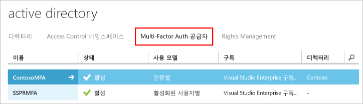

# Azure Multi-Factor Authentication 서버로 시작하기

온-프레미스 Multi-Factor Authentication 서버를 사용할지 여부를 결정했으므로 다음으로 진행합니다. 이 페이지에서는 서버를 새롭게 설치하고 이를 온-프레미스 Active Directory를 사용하여 설정하는 것을 다룹니다. MFA 서버가 이미 설치되어 있고 업그레이드를 고려하는 경우 [최신 Azure Multi-Factor Authentication 서버로 업그레이드](multi-factor-authentication-server-upgrade.md)를 참조하세요. 웹 서비스만 설치하는 정보는 [Azure Multi-Factor Authentication 서버 모바일 앱 웹 서비스 배포](multi-factor-authentication-get-started-server-webservice.md)를 참조하세요.
 

## Azure Multi-Factor Authentication 서버 다운로드
Azure Multi-factor Authentication 서버를 다운로드할 수 있는 두 가지 다른 방식이 있습니다. 두 방식 모두 Azure 포털을 통해 수행할 수 있습니다. 첫 번째는 Multi-Factor Auth 공급자를 직접 관리하여 수행합니다. 두 번째는 서비스 설정을 통해 수행합니다. 두 번째 옵션은 Multi-Factor Auth 공급자나 Azure MFA, Azure AD Premium 또는 Enterprise Mobility Suite 라이선스가 필요합니다.

> [!Important]
> 이러한 두 옵션은 비슷해 보이지만 어떤 옵션을 사용할지 알아야 합니다. 사용자에게 MFA(Azure MFA, Azure AD Premium 또는 Enterprise Mobility + Security)와 함께 제공되는 라이선스가 있는 경우 서버 다운로드를 시작하기 위해 Multi-Factor Auth 공급자를 만들지 마십시오. 대신 서비스 설정 페이지에서 서버를 다운로드하는 옵션 2를 사용합니다. 

### 옵션 1: Azure 클래식 포털에서 Azure Multi-Factor Authentication 서버 다운로드

Multi-Factor Auth 공급자가 있는 경우 활성화된 사용자나 인증 단위별로 MFA에 대한 요금을 지불하기 때문에 이 다운로드 옵션을 사용합니다. 

1. 관리자 권한으로 [Azure 클래식 포털](https://manage.windowsazure.com)에 로그인합니다.
2. 왼쪽 창에서 **Active Directory**를 선택합니다.
3. Active Directory 페이지에서 **Multi-Factor Auth 공급자**
    를 클릭합니다.
4. 아래쪽에서 **관리**를 클릭합니다. 새 페이지가 열립니다.
5. **다운로드**를 클릭합니다.
6. **정품 인증 자격 증명 생성** 위의 **다운로드** 링크를 클릭합니다.
   
7. 다운로드 파일을 저장합니다.

### 옵션 2: 서비스 설정에서 Azure Multi-Factor Authentication 서버 다운로드

Enterprise Mobility Suite, Azure AD Premium 또는 Enterprise Cloud Suite 라이선스가 있는 경우 이 다운로드 옵션을 사용합니다. 

1. 관리자 권한으로 [Azure 클래식 포털](https://manage.windowsazure.com)에 로그인합니다.
2. 왼쪽 창에서 **Active Directory**를 선택합니다.
3. Azure AD 인스턴스를 두 번 클릭합니다.
4. 위쪽에서 **구성**
5. **Multi-Factor Authentication** 섹션까지 아래로 스크롤하고 **서비스 설정 관리**를 선택합니다.
6. 서비스 설정 페이지의 화면 아래쪽에서 **포털로 이동**을 클릭합니다. 새 페이지가 열립니다.
   
7. **다운로드**
8. **정품 인증 자격 증명 생성** 위의 **다운로드** 링크를 클릭합니다.
    
9. 다운로드 파일을 저장합니다.

## Azure Multi-Factor Authentication 서버 설치 및 구성
서버를 다운로드했으므로 이제 서버를 설치하고 구성할 수 있습니다.  설치하려는 서버가 다음 요구 사항을 충족하는지 확인하십시오.

| Azure Multi-Factor Authentication 서버 요구 사항 | 설명 |
|:--- |:--- |
| 하드웨어 |<li>200MB의 하드 디스크 공간</li><li>x32 또는 x64 지원 프로세서</li><li>1GB 이상 RAM</li> |
| 소프트웨어 |<li>호스트가 서버 OS인 경우 Windows Server 2008 이상</li><li>호스트가 클라이언트 OS인 경우 Windows 7 이상</li><li>Microsoft .NET 4.0 Framework</li><li>사용자 포털 또는 웹 서비스 SDK를 설치하는 경우 IIS 7.0 이상</li> |

### Azure Multi-Factor Authentication 방화벽 요구 사항
- - -
각 MFA 서버는 다음 주소로 포트 443 아웃바운드에서 통신할 수 있어야 합니다.

* https://pfd.phonefactor.net
* https://pfd2.phonefactor.net
* https://css.phonefactor.net

아웃바운드 방화벽이 포트 443에서 제한되는 경우 다음 IP 주소 범위를 엽니다.

| IP 서브넷 | 네트워크 마스크 | IP 범위 |
|:--- |:--- |:--- |
| 134.170.116.0/25 |255.255.255.128 |134.170.116.1 – 134.170.116.126 |
| 134.170.165.0/25 |255.255.255.128 |134.170.165.1 – 134.170.165.126 |
| 70.37.154.128/25 |255.255.255.128 |70.37.154.129 – 70.37.154.254 |

이벤트 확인 기능을 사용하지 않고 사용자가 모바일 앱을 사용하여 회사 네트워크의 장치에서 확인하지 않는 경우 다음 범위만 필요합니다.

| IP 서브넷 | 네트워크 마스크 | IP 범위 |
|:--- |:--- |:--- |
| 134.170.116.72/29 |255.255.255.248 |134.170.116.72 – 134.170.116.79 |
| 134.170.165.72/29 |255.255.255.248 |134.170.165.72 – 134.170.165.79 |
| 70.37.154.200/29 |255.255.255.248 |70.37.154.201 – 70.37.154.206 |

### Azure Multi-Factor Authentication 서버를 설치 및 구성하려면

이 단계 다음에는 구성 마법사에서 빠른 설치가 표시됩니다. 마법사가 보이지 않거나 마법사를 다시 실행하려면 서버의 **도구** 메뉴에서 선택할 수 있습니다.

1. 실행 파일을 두 번 클릭합니다. 
2. 설치 폴더 선택 화면에서 해당 폴더가 정확한지 확인하고 **다음**을 클릭합니다.
3. 설치가 완료되면 **마침**을 클릭합니다.  구성 마법사가 시작됩니다.
4. 구성 마법사 시작 화면에서 **인증 구성 마법사를 사용하여 건너뛰기**에 체크 표시하고 **다음**을 클릭합니다.  마법사가 닫히고 서버가 시작됩니다.
    
5. 서버를 다운로드한 페이지로 돌아가서 **정품 인증 자격 증명 생성** 버튼을 클릭합니다. 이 정보를 제공된 상자의 Azure MFA 서버에 복사하고 **활성화**를 클릭합니다.

## Active Directory에서 사용자 가져오기
이제 서버를 설치 및 구성했으므로 Azure MFA 서버로 사용자를 신속하게 가져올 수 있습니다.

1. Azure MFA 서버의 왼쪽에서 **사용자**를 선택합니다.
2. 아래쪽에서 **Active Directory에서 가져오기**를 선택합니다.
3. 이제 개별 사용자를 검색하거나 해당 사용자로 OU에 대한 AD 디렉터리를 검색할 수 있습니다.  이 경우 사용자 OU를 지정합니다.
4. 오른쪽의 모든 사용자를 강조 표시하고 **가져오기**를 클릭합니다.  성공했음을 알려주는 팝업 메시지가 나타납니다.  가져오기 창을 닫습니다.

## 사용자에게 전자 메일 보내기
사용자를 MFA 서버에 가져왔으니,&2;단계 인증에 등록되었음을 알리는 전자 메일을 보냅니다.

전자 메일을 보내는 작업은&2;단계 인증에 사용자를 구성하는 방법으로 결정되어야 합니다. 예를 들어, 회사 디렉터리에서 전화 번호를 가져올 수 있었다면 사용자가 예상하는 것을 알 수 있도록 전자 메일에 기본 전화 번호가 포함되어 있습니다. 전화 번호를 가져오지 않았거나 사용자가 모바일 앱을 사용하려는 경우 하이퍼링크를 통해 Azure Multi-Factor Authentication 사용자 포털에 계정 등록을 완료하도록 안내하는 이메일을 보냅니다.

또한 전자 메일의 내용은 사용자에 대해 설정된 인증 방법(전화 통화, SMS, 모바일 앱)에 따라 달라집니다.  예를 들어 사용자가 인증할 때 PIN을 사용해야 하는 경우 전자 메일은 초기 PIN 설정 내용을 알려줍니다.  사용자는 처음 인증할 때 PIN을 변경해야 합니다.

### 전자 메일 및 전자 메일 템플릿 구성
왼쪽에 있는 전자 메일 아이콘을 클릭하여 이 전자 메일 보내기에 대한 설정을 설정합니다. 여기서 메일 서버의 SMTP 정보를 입력할 수 있으며 **전자 메일을 사용자에게 보내기** 확인란을 선택하여 메일을 보낼 수 있습니다.

전자 메일 내용 탭에서 선택할 수 있는 전자 메일 템플릿을 확인할 수 있습니다. 사용자가&2;단계 인증을 수행하도록 구성한 방법에 따라 가장 적합한 템플릿을 선택합니다.

## Azure Multi-Factor Authentication 서버에서 사용자 데이터를 처리하는 방법
MFA(Multi-Factor Authentication) 서버 온-프레미스를 사용하면 사용자의 데이터가 온-프레미스 서버에 저장됩니다. 영구 사용자 데이터는 클라우드에 저장되지 않습니다. 사용자가&2;단계 인증을 수행하면 MFA 서버가 인증을 수행할 Azure MFA 클라우드 서비스에 데이터를 보냅니다. 이러한 인증 요청이 클라우드 서비스에 전송되면 다음 필드가 요청 및 로그에 전송되어 고객의 인증/사용 보고서에서 사용할 수 있게 됩니다. 일부 필드는 선택 사항이므로 Multi-Factor Authentication 서버 내에서 사용하거나 사용하지 않도록 설정할 수 있습니다. MFA 서버에서 MFA 클라우드 서비스로의 통신은 포트 443 아웃바운드를 통해 연결된 SSL/TLS를 사용합니다. 이러한 필드는 다음과 같습니다.

* 고유 ID - 사용자 이름 또는 내부 MFA 서버 ID 
* 이름과 성(선택 사항)
* 메일 주소(선택 사항)
* 전화 번호 - 음성 통화 또는 SMS 인증을 수행할 때
* 장치 토큰 - 모바일 앱 인증을 수행할 때
* 인증 모드
* 인증 결과
* MFA 서버 이름
* MFA 서버 IP
* 클라이언트 IP - 사용 가능한 경우

위의 필드 외에도 인증 결과(성공/거부) 및 모든 거부 사유는 인증 데이터와 함께 저장되어 인증/사용 보고서를 통해 사용할 수 있습니다.

## 다음 단계

- 사용자 셀프 서비스를 위해 [사용자 포털](multi-factor-authentication-get-started-portal.md)을 설정 및 구성합니다.

- [Active Directory Federation Service](multi-factor-authentication-get-started-adfs.md)를 사용하여 Azure Multi-Factor Authentication 설정

- [RADIUS 인증](multi-factor-authentication-get-started-server-radius.md)을 사용하여 Azure MFA Server 설정 및 구성 RADIUS를 사용하면 Azure MFA 서버와 다양한 타사 시스템을 통합할 수 있습니다. 

- [Windows 인증](multi-factor-authentication-get-started-server-windows.md)을 사용하여 Azure MFA Server를 설정 및 구성합니다.

- [RADIUS를 사용하여 원격 데스크톱 게이트웨이 및 Azure Multi-Factor Authentication 서버](multi-factor-authentication-get-started-server-rdg.md)를 설정 및 구성합니다. 

- [Azure Multi-Factor Authentication 서버 모바일 앱 웹 서비스 배포](multi-factor-authentication-get-started-server-webservice.md)

- [Azure Multi-Factor Authentication 및 타사 VPN을 사용한 고급 시나리오](multi-factor-authentication-advanced-vpn-configurations.md)

