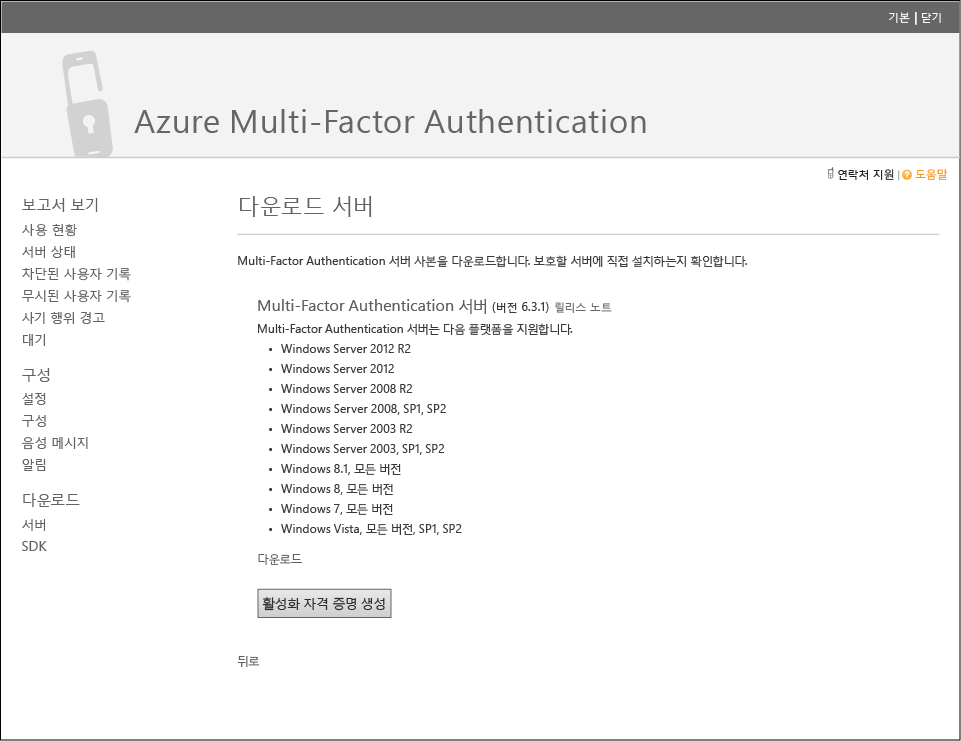
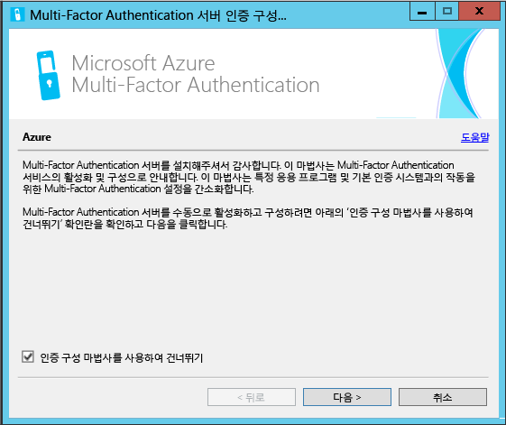
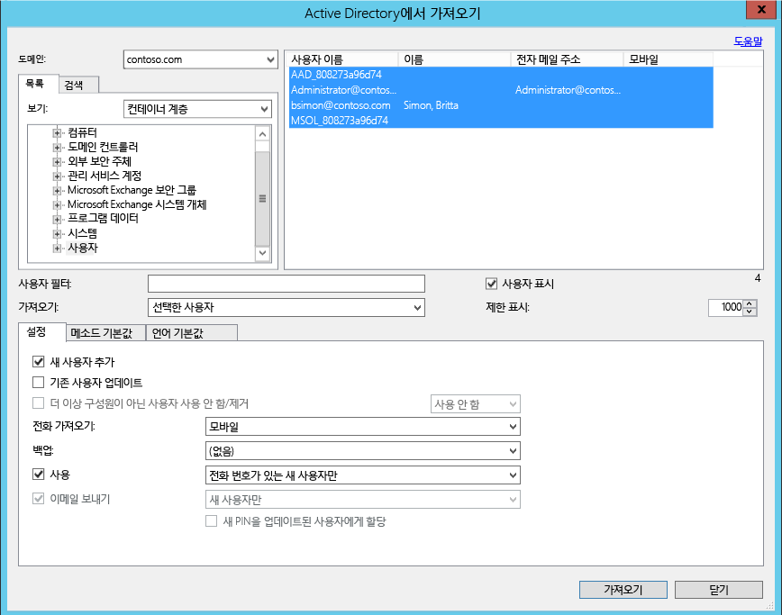
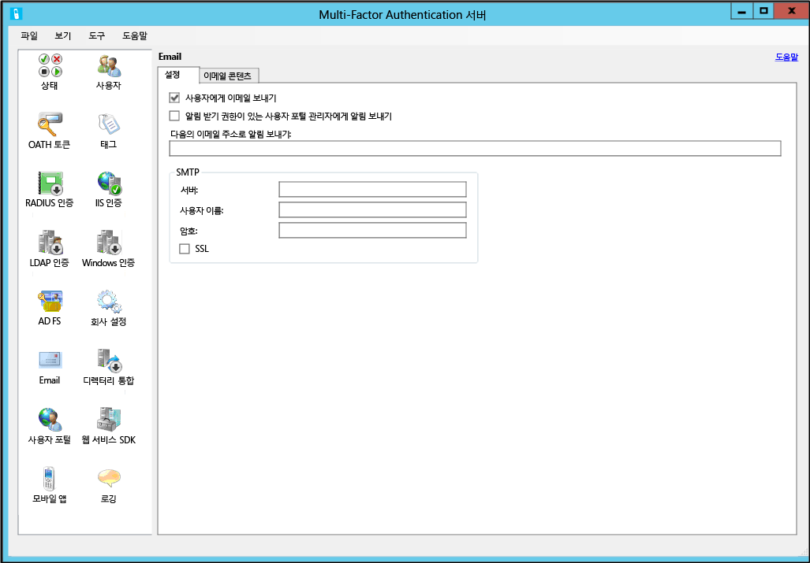
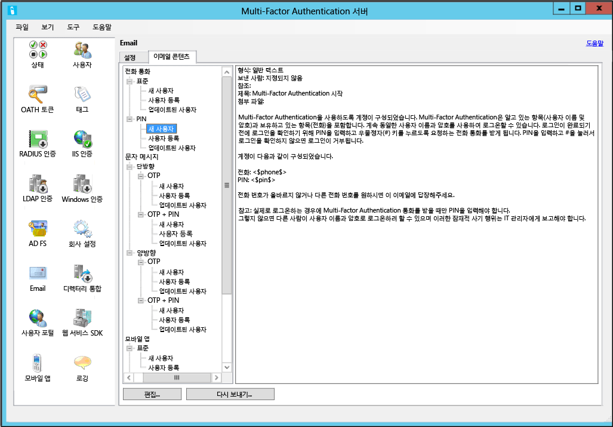

<properties 
	pageTitle="Azure Multi-Factor Authentication 서버로 시작하기"
	description="Azure MFA 서버 시작 방법을 설명하는 Azure 다단계 인증 페이지입니다."
	services="multi-factor-authentication"
	keywords="인증 서버, Azure Multi Factor Authentication 앱 활성화 페이지, 인증 서버 다운로드"
	documentationCenter=""
	authors="kgremban"
	manager="femila"
	editor="curtand"/>

<tags
	ms.service="multi-factor-authentication"
	ms.workload="identity"
	ms.tgt_pltfrm="na"
	ms.devlang="na"
	ms.topic="get-started-article"
	ms.date="08/15/2016"
	ms.author="kgremban"/>

# Azure Multi-Factor Authentication 서버로 시작하기

온-프레미스 Multi-Factor Authentication를 사용할지 여부를 결정했으므로 다음으로 진행합니다. 이 페이지에서는 서버를 새롭게 설치하고 이를 온-프레미스 Active Directory를 사용하여 설정하는 것을 다룹니다. 이미 설치된 PhoneFactor 서버가 있고 업그레이드할 방법을 찾는 경우 [Azure Multi-Factor 서버로 업그레이드하기](multi-factor-authentication-get-started-server-upgrade.md)를 참조하거나 웹 서비스만을 설치하는 정보를 찾는 경우 [Azure Multi-Factor Authentication 서버 모바일 앱 웹 서비스 배포하기](multi-factor-authentication-get-started-server-webservice.md)를 참조하십시오.

## Azure Multi-Factor Authentication 서버 다운로드

Azure Multi-factor Authentication 서버를 다운로드할 수 있는 두 가지 다른 방식이 있습니다. 두 방식 모두 Azure 포털을 통해 수행할 수 있습니다. 첫 번째는 Multi-Factor Auth 공급자를 직접 관리하여 수행합니다. 두 번째는 서비스 설정을 통해 수행합니다. 두 번째 옵션은 Multi-Factor Auth 공급자 또는 Azure MFA, Azure AD Premium 또는 Enterprise Mobility Suite 라이선스가 필요합니다.

### Azure 포털에서 Azure Multi-Factor Authentication 서버를 다운로드하려면
--------------------------------------------------------------------------------

1. 관리자 권한으로 Azure 포털에 로그인합니다.
2. 왼쪽에서 Active Directory를 선택합니다.
3. Active Directory 페이지의 위쪽에서 **Multi-Factor Auth 공급자**를 클릭합니다.
4. 아래쪽에서 **관리**를 클릭합니다.
5. 그러면 새 페이지가 열립니다. **다운로드**를 클릭합니다. 
6. **정품 인증 자격 증명 생성** 위의 **다운로드**를 클릭합니다. 
7. 다운로드 파일을 저장합니다.

### 서비스 설정을 통해 Azure Multi-Factor Authentication 서버를 다운로드하려면

1. 관리자 권한으로 Azure 포털에 로그인합니다.
2. 왼쪽에서 Active Directory를 선택합니다.
3. Azure AD 인스턴스를 두 번 클릭합니다.
4. 위쪽에서 **구성**을 클릭합니다. 
5. Multi-Factor Authentication 아래에서 **서비스 설정 관리**를 선택합니다.
6. 서비스 설정 페이지 화면 아래쪽에서 **포털로 이동** 을 클릭합니다.
7. 그러면 새 페이지가 열립니다. **다운로드**를 클릭합니다.
8. **정품 인증 자격 증명 생성** 위의 **다운로드**를 클릭합니다.
9. 다운로드 파일을 저장합니다.

## Azure Multi-Factor Authentication 서버 설치 및 구성
서버를 다운로드했으므로 이제 서버를 설치하고 구성할 수 있습니다. 설치하려는 서버가 다음 요구 사항을 충족하는지 확인하십시오.

Azure Multi-Factor Authentication 서버 요구 사항|설명|
:------------- | :------------- |
하드웨어|<li>200MB의 하드 디스크 공간</li><li>x32 또는 x64 지원 프로세서</li><li>1GB 이상 RAM</li>
소프트웨어|<li>호스트가 서버 OS인 경우 Windows Server 2008 이상</li><li>호스트가 클라이언트 OS인 경우 Windows 7 이상</li><li>Microsoft .NET 4.0 Framework</li><li>사용자 포털 또는 웹 서비스 SDK를 설치하는 경우 IIS 7.0 이상</li>

### Azure Multi-Factor Authentication 방화벽 요구 사항
--------------------------------------------------------------------------------
각 MFA 서버는 다음으로 아웃바운드되는 포트 443에서 통신할 수 있어야 합니다.

- https://pfd.phonefactor.net
- https://pfd2.phonefactor.net
- https://css.phonefactor.net

아웃바운드 방화벽이 포트 443에서 제한되는 경우 다음 IP 주소 범위를 열어야 합니다.

IP 서브넷|네트워크 마스크|IP 범위
:------------- | :------------- | :------------- |
134\.170.116.0/25|255\.255.255.128|134\.170.116.1 – 134.170.116.126
134\.170.165.0/25|255\.255.255.128|134\.170.165.1 – 134.170.165.126
70\.37.154.128/25|255\.255.255.128|70\.37.154.129 – 70.37.154.254

Azure Multi-factor Authentication 이벤트 확인 기능을 사용하지 않는 경우 및 사용자가 회사 네트워크의 장치에서 Multi-Factor Auth 모바일 앱을 사용하여 인증하지 않는 경우 IP 범위를 다음과 같이 줄일 수 있습니다.

IP 서브넷|네트워크 마스크|IP 범위
:------------- | :------------- | :------------- |
134\.170.116.72/29|255\.255.255.248|134\.170.116.72 – 134.170.116.79
134\.170.165.72/29|255\.255.255.248|134\.170.165.72 – 134.170.165.79
70\.37.154.200/29|255\.255.255.248|70\.37.154.201 – 70.37.154.206

### Azure Multi-Factor Authentication 서버를 설치 및 구성하려면
--------------------------------------------------------------------------------

1. 실행 파일을 두 번 클릭합니다. 설치가 시작됩니다.
2. 설치 폴더 선택 화면에서 해당 폴더가 정확한지 확인하고 다음을 클릭합니다.
3. 설치가 완료되면 마침을 클릭합니다. 그러면 구성 마법사가 시작됩니다.
4. 구성 마법사 시작 화면에서 **인증 구성 마법사를 사용하여 건너뛰기**를 선택한 후 **다음**을 클릭합니다.  마법사가 닫히고 서버가 시작됩니다.

5. 서버를 다운로드한 페이지로 돌아가서 **정품 인증 자격 증명 생성** 버튼을 클릭합니다. 이 정보를 제공된 상자의 Azure MFA 서버에 복사하고 **활성화**를 클릭합니다.

위의 단계에서는 구성 마법사를 사용한 빠른 설치를 보여줍니다. 서버의 도구 메뉴에서 선택하여 인증 마법사를 다시 실행할 수 있습니다.

##Active Directory에서 사용자 가져오기

이제 서버를 설치 및 구성했으므로 Azure MFA 서버로 사용자를 신속하게 가져올 수 있습니다.

### Active Directory에서 사용자를 가져오려면
--------------------------------------------------------------------------------

1. Azure MFA 서버의 왼쪽에서 **사용자**를 선택합니다.
2. 아래쪽에서 **Active Directory에서 가져오기**를 선택합니다.
3. 이제 개별 사용자를 검색하거나 해당 사용자로 OU에 대한 AD 디렉터리를 검색할 수 있습니다. 이 경우 사용자 OU를 지정합니다.
4. 오른쪽의 모든 사용자를 강조 표시하고 **가져오기**를 클릭합니다. 성공했음을 알려주는 팝업 메시지가 나타납니다. 가져오기 창을 닫습니다.

## 사용자에게 전자 메일 보내기
사용자를 Azure Multi-factor Authentication 서버로 가져오므로 사용자에게 multi-factor authentication에 등록되었음을 알리는 전자 메일을 보내는 것이 좋습니다.

Azure Multi-factor Authentication 서버와 함께 다양한 방법으로 다중 요소 인증을 사용하도록 사용자를 구성할 수 있습니다. 예를 들어, 사용자의 전화번호를 알거나 회사 디렉터리에서 Azure Multi-Factor Authentication 서버로 전화번호를 가져올 수 있으면, 전자 메일로 사용자가 Azure Multi-Factor Authentication을 사용하여 구성되었음을 알 수 있으며 Azure Multi-Factor Authentication 사용에 대한 일부 지침을 제공하고 인증을 받는 전화번호의 사용자에게 알립니다.

전자 메일의 내용은 사용자에 대해 설정된 인증 방법(예: 전화 통화, SMS, 모바일 앱)에 따라 달라집니다. 예를 들어 사용자가 인증할 때 PIN을 사용해야하는 경우 전자 메일은 초기 PIN 설정 내용을 알려줍니다. 사용자가 처음 인증할 때 PIN을 변경하려면 일반적으로 필요합니다.

사용자의 전화번호 또는 Azure Multi-Factor Authentication 서버를 구성하거나 서버로 가져오지 않거나, 또는 사용자가 인증에 모바일 앱이 사용되도록 미리 구성된 경우, Azure Multi-Factor Authentication을 사용하도록 구성되었음을 알려주는 전자 메일을 보내고 Azure Multi-Factor Authentication 사용자 포털을 통해 계정 등록을 완료하도록 지시합니다. 사용자가 클릭하여 사용자 포털에 액세스하는 하이퍼링크가 포함됩니다. 사용자가 하이퍼링크를 클릭하면 웹브라우저가 열리고 회사의 Azure Multi-Factor Authentication 사용자 포털로 이동합니다.

### 전자 메일 및 전자 메일 템플릿 구성

왼쪽에 있는 전자 메일 아이콘을 클릭하여 이 전자 메일 보내기에 대한 설정을 설정할 수 있습니다. 여기서 메일 서버의 SMTP 정보를 입력할 수 있으며 전자 메일을 사용자에게 보내기 검사 확인란을 추가하여 블랭킷 전체 메일을 보낼 수 있습니다.

전자 메일 내용 탭 중에서 선택할 수 있는 다양한 전자 메일 템플릿을 모두 표시합니다. 사용자가 multi-factor authentication을 사용하기 위해 구성한 방법에 따라, 가장 적합한 템플릿을 선택할 수 있습니다.

## Azure Multi-Factor Authentication 서버에서 사용자 데이터를 처리하는 방법

MFA(Multi-Factor Authentication) 서버 온-프레미스를 사용하면 사용자의 데이터가 온-프레미스 서버에 저장됩니다. 영구 사용자 데이터는 클라우드에 저장되지 않습니다. 사용자가 2단계 인증을 수행하면 MFA 서버가 인증을 수행할 Azure MFA 클라우드 서비스에 데이터를 보냅니다. 이러한 인증 요청이 클라우드 서비스에 전송되면 다음 필드가 요청 및 로그에 전송되어 고객의 인증/사용 보고서에서 사용할 수 있게 됩니다. 일부 필드는 선택 사항이므로 Multi-Factor Authentication 서버 내에서 사용하거나 사용하지 않도록 설정할 수 있습니다. MFA 서버에서 MFA 클라우드 서비스로의 통신은 포트 443 아웃바운드를 통해 연결된 SSL/TLS를 사용합니다. 이러한 필드는 다음과 같습니다.

- 고유 ID - 사용자 이름 또는 내부 MFA 서버 ID
- 이름과 성 - 선택 사항
- 메일 주소 - 선택 사항
- 전화 번호 - 음성 통화 또는 SMS 인증을 수행할 때
- 장치 토큰 - 모바일 앱 인증을 수행할 때
- 인증 모드
- 인증 결과
- MFA 서버 이름
- MFA 서버 IP
- 클라이언트 IP - 사용 가능한 경우

위의 필드 외에도 인증 결과(성공/거부) 및 모든 거부 사유는 인증 데이터와 함께 저장되어 인증/사용 보고서를 통해 사용할 수 있습니다.

## 고급 Azure Multi-Factor Authentication 서버 구성
고급 설정 및 구성 정보에 대한 추가 정보는 아래 표를 사용합니다.

메서드|설명
:------------- | :------------- |
[사용자 포털](multi-factor-authentication-get-started-portal.md)| 배포 및 사용자 셀프 서비스를 포함한 사용자 포털 설정 및 구성에 대한 정보입니다.
[Active Directory Federation Service](multi-factor-authentication-get-started-adfs.md)|AD FS를 사용한 Azure Multi-Factor Authentication 설정에 대한 정보입니다.
[RADIUS 인증](multi-factor-authentication-get-started-server-radius.md)| RADIUS를 사용한 Azure MFA 서버 구성 및 설치에 대한 정보입니다.
[IIS 인증](multi-factor-authentication-get-started-server-iis.md)|IIS를 사용한 Azure MFA 서버 구성 및 설치에 대한 정보입니다.
[Windows 인증](multi-factor-authentication-get-started-server-windows.md)| Windows 인증을 사용한 Azure MFA 서버 구성 및 설치에 대한 정보입니다.
[LDAP 인증](multi-factor-authentication-get-started-server-ldap.md)|LDAP 인증을 사용한 Azure MFA 서버 구성 및 설치에 대한 정보입니다.
[RADIUS를 사용한 원격 데스크톱 게이트웨이 및 Azure Multi-Factor Authentication 서버](multi-factor-authentication-get-started-server-rdg.md)| RADIUS를 사용한 원격 데스크톱 게이트웨이에서 Azure MFA 서버 구성 및 설치에 대한 정보입니다.
[Windows Server Active Directory와 동기화](multi-factor-authentication-get-started-server-dirint.md)|Active Directory와 Azure MFA 서버 간의 동기화 설정 및 구성에 대한 정보입니다.
[Azure Multi-Factor Authentication 서버 모바일 앱 웹 서비스](multi-factor-authentication-get-started-server-webservice.md)|Azure MFA 서버 웹 서비스 구성 및 설치에 대한 정보입니다.

<!---HONumber=AcomDC_0928_2016-->