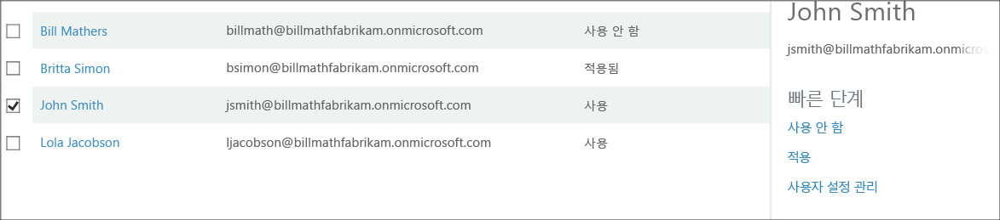

<properties 
	pageTitle="Microsoft Azure Multi-Factor Authentication 사용자 상태"
	description="Azure MFA의 사용자 상태에 대해 알아보세요."
	services="multi-factor-authentication"
	documentationCenter=""
	authors="kgremban"
	manager="femila"
	editor="curtand"/>

<tags
	ms.service="multi-factor-authentication"
	ms.workload="identity"
	ms.tgt_pltfrm="na"
	ms.devlang="na"
	ms.topic="article"
	ms.date="08/04/2016"
	ms.author="kgremban"/>

# Azure Multi-Factor Authentication의 사용자 상태

Azure Multi-Factor Authentication의 사용자 계정은 다음과 같은 3가지 상태를 갖습니다.

시스템 상태 | 설명 |영향 받는 비브라우저 앱| 참고 사항
:-------------: | :-------------: |:-------------: |:-------------: |
사용 안 함 | 다단계 인증에 등록되지 않은 새 사용자에 대한 기본 상태입니다.|아니요|사용자는 Multi-Factor Authentication을 사용하고 있지 않습니다.
사용 |사용자가 다단계 인증에 등록되었습니다.|아니요. 등록 프로세스가 완료될 때까지 계속 작업합니다.|사용자가 활성화되었지만 등록 프로세스를 완료하지 않았습니다. 다음 로그인 시 프로세스를 완료하라는 메시지가 표시됩니다.
적용|사용자가 등록되었으며 다단계 인증을 사용하기 위한 등록 프로세스를 완료했습니다.|예. 앱에 앱 암호가 필요합니다. | 사용자가 등록을 완료했을 수도 있고 그렇지 않았을 수도 있습니다. 등록 프로세스를 완료한 경우 Multi-Factor Authentication을 사용합니다. 그렇지 않은 경우 사용자에게 다음 로그인 시 프로세스를 완료하라는 메시지가 표시됩니다.

## 사용자 상태 변경
사용자 상태는 MFA가 설정되었는지 여부 및 사용자가 프로세스를 완료했는지 여부에 따라 달라집니다. 사용자에 대해 MFA를 설정하면 사용자 상태가 사용에서 사용 안 함으로 변경됩니다. 사용 상태로 변경된 사용자가 로그인하고 프로세스를 완료하면 상태가 적용으로 바뀝니다.

### 사용자 상태를 보려면
--------------------------------------------------------------------------------
1.  관리자 권한으로 **Azure 클래식 포털**에 로그인합니다.
2.  왼쪽에서 **Active Directory**를 클릭합니다.
3.  **디렉터리**에서 사용하도록 설정하려는 사용자에 대한 디렉터리 클릭합니다. 
4.  위쪽에서 **사용자**를 클릭합니다.
5.  페이지의 아래쪽에서 **Multi-Factor Auth 관리**를 클릭합니다. 
6.  그러면 새 브라우저 탭이 열립니다. 사용자 상태가 표시됩니다. 

###상태를 사용 안 함에서 사용으로 변경하려면
1.  관리자 권한으로 **Azure 클래식 포털**에 로그인합니다.
2.  왼쪽에서 **Active Directory**를 클릭합니다.
3.  **디렉터리**에서 사용하도록 설정하려는 사용자에 대한 디렉터리 클릭합니다. 
4.  위쪽에서 **사용자**를 클릭합니다.
5.  페이지의 아래쪽에서 **Multi-Factor Auth 관리**를 클릭합니다. 
6.  그러면 새 브라우저 탭이 열립니다. 다단계 인증을 사용하도록 설정할 사용자를 찾습니다. 위쪽에서 보기를 변경해야 할 수 있습니다. 상태가 **사용 안 함**인지 확인합니다. 
7.  이름 옆의 상자에 **확인 표시**를 합니다.
7.  오른쪽에서 **사용**을 클릭합니다. 
8.  **다단계 인증 사용**을 클릭합니다. 
9.  사용자의 상태가 **사용 안 함**에서 **사용**으로 변경됩니다. 
10.  사용자를 사용하도록 설정하면 전자 메일을 통해 알리는 것이 좋습니다. 또한 잠그지 않으려면 비 브라우저 앱을 사용할 수 있는 방법을 알려야 합니다.

### 상태를 사용/적용에서 사용 안 함으로 변경하려면
1.  관리자 권한으로 **Azure 클래식 포털**에 로그인합니다.
2.  왼쪽에서 **Active Directory**를 클릭합니다.
3.  **디렉터리**에서 사용하도록 설정하려는 사용자에 대한 디렉터리 클릭합니다. 
4.  위쪽에서 **사용자**를 클릭합니다.
5.  페이지의 아래쪽에서 **Multi-Factor Auth 관리**를 클릭합니다. 
6.  그러면 새 브라우저 탭이 열립니다. 사용하지 않도록 설정하려는 사용자를 찾습니다. 위쪽에서 보기를 변경해야 할 수 있습니다. 상태가 **사용** 또는 **적용**인지 확인합니다.
7.  이름 옆의 상자에 **확인 표시**를 합니다.
7.  오른쪽에서 **사용 안 함**을 클릭합니다. 
8.  확인 메시지가 표시됩니다. **예**를 클릭합니다. 
9.  그러면 성공 메시지가 표시됩니다. **닫기**를 클릭합니다. 

<!---HONumber=AcomDC_0921_2016-->