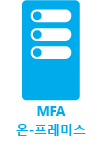

<properties 
	pageTitle="Azure Multi-Factor Authentication - 시작"
	description="보안을 유지하려는 대상과 사용자의 위치에 대한 질문에 답하여 적합한 다단계 인증 보안 솔루션을 선택합니다. 클라우드, MFA 서버 또는 AD FS를 선택합니다."
	services="multi-factor-authentication"
	documentationCenter=""
	authors="kgremban"
	manager="femila"
	editor="curtland"/>

<tags
	ms.service="multi-factor-authentication"
	ms.workload="identity"
	ms.tgt_pltfrm="na"
	ms.devlang="na"
	ms.topic="get-started-article"
	ms.date="08/15/2016"
	ms.author="kgremban"/>

#다단계 보안 솔루션 선택

Azure Multi-Factor Authentication에는 여러 가지 버전이 있기 때문에 사용하기에 적절한 버전을 파악하기 위해 몇 가지 사항을 확인해야 합니다. 이러한 사항은 다음과 같습니다.

-	<a href="#-1">보안을 유지하려는 대상은 무엇입니까</a>
-	<a href="#-2">사용자는 어디에 있습니까</a>

다음 섹션에서는 이러한 각 결정에 대한 지침을 제공합니다.

<h2 id="-1">보안을 유지하려는 대상은 무엇입니까?</h2>

올바른 다단계 인증 솔루션을 결정하기 위해 먼저 두 번째 인증 방법으로 보안을 유지하려는 대상이 무엇인지 답해야 합니다. Azure에 있는 응용프로그램 입니까? 아니면 예를 들어 원격 액세스 시스템입니까? 보안을 유지하려는 대상이 무엇인지 결정하여 Multi-Factor Authentication 활성화가 필요한 곳에 대한 질문의 답을 확인합니다.

보안을 유지하려는 대상은 무엇입니까| 클라우드에서 Multi-Factor Authentication|Multi-Factor Authentication 서버
------------- | :-------------: | :-------------: |
자사 Microsoft 앱|* |* |
앱 갤러리의 Saas 앱|* |* |
Azure AD 응용프로그램 프록시를 통해 IIS 응용프로그램 게시됨|* |* |
Azure AD 응용프로그램 프록시를 통해 IIS 응용프로그램 게시되지 않음 | |* |
VPN, RDG와 같은 원격 액세스| |* |

<h2 id="-2">사용자는 어디에 있습니까</h2>

다음으로 사용자의 위치에 따라 사용할 올바른 솔루션이 클라우드에 있는 Multi-Factor Authentication인지 MFA 서버를 사용한 온-프레미스인지를 확인할 수 있습니다.

사용자 위치| 해결 방법
------------- | :------------- |
Azure Active Directory| 클라우드에서 Multi-Factor Authentication|
Azure AD 및 AD FS로 페더레이션을 사용한 온-프레미스 AD| 클라우드의 MFA 및 MFA 서버 모두 사용 가능한 옵션입니다
Azure AD 및 DirSync를 사용한 온-프레미스 AD, Azure AD Sync, Azure AD Connect - 암호 동기화 없음|클라우드의 MFA 및 MFA 서버 모두 사용 가능한 옵션입니다
Azure AD 및 DirSync를 사용한 온-프레미스 AD, Azure AD Sync, Azure AD Connect - 암호 동기화 사용|클라우드에서 Multi-Factor Authentication
온-프레미스 Active Directory|Multi-Factor Authentication 서버

다음 표는 클라우드에서 Multi-Factor Authentication을 사용하는 경우와 Multi-Factor Authentication 서버를 사용하는 경우에 대한 기능 비교입니다.

 | 클라우드에서 Multi-Factor Authentication | Multi-Factor Authentication 서버
------------- | :-------------: | :-------------: |
두 번째 단계로 모바일 앱 알림 | ● | ● |
두 번째 단계로 모바일 앱 확인 코드 | ● | ●
두 번째 단계로 전화 통화 | ● | ●
두 번째 단계로 단방향 SMS | ● | ●
두 번째 단계로 양방향 SMS | | ●
두 번째 단계로 하드웨어 토큰 | | ●
MFA를 지원하지 않는 클라이언트에 대한 앱 암호 | ● |  
인증 방법에 대한 관리자 제어 | ● | ●
PIN 모드 | | ●
사기 행위 경고 | ● | ●
MFA 보고서 | ● | ●
일회성 바이패스 | | ●
전화 통화에 대한 사용자 지정 인사말 | ● | ●
전화 통화에 대한 사용자 지정 가능한 발신자 번호 | ● | ●
신뢰할 수 있는 IP | ● | ●
신뢰할 수 있는 장치에 대한 MFA 기억 | ● |  
조건부 액세스 | ● | ●
캐시 | | ●

클라우드 다단계 인증 또는 MFA 서버 온-프레미스 사용 여부를 결정했으므로 Azure Multi-Factor Authentication을 설정하고 사용을 시작할 수 있습니다. **시나리오를 나타내는 아이콘을 선택하십시오!**

  &#160;&#160;&#160;&#160;&#160;&#160;&#160;&#160;&#160;&#160;&#160;&#160;&#160;&#160;&#160;&#160;&#160;&#160;&#160;&#160;&#160;&#160;&#160;&#160;&#160; &#160;&#160;&#160;&#160;&#160; 

<!---HONumber=AcomDC_0928_2016-->