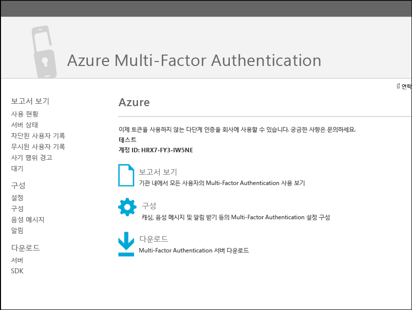
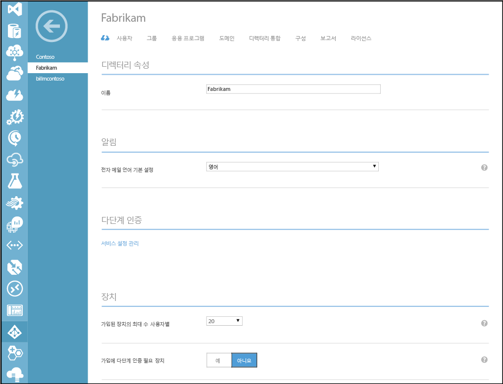

<properties 
	pageTitle="Azure Active Directory와 온-프레미스 ID 통합"
	description="Azure AD Connect의 정의 및 사용해야 하는 이유를 설명합니다."
	services="multi-factor-authentication"
	documentationCenter=""
	authors="kgremban"
	manager="femila"
	editor="curtand"/>

<tags
	ms.service="multi-factor-authentication"
	ms.workload="identity"
	ms.tgt_pltfrm="na"
	ms.devlang="na"
	ms.topic="article"
	ms.date="08/04/2016"
	ms.author="kgremban"/>

# Multi-Factor Authentication을 사용자 지정 앱(SDK)으로 빌드하기

> [AZURE.IMPORTANT]  SDK를 다운로드하려는 경우 Azure MFA, AAD Premium 또는 EMS 라이선스가 있더라도 Azure Multi-Factor Auth 공급자를 만들어야 합니다. 이 용도로 Azure Multi-Factor Auth 공급자를 만들고 이미 라이선스를 보유하고 있는 경우 **활성화된 사용자별** 모델로 공급자를 만들고 Azure MFA, Azure AD Premium 또는 EMS 라이선스를 포함하는 디렉터리에 공급자를 연결해야 합니다. 이렇게 하면 사용자가 소유한 라이선스 수보다 SDK를 사용하는 고유 사용자가 더 많지 않은 이상 요금이 청구되지 않습니다.

Azure Multi-Factor Authentication 소프트웨어 개발 키트(SDK)를 사용하면 Azure AD 테넌트에 응용 프로그램의 로그인 또는 트랜잭션 프로세스로 직접 전화 통화 및 문자 메시지 확인을 빌드할 수 있습니다.

Multi-Factor Authentication SDK는 C#, Visual Basic(.NET), Java, Perl, PHP 및 Ruby에 사용할 수 있습니다. SDK는 multi-factor authentication에 대한 씬 래퍼를 제공합니다. 주석 처리된 소스 코드 파일, 예제 파일 및 자세한 추가 정보 파일을 포함하여 코드를 작성하는 데 필요한 모든 것이 포함됩니다. 또한 각 SDK에는 Multi-Factor Authentication 공급자에 고유한 트랜잭션을 암호화하기 위한 인증서와 개인 키가 포함됩니다. 공급자가 있으면 필요에 따라 많은 언어와 형식에서 SDK를 다운로드할 수 있습니다.

Multi-Factor Authentication SDK의 API 구조는 매우 간단합니다. 유효성을 검사할 PIN 번호나 전화번호와 같은 사용자 데이터 및 확인 모드와 같은 다단계 옵션 매개 변수를 사용하여 API에 단일 함수를 호출합니다. API는 클라우드 기반 Azure Multi-Factor Authentication 서비스에 대한 웹 서비스 요청으로 함수 호출을 변환합니다. 모든 호출은 모든 SDK에 포함된 개인 인증서에 대한 참조를 포함해야 합니다.

Azure Active Directory에 등록된 사용자에 대한 액세스 권한이 API에 없기 때문에 전화번호 및 PIN 코드와 같은 사용자 정보를 파일이나 데이터베이스에 제공해야 합니다. 또한 API는 등록 또는 사용자 관리 기능을 제공하지 않으므로, 응용 프로그램으로 이 프로세스를 빌드해야 합니다.

## Azure Multi-Factor Authentication SDK 다운로드

Azure Multi-Factor SDK를 다운로드하려면 [Azure Multi-Factor Auth 공급자](multi-factor-authentication-get-started-auth-provider.md)가 필요합니다. 따라서 Azure MFA, Azure AD Premium 또는 Enterprise Mobility Suite 라이선스가 있는 경우에도 전체 Azure 구독이 필요합니다. 이 SDK를 다운로드하려면 다단계 관리 포털로 이동하여 Multi-Factor Auth 공급자를 직접 관리하거나 MFA 서비스 설정 페이지에서 **"포털로 이동"** 링크를 클릭해야 합니다.

### Azure 포털에서 Azure Multi-Factor Authentication SDK를 다운로드하려면

1. 관리자 권한으로 Azure 포털에 로그인합니다.
2. 왼쪽에서 Active Directory를 선택합니다.
3. Active Directory 페이지의 위쪽에서 **Multi-Factor Auth 공급자**를 클릭합니다.
4. 아래쪽에서 **관리**를 클릭합니다.
5. 그러면 새 페이지가 열립니다. 왼쪽의 아래쪽에서 SDK를 클릭합니다.

6. 원하는 언어를 누르고 관련된 다운로드 링크를 하나 클릭합니다.
7. 다운로드 파일을 저장합니다.

### 서비스 설정을 통해 Azure Multi-Factor Authentication SDK를 다운로드하려면

1. 관리자 권한으로 Azure 포털에 로그인합니다.
2. 왼쪽에서 Active Directory를 선택합니다.
3. Azure AD 인스턴스를 두 번 클릭합니다.
4. 위쪽에서 **구성**을 클릭합니다.
5. Multi-Factor Authentication 아래에서 **서비스 설정 관리** 를 선택합니다.
6. 서비스 설정 페이지의 화면 아래쪽에서 **포털로 이동**을 클릭합니다. 
7. 그러면 새 페이지가 열립니다. 왼쪽의 아래쪽에서 SDK를 클릭합니다.
8. 원하는 언어를 누르고 관련된 다운로드 링크를 하나 클릭합니다.
9. 다운로드 파일을 저장합니다.

## Azure Multi-Factor Authentication SDK의 내용
SDK 내에서 다음 항목을 찾을 수 있습니다.

- **README**. 기존 또는 새 응용 프로그램에서 Multi-Factor Authentication API를 사용하는 방법을 설명합니다.
- Multi-Factor Authentication을 위한 **소스 파일**
- Multi-Factor Authentication 서비스와 통신하는데 사용하는 **클라이언트 인증서**
- 인증서에 대한 **개인 키**
- **결과를 호출합니다.** 호출 결과 코드의 목록입니다. 이 파일을 열려면 텍스트 워드패드와 같은 서식에 응용 프로그램을 사용합니다. 호출 결과 코드를 사용하여 응용 프로그램의 Multi-Factor Authentication 구현을 테스트하고 문제를 해결합니다. 상태 코드를 인증하지 않습니다.
- **예제.** Multi-Factor Authentication의 기본 작업 구현에 대한 샘플 코드입니다.

>[AZURE.WARNING]클라이언트 인증서는 특히 사용자에 대해 생성된 고유한 개인 인증서입니다. 이 파일을 손실하거나 공유하지 마세요. Multi-Factor Authentication 서비스와의 통신 보안을 유지할 키입니다.

## 코드 샘플: 표준 모드 휴대폰 확인

이 코드 예제에서는 Azure Multi-Factor Authentication SDK의 API를 사용하여 표준 모드 음성 통화 확인을 응용 프로그램에 추가하는 방법을 보여줍니다. 표준 모드는 사용자가 # 키를 눌러 응답하는 전화 통화입니다.

이 예에서는 C# 서버측 논리를 사용하는 기본 ASP.NET 응용 프로그램에서 C# .NET 2.0 Multi-Factor Authentication SDK를 사용하지만 프로세스는 다른 언어의 간단한 구현에 대해 매우 비슷합니다. SDK에는 실행 파일이 아닌 소스 파일이 포함되어 있으므로 파일을 빌드하고 참조하거나 응용 프로그램에 직접 포함할 수 있습니다.

>[AZURE.NOTE]Multi-Factor Authentication을 구현 하는 경우 기본 인증 방법을 보완하기 위해 보조 또는 3차 확인으로 추가 요소를 사용합니다. 이 메서드는 기본 인증 방법으로 사용할 수 없습니다.

### 코드 샘플 개요
매우 간단한 웹 데모 응용 프로그램에 대한 이 샘플 코드는 # 키 응답으로 전화 통화를 사용하여 사용자의 인증을 완료합니다. 이 전화 통화 단계는 Multi-Factor Authentication에서 표준 모드라고 합니다.

클라이언트측 코드는 Multi-Factor Authentication 관련 요소를 포함하지 않습니다. 추가 인증 단계는 기본 인증과 독립적이기 때문에 기존의 로그온 인터페이스를 변경하지 않고 추가할 수 있습니다. 다단계 SDK의 API를 통해 사용자 환경을 사용자 지정할 수 있지만 전혀 변경할 필요가 없을 수도 있습니다.

서버쪽 코드는 2 단계에서 표준 모드 인증을 추가합니다. 표준 모드 확인에 필요한 매개 변수로 PfAuthParams 개체를 만듭니다. 사용자 이름, 전화 번호, 모드 및 클라이언트 인증서(CertFilePath)에 대 한 경로가 각 호출에 필요합니다. PfAuthParams의 모든 매개 변수의 데모를 보려면 SDK의 예제 파일을 참조하세요.

다음으로, 코드는 PfAuthParams 개체를 pf\_authenticate() 함수에 전달합니다. 반환 값은 인증의 성공 여부를 나타냅니다. Out 매개 변수, callStatus 및 errorID는 추가 호출 결과 정보를 포함합니다. 호출 결과 코드는 SDK의 호출 결과 파일에 설명되어 있습니다.

이 최소 구현은 몇 줄로 작성될 수 있습니다. 그러나 프로덕션 코드에서는 보다 복잡 한 오류 처리, 추가 데이터베이스 코드 및 고급 사용자 환경을 포함할 수도 있습니다.

### 웹 클라이언트 코드

다음은 데모 페이지에 대한 웹 클라이언트 코드입니다.

	<%@ Page Language="C#" AutoEventWireup="true" CodeFile="Default.aspx.cs" Inherits="_Default" %>

	<!DOCTYPE html>

	<html xmlns="http://www.w3.org/1999/xhtml">
	<head runat="server">
	<title>Multi-Factor Authentication Demo</title>
	</head>
	<body>
	<h1>Azure Multi-Factor Authentication Demo</h1>
	<form id="form1" runat="server">

	

	Username:&nbsp; 
	Password:&nbsp; 
	

	<div">
	<asp:TextBox id="username" runat="server" width="100px"/> 
	<asp:Textbox id="password" runat="server" width="100px" TextMode="password" /> 
	

	<asp:Button id="btnSubmit" runat="server" Text="Log in" onClick="btnSubmit_Click"/>

	
<asp:Label ID="lblResult" runat="server"></asp:Label>

	</form>
	</body>
	</html>

### 서버 쪽 코드

다음 서버쪽 코드에서 Multi-Factor Authentication이 구성되고 2 단계에서 실행해야 합니다. 표준 모드(MODE\_STANDARD)는 사용자가 # 키를 눌러 응답하는 전화 통화입니다.

	using System;
	using System.Collections.Generic;
	using System.Linq;
	using System.Web;
	using System.Web.UI;
	using System.Web.UI.WebControls;

	public partial class _Default : System.Web.UI.Page
	{
	    protected void Page_Load(object sender, EventArgs e)
	    {
	    }

	    protected void btnSubmit_Click(object sender, EventArgs e)
	    {
	        // Step 1: Validate the username and password
	        if (username.Text != "Contoso" || password.Text != "password")
	        {
	            lblResult.ForeColor = System.Drawing.Color.Red;
	            lblResult.Text = "Username or password incorrect.";
	        }
	        else
	        {
	            // Step 2: Perform multi-factor authentication

	            // Add call details from the user database.
	            PfAuthParams pfAuthParams = new PfAuthParams();
	            pfAuthParams.Username = username.Text;
	            pfAuthParams.Phone = "9134884271";
	            pfAuthParams.Mode = pf_auth.MODE_STANDARD;

	            // Specify a client certificate
	            // NOTE: This file contains the private key for the client
	            // certificate. It must be stored with appropriate file
	            // permissions.
	            pfAuthParams.CertFilePath = "c:\\cert_key.p12";

	            // Perform phone-based authentication
	            int callStatus;
	            int errorId;

	            if(pf_auth.pf_authenticate(pfAuthParams, out callStatus, out errorId))
	            {
	                lblResult.ForeColor = System.Drawing.Color.Green;
	                lblResult.Text = "Multi-Factor Authentication succeeded.";
	            }
	            else
	            {
	                lblResult.ForeColor = System.Drawing.Color.Red;
	                lblResult.Text = " Multi-Factor Authentication failed.";
	            }
	        }

	    }
	}

<!---HONumber=AcomDC_0921_2016-->