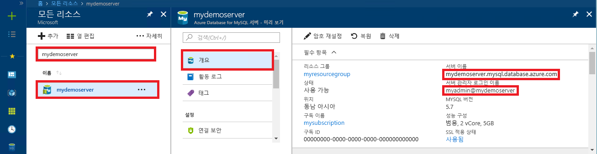

# <a name="azure-database-for-mysql-use-connectorc-to-connect-and-query-data"></a>Azure Database for MySQL: Connector/C++를 사용하여 데이터 연결 및 쿼리
이 빠른 시작에서는 C++ 애플리케이션을 사용하여 MySQL용 Azure Database에 연결하는 방법을 보여 줍니다. SQL 문을 사용하여 데이터베이스의 데이터를 쿼리, 삽입, 업데이트 및 삭제하는 방법을 보여 줍니다. 이 항목에서는 C++를 사용하여 개발하는 데 익숙하고 MySQL용 Azure Database를 처음 사용한다고 가정합니다.

## <a name="prerequisites"></a>필수 조건
이 빠른 시작에서는 다음과 같은 가이드 중 하나에서 만들어진 리소스를 시작 지점으로 사용합니다.
- [Azure Portal을 사용한 MySQL용 Azure Database 서버 만들기](./quickstart-create-mysql-server-database-using-azure-portal.md)
- [Azure CLI를 사용한 MySQL용 Azure Database 서버 만들기](./quickstart-create-mysql-server-database-using-azure-cli.md)

다음과 같은 작업도 필요합니다.
- [.NET Framework](https://www.microsoft.com/net/download) 설치
-  [Visual Studio](https://www.visualstudio.com/downloads/)
- [MySQL Connector/C++](https://dev.mysql.com/downloads/connector/cpp/) 설치 
- [부스트](https://www.boost.org/) 설치

## <a name="install-visual-studio-and-net"></a>Visual Studio 및 .NET 설치
이 섹션의 단계에서는 개발자가 .NET을 사용한 개발에 익숙하다고 가정합니다.

### <a name="windows"></a>**Windows**
- Android, iOS, Windows뿐만 아니라 웹 및 데이터베이스 애플리케이션, 클라우드 서비스를 위한 최신 애플리케이션을 만들기 위해 완전한 기능을 갖춘 확장 가능한 평가판 IDE인 Visual Studio 2017 Community를 설치합니다. 전체 .NET Framework 또는 .NET Core만 설치할 수 있습니다. 이 빠른 시작의 코드 조각은 둘 중 하나에서 작동합니다. 컴퓨터에 이미 Visual Studio가 설치된 경우 다음 두 단계를 건너뜁니다.
   1. [Visual Studio 2017 설치 관리자](https://www.visualstudio.com/thank-you-downloading-visual-studio/?sku=Community&rel=15)를 다운로드합니다. 
   2. 설치 관리자를 실행하고 설치 메시지에 따라 설치를 완료합니다.

### <a name="configure-visual-studio"></a>**Visual Studio 구성**
1. Visual Studio, 프로젝트 -> 속성 -> 링커 -> 일반 -> 추가 라이브러리 디렉터리에서 C++ 커넥터의 "\lib\opt" 디렉터리(예: C:\Program Files (x86)\MySQL\MySQL Connector C++ 1.1.9\lib\opt)를 추가합니다.
2. Visual Studio, 프로젝트 -> 속성 ->C/C++ -> 일반 -> 추가 포함 디렉터리에서:
   - c++ 커넥터의 "\include" 디렉터리(예: C:\Program Files (x86)\MySQL\MySQL Connector C++ 1.1.9\include\)를 추가합니다.
   - Boost 라이브러리의 루트 디렉터리(예: C:\boost_1_64_0\)를 추가합니다.
3. Visual Studio, 프로젝트 -> 속성 -> 링커 > 입력 > 추가 종속성에서 텍스트 필드에 **mysqlcppconn.lib**를 추가합니다.
4. 3단계에서 C++ 커넥터 라이브러리 폴더의 **mysqlcppconn.dll**을 애플리케이션 실행 파일과 같은 폴더에 복사하거나 애플리케이션에서 찾을 수 있도록 환경 변수에 추가합니다.

## <a name="get-connection-information"></a>연결 정보 가져오기
MySQL용 Azure Database에 연결하는 데 필요한 연결 정보를 가져옵니다. 정규화된 서버 이름 및 로그인 자격 증명이 필요합니다.

1. [Azure Portal](https://portal.azure.com/)에 로그인합니다.
2. Azure Portal의 왼쪽 메뉴에서 **모든 리소스**를 클릭한 다음, 방금 만든 서버를 검색합니다(예: **mydemoserver**).
3. 서버 이름을 클릭합니다.
4. 서버의 **개요** 패널에 있는 **서버 이름**과 **서버 관리자 로그인 이름**을 기록해 둡니다. 암호를 잊어버리면 이 패널에서 암호를 재설정할 수 있습니다.
 

## <a name="connect-create-table-and-insert-data"></a>테이블 연결, 생성 및 데이터 삽입
**CREATE TABLE** 및 **INSERT INTO** SQL 문을 사용하여 데이터를 연결하고 로드하려면 다음 코드를 사용하세요. 이 코드는 connect() 메서드가 포함된 sql::Driver 클래스를 사용하여 MySQL에 대한 연결을 설정합니다. 그리고 createStatement() 메서드와 execute() 메서드를 사용하여 데이터베이스 명령을 실행합니다. 

Host, DBName, User 및 Password 매개 변수는 서버 및 데이터베이스를 만들 때 지정한 값으로 바꾸세요. 

```c++
#include <stdlib.h>
#include <iostream>
#include "stdafx.h"

#include "mysql_connection.h"
#include <cppconn/driver.h>
#include <cppconn/exception.h>
#include <cppconn/prepared_statement.h>
using namespace std;

//for demonstration only. never save your password in the code!
const string server = "tcp://yourservername.mysql.database.azure.com:3306";
const string username = "username@servername";
const string password = "yourpassword";

int main()
{
    sql::Driver *driver;
    sql::Connection *con;
    sql::Statement *stmt;
    sql::PreparedStatement *pstmt;

    try
    {
        driver = get_driver_instance();
        con = driver->connect(server, username, password);
    }
    catch (sql::SQLException e)
    {
        cout << "Could not connect to server. Error message: " << e.what() << endl;
        system("pause");
        exit(1);
    }

    //please create database "quickstartdb" ahead of time
    con->setSchema("quickstartdb");

    stmt = con->createStatement();
    stmt->execute("DROP TABLE IF EXISTS inventory");
    cout << "Finished dropping table (if existed)" << endl;
    stmt->execute("CREATE TABLE inventory (id serial PRIMARY KEY, name VARCHAR(50), quantity INTEGER);");
    cout << "Finished creating table" << endl;
    delete stmt;

    pstmt = con->prepareStatement("INSERT INTO inventory(name, quantity) VALUES(?,?)");
    pstmt->setString(1, "banana");
    pstmt->setInt(2, 150);
    pstmt->execute();
    cout << "One row inserted." << endl;

    pstmt->setString(1, "orange");
    pstmt->setInt(2, 154);
    pstmt->execute();
    cout << "One row inserted." << endl;

    pstmt->setString(1, "apple");
    pstmt->setInt(2, 100);
    pstmt->execute();
    cout << "One row inserted." << endl;

    delete pstmt;
    delete con;
    system("pause");
    return 0;
}
```

## <a name="read-data"></a>데이터 읽기

**SELECT** SQL 문을 사용하여 데이터를 연결하고 읽으려면 다음 코드를 사용하세요. 이 코드는 connect() 메서드가 포함된 sql::Driver 클래스를 사용하여 MySQL에 대한 연결을 설정합니다. 그런 다음 prepareStatement() 메서드와 executeQuery() 메서드를 사용하여 select 명령을 실행합니다. 다음으로 next()를 사용하여 결과의 레코드로 이동합니다. 마지막으로 getInt() 및 getString()을 사용하여 레코드의 값을 구문 분석합니다.

Host, DBName, User 및 Password 매개 변수는 서버 및 데이터베이스를 만들 때 지정한 값으로 바꾸세요. 

```c++
#include <stdlib.h>
#include <iostream>
#include "stdafx.h"

#include "mysql_connection.h"
#include <cppconn/driver.h>
#include <cppconn/exception.h>
#include <cppconn/resultset.h>
#include <cppconn/prepared_statement.h>
using namespace std;

//for demonstration only. never save your password in the code!
const string server = "tcp://yourservername.mysql.database.azure.com:3306";
const string username = "username@servername";
const string password = "yourpassword";

int main()
{
    sql::Driver *driver;
    sql::Connection *con;
    sql::PreparedStatement *pstmt;
    sql::ResultSet *result;

    try
    {
        driver = get_driver_instance();
        //for demonstration only. never save password in the code!
        con = driver->connect(server, username, password);
    }
    catch (sql::SQLException e)
    {
        cout << "Could not connect to server. Error message: " << e.what() << endl;
        system("pause");
        exit(1);
    }

    con->setSchema("quickstartdb");

    //select  
    pstmt = con->prepareStatement("SELECT * FROM inventory;");
    result = pstmt->executeQuery();

    while (result->next())
        printf("Reading from table=(%d, %s, %d)\n", result->getInt(1), result->getString(2).c_str(), result->getInt(3));

    delete result;
    delete pstmt;
    delete con;
    system("pause");
    return 0;
}
```

## <a name="update-data"></a>데이터 업데이트
**UPDATE** SQL 문을 사용하여 데이터를 연결하고 읽으려면 다음 코드를 사용하세요. 이 코드는 connect() 메서드가 포함된 sql::Driver 클래스를 사용하여 MySQL에 대한 연결을 설정합니다. 그런 다음 prepareStatement() 메서드와 executeQuery() 메서드를 사용하여 update 명령을 실행합니다. 

Host, DBName, User 및 Password 매개 변수는 서버 및 데이터베이스를 만들 때 지정한 값으로 바꾸세요. 

```c++
#include <stdlib.h>
#include <iostream>
#include "stdafx.h"

#include "mysql_connection.h"
#include <cppconn/driver.h>
#include <cppconn/exception.h>
#include <cppconn/resultset.h>
#include <cppconn/prepared_statement.h>
using namespace std;

//for demonstration only. never save your password in the code!
const string server = "tcp://yourservername.mysql.database.azure.com:3306";
const string username = "username@servername";
const string password = "yourpassword";

int main()
{
    sql::Driver *driver;
    sql::Connection *con;
    sql::PreparedStatement *pstmt;

    try
    {
        driver = get_driver_instance();
        //for demonstration only. never save password in the code!
        con = driver->connect(server, username, password);
    }
    catch (sql::SQLException e)
    {
        cout << "Could not connect to server. Error message: " << e.what() << endl;
        system("pause");
        exit(1);
    }
    
    con->setSchema("quickstartdb");

    //update
    pstmt = con->prepareStatement("UPDATE inventory SET quantity = ? WHERE name = ?");
    pstmt->setInt(1, 200);
    pstmt->setString(2, "banana");
    pstmt->executeQuery();
    printf("Row updated\n");

    delete con;
    delete pstmt;
    system("pause");
    return 0;
}
```


## <a name="delete-data"></a>데이터 삭제
**DELETE** SQL 문을 사용하여 데이터를 연결하고 읽으려면 다음 코드를 사용하세요. 이 코드는 connect() 메서드가 포함된 sql::Driver 클래스를 사용하여 MySQL에 대한 연결을 설정합니다. 그런 다음 prepareStatement() 메서드와 executeQuery() 메서드를 사용하여 delete 명령을 실행합니다.

Host, DBName, User 및 Password 매개 변수는 서버 및 데이터베이스를 만들 때 지정한 값으로 바꾸세요. 

```c++
#include <stdlib.h>
#include <iostream>
#include "stdafx.h"

#include "mysql_connection.h"
#include <cppconn/driver.h>
#include <cppconn/exception.h>
#include <cppconn/resultset.h>
#include <cppconn/prepared_statement.h>
using namespace std;

//for demonstration only. never save your password in the code!
const string server = "tcp://yourservername.mysql.database.azure.com:3306";
const string username = "username@servername";
const string password = "yourpassword";

int main()
{
    sql::Driver *driver;
    sql::Connection *con;
    sql::PreparedStatement *pstmt;
    sql::ResultSet *result;

    try
    {
        driver = get_driver_instance();
        //for demonstration only. never save password in the code!
        con = driver->connect(server, username, password);
    }
    catch (sql::SQLException e)
    {
        cout << "Could not connect to server. Error message: " << e.what() << endl;
        system("pause");
        exit(1);
    }
    
    con->setSchema("quickstartdb");
        
    //delete
    pstmt = con->prepareStatement("DELETE FROM inventory WHERE name = ?");
    pstmt->setString(1, "orange");
    result = pstmt->executeQuery();
    printf("Row deleted\n");    
    
    delete pstmt;
    delete con;
    delete result;
    system("pause");
    return 0;
}
```

## <a name="next-steps"></a>다음 단계
> [!div class="nextstepaction"]
> [덤프 및 복원을 사용하여 MySQL Database를 MySQL용 Azure Database로 마이그레이션](concepts-migrate-dump-restore.md)
