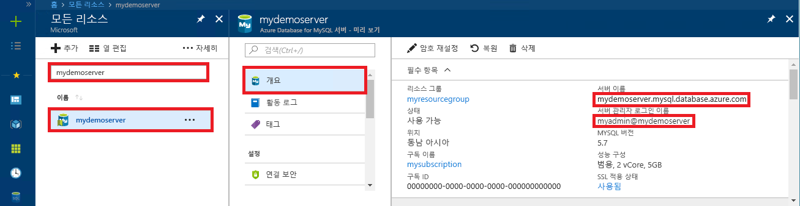

# <a name="azure-database-for-mysql-use-net-c-to-connect-and-query-data"></a>MySQL용 Azure Database: .NET(C#)을 사용하여 데이터 연결 및 쿼리
이 빠른 시작에서는 C# 응용 프로그램을 사용하여 MySQL용 Azure Database에 연결하는 방법을 보여 줍니다. SQL 문을 사용하여 데이터베이스의 데이터를 쿼리, 삽입, 업데이트 및 삭제하는 방법을 보여 줍니다. 이 항목에서는 C#을 사용하여 개발하는 데 익숙하고 MySQL용 Azure Database를 처음 사용한다고 가정합니다.

## <a name="prerequisites"></a>필수 조건
이 빠른 시작에서는 다음과 같은 가이드 중 하나에서 만들어진 리소스를 시작 지점으로 사용합니다.
- [Azure Portal을 사용한 MySQL용 Azure Database 서버 만들기](./quickstart-create-mysql-server-database-using-azure-portal.md)
- [Azure CLI를 사용한 MySQL용 Azure Database 서버 만들기](./quickstart-create-mysql-server-database-using-azure-cli.md)

다음과 같은 작업도 필요합니다.
- [.NET](https://www.microsoft.com/net/download)을 설치합니다. 연결된 문서의 단계에 따라 사용하는 플랫폼(Windows, Ubuntu Linux 또는 macOS)에 맞는 .NET을 설치합니다. 
- [Visual Studio](https://www.visualstudio.com/downloads/)를 설치합니다.

## <a name="create-a-c-project"></a>C# 프로젝트 만들기
명령 프롬프트에서 다음을 실행합니다.

```
mkdir AzureMySqlExample
cd AzureMySqlExample
dotnet new console
dotnet add package MySqlConnector
```

## <a name="get-connection-information"></a>연결 정보 가져오기
MySQL용 Azure Database에 연결하는 데 필요한 연결 정보를 가져옵니다. 정규화된 서버 이름 및 로그인 자격 증명이 필요합니다.

1. [Azure Portal](https://portal.azure.com/)에 로그인합니다.
2. Azure Portal의 왼쪽 메뉴에서 **모든 리소스**를 클릭한 다음, 방금 만든 서버를 검색합니다(예: **mydemoserver**).
3. 서버 이름을 클릭합니다.
4. 서버의 **개요** 패널에 있는 **서버 이름**과 **서버 관리자 로그인 이름**을 기록해 둡니다. 암호를 잊어버리면 이 패널에서 암호를 재설정할 수 있습니다.
 

## <a name="connect-create-table-and-insert-data"></a>테이블 연결, 생성 및 데이터 삽입
`CREATE TABLE` 및 `INSERT INTO` SQL 문을 사용하여 데이터를 연결하고 읽으려면 다음 코드를 사용하세요. 이 코드는 [OpenAsync()](https://docs.microsoft.com/dotnet/api/system.data.common.dbconnection.openasync#System_Data_Common_DbConnection_OpenAsync) 메서드가 포함된 `MySqlConnection` 클래스를 사용하여 MySQL에 대한 연결을 설정합니다. 그런 다음, [CreateCommand()](https://docs.microsoft.com/dotnet/api/system.data.common.dbconnection.createcommand) 메서드를 사용하고, CommandText 속성을 설정하고, [ExecuteNonQueryAsync()](https://docs.microsoft.com/dotnet/api/system.data.common.dbcommand.executenonqueryasync) 메서드를 호출하여 데이터베이스 명령을 실행합니다. 

`Server`, `Database`, `UserID` 및 `Password` 매개 변수는 서버 및 데이터베이스를 만들 때 지정한 값으로 바꿉니다. 

```csharp
using System;
using System.Threading.Tasks;
using MySql.Data.MySqlClient;

namespace AzureMySqlExample
{
    class MySqlCreate
    {
        static async Task Main(string[] args)
        {
            var builder = new MySqlConnectionStringBuilder
            {
                Server = "YOUR-SERVER.mysql.database.azure.com",
                Database = "YOUR-DATABASE",
                UserID = "USER@YOUR-SERVER",
                Password = "PASSWORD",
                SslMode = MySqlSslMode.Required,
            };

            using (var conn = new MySqlConnection(builder.ConnectionString))
            {
                Console.WriteLine("Opening connection");
                await conn.OpenAsync();

                using (var command = conn.CreateCommand())
                {
                    command.CommandText = "DROP TABLE IF EXISTS inventory;";
                    await command.ExecuteNonQueryAsync();
                    Console.WriteLine("Finished dropping table (if existed)");

                    command.CommandText = "CREATE TABLE inventory (id serial PRIMARY KEY, name VARCHAR(50), quantity INTEGER);";
                    await command.ExecuteNonQueryAsync();
                    Console.WriteLine("Finished creating table");

                    command.CommandText = @"INSERT INTO inventory (name, quantity) VALUES (@name1, @quantity1),
                        (@name2, @quantity2), (@name3, @quantity3);";
                    command.Parameters.AddWithValue("@name1", "banana");
                    command.Parameters.AddWithValue("@quantity1", 150);
                    command.Parameters.AddWithValue("@name2", "orange");
                    command.Parameters.AddWithValue("@quantity2", 154);
                    command.Parameters.AddWithValue("@name3", "apple");
                    command.Parameters.AddWithValue("@quantity3", 100);

                    int rowCount = await command.ExecuteNonQueryAsync();
                    Console.WriteLine(String.Format("Number of rows inserted={0}", rowCount));
                }

                // connection will be closed by the 'using' block
                Console.WriteLine("Closing connection");
            }

            Console.WriteLine("Press RETURN to exit");
            Console.ReadLine();
        }
    }
}
```

## <a name="read-data"></a>데이터 읽기

`SELECT` SQL 문을 사용하여 데이터를 연결하고 읽으려면 다음 코드를 사용하세요. 이 코드는 [OpenAsync()](https://docs.microsoft.com/dotnet/api/system.data.common.dbconnection.openasync#System_Data_Common_DbConnection_OpenAsync) 메서드가 포함된 `MySqlConnection` 클래스를 사용하여 MySQL에 대한 연결을 설정합니다. 그리고 [CreateCommand()](https://docs.microsoft.com/dotnet/api/system.data.common.dbconnection.createcommand) 메서드와 [ExecuteReaderAsync()](https://docs.microsoft.com/dotnet/api/system.data.common.dbcommand.executereaderasync) 메서드를 사용하여 데이터베이스 명령을 실행합니다. 그런 다음, [ReadAsync()](https://docs.microsoft.com/dotnet/api/system.data.common.dbdatareader.readasync#System_Data_Common_DbDataReader_ReadAsync)를 사용하여 결과의 레코드로 이동합니다. 그런 다음 GetInt32 및 GetString을 사용하여 레코드의 값을 구문 분석합니다.

`Server`, `Database`, `UserID` 및 `Password` 매개 변수는 서버 및 데이터베이스를 만들 때 지정한 값으로 바꿉니다. 

```csharp
using System;
using System.Threading.Tasks;
using MySql.Data.MySqlClient;

namespace AzureMySqlExample
{
    class MySqlRead
    {
        static async Task Main(string[] args)
        {
            var builder = new MySqlConnectionStringBuilder
            {
                Server = "YOUR-SERVER.mysql.database.azure.com",
                Database = "YOUR-DATABASE",
                UserID = "USER@YOUR-SERVER",
                Password = "PASSWORD",
                SslMode = MySqlSslMode.Required,
            };

            using (var conn = new MySqlConnection(builder.ConnectionString))
            {
                Console.WriteLine("Opening connection");
                await conn.OpenAsync();

                using (var command = conn.CreateCommand())
                {
                    command.CommandText = "SELECT * FROM inventory;";

                    using (var reader = await command.ExecuteReaderAsync())
                    {
                        while (await reader.ReadAsync())
                        {
                            Console.WriteLine(string.Format(
                                "Reading from table=({0}, {1}, {2})",
                                reader.GetInt32(0),
                                reader.GetString(1),
                                reader.GetInt32(2)));
                        }
                    }
                }

                Console.WriteLine("Closing connection");
            }

            Console.WriteLine("Press RETURN to exit");
            Console.ReadLine();
        }
    }
}
```

## <a name="update-data"></a>데이터 업데이트
`UPDATE` SQL 문을 사용하여 데이터를 연결하고 읽으려면 다음 코드를 사용하세요. 이 코드는 [OpenAsync()](https://docs.microsoft.com/dotnet/api/system.data.common.dbconnection.openasync#System_Data_Common_DbConnection_OpenAsync) 메서드가 포함된 `MySqlConnection` 클래스를 사용하여 MySQL에 대한 연결을 설정합니다. 그런 다음, [CreateCommand()](https://docs.microsoft.com/dotnet/api/system.data.common.dbconnection.createcommand) 메서드를 사용하고, CommandText 속성을 설정하고, [ExecuteNonQueryAsync()](https://docs.microsoft.com/dotnet/api/system.data.common.dbcommand.executenonqueryasync) 메서드를 호출하여 데이터베이스 명령을 실행합니다. 

`Server`, `Database`, `UserID` 및 `Password` 매개 변수는 서버 및 데이터베이스를 만들 때 지정한 값으로 바꿉니다. 

```csharp
using System;
using System.Threading.Tasks;
using MySql.Data.MySqlClient;

namespace AzureMySqlExample
{
    class MySqlUpdate
    {
        static async Task Main(string[] args)
        {
            var builder = new MySqlConnectionStringBuilder
            {
                Server = "YOUR-SERVER.mysql.database.azure.com",
                Database = "YOUR-DATABASE",
                UserID = "USER@YOUR-SERVER",
                Password = "PASSWORD",
                SslMode = MySqlSslMode.Required,
            };

            using (var conn = new MySqlConnection(builder.ConnectionString))
            {
                Console.WriteLine("Opening connection");
                await conn.OpenAsync();

                using (var command = conn.CreateCommand())
                {
                    command.CommandText = "UPDATE inventory SET quantity = @quantity WHERE name = @name;";
                    command.Parameters.AddWithValue("@quantity", 200);
                    command.Parameters.AddWithValue("@name", "banana");

                    int rowCount = await command.ExecuteNonQueryAsync();
                    Console.WriteLine(String.Format("Number of rows updated={0}", rowCount));
                }

                Console.WriteLine("Closing connection");
            }

            Console.WriteLine("Press RETURN to exit");
            Console.ReadLine();
        }
    }
}
```

## <a name="delete-data"></a>데이터 삭제
`DELETE` SQL 문을 사용하여 데이터를 연결하고 삭제하려면 다음 코드를 사용하세요. 

이 코드는 [OpenAsync()](https://docs.microsoft.com/dotnet/api/system.data.common.dbconnection.openasync#System_Data_Common_DbConnection_OpenAsync) 메서드가 포함된 `MySqlConnection` 클래스를 사용하여 MySQL에 대한 연결을 설정합니다. 그런 다음, [CreateCommand()](https://docs.microsoft.com/dotnet/api/system.data.common.dbconnection.createcommand) 메서드를 사용하고, CommandText 속성을 설정하고, [ExecuteNonQueryAsync()](https://docs.microsoft.com/dotnet/api/system.data.common.dbcommand.executenonqueryasync) 메서드를 호출하여 데이터베이스 명령을 실행합니다. 

`Server`, `Database`, `UserID` 및 `Password` 매개 변수는 서버 및 데이터베이스를 만들 때 지정한 값으로 바꿉니다. 

```csharp
using System;
using System.Threading.Tasks;
using MySql.Data.MySqlClient;

namespace AzureMySqlExample
{
    class MySqlDelete
    {
        static async Task Main(string[] args)
        {
            var builder = new MySqlConnectionStringBuilder
            {
                Server = "YOUR-SERVER.mysql.database.azure.com",
                Database = "YOUR-DATABASE",
                UserID = "USER@YOUR-SERVER",
                Password = "PASSWORD",
                SslMode = MySqlSslMode.Required,
            };

            using (var conn = new MySqlConnection(builder.ConnectionString))
            {
                Console.WriteLine("Opening connection");
                await conn.OpenAsync();

                using (var command = conn.CreateCommand())
                {
                    command.CommandText = "DELETE FROM inventory WHERE name = @name;";
                    command.Parameters.AddWithValue("@name", "orange");

                    int rowCount = await command.ExecuteNonQueryAsync();
                    Console.WriteLine(String.Format("Number of rows deleted={0}", rowCount));
                }

                Console.WriteLine("Closing connection");
            }

            Console.WriteLine("Press RETURN to exit");
            Console.ReadLine();
        }
    }
}
```

## <a name="next-steps"></a>다음 단계
> [!div class="nextstepaction"]
> [덤프 및 복원을 사용하여 MySQL Database를 MySQL용 Azure Database로 마이그레이션](concepts-migrate-dump-restore.md)
