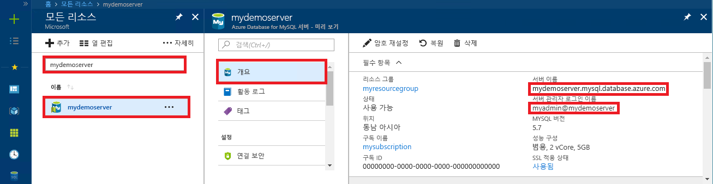

# <a name="azure-database-for-mysql-use-go-language-to-connect-and-query-data"></a>Azure Database for MySQL: Go 언어를 사용하여 데이터 연결 및 쿼리
이 빠른 시작에서는 [Go](https://golang.org/) 언어로 작성된 코드를 사용하여 Windows, Ubuntu Linux 및 Apple macOS 플랫폼에서 MySQL용 Azure Database에 연결하는 방법을 보여 줍니다. SQL 문을 사용하여 데이터베이스의 데이터를 쿼리, 삽입, 업데이트 및 삭제하는 방법을 보여 줍니다. 이 항목에서는 Go를 사용하여 개발하는 데 익숙하고 MySQL용 Azure Database를 처음 사용한다고 가정합니다.

## <a name="prerequisites"></a>필수 조건
이 빠른 시작에서는 다음과 같은 가이드 중 하나에서 만들어진 리소스를 시작 지점으로 사용합니다.
- [Azure Portal을 사용한 MySQL용 Azure Database 서버 만들기](./quickstart-create-mysql-server-database-using-azure-portal.md)
- [Azure CLI를 사용한 MySQL용 Azure Database 서버 만들기](./quickstart-create-mysql-server-database-using-azure-cli.md)

## <a name="install-go-and-mysql-connector"></a>Go 및 MySQL 커넥터 설치
[Go](https://golang.org/doc/install) 및 [MySQL용 go-sql-driver](https://github.com/go-sql-driver/mysql#installation)를 자신의 컴퓨터에 설치합니다. 사용하는 플랫폼에 따라 해당 섹션의 다음 단계를 수행합니다.

### <a name="windows"></a> Windows
1. [설치 지침](https://golang.org/doc/install)에 따라 Microsoft Windows용 Go를 [다운로드](https://golang.org/dl/)하고 설치합니다.
2. [시작] 메뉴에서 [명령 프롬프트]를 선택합니다.
3. 다음과 같이 프로젝트 폴더를 만듭니다. `mkdir  %USERPROFILE%\go\src\mysqlgo`.
4. 디렉터리를 프로젝트 폴더로 변경합니다(예: `cd %USERPROFILE%\go\src\mysqlgo`).
5. 소스 코드 디렉터리를 가리키도록 GOPATH에 대한 환경 변수를 설정합니다. `set GOPATH=%USERPROFILE%\go`.
6. `go get github.com/go-sql-driver/mysql` 명령을 실행하여 [MySQL용 go-sql-driver(영문)](https://github.com/go-sql-driver/mysql#installation)를 설치합니다.

   요약하자면, Go 설치 후 명령 프롬프트에서 다음이 명령을 실행합니다.
   ```cmd
   mkdir  %USERPROFILE%\go\src\mysqlgo
   cd %USERPROFILE%\go\src\mysqlgo
   set GOPATH=%USERPROFILE%\go
   go get github.com/go-sql-driver/mysql
   ```

### <a name="linux-ubuntu"></a>Linux(Ubuntu)
1. Bash 셸을 시작합니다. 
2. `sudo apt-get install golang-go`를 실행하여 Go를 설치합니다.
3. 홈 디렉터리에서 프로젝트 폴더를 만듭니다(예: `mkdir -p ~/go/src/mysqlgo/`).
4. 디렉터리를 폴더로 변경합니다(예: `cd ~/go/src/mysqlgo/`).
5. 현재 홈 디렉터리의 go 폴더와 같이 유효한 소스 디렉터리를 가리키도록 GOPATH 환경 변수를 설정합니다. Bash 셸에서 `export GOPATH=~/go`를 실행하여 go 디렉터리를 현재 셸 세션에 대한 GOPATH로 추가합니다.
6. `go get github.com/go-sql-driver/mysql` 명령을 실행하여 [MySQL용 go-sql-driver(영문)](https://github.com/go-sql-driver/mysql#installation)를 설치합니다.

   요약하자면, 다음과 같은 Bash 명령을 실행합니다.
   ```bash
   sudo apt-get install golang-go
   mkdir -p ~/go/src/mysqlgo/
   cd ~/go/src/mysqlgo/
   export GOPATH=~/go/
   go get github.com/go-sql-driver/mysql
   ```

### <a name="apple-macos"></a>Apple macOS
1. 해당 플랫폼과 일치하는 [설치 지침](https://golang.org/doc/install)에 따라 Go를 다운로드하고 설치합니다. 
2. Bash 셸을 시작합니다.
3. 홈 디렉터리에서 프로젝트 폴더를 만듭니다(예: `mkdir -p ~/go/src/mysqlgo/`).
4. 디렉터리를 폴더로 변경합니다(예: `cd ~/go/src/mysqlgo/`).
5. 현재 홈 디렉터리의 go 폴더와 같이 유효한 소스 디렉터리를 가리키도록 GOPATH 환경 변수를 설정합니다. Bash 셸에서 `export GOPATH=~/go`를 실행하여 go 디렉터리를 현재 셸 세션에 대한 GOPATH로 추가합니다.
6. `go get github.com/go-sql-driver/mysql` 명령을 실행하여 [MySQL용 go-sql-driver(영문)](https://github.com/go-sql-driver/mysql#installation)를 설치합니다.

   요약하자면, Go 설치 후 다음 bash 명령을 실행합니다.
   ```bash
   mkdir -p ~/go/src/mysqlgo/
   cd ~/go/src/mysqlgo/
   export GOPATH=~/go/
   go get github.com/go-sql-driver/mysql
   ```

## <a name="get-connection-information"></a>연결 정보 가져오기
MySQL용 Azure Database에 연결하는 데 필요한 연결 정보를 가져옵니다. 정규화된 서버 이름 및 로그인 자격 증명이 필요합니다.

1. [Azure Portal](https://portal.azure.com/)에 로그인합니다.
2. Azure Portal의 왼쪽 메뉴에서 **모든 리소스**를 클릭한 다음, 방금 만든 서버를 검색합니다(예: **mydemoserver**).
3. 서버 이름을 클릭합니다.
4. 서버의 **개요** 패널에 있는 **서버 이름**과 **서버 관리자 로그인 이름**을 기록해 둡니다. 암호를 잊어버리면 이 패널에서 암호를 재설정할 수 있습니다.
 
   

## <a name="build-and-run-go-code"></a>Go 코드 작성 및 실행 
1. Golang 코드를 작성하려면 Microsoft Windows의 메모장, Ubuntu의 [vi](https://manpages.ubuntu.com/manpages/xenial/man1/nvi.1.html#contenttoc5) 또는 [Nano](https://www.nano-editor.org/), macOS의 TextEdit과 같은 간단한 텍스트 편집기를 사용할 수 있습니다. 보다 풍부한 IDE(대화형 개발 환경)를 선호하는 경우 Jetbrains의 [Gogland](https://www.jetbrains.com/go/), Microsoft의 [Visual Studio Code](https://code.visualstudio.com/) 또는 [Atom](https://atom.io/)을 사용해 보세요.
2. 아래 섹션에서 Go 코드를 텍스트 파일에 붙여넣고 `%USERPROFILE%\go\src\mysqlgo\createtable.go`(Windows 경로) 또는 `~/go/src/mysqlgo/createtable.go`(Linux 경로)와 같이 \*.go 파일 확장명이 포함된 프로젝트 폴더에 저장합니다.
3. 코드에서 `HOST`, `DATABASE`, `USER` 및 `PASSWORD` 상수를 찾아 예제 값을 사용자 고유의 값으로 바꿉니다. 
4. 명령 프롬프트 또는 Bash 셸을 시작합니다. 디렉터리를 프로젝트 폴더로 변경합니다. 예를 들어 Windows에서는 `cd %USERPROFILE%\go\src\mysqlgo\`이고, Linux에서는 `cd ~/go/src/mysqlgo/`입니다.  언급된 일부 IDE 편집기에서는 셸 명령 없이 디버그 및 런타임 기능을 제공합니다.
5. 애플리케이션을 컴파일하고 실행하려면 `go run createtable.go` 명령을 입력하여 코드를 실행합니다. 
6. 또는 `go build createtable.go` 네이티브 애플리케이션에 코드를 빌드하려면 `createtable.exe`를 시작하여 애플리케이션을 실행합니다.

## <a name="connect-create-table-and-insert-data"></a>테이블 연결, 생성 및 데이터 삽입
다음 코드를 사용하여 서버에 연결하고, 테이블을 만들고, **INSERT** SQL 문을 통해 데이터를 로드합니다. 

이 코드는 세 개의 패키지, 즉 [sql 패키지](https://golang.org/pkg/database/sql/), MySQL용 Azure Database와 통신할 드라이버로 사용되는 [go sql driver for mysql](https://github.com/go-sql-driver/mysql#installation), 명령줄에 출력되는 입출력을 위한 [fmt 패키지](https://golang.org/pkg/fmt/)를 가져옵니다.

[sql.Open()](http://go-database-sql.org/accessing.html) 메서드를 호출하여 MySQL용 Azure Database에 연결하고 [db.Ping()](https://golang.org/pkg/database/sql/#DB.Ping) 메서드를 사용하여 연결을 확인합니다. [데이터베이스 핸들](https://golang.org/pkg/database/sql/#DB)은 이러한 과정 내내 사용되며 데이터베이스 서버에 대한 연결 풀을 보유합니다. [Exec()](https://golang.org/pkg/database/sql/#DB.Exec) 메서드를 여러 번 호출하여 여러 DDL 명령을 실행합니다. 또한 [Prepare()](http://go-database-sql.org/prepared.html) 및 Exec()를 사용하여 다른 매개 변수로 준비된 문을 실행하여 3개 행을 삽입합니다. 매번 사용자 지정 checkError() 메서드를 사용하여, 오류가 발생했는지와 서둘러 종료했는지 확인합니다.

`host`, `database`, `user` 및 `password` 상수는 원하는 값으로 바꿉니다. 

```Go
package main

import (
    "database/sql"
    "fmt"

    _ "github.com/go-sql-driver/mysql"
)

const (
    host     = "mydemoserver.mysql.database.azure.com"
    database = "quickstartdb"
    user     = "myadmin@mydemoserver"
    password = "yourpassword"
)

func checkError(err error) {
    if err != nil {
        panic(err)
    }
}

func main() {

    // Initialize connection string.
    var connectionString = fmt.Sprintf("%s:%s@tcp(%s:3306)/%s?allowNativePasswords=true", user, password, host, database)

    // Initialize connection object.
    db, err := sql.Open("mysql", connectionString)
    checkError(err)
    defer db.Close()

    err = db.Ping()
    checkError(err)
    fmt.Println("Successfully created connection to database.")

    // Drop previous table of same name if one exists.
    _, err = db.Exec("DROP TABLE IF EXISTS inventory;")
    checkError(err)
    fmt.Println("Finished dropping table (if existed).")

    // Create table.
    _, err = db.Exec("CREATE TABLE inventory (id serial PRIMARY KEY, name VARCHAR(50), quantity INTEGER);")
    checkError(err)
    fmt.Println("Finished creating table.")

    // Insert some data into table.
    sqlStatement, err := db.Prepare("INSERT INTO inventory (name, quantity) VALUES (?, ?);")
    res, err := sqlStatement.Exec("banana", 150)
    checkError(err)
    rowCount, err := res.RowsAffected()
    fmt.Printf("Inserted %d row(s) of data.\n", rowCount)

    res, err = sqlStatement.Exec("orange", 154)
    checkError(err)
    rowCount, err = res.RowsAffected()
    fmt.Printf("Inserted %d row(s) of data.\n", rowCount)

    res, err = sqlStatement.Exec("apple", 100)
    checkError(err)
    rowCount, err = res.RowsAffected()
    fmt.Printf("Inserted %d row(s) of data.\n", rowCount)
    fmt.Println("Done.")
}

```

## <a name="read-data"></a>데이터 읽기
**SELECT** SQL 문을 사용하여 데이터를 연결하고 읽으려면 다음 코드를 사용하세요. 

이 코드는 세 개의 패키지, 즉 [sql 패키지](https://golang.org/pkg/database/sql/), MySQL용 Azure Database와 통신할 드라이버로 사용되는 [go sql driver for mysql](https://github.com/go-sql-driver/mysql#installation), 명령줄에 출력되는 입출력을 위한 [fmt 패키지](https://golang.org/pkg/fmt/)를 가져옵니다.

[sql.Open()](http://go-database-sql.org/accessing.html) 메서드를 호출하여 MySQL용 Azure Database에 연결하고 [db.Ping()](https://golang.org/pkg/database/sql/#DB.Ping) 메서드를 사용하여 연결을 확인합니다. [데이터베이스 핸들](https://golang.org/pkg/database/sql/#DB)은 이러한 과정 내내 사용되며 데이터베이스 서버에 대한 연결 풀을 보유합니다. [Query()](https://golang.org/pkg/database/sql/#DB.Query) 메서드를 호출하여 select 명령을 실행합니다. 그런 다음 [Next()](https://golang.org/pkg/database/sql/#Rows.Next)를 실행하여 결과 집합을 반복하고 [Scan()](https://golang.org/pkg/database/sql/#Rows.Scan)을 사용하여 열 값을 구문 분석하여 변수에 값을 저장합니다. 매번 사용자 지정 checkError() 메서드를 사용하여, 오류가 발생하여 서둘러 종료했는지 확인합니다.

`host`, `database`, `user` 및 `password` 상수는 원하는 값으로 바꿉니다. 

```Go
package main

import (
    "database/sql"
    "fmt"

    _ "github.com/go-sql-driver/mysql"
)

const (
    host     = "mydemoserver.mysql.database.azure.com"
    database = "quickstartdb"
    user     = "myadmin@mydemoserver"
    password = "yourpassword"
)

func checkError(err error) {
    if err != nil {
        panic(err)
    }
}

func main() {

    // Initialize connection string.
    var connectionString = fmt.Sprintf("%s:%s@tcp(%s:3306)/%s?allowNativePasswords=true", user, password, host, database)

    // Initialize connection object.
    db, err := sql.Open("mysql", connectionString)
    checkError(err)
    defer db.Close()

    err = db.Ping()
    checkError(err)
    fmt.Println("Successfully created connection to database.")

    // Variables for printing column data when scanned.
    var (
        id       int
        name     string
        quantity int
    )

    // Read some data from the table.
    rows, err := db.Query("SELECT id, name, quantity from inventory;")
    checkError(err)
    defer rows.Close()
    fmt.Println("Reading data:")
    for rows.Next() {
        err := rows.Scan(&id, &name, &quantity)
        checkError(err)
        fmt.Printf("Data row = (%d, %s, %d)\n", id, name, quantity)
    }
    err = rows.Err()
    checkError(err)
    fmt.Println("Done.")
}
```

## <a name="update-data"></a>데이터 업데이트
**UPDATE** SQL 문을 사용하여 데이터를 연결하고 업데이트하려면 다음 코드를 사용하세요. 

이 코드는 세 개의 패키지, 즉 [sql 패키지](https://golang.org/pkg/database/sql/), MySQL용 Azure Database와 통신할 드라이버로 사용되는 [go sql driver for mysql](https://github.com/go-sql-driver/mysql#installation), 명령줄에 출력되는 입출력을 위한 [fmt 패키지](https://golang.org/pkg/fmt/)를 가져옵니다.

[sql.Open()](http://go-database-sql.org/accessing.html) 메서드를 호출하여 MySQL용 Azure Database에 연결하고 [db.Ping()](https://golang.org/pkg/database/sql/#DB.Ping) 메서드를 사용하여 연결을 확인합니다. [데이터베이스 핸들](https://golang.org/pkg/database/sql/#DB)은 이러한 과정 내내 사용되며 데이터베이스 서버에 대한 연결 풀을 보유합니다. [Exec()](https://golang.org/pkg/database/sql/#DB.Exec) 메서드를 호출하여 update 명령을 실행합니다. 매번 사용자 지정 checkError() 메서드를 사용하여, 오류가 발생하여 서둘러 종료했는지 확인합니다.

`host`, `database`, `user` 및 `password` 상수는 원하는 값으로 바꿉니다. 

```Go
package main

import (
    "database/sql"
    "fmt"

    _ "github.com/go-sql-driver/mysql"
)

const (
    host     = "mydemoserver.mysql.database.azure.com"
    database = "quickstartdb"
    user     = "myadmin@mydemoserver"
    password = "yourpassword"
)

func checkError(err error) {
    if err != nil {
        panic(err)
    }
}

func main() {

    // Initialize connection string.
    var connectionString = fmt.Sprintf("%s:%s@tcp(%s:3306)/%s?allowNativePasswords=true", user, password, host, database)

    // Initialize connection object.
    db, err := sql.Open("mysql", connectionString)
    checkError(err)
    defer db.Close()

    err = db.Ping()
    checkError(err)
    fmt.Println("Successfully created connection to database.")

    // Modify some data in table.
    rows, err := db.Exec("UPDATE inventory SET quantity = ? WHERE name = ?", 200, "banana")
    checkError(err)
    rowCount, err := rows.RowsAffected()
    fmt.Printf("Deleted %d row(s) of data.\n", rowCount)
    fmt.Println("Done.")
}
```

## <a name="delete-data"></a>데이터 삭제
다음 코드를 사용하여 데이터를 연결하고 **DELETE** SQL 문을 통해 데이터를 제거합니다. 

이 코드는 세 개의 패키지, 즉 [sql 패키지](https://golang.org/pkg/database/sql/), MySQL용 Azure Database와 통신할 드라이버로 사용되는 [go sql driver for mysql](https://github.com/go-sql-driver/mysql#installation), 명령줄에 출력되는 입출력을 위한 [fmt 패키지](https://golang.org/pkg/fmt/)를 가져옵니다.

[sql.Open()](http://go-database-sql.org/accessing.html) 메서드를 호출하여 MySQL용 Azure Database에 연결하고 [db.Ping()](https://golang.org/pkg/database/sql/#DB.Ping) 메서드를 사용하여 연결을 확인합니다. [데이터베이스 핸들](https://golang.org/pkg/database/sql/#DB)은 이러한 과정 내내 사용되며 데이터베이스 서버에 대한 연결 풀을 보유합니다. [Exec()](https://golang.org/pkg/database/sql/#DB.Exec) 메서드를 호출하여 delete 명령을 실행합니다. 매번 사용자 지정 checkError() 메서드를 사용하여, 오류가 발생하여 서둘러 종료했는지 확인합니다.

`host`, `database`, `user` 및 `password` 상수는 원하는 값으로 바꿉니다. 

```Go
package main

import (
    "database/sql"
    "fmt"
    _ "github.com/go-sql-driver/mysql"
)

const (
    host     = "mydemoserver.mysql.database.azure.com"
    database = "quickstartdb"
    user     = "myadmin@mydemoserver"
    password = "yourpassword"
)

func checkError(err error) {
    if err != nil {
        panic(err)
    }
}

func main() {

    // Initialize connection string.
    var connectionString = fmt.Sprintf("%s:%s@tcp(%s:3306)/%s?allowNativePasswords=true", user, password, host, database)

    // Initialize connection object.
    db, err := sql.Open("mysql", connectionString)
    checkError(err)
    defer db.Close()

    err = db.Ping()
    checkError(err)
    fmt.Println("Successfully created connection to database.")

    // Modify some data in table.
    rows, err := db.Exec("DELETE FROM inventory WHERE name = ?", "orange")
    checkError(err)
    rowCount, err := rows.RowsAffected()
    fmt.Printf("Deleted %d row(s) of data.\n", rowCount)
    fmt.Println("Done.")
}
```

## <a name="next-steps"></a>다음 단계
> [!div class="nextstepaction"]
> [내보내기 및 가져오기를 사용하여 데이터베이스 마이그레이션](./concepts-migrate-import-export.md)
