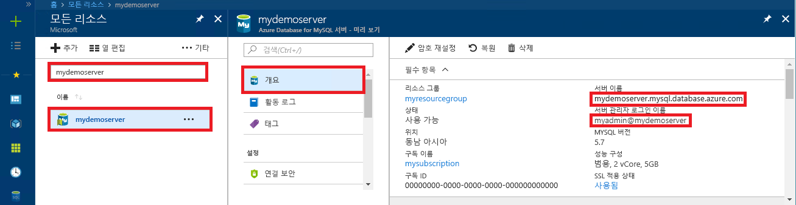

# <a name="azure-database-for-mysql-use-java-to-connect-and-query-data"></a>Azure Database for MySQL: Java를 사용하여 데이터 연결 및 쿼리
이 빠른 시작에서는 Java 애플리케이션과 [MySQL 커넥터/J](https://dev.mysql.com/downloads/connector/j/) JDBC 드라이버를 사용하여 Azure Database for MySQL에 연결하는 방법을 보여 줍니다. SQL 문을 사용하여 데이터베이스의 데이터를 쿼리, 삽입, 업데이트 및 삭제하는 방법을 보여 줍니다. 이 문서에서는 Java를 사용하여 개발하는 데 익숙하고 Azure Database for MySQL을 처음 사용한다고 가정합니다.

[MySQL 커넥터 예제 페이지](https://dev.mysql.com/doc/connector-j/5.1/en/connector-j-examples.html)에는 다른 많은 예제와 샘플 코드가 있습니다.

## <a name="prerequisites"></a>필수 조건
1. 이 빠른 시작에서는 다음과 같은 가이드 중 하나에서 만들어진 리소스를 시작 지점으로 사용합니다.
   - [Azure Portal을 사용한 MySQL용 Azure Database 서버 만들기](./quickstart-create-mysql-server-database-using-azure-portal.md)
   - [Azure CLI를 사용한 MySQL용 Azure Database 서버 만들기](./quickstart-create-mysql-server-database-using-azure-cli.md)

2. 방화벽이 애플리케이션에 열려 있고 SSL 설정이 애플리케이션에 맞게 조정되어 있는 등 MySQL용 Azure Database 연결 보안이 올바른 연결에 맞게 구성되어 있는지 확인합니다.

3. 다음 방법 중 하나를 사용하여 MySQL 커넥터/J 커넥터를 가져옵니다.
   - Maven 패키지 [mysql-connector-java](https://search.maven.org/#search%7Cga%7C1%7Cg%3A%22mysql%22%20AND%20a%3A%22mysql-connector-java%22)를 사용하여 프로젝트에 대한 POM 파일에 [mysql 종속성](https://mvnrepository.com/artifact/mysql/mysql-connector-java/5.1.6)을 포함시킵니다.
   - [MySQL 커넥터/J](https://dev.mysql.com/downloads/connector/j/) JDBC 드라이버를 다운로드하고 애플리케이션 클래스 경로에 JDBC jar 파일(예: mysql-connector-java-5.1.42-bin.jar)을 포함시킵니다. 클래스 경로 문제가 있는 경우 환경(예: [Apache Tomcat](https://tomcat.apache.org/tomcat-7.0-doc/class-loader-howto.html) 또는 [Java SE](https://docs.oracle.com/javase/7/docs/technotes/tools/windows/classpath.html))의 클래스 경로 세부 사항에 대한 설명서를 참조하세요.

## <a name="get-connection-information"></a>연결 정보 가져오기
MySQL용 Azure Database에 연결하는 데 필요한 연결 정보를 가져옵니다. 정규화된 서버 이름 및 로그인 자격 증명이 필요합니다.

1. [Azure Portal](https://portal.azure.com/)에 로그인합니다.
2. Azure Portal의 왼쪽 메뉴에서 **모든 리소스**를 클릭한 다음, 방금 만든 서버를 검색합니다(예: **mydemoserver**).
3. 서버 이름을 클릭합니다.
4. 서버의 **개요** 패널에 있는 **서버 이름**과 **서버 관리자 로그인 이름**을 기록해 둡니다. 암호를 잊어버리면 이 패널에서 암호를 재설정할 수 있습니다.
 

## <a name="connect-create-table-and-insert-data"></a>테이블 연결, 생성 및 데이터 삽입
**INSERT** SQL 문이 있는 함수를 사용하여 데이터를 연결하고 로드하려면 다음 코드를 사용하세요. [getConnection()](https://dev.mysql.com/doc/connector-j/5.1/en/connector-j-usagenotes-connect-drivermanager.html) 메서드는 MySQL에 연결하는 데 사용됩니다. [createStatement()](https://dev.mysql.com/doc/connector-j/5.1/en/connector-j-usagenotes-statements.html) 및 execute() 메서드는 테이블을 삭제하고 생성하는 데 사용됩니다. prepareStatement 개체는 매개 변수 값을 바인딩하는 setString() 및 setInt()를 사용하여 insert 명령을 작성하는 데 사용됩니다. executeUpdate() 메서드는 각 매개 변수 집합에 값을 삽입하는 명령을 실행합니다. 

host, database, user 및 password 매개 변수를 서버 및 데이터베이스를 만들 때 지정한 값으로 바꿉니다.

```java
import java.sql.*;
import java.util.Properties;

public class CreateTableInsertRows {

    public static void main (String[] args)  throws Exception
    {
        // Initialize connection variables. 
        String host = "mydemoserver.mysql.database.azure.com";
        String database = "quickstartdb";
        String user = "myadmin@mydemoserver";
        String password = "<server_admin_password>";

        // check that the driver is installed
        try
        {
            Class.forName("com.mysql.jdbc.Driver");
        }
        catch (ClassNotFoundException e)
        {
            throw new ClassNotFoundException("MySQL JDBC driver NOT detected in library path.", e);
        }

        System.out.println("MySQL JDBC driver detected in library path.");

        Connection connection = null;

        // Initialize connection object
        try
        {
            String url = String.format("jdbc:mysql://%s/%s", host, database);

            // Set connection properties.
            Properties properties = new Properties();
            properties.setProperty("user", user);
            properties.setProperty("password", password);
            properties.setProperty("useSSL", "true");
            properties.setProperty("verifyServerCertificate", "true");
            properties.setProperty("requireSSL", "false");

            // get connection
            connection = DriverManager.getConnection(url, properties);
        }
        catch (SQLException e)
        {
            throw new SQLException("Failed to create connection to database.", e);
        }
        if (connection != null) 
        { 
            System.out.println("Successfully created connection to database.");
        
            // Perform some SQL queries over the connection.
            try
            {
                // Drop previous table of same name if one exists.
                Statement statement = connection.createStatement();
                statement.execute("DROP TABLE IF EXISTS inventory;");
                System.out.println("Finished dropping table (if existed).");
    
                // Create table.
                statement.execute("CREATE TABLE inventory (id serial PRIMARY KEY, name VARCHAR(50), quantity INTEGER);");
                System.out.println("Created table.");
                
                // Insert some data into table.
                int nRowsInserted = 0;
                PreparedStatement preparedStatement = connection.prepareStatement("INSERT INTO inventory (name, quantity) VALUES (?, ?);");
                preparedStatement.setString(1, "banana");
                preparedStatement.setInt(2, 150);
                nRowsInserted += preparedStatement.executeUpdate();

                preparedStatement.setString(1, "orange");
                preparedStatement.setInt(2, 154);
                nRowsInserted += preparedStatement.executeUpdate();

                preparedStatement.setString(1, "apple");
                preparedStatement.setInt(2, 100);
                nRowsInserted += preparedStatement.executeUpdate();
                System.out.println(String.format("Inserted %d row(s) of data.", nRowsInserted));
    
                // NOTE No need to commit all changes to database, as auto-commit is enabled by default.
    
            }
            catch (SQLException e)
            {
                throw new SQLException("Encountered an error when executing given sql statement.", e);
            }       
        }
        else {
            System.out.println("Failed to create connection to database.");
        }
        System.out.println("Execution finished.");
    }
}

```

## <a name="read-data"></a>데이터 읽기
**SELECT** SQL 문을 사용하여 데이터를 읽으려면 다음 코드를 사용하세요. [getConnection()](https://dev.mysql.com/doc/connector-j/5.1/en/connector-j-usagenotes-connect-drivermanager.html) 메서드는 MySQL에 연결하는 데 사용됩니다. [createStatement()](https://dev.mysql.com/doc/connector-j/5.1/en/connector-j-usagenotes-statements.html) 및 executeQuery() 메서드는 Select 문을 연결하고 실행하는 데 사용됩니다. 결과는 [ResultSet](https://docs.oracle.com/javase/tutorial/jdbc/basics/retrieving.html) 개체를 사용하여 처리됩니다. 

host, database, user 및 password 매개 변수를 서버 및 데이터베이스를 만들 때 지정한 값으로 바꿉니다.

```java
import java.sql.*;
import java.util.Properties;

public class ReadTable {

    public static void main (String[] args)  throws Exception
    {
        // Initialize connection variables.
        String host = "mydemoserver.mysql.database.azure.com";
        String database = "quickstartdb";
        String user = "myadmin@mydemoserver";
        String password = "<server_admin_password>";

        // check that the driver is installed
        try
        {
            Class.forName("com.mysql.jdbc.Driver");
        }
        catch (ClassNotFoundException e)
        {
            throw new ClassNotFoundException("MySQL JDBC driver NOT detected in library path.", e);
        }

        System.out.println("MySQL JDBC driver detected in library path.");

        Connection connection = null;

        // Initialize connection object
        try
        {
            String url = String.format("jdbc:mysql://%s/%s", host, database);

            // Set connection properties.
            Properties properties = new Properties();
            properties.setProperty("user", user);
            properties.setProperty("password", password);
            properties.setProperty("useSSL", "true");
            properties.setProperty("verifyServerCertificate", "true");
            properties.setProperty("requireSSL", "false");
            
            // get connection
            connection = DriverManager.getConnection(url, properties);
        }
        catch (SQLException e)
        {
            throw new SQLException("Failed to create connection to database", e);
        }
        if (connection != null) 
        { 
            System.out.println("Successfully created connection to database.");
        
            // Perform some SQL queries over the connection.
            try
            {
    
                Statement statement = connection.createStatement();
                ResultSet results = statement.executeQuery("SELECT * from inventory;");
                while (results.next())
                {
                    String outputString = 
                        String.format(
                            "Data row = (%s, %s, %s)",
                            results.getString(1),
                            results.getString(2),
                            results.getString(3));
                    System.out.println(outputString);
                }
            }
            catch (SQLException e)
            {
                throw new SQLException("Encountered an error when executing given sql statement", e);
            }       
        }
        else {
            System.out.println("Failed to create connection to database."); 
        }
        System.out.println("Execution finished.");
    }
}
```

## <a name="update-data"></a>데이터 업데이트
**UPDATE** SQL 문을 사용하여 데이터를 변경하려면 다음 코드를 사용하세요. [getConnection()](https://dev.mysql.com/doc/connector-j/5.1/en/connector-j-usagenotes-connect-drivermanager.html) 메서드는 MySQL에 연결하는 데 사용됩니다. [prepareStatement()](https://docs.oracle.com/javase/tutorial/jdbc/basics/prepared.html) 및 executeUpdate() 메서드는 Update 문을 준비하고 실행하는 데 사용됩니다. 

host, database, user 및 password 매개 변수를 서버 및 데이터베이스를 만들 때 지정한 값으로 바꿉니다.

```java
import java.sql.*;
import java.util.Properties;

public class UpdateTable {
    public static void main (String[] args)  throws Exception
    {
        // Initialize connection variables. 
        String host = "mydemoserver.mysql.database.azure.com";
        String database = "quickstartdb";
        String user = "myadmin@mydemoserver";
        String password = "<server_admin_password>";

        // check that the driver is installed
        try
        {
            Class.forName("com.mysql.jdbc.Driver");
        }
        catch (ClassNotFoundException e)
        {
            throw new ClassNotFoundException("MySQL JDBC driver NOT detected in library path.", e);
        }
        System.out.println("MySQL JDBC driver detected in library path.");

        Connection connection = null;

        // Initialize connection object
        try
        {
            String url = String.format("jdbc:mysql://%s/%s", host, database);
            
            // set up the connection properties
            Properties properties = new Properties();
            properties.setProperty("user", user);
            properties.setProperty("password", password);
            properties.setProperty("useSSL", "true");
            properties.setProperty("verifyServerCertificate", "true");
            properties.setProperty("requireSSL", "false");

            // get connection
            connection = DriverManager.getConnection(url, properties);
        }
        catch (SQLException e)
        {
            throw new SQLException("Failed to create connection to database.", e);
        }
        if (connection != null) 
        { 
            System.out.println("Successfully created connection to database.");
        
            // Perform some SQL queries over the connection.
            try
            {
                // Modify some data in table.
                int nRowsUpdated = 0;
                PreparedStatement preparedStatement = connection.prepareStatement("UPDATE inventory SET quantity = ? WHERE name = ?;");
                preparedStatement.setInt(1, 200);
                preparedStatement.setString(2, "banana");
                nRowsUpdated += preparedStatement.executeUpdate();
                System.out.println(String.format("Updated %d row(s) of data.", nRowsUpdated));
    
                // NOTE No need to commit all changes to database, as auto-commit is enabled by default.
            }
            catch (SQLException e)
            {
                throw new SQLException("Encountered an error when executing given sql statement.", e);
            }       
        }
        else {
            System.out.println("Failed to create connection to database.");
        }
        System.out.println("Execution finished.");
    }
}
```

## <a name="delete-data"></a>데이터 삭제
**DELETE** SQL 문을 사용하여 데이터를 제거하려면 다음 코드를 사용하세요. [getConnection()](https://dev.mysql.com/doc/connector-j/5.1/en/connector-j-usagenotes-connect-drivermanager.html) 메서드는 MySQL에 연결하는 데 사용됩니다.  [prepareStatement()](https://docs.oracle.com/javase/tutorial/jdbc/basics/prepared.html) 및 executeUpdate() 메서드는 Update 문을 준비하고 실행하는 데 사용됩니다. 

host, database, user 및 password 매개 변수를 서버 및 데이터베이스를 만들 때 지정한 값으로 바꿉니다.

```java
import java.sql.*;
import java.util.Properties;

public class DeleteTable {
    public static void main (String[] args)  throws Exception
    {
        // Initialize connection variables.
        String host = "mydemoserver.mysql.database.azure.com";
        String database = "quickstartdb";
        String user = "myadmin@mydemoserver";
        String password = "<server_admin_password>";
        
        // check that the driver is installed
        try
        {
            Class.forName("com.mysql.jdbc.Driver");
        }
        catch (ClassNotFoundException e)
        {
            throw new ClassNotFoundException("MySQL JDBC driver NOT detected in library path.", e);
        }

        System.out.println("MySQL JDBC driver detected in library path.");

        Connection connection = null;

        // Initialize connection object
        try
        {
            String url = String.format("jdbc:mysql://%s/%s", host, database);
            
            // set up the connection properties
            Properties properties = new Properties();
            properties.setProperty("user", user);
            properties.setProperty("password", password);
            properties.setProperty("useSSL", "true");
            properties.setProperty("verifyServerCertificate", "true");
            properties.setProperty("requireSSL", "false");
            
            // get connection
            connection = DriverManager.getConnection(url, properties);
        }
        catch (SQLException e)
        {
            throw new SQLException("Failed to create connection to database", e);
        }
        if (connection != null) 
        { 
            System.out.println("Successfully created connection to database.");
        
            // Perform some SQL queries over the connection.
            try
            {
                // Delete some data from table.
                int nRowsDeleted = 0;
                PreparedStatement preparedStatement = connection.prepareStatement("DELETE FROM inventory WHERE name = ?;");
                preparedStatement.setString(1, "orange");
                nRowsDeleted += preparedStatement.executeUpdate();
                System.out.println(String.format("Deleted %d row(s) of data.", nRowsDeleted));
    
                // NOTE No need to commit all changes to database, as auto-commit is enabled by default.
            }
            catch (SQLException e)
            {
                throw new SQLException("Encountered an error when executing given sql statement.", e);
            }       
        }
        else {
            System.out.println("Failed to create connection to database.");
        }
        System.out.println("Execution finished.");
    }
}
```

## <a name="next-steps"></a>다음 단계
[MySQL 커넥터/J 예제 페이지](https://dev.mysql.com/doc/connector-j/5.1/en/connector-j-examples.html)에는 다른 많은 예제와 샘플 코드가 있습니다.

> [!div class="nextstepaction"]
> [덤프 및 복원을 사용하여 MySQL Database를 MySQL용 Azure Database로 마이그레이션](concepts-migrate-dump-restore.md)
