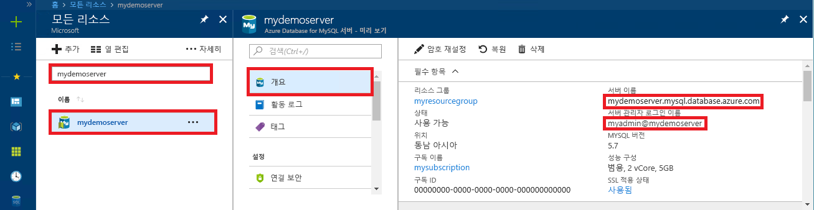

# <a name="azure-database-for-mysql-use-nodejs-to-connect-and-query-data"></a>MySQL용 Azure Database: Node.js를 사용하여 데이터 연결 및 쿼리
이 빠른 시작에서는 Windows, Ubuntu Linux 및 Mac 플랫폼에서 [Node.js](https://nodejs.org/)를 사용하여 MySQL용 Azure Database에 연결하는 방법을 보여 줍니다. SQL 문을 사용하여 데이터베이스의 데이터를 쿼리, 삽입, 업데이트 및 삭제하는 방법을 보여 줍니다. 이 항목에서는 Node.js를 사용하여 개발하는 데 익숙하고 MySQL용 Azure Database를 처음 사용한다고 가정합니다.

## <a name="prerequisites"></a>필수 조건
이 빠른 시작에서는 다음과 같은 가이드 중 하나에서 만들어진 리소스를 시작 지점으로 사용합니다.
- [Azure Portal을 사용한 MySQL용 Azure Database 서버 만들기](./quickstart-create-mysql-server-database-using-azure-portal.md)
- [Azure CLI를 사용한 MySQL용 Azure Database 서버 만들기](./quickstart-create-mysql-server-database-using-azure-cli.md)

다음과 같은 작업도 필요합니다.
- [Node.js](https://nodejs.org) 런타임을 설치합니다.
- Node.js 애플리케이션에서 MySQL에 연결하려면 [mysql](https://www.npmjs.com/package/mysql) 패키지를 설치합니다. 

## <a name="install-nodejs-and-the-mysql-connector"></a>Node.js 및 MySQL 커넥터 설치
사용하는 플랫폼에 따라 적절한 섹션의 지침을 수행하여 Node.js를 설치합니다. npm을 사용하여 프로젝트 폴더에 mysql 패키지와 해당 종속 항목을 설치합니다.

### <a name="windows"></a>**Windows**
1. [Node.js 다운로드 페이지](https://nodejs.org/en/download/)를 방문하여 원하는 Windows 설치 관리자 옵션을 선택합니다.
2. 로컬 프로젝트 폴더를 만듭니다(예: `nodejsmysql`). 
3. 명령 프롬프트를 시작하고 디렉터리를 프로젝트 폴더로 변경합니다(예: `cd c:\nodejsmysql\`).
4. NPM 도구를 실행하여 mysql 라이브러리를 프로젝트 폴더에 설치합니다.

   ```cmd
   cd c:\nodejsmysql\
   "C:\Program Files\nodejs\npm" install mysql
   "C:\Program Files\nodejs\npm" list
   ```

5. `npm list` 출력 텍스트를 확인하여 설치를 확인합니다. 버전 번호는 새 패치가 출시될 때마다 달라질 수 있습니다.

### <a name="linux-ubuntu"></a>**Linux(Ubuntu)**
1. 다음 명령을 실행하여 **Node.js** 및 **npm**(Node.js용 패키지 관리자)을 설치합니다.

   ```bash
   sudo apt-get install -y nodejs npm
   ```

2. 다음 명령을 실행하여 `mysqlnodejs` 프로젝트 폴더를 만들고 이 폴더에 mysql 패키지를 설치합니다.

   ```bash
   mkdir nodejsmysql
   cd nodejsmysql
   npm install --save mysql
   npm list
   ```
3. npm list 출력 텍스트를 확인하여 설치를 확인합니다. 버전 번호는 새 패치가 출시될 때마다 달라질 수 있습니다.

### <a name="mac-os"></a>**Mac OS**
1. **Node.js** 및 사용하기 쉬운 Mac OS X용 패키지 관리자인 **brew**를 설치하려면 다음 명령을 입력합니다.

   ```bash
   ruby -e "$(curl -fsSL https://raw.githubusercontent.com/Homebrew/install/master/install)"
   brew install node
   ```
2. 다음 명령을 실행하여 `mysqlnodejs` 프로젝트 폴더를 만들고 이 폴더에 mysql 패키지를 설치합니다.

   ```bash
   mkdir nodejsmysql
   cd nodejsmysql
   npm install --save mysql
   npm list
   ```

3. `npm list` 출력 텍스트를 확인하여 설치를 확인합니다. 버전 번호는 새 패치가 출시될 때마다 달라질 수 있습니다.

## <a name="get-connection-information"></a>연결 정보 가져오기
MySQL용 Azure Database에 연결하는 데 필요한 연결 정보를 가져옵니다. 정규화된 서버 이름 및 로그인 자격 증명이 필요합니다.

1. [Azure Portal](https://portal.azure.com/)에 로그인합니다.
2. Azure Portal의 왼쪽 메뉴에서 **모든 리소스**를 클릭한 다음, 방금 만든 서버를 검색합니다(예: **mydemoserver**).
3. 서버 이름을 클릭합니다.
4. 서버의 **개요** 패널에 있는 **서버 이름**과 **서버 관리자 로그인 이름**을 기록해 둡니다. 암호를 잊어버리면 이 패널에서 암호를 재설정할 수 있습니다.
 

## <a name="running-the-javascript-code-in-nodejs"></a>Node.js에서 JavaScript 코드 실행
1. JavaScript 코드를 텍스트 파일에 붙여넣고 .js 파일 확장명이 포함된 프로젝트 폴더(C:\nodejsmysql\createtable.js 또는 /home/username/nodejsmysql/createtable.js)에 저장합니다.
2. 명령 프롬프트 또는 Bash 셸을 시작한 후 디렉터리를 프로젝트 폴더로 변경합니다(예: `cd nodejsmysql`).
3. 애플리케이션을 실행하려면 node 명령 다음에 파일 이름을 입력합니다(예: `node createtable.js`).
4. Windows에서 노드 애플리케이션이 환경 변수 경로에 없는 경우 전체 경로를 사용하여 노드 애플리케이션을 시작해야 할 수도 있습니다(예: `"C:\Program Files\nodejs\node.exe" createtable.js`).

## <a name="connect-create-table-and-insert-data"></a>테이블 연결, 생성 및 데이터 삽입
**CREATE TABLE** 및 **INSERT INTO** SQL 문을 사용하여 데이터를 연결하고 로드하려면 다음 코드를 사용하세요.

[mysql.createConnection()](https://github.com/mysqljs/mysql#establishing-connections) 메서드는 MySQL 서버와 상호 작용하는 데 사용됩니다. [connect()](https://github.com/mysqljs/mysql#establishing-connections) 함수는 서버에 대한 연결을 설정하는 데 사용됩니다. [query()](https://github.com/mysqljs/mysql#performing-queries) 함수는 MySQL 데이터베이스에 대해 SQL 쿼리를 실행하는 데 사용됩니다. 

`host`, `user`, `password` 및 `database` 매개 변수는 서버 및 데이터베이스를 만들 때 지정한 값으로 바꿉니다.

```javascript
const mysql = require('mysql');

var config =
{
    host: 'mydemoserver.mysql.database.azure.com',
    user: 'myadmin@mydemoserver',
    password: 'your_password',
    database: 'quickstartdb',
    port: 3306,
    ssl: true
};

const conn = new mysql.createConnection(config);

conn.connect(
    function (err) { 
    if (err) { 
        console.log("!!! Cannot connect !!! Error:");
        throw err;
    }
    else
    {
       console.log("Connection established.");
           queryDatabase();
    }   
});

function queryDatabase(){
       conn.query('DROP TABLE IF EXISTS inventory;', function (err, results, fields) { 
            if (err) throw err; 
            console.log('Dropped inventory table if existed.');
        })
       conn.query('CREATE TABLE inventory (id serial PRIMARY KEY, name VARCHAR(50), quantity INTEGER);', 
            function (err, results, fields) {
                if (err) throw err;
            console.log('Created inventory table.');
        })
       conn.query('INSERT INTO inventory (name, quantity) VALUES (?, ?);', ['banana', 150], 
            function (err, results, fields) {
                if (err) throw err;
            else console.log('Inserted ' + results.affectedRows + ' row(s).');
        })
       conn.query('INSERT INTO inventory (name, quantity) VALUES (?, ?);', ['orange', 154], 
            function (err, results, fields) {
                if (err) throw err;
            console.log('Inserted ' + results.affectedRows + ' row(s).');
        })
       conn.query('INSERT INTO inventory (name, quantity) VALUES (?, ?);', ['apple', 100], 
        function (err, results, fields) {
                if (err) throw err;
            console.log('Inserted ' + results.affectedRows + ' row(s).');
        })
       conn.end(function (err) { 
        if (err) throw err;
        else  console.log('Done.') 
        });
};
```

## <a name="read-data"></a>데이터 읽기
**SELECT** SQL 문을 사용하여 데이터를 연결하고 읽으려면 다음 코드를 사용하세요. 

[mysql.createConnection()](https://github.com/mysqljs/mysql#establishing-connections) 메서드는 MySQL 서버와 상호 작용하는 데 사용됩니다. [connect()](https://github.com/mysqljs/mysql#establishing-connections) 메서드는 서버에 대한 연결을 설정하는 데 사용됩니다. [query()](https://github.com/mysqljs/mysql#performing-queries) 메서드는 MySQL 데이터베이스에 대해 SQL 쿼리를 실행하는 데 사용됩니다. 결과 배열은 쿼리 결과를 저장하는 데 사용됩니다.

`host`, `user`, `password` 및 `database` 매개 변수는 서버 및 데이터베이스를 만들 때 지정한 값으로 바꿉니다.

```javascript
const mysql = require('mysql');

var config =
{
    host: 'mydemoserver.mysql.database.azure.com',
    user: 'myadmin@mydemoserver',
    password: 'your_password',
    database: 'quickstartdb',
    port: 3306,
    ssl: true
};

const conn = new mysql.createConnection(config);

conn.connect(
    function (err) { 
        if (err) { 
            console.log("!!! Cannot connect !!! Error:");
            throw err;
        }
        else {
            console.log("Connection established.");
            readData();
        }   
    });

function readData(){
        conn.query('SELECT * FROM inventory', 
            function (err, results, fields) {
                if (err) throw err;
                else console.log('Selected ' + results.length + ' row(s).');
                for (i = 0; i < results.length; i++) {
                    console.log('Row: ' + JSON.stringify(results[i]));
                }
                console.log('Done.');
            })
       conn.end(
           function (err) { 
                if (err) throw err;
                else  console.log('Closing connection.') 
        });
};
```

## <a name="update-data"></a>데이터 업데이트
**UPDATE** SQL 문을 사용하여 데이터를 연결하고 읽으려면 다음 코드를 사용하세요. 

[mysql.createConnection()](https://github.com/mysqljs/mysql#establishing-connections) 메서드는 MySQL 서버와 상호 작용하는 데 사용됩니다. [connect()](https://github.com/mysqljs/mysql#establishing-connections) 메서드는 서버에 대한 연결을 설정하는 데 사용됩니다. [query()](https://github.com/mysqljs/mysql#performing-queries) 메서드는 MySQL 데이터베이스에 대해 SQL 쿼리를 실행하는 데 사용됩니다. 

`host`, `user`, `password` 및 `database` 매개 변수는 서버 및 데이터베이스를 만들 때 지정한 값으로 바꿉니다.

```javascript
const mysql = require('mysql');

var config =
{
    host: 'mydemoserver.mysql.database.azure.com',
    user: 'myadmin@mydemoserver',
    password: 'your_password',
    database: 'quickstartdb',
    port: 3306,
    ssl: true
};

const conn = new mysql.createConnection(config);

conn.connect(
    function (err) { 
        if (err) { 
            console.log("!!! Cannot connect !!! Error:");
            throw err;
        }
        else {
            console.log("Connection established.");
            updateData();
        }   
    });

function updateData(){
       conn.query('UPDATE inventory SET quantity = ? WHERE name = ?', [200, 'banana'], 
            function (err, results, fields) {
                if (err) throw err;
                else console.log('Updated ' + results.affectedRows + ' row(s).');
        })
       conn.end(
           function (err) { 
                if (err) throw err;
                else  console.log('Done.') 
        });
};
```

## <a name="delete-data"></a>데이터 삭제
**DELETE** SQL 문을 사용하여 데이터를 연결하고 읽으려면 다음 코드를 사용하세요. 

[mysql.createConnection()](https://github.com/mysqljs/mysql#establishing-connections) 메서드는 MySQL 서버와 상호 작용하는 데 사용됩니다. [connect()](https://github.com/mysqljs/mysql#establishing-connections) 메서드는 서버에 대한 연결을 설정하는 데 사용됩니다. [query()](https://github.com/mysqljs/mysql#performing-queries) 메서드는 MySQL 데이터베이스에 대해 SQL 쿼리를 실행하는 데 사용됩니다. 

`host`, `user`, `password` 및 `database` 매개 변수는 서버 및 데이터베이스를 만들 때 지정한 값으로 바꿉니다.

```javascript
const mysql = require('mysql');

var config =
{
    host: 'mydemoserver.mysql.database.azure.com',
    user: 'myadmin@mydemoserver',
    password: 'your_password',
    database: 'quickstartdb',
    port: 3306,
    ssl: true
};

const conn = new mysql.createConnection(config);

conn.connect(
    function (err) { 
        if (err) { 
            console.log("!!! Cannot connect !!! Error:");
            throw err;
        }
        else {
            console.log("Connection established.");
            deleteData();
        }   
    });

function deleteData(){
       conn.query('DELETE FROM inventory WHERE name = ?', ['orange'], 
            function (err, results, fields) {
                if (err) throw err;
                else console.log('Deleted ' + results.affectedRows + ' row(s).');
        })
       conn.end(
           function (err) { 
                if (err) throw err;
                else  console.log('Done.') 
        });
};
```

## <a name="next-steps"></a>다음 단계
> [!div class="nextstepaction"]
> [내보내기 및 가져오기를 사용하여 데이터베이스 마이그레이션](./concepts-migrate-import-export.md)
