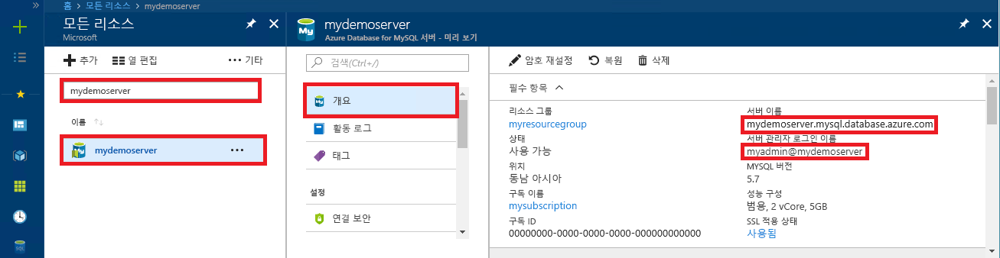

# <a name="azure-database-for-mysql-use-php-to-connect-and-query-data"></a>MySQL용 Azure Database: PHP를 사용하여 데이터 연결 및 쿼리
이 빠른 시작에서는 [PHP](http://php.net/manual/intro-whatis.php) 응용 프로그램을 사용하여 MySQL용 Azure Database에 연결하는 방법을 보여줍니다. SQL 문을 사용하여 데이터베이스의 데이터를 쿼리, 삽입, 업데이트 및 삭제하는 방법을 보여 줍니다. 이 항목에서는 PHP를 사용한 개발에 익숙하고Azure Database for MySQL를 처음 사용한다고 가정합니다.

## <a name="prerequisites"></a>필수 조건
이 빠른 시작에서는 다음과 같은 가이드 중 하나에서 만들어진 리소스를 시작 지점으로 사용합니다.
- [Azure Portal을 사용한 MySQL용 Azure Database 서버 만들기](./quickstart-create-mysql-server-database-using-azure-portal.md)
- [Azure CLI를 사용한 MySQL용 Azure Database 서버 만들기](./quickstart-create-mysql-server-database-using-azure-cli.md)

## <a name="install-php"></a>PHP 설치
사용자의 서버에 PHP를 설치하거나 PHP를 포함하는 Azure [웹앱](../app-service/app-service-web-overview.md)을 만듭니다.

### <a name="macos"></a>MacOS
- [PHP 7.1.4 버전](http://php.net/downloads.php) 다운로드.
- PHP를 설치하고 [PHP 매뉴얼](http://php.net/manual/install.macosx.php)에서 자세한 구성 정보 참조.

### <a name="linux-ubuntu"></a>Linux(Ubuntu)
- [PHP 7.1.4 스레드로부터 안전하지 않은(x64) 버전](http://php.net/downloads.php) 다운로드.
- PHP를 설치하고 [PHP 매뉴얼](http://php.net/manual/install.unix.php)에서 자세한 구성 정보 참조.

### <a name="windows"></a>Windows
- [PHP 7.1.4 스레드로부터 안전하지 않은(x64) 버전](http://windows.php.net/download#php-7.1) 다운로드.
- PHP를 설치하고 [PHP 매뉴얼](http://php.net/manual/install.windows.php)에서 자세한 구성 정보 참조.

## <a name="get-connection-information"></a>연결 정보 가져오기
MySQL용 Azure Database에 연결하는 데 필요한 연결 정보를 가져옵니다. 정규화된 서버 이름 및 로그인 자격 증명이 필요합니다.

1. [Azure Portal](https://portal.azure.com/)에 로그인합니다.
2. Azure Portal의 왼쪽 메뉴에서 **모든 리소스**를 클릭한 다음, 방금 만든 서버를 검색합니다(예: **mydemoserver**).
3. 서버 이름을 클릭합니다.
4. 서버의 **개요** 패널에 있는 **서버 이름**과 **서버 관리자 로그인 이름**을 기록해 둡니다. 암호를 잊어버리면 이 패널에서 암호를 재설정할 수 있습니다.
 

## <a name="connect-and-create-a-table"></a>테이블 연결 및 생성
**CREATE TABLE** SQL 문을 사용하여 테이블을 연결하고 생성하려면 다음 코드를 사용하세요. 

이 코드는 PHP에 포함된 **MySQL Improved Extension**(mysqli) 클래스를 사용합니다. 이 코드는 [mysqli_init](http://php.net/manual/mysqli.init.php) 및 [mysqli_real_connect](http://php.net/manual/mysqli.real-connect.php) 메서드를 호출하여 MySQL에 연결합니다. 그리고 [mysqli_query](http://php.net/manual/mysqli.query.php) 메서드를 호출하여 쿼리를 실행합니다. 그런 다음 [mysqli_close](http://php.net/manual/mysqli.close.php) 메서드를 호출하여 연결을 닫습니다.

host, username, password 및 db_name 매개 변수는 원하는 값으로 바꾸세요. 

```php
<?php
$host = 'mydemoserver.mysql.database.azure.com';
$username = 'myadmin@mydemoserver';
$password = 'your_password';
$db_name = 'your_database';

//Establishes the connection
$conn = mysqli_init();
mysqli_real_connect($conn, $host, $username, $password, $db_name, 3306);
if (mysqli_connect_errno($conn)) {
die('Failed to connect to MySQL: '.mysqli_connect_error());
}

// Run the create table query
if (mysqli_query($conn, '
CREATE TABLE Products (
`Id` INT NOT NULL AUTO_INCREMENT ,
`ProductName` VARCHAR(200) NOT NULL ,
`Color` VARCHAR(50) NOT NULL ,
`Price` DOUBLE NOT NULL ,
PRIMARY KEY (`Id`)
);
')) {
printf("Table created\n");
}

//Close the connection
mysqli_close($conn);
?>
```

## <a name="insert-data"></a>데이터 삽입
**INSERT** SQL 문을 사용하여 데이터를 연결하고 삽입하려면 다음 코드를 사용하세요.

이 코드는 PHP에 포함된 **MySQL Improved Extension**(mysqli) 클래스를 사용합니다. 이 코드는 [mysqli_prepare](http://php.net/manual/mysqli.prepare.php) 메서드를 사용하여 준비된 INSERT 문을 만든 후 [mysqli_stmt_bind_param](http://php.net/manual/mysqli-stmt.bind-param.php) 메서드를 사용하여 삽입된 각 열 값의 매개 변수를 바인딩합니다. [mysqli_stmt_execute](http://php.net/manual/mysqli-stmt.execute.php) 메서드를 사용하여 문을 실행한 후 [mysqli_stmt_close](http://php.net/manual/mysqli-stmt.close.php) 메서드를 사용하여 문을 닫습니다.

host, username, password 및 db_name 매개 변수는 원하는 값으로 바꾸세요. 

```php
<?php
$host = 'mydemoserver.mysql.database.azure.com';
$username = 'myadmin@mydemoserver';
$password = 'your_password';
$db_name = 'your_database';

//Establishes the connection
$conn = mysqli_init();
mysqli_real_connect($conn, $host, $username, $password, $db_name, 3306);
if (mysqli_connect_errno($conn)) {
die('Failed to connect to MySQL: '.mysqli_connect_error());
}

//Create an Insert prepared statement and run it
$product_name = 'BrandNewProduct';
$product_color = 'Blue';
$product_price = 15.5;
if ($stmt = mysqli_prepare($conn, "INSERT INTO Products (ProductName, Color, Price) VALUES (?, ?, ?)")) {
mysqli_stmt_bind_param($stmt, 'ssd', $product_name, $product_color, $product_price);
mysqli_stmt_execute($stmt);
printf("Insert: Affected %d rows\n", mysqli_stmt_affected_rows($stmt));
mysqli_stmt_close($stmt);
}

// Close the connection
mysqli_close($conn);
?>
```

## <a name="read-data"></a>데이터 읽기
**SELECT** SQL 문을 사용하여 데이터를 연결하고 읽으려면 다음 코드를 사용하세요.  이 코드는 PHP에 포함된 **MySQL Improved Extension**(mysqli) 클래스를 사용합니다. 이 코드는 [mysqli_query](http://php.net/manual/mysqli.query.php) 메서드를 사용하여 SQL 쿼리를 수행하고 [mysqli_fetch_assoc](http://php.net/manual/mysqli-result.fetch-assoc.php) 메서드를 사용하여 결과 행을 페치합니다.

host, username, password 및 db_name 매개 변수는 원하는 값으로 바꾸세요. 

```php
<?php
$host = 'mydemoserver.mysql.database.azure.com';
$username = 'myadmin@mydemoserver';
$password = 'your_password';
$db_name = 'your_database';

//Establishes the connection
$conn = mysqli_init();
mysqli_real_connect($conn, $host, $username, $password, $db_name, 3306);
if (mysqli_connect_errno($conn)) {
die('Failed to connect to MySQL: '.mysqli_connect_error());
}

//Run the Select query
printf("Reading data from table: \n");
$res = mysqli_query($conn, 'SELECT * FROM Products');
while ($row = mysqli_fetch_assoc($res)) {
var_dump($row);
}

//Close the connection
mysqli_close($conn);
?>
```

## <a name="update-data"></a>데이터 업데이트
**UPDATE** SQL 문을 사용하여 데이터를 연결하고 업데이트하려면 다음 코드를 사용하세요.

이 코드는 PHP에 포함된 **MySQL Improved Extension**(mysqli) 클래스를 사용합니다. 이 코드는 [mysqli_prepare](http://php.net/manual/mysqli.prepare.php) 메서드를 사용하여 준비된 UPDATE 문을 만든 후 [mysqli_stmt_bind_param](http://php.net/manual/mysqli-stmt.bind-param.php) 메서드를 사용하여 업데이트된 각 열 값의 매개 변수를 바인딩합니다. [mysqli_stmt_execute](http://php.net/manual/mysqli-stmt.execute.php) 메서드를 사용하여 문을 실행한 후 [mysqli_stmt_close](http://php.net/manual/mysqli-stmt.close.php) 메서드를 사용하여 문을 닫습니다.

host, username, password 및 db_name 매개 변수는 원하는 값으로 바꾸세요. 

```php
<?php
$host = 'mydemoserver.mysql.database.azure.com';
$username = 'myadmin@mydemoserver';
$password = 'your_password';
$db_name = 'your_database';

//Establishes the connection
$conn = mysqli_init();
mysqli_real_connect($conn, $host, $username, $password, $db_name, 3306);
if (mysqli_connect_errno($conn)) {
die('Failed to connect to MySQL: '.mysqli_connect_error());
}

//Run the Update statement
$product_name = 'BrandNewProduct';
$new_product_price = 15.1;
if ($stmt = mysqli_prepare($conn, "UPDATE Products SET Price = ? WHERE ProductName = ?")) {
mysqli_stmt_bind_param($stmt, 'ds', $new_product_price, $product_name);
mysqli_stmt_execute($stmt);
printf("Update: Affected %d rows\n", mysqli_stmt_affected_rows($stmt));

//Close the connection
mysqli_stmt_close($stmt);
}

mysqli_close($conn);
?>
```


## <a name="delete-data"></a>데이터 삭제
**DELETE** SQL 문을 사용하여 데이터를 연결하고 읽으려면 다음 코드를 사용하세요. 

이 코드는 PHP에 포함된 **MySQL Improved Extension**(mysqli) 클래스를 사용합니다. 이 코드는 [mysqli_prepare](http://php.net/manual/mysqli.prepare.php) 메서드를 사용하여 준비된 DELETE 문을 만든 후 [mysqli_stmt_bind_param](http://php.net/manual/mysqli-stmt.bind-param.php) 메서드를 사용하여 문의 Where 절에 대한 매개 변수를 바인딩합니다. [mysqli_stmt_execute](http://php.net/manual/mysqli-stmt.execute.php) 메서드를 사용하여 문을 실행한 후 [mysqli_stmt_close](http://php.net/manual/mysqli-stmt.close.php) 메서드를 사용하여 문을 닫습니다.

host, username, password 및 db_name 매개 변수는 원하는 값으로 바꾸세요. 

```php
<?php
$host = 'mydemoserver.mysql.database.azure.com';
$username = 'myadmin@mydemoserver';
$password = 'your_password';
$db_name = 'your_database';

//Establishes the connection
$conn = mysqli_init();
mysqli_real_connect($conn, $host, $username, $password, $db_name, 3306);
if (mysqli_connect_errno($conn)) {
die('Failed to connect to MySQL: '.mysqli_connect_error());
}

//Run the Delete statement
$product_name = 'BrandNewProduct';
if ($stmt = mysqli_prepare($conn, "DELETE FROM Products WHERE ProductName = ?")) {
mysqli_stmt_bind_param($stmt, 's', $product_name);
mysqli_stmt_execute($stmt);
printf("Delete: Affected %d rows\n", mysqli_stmt_affected_rows($stmt));
mysqli_stmt_close($stmt);
}

//Close the connection
mysqli_close($conn);
?>
```

## <a name="next-steps"></a>다음 단계
> [!div class="nextstepaction"]
> [SSL을 통해 Azure Database for MySQL에 연결](howto-configure-ssl.md)
