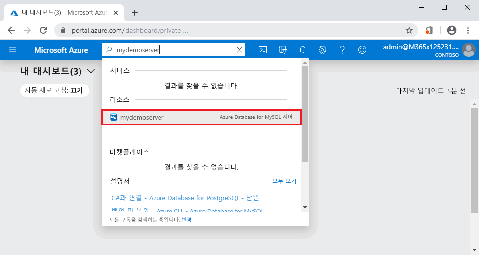

# <a name="azure-database-for-mysql-use-python-to-connect-and-query-data"></a>Azure Database for MySQL: Python을 사용하여 데이터 연결 및 쿼리
이 빠른 시작에서는 [Python](https://python.org)을 사용하여 MySQL용 Azure Database에 연결하는 방법을 보여 줍니다. SQL 문을 사용하여 Mac OS, Ubuntu Linux 및 Windows 플랫폼에서 데이터베이스의 데이터를 쿼리, 삽입, 업데이트 및 삭제합니다. 이 항목에서는 Python을 사용하여 개발하는 데 익숙하고 MySQL용 Azure Database를 처음 사용한다고 가정합니다.

## <a name="prerequisites"></a>필수 조건
이 빠른 시작에서는 다음과 같은 가이드 중 하나에서 만들어진 리소스를 시작 지점으로 사용합니다.
- [Azure Portal을 사용한 MySQL용 Azure Database 서버 만들기](./quickstart-create-mysql-server-database-using-azure-portal.md)
- [Azure CLI를 사용한 MySQL용 Azure Database 서버 만들기](./quickstart-create-mysql-server-database-using-azure-cli.md)

## <a name="install-python-and-the-mysql-connector"></a>Python 및 MySQL 커넥터 설치
자신의 컴퓨터에 [Python](https://www.python.org/downloads/)과 [Python용 MySQL 커넥터](https://dev.mysql.com/downloads/connector/python/)를 설치합니다. 사용하는 플랫폼에 따라 아래 해당 섹션의 단계를 수행합니다. 

> [!NOTE]
> 이 빠른 시작은 쿼리를 실행하는 MySQL에 연결하는 원시 SQL 쿼리 접근 방식을 사용합니다. 웹 프레임워크를 사용하는 경우 이러한 프레임워크에 대한 권장되는 커넥터를 사용합니다. 예를 들어 Django 사용에 대해 [mysqlclient](https://pypi.org/project/mysqlclient/)가 제안됩니다.
>

### <a name="windows"></a> Windows
1. [python.org](https://www.python.org/downloads/windows/)에서 Python 2.7을 다운로드하고 설치합니다. 
2. 명령 프롬프트를 실행하여 Python 설치를 확인합니다. 대문자 V 스위치와 함께 `C:\python27\python.exe -V` 명령을 실행하여 버전 번호를 확인합니다.
3. [mysql.com](https://dev.mysql.com/downloads/connector/python/)에서 자신의 Python 버전에 해당하는 MySQL용 Python 커넥터를 설치합니다.

### <a name="linux-ubuntu"></a>Linux(Ubuntu)
1. Linux(Ubuntu)에서 Python은 일반적으로 기본 설치의 일부로 설치됩니다.
2. Bash 셸을 실행하여 Python 설치를 확인합니다. 대문자 V 스위치와 함께 `python -V` 명령을 실행하여 버전 번호를 확인합니다.
3. `pip show pip -V` 명령을 실행하여 버전 번호를 확인함으로써 PIP 설치를 확인합니다. 
4. PIP는 Python의 일부 버전에 포함될 수 있습니다. PIP가 설치되어 있지 않으면 명령 `sudo apt-get install python-pip`을 실행하여 [PIP](https://pip.pypa.io/en/stable/installing/) 패키지를 설치할 수 있습니다.
5. `pip install -U pip` 명령을 실행하여 PIP를 최신 버전으로 업데이트합니다.
6. PIP 명령을 사용하여 Python용 MySQL 커넥터 및 해당 종속성을 설치합니다.

   ```bash
   sudo pip install mysql-connector-python-rf
   ```
 
### <a name="macos"></a>MacOS
1. Mac OS에서 Python은 일반적으로 기본 OS 설치의 일부로 설치됩니다.
2. Bash 셸을 실행하여 Python 설치를 확인합니다. 대문자 V 스위치와 함께 `python -V` 명령을 실행하여 버전 번호를 확인합니다.
3. `pip show pip -V` 명령을 실행하여 버전 번호를 확인함으로써 PIP 설치를 확인합니다.
4. PIP는 Python의 일부 버전에 포함될 수 있습니다. PIP가 설치되어 있지 않으면 [PIP](https://pip.pypa.io/en/stable/installing/) 패키지를 설치할 수 있습니다.
5. `pip install -U pip` 명령을 실행하여 PIP를 최신 버전으로 업데이트합니다.
6. PIP 명령을 사용하여 Python용 MySQL 커넥터 및 해당 종속성을 설치합니다.

   ```bash
   pip install mysql-connector-python-rf
   ``` 

## <a name="get-connection-information"></a>연결 정보 가져오기
MySQL용 Azure Database에 연결하는 데 필요한 연결 정보를 가져옵니다. 정규화된 서버 이름 및 로그인 자격 증명이 필요합니다.

1. [Azure Portal](https://portal.azure.com/)에 로그인합니다.
2. Azure Portal의 왼쪽 메뉴에서 **모든 리소스**를 클릭한 다음, 방금 만든 서버를 검색합니다(예: **mydemoserver**).
3. 서버 이름을 클릭합니다.
4. 서버의 **개요** 패널에 있는 **서버 이름**과 **서버 관리자 로그인 이름**을 기록해 둡니다. 암호를 잊어버리면 이 패널에서 암호를 재설정할 수 있습니다.
 

## <a name="run-python-code"></a>Python 코드 실행
- 코드를 텍스트 파일에 붙여넣고 .py 파일 확장명이 포함된 프로젝트 폴더(C:\pythonmysql\createtable.py 또는 /home/username/pythonmysql/createtable.py)에 저장합니다.
- 코드를 실행하려면 명령 프롬프트 또는 Bash 셸을 시작합니다. 디렉터리를 프로젝트 폴더로 변경합니다(예: `cd pythonmysql`). 그런 다음 python 명령 다음에 파일 이름을 입력하여 애플리케이션을 실행합니다(예: `python createtable.py`). Windows OS에서 python.exe를 찾을 수 없으면 실행 파일의 전체 경로를 제공하거나 경로 환경 변수에 Python 경로를 추가해야 할 수 있습니다. `C:\python27\python.exe createtable.py`

## <a name="connect-create-table-and-insert-data"></a>테이블 연결, 생성 및 데이터 삽입
다음 코드를 사용하여 서버에 연결하고, 테이블을 만들고, **INSERT** SQL 문을 통해 데이터를 로드합니다. 

코드에서 mysql.connector 라이브러리를 가져옵니다. [connect()](https://dev.mysql.com/doc/connector-python/en/connector-python-api-mysql-connector-connect.html) 함수는 구성 컬렉션의 [연결 인수](https://dev.mysql.com/doc/connector-python/en/connector-python-connectargs.html)를 사용하여 MySQL용 Azure Database에 연결하는 데 사용됩니다. 코드는 연결에서 커서를 사용하고, [cursor.execute()](https://dev.mysql.com/doc/connector-python/en/connector-python-api-mysqlcursor-execute.html) 메서드는 MySQL 데이터베이스에 대해 SQL 쿼리를 실행합니다. 

`host`, `user`, `password` 및 `database` 매개 변수는 서버 및 데이터베이스를 만들 때 지정한 값으로 바꿉니다.

```Python
import mysql.connector
from mysql.connector import errorcode

# Obtain connection string information from the portal
config = {
  'host':'mydemoserver.mysql.database.azure.com',
  'user':'myadmin@mydemoserver',
  'password':'yourpassword',
  'database':'quickstartdb'
}

# Construct connection string
try:
   conn = mysql.connector.connect(**config)
   print("Connection established")
except mysql.connector.Error as err:
  if err.errno == errorcode.ER_ACCESS_DENIED_ERROR:
    print("Something is wrong with the user name or password")
  elif err.errno == errorcode.ER_BAD_DB_ERROR:
    print("Database does not exist")
  else:
    print(err)
else:
  cursor = conn.cursor()

  # Drop previous table of same name if one exists
  cursor.execute("DROP TABLE IF EXISTS inventory;")
  print("Finished dropping table (if existed).")

  # Create table
  cursor.execute("CREATE TABLE inventory (id serial PRIMARY KEY, name VARCHAR(50), quantity INTEGER);")
  print("Finished creating table.")

  # Insert some data into table
  cursor.execute("INSERT INTO inventory (name, quantity) VALUES (%s, %s);", ("banana", 150))
  print("Inserted",cursor.rowcount,"row(s) of data.")
  cursor.execute("INSERT INTO inventory (name, quantity) VALUES (%s, %s);", ("orange", 154))
  print("Inserted",cursor.rowcount,"row(s) of data.")
  cursor.execute("INSERT INTO inventory (name, quantity) VALUES (%s, %s);", ("apple", 100))
  print("Inserted",cursor.rowcount,"row(s) of data.")

  # Cleanup
  conn.commit()
  cursor.close()
  conn.close()
  print("Done.")
```

## <a name="read-data"></a>데이터 읽기
**SELECT** SQL 문을 사용하여 데이터를 연결하고 읽으려면 다음 코드를 사용하세요. 

코드에서 mysql.connector 라이브러리를 가져옵니다. [connect()](https://dev.mysql.com/doc/connector-python/en/connector-python-api-mysql-connector-connect.html) 함수는 구성 컬렉션의 [연결 인수](https://dev.mysql.com/doc/connector-python/en/connector-python-connectargs.html)를 사용하여 MySQL용 Azure Database에 연결하는 데 사용됩니다. 코드는 연결에서 커서를 사용하고, [cursor.execute()](https://dev.mysql.com/doc/connector-python/en/connector-python-api-mysqlcursor-execute.html) 메서드는 MySQL 데이터베이스에 대해 SQL 문을 실행합니다. 데이터 행은 [fetchall()](https://dev.mysql.com/doc/connector-python/en/connector-python-api-mysqlcursor-fetchall.html) 메서드를 사용하여 읽습니다. 결과 집합은 컬렉션 행에 유지되고 for 반복기는 행을 반복하는 데 사용됩니다.

`host`, `user`, `password` 및 `database` 매개 변수는 서버 및 데이터베이스를 만들 때 지정한 값으로 바꿉니다.

```Python
import mysql.connector
from mysql.connector import errorcode

# Obtain connection string information from the portal
config = {
  'host':'mydemoserver.mysql.database.azure.com',
  'user':'myadmin@mydemoserver',
  'password':'yourpassword',
  'database':'quickstartdb'
}

# Construct connection string
try:
   conn = mysql.connector.connect(**config)
   print("Connection established")
except mysql.connector.Error as err:
  if err.errno == errorcode.ER_ACCESS_DENIED_ERROR:
    print("Something is wrong with the user name or password")
  elif err.errno == errorcode.ER_BAD_DB_ERROR:
    print("Database does not exist")
  else:
    print(err)
else:
  cursor = conn.cursor()

  # Read data
  cursor.execute("SELECT * FROM inventory;")
  rows = cursor.fetchall()
  print("Read",cursor.rowcount,"row(s) of data.")

  # Print all rows
  for row in rows:
    print("Data row = (%s, %s, %s)" %(str(row[0]), str(row[1]), str(row[2])))

  # Cleanup
  conn.commit()
  cursor.close()
  conn.close()
  print("Done.")
```

## <a name="update-data"></a>데이터 업데이트
**UPDATE** SQL 문을 사용하여 데이터를 연결하고 업데이트하려면 다음 코드를 사용하세요. 

코드에서 mysql.connector 라이브러리를 가져옵니다.  [connect()](https://dev.mysql.com/doc/connector-python/en/connector-python-api-mysql-connector-connect.html) 함수는 구성 컬렉션의 [연결 인수](https://dev.mysql.com/doc/connector-python/en/connector-python-connectargs.html)를 사용하여 MySQL용 Azure Database에 연결하는 데 사용됩니다. 코드는 연결에서 커서를 사용하고, [cursor.execute()](https://dev.mysql.com/doc/connector-python/en/connector-python-api-mysqlcursor-execute.html) 메서드는 MySQL 데이터베이스에 대해 SQL 문을 실행합니다. 

`host`, `user`, `password` 및 `database` 매개 변수는 서버 및 데이터베이스를 만들 때 지정한 값으로 바꿉니다.

```Python
import mysql.connector
from mysql.connector import errorcode

# Obtain connection string information from the portal
config = {
  'host':'mydemoserver.mysql.database.azure.com',
  'user':'myadmin@mydemoserver',
  'password':'yourpassword',
  'database':'quickstartdb'
}

# Construct connection string
try:
   conn = mysql.connector.connect(**config)
   print("Connection established")
except mysql.connector.Error as err:
  if err.errno == errorcode.ER_ACCESS_DENIED_ERROR:
    print("Something is wrong with the user name or password")
  elif err.errno == errorcode.ER_BAD_DB_ERROR:
    print("Database does not exist")
  else:
    print(err)
else:
  cursor = conn.cursor()

  # Update a data row in the table
  cursor.execute("UPDATE inventory SET quantity = %s WHERE name = %s;", (200, "banana"))
  print("Updated",cursor.rowcount,"row(s) of data.")

  # Cleanup
  conn.commit()
  cursor.close()
  conn.close()
  print("Done.")
```

## <a name="delete-data"></a>데이터 삭제
다음 코드를 사용하여 데이터를 연결하고 **DELETE** SQL 문을 통해 데이터를 제거합니다. 

코드에서 mysql.connector 라이브러리를 가져옵니다.  [connect()](https://dev.mysql.com/doc/connector-python/en/connector-python-api-mysql-connector-connect.html) 함수는 구성 컬렉션의 [연결 인수](https://dev.mysql.com/doc/connector-python/en/connector-python-connectargs.html)를 사용하여 MySQL용 Azure Database에 연결하는 데 사용됩니다. 코드는 연결에서 커서를 사용하고, [cursor.execute()](https://dev.mysql.com/doc/connector-python/en/connector-python-api-mysqlcursor-execute.html) 메서드는 MySQL 데이터베이스에 대해 SQL 쿼리를 실행합니다. 

`host`, `user`, `password` 및 `database` 매개 변수는 서버 및 데이터베이스를 만들 때 지정한 값으로 바꿉니다.

```Python
import mysql.connector
from mysql.connector import errorcode

# Obtain connection string information from the portal
config = {
  'host':'mydemoserver.mysql.database.azure.com',
  'user':'myadmin@mydemoserver',
  'password':'yourpassword',
  'database':'quickstartdb'
}

# Construct connection string
try:
   conn = mysql.connector.connect(**config)
   print("Connection established.")
except mysql.connector.Error as err:
  if err.errno == errorcode.ER_ACCESS_DENIED_ERROR:
    print("Something is wrong with the user name or password.")
  elif err.errno == errorcode.ER_BAD_DB_ERROR:
    print("Database does not exist.")
  else:
    print(err)
else:
  cursor = conn.cursor()

  # Delete a data row in the table
  cursor.execute("DELETE FROM inventory WHERE name=%(param1)s;", {'param1':"orange"})
  print("Deleted",cursor.rowcount,"row(s) of data.")

  # Cleanup
  conn.commit()
  cursor.close()
  conn.close()
  print("Done.")
```

## <a name="next-steps"></a>다음 단계
> [!div class="nextstepaction"]
> [내보내기 및 가져오기를 사용하여 데이터베이스 마이그레이션](./concepts-migrate-import-export.md)
