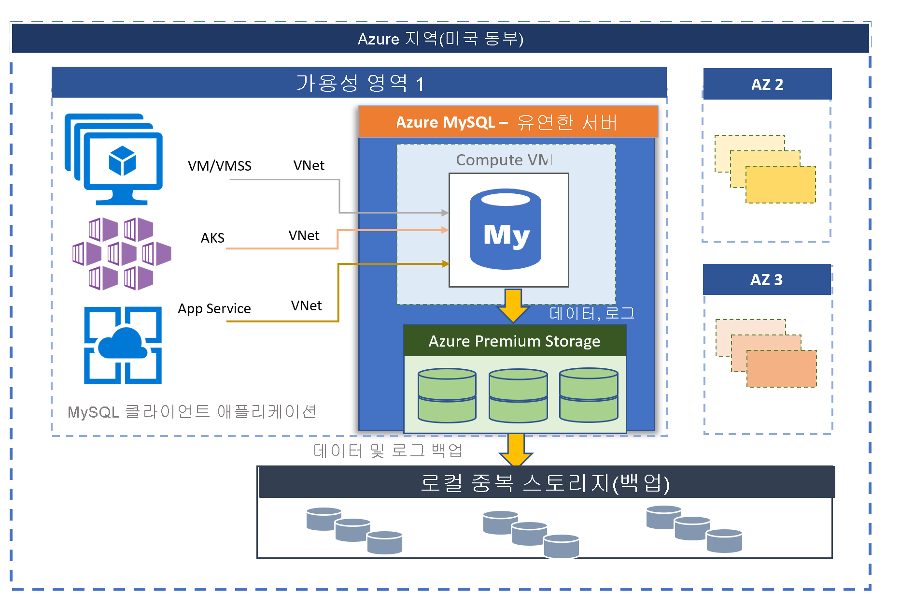

# Azure Database for MySQL - 유연한 서버(미리 보기)

MySQL 커뮤니티 버전에서 제공하는 Azure Database for MySQL은 두 가지 배포 모드로 사용할 수 있습니다.
- 단일 서버 
- 유연한 서버(미리 보기)

이 문서에서는 유연한 서버 배포 모델의 핵심 개념에 대한 개요 및 소개를 제공합니다. 작업에 적합한 배포 옵션을 결정하는 방법에 대한 자세한 내용은 [Azure에서 올바른 MySQL 서버 옵션 선택](./../select-right-deployment-type.md)을 참조하세요.

## 개요

Azure Database for MySQL 유연한 서버는 데이터베이스 관리 기능 및 구성 설정에 대한 보다 세부적인 제어와 유연성을 제공하도록 설계된 완전 관리형 데이터베이스 서비스입니다. 일반적으로 이 서비스는 사용자 요구 사항에 따라 더 많은 유연성과 서버 구성 사용자 지정을 제공합니다. 유연한 서버 아키텍처는 사용자가 단일 가용성 영역 및 여러 가용성 영역에서 고가용성을 선택할 수 있습니다. 또한 유연한 서버는 서버를 중지/시작하는 기능과 버스트 가능 sku를 제공하므로 전체 컴퓨팅 용량이 지속적으로 필요하지 않는 워크로드에 적합합니다. 이 서비스는 현재 MySQL 커뮤니티 버전 5.7을 지원합니다. 이 서비스는 현재 미리 보기로 제공되며, 다양한 [Azure 지역](https://azure.microsoft.com/global-infrastructure/services/)에서 사용할 수 있습니다.

유연한 서버는 다음과 같은 용도에 적합합니다. 
- 더 나은 제어 및 사용자 지정이 필요한 애플리케이션 개발
- 영역 중복 고가용성
- 관리되는 유지 관리 기간

 

## 가용성 영역의 고가용성

유연한 서버 배포 모델은 단일 가용성 영역 및 여러 가용성 영역에서 고가용성을 지원하도록 설계되었습니다. 아키텍처는 컴퓨팅과 스토리지를 분리합니다. 데이터베이스 엔진은 가상 머신에서 실행되는 반면, 데이터 파일은 Azure 스토리지에 상주합니다. 스토리지는 데이터베이스 파일의 세 가지 로컬 중복 동기 복사본을 유지하여 항상 데이터 내구성을 보장합니다. 

계획되거나 계획되지 않은 이벤트로 인해 서버가 다운되면 서비스는 다음과 같은 자동 절차를 사용하여 서버의 고가용성을 유지합니다.

1. 새 컴퓨팅 VM이 프로비저닝됩니다.
2. 데이터 파일이 있는 스토리지가 새 가상 머신에 매핑됩니다.
3. 새 가상 머신에서 MySQL 데이터베이스 엔진이 온라인 상태로 전환됩니다.
4. 서버에서 연결을 허용할 준비가 되면 클라이언트 애플리케이션이 다시 연결할 수 있습니다.
   
:::image type="content" source="media/overview/2-flexible-server-architecture.png" alt-text="단일 영역 고가용성 개념 다이어그램"::: 

영역 중복 고가용성이 구성된 경우 서비스는 동일한 Azure 지역 내에서 가용성 영역에 걸쳐 상시 대기 서버를 프로비저닝하고 유지 관리합니다. 데이터 손실을 방지하기 위해 원본 서버의 데이터 변경 내용이 대기 서버에 동기적으로 복제됩니다. 영역 중복 고가용성을 사용하면 계획되거나 계획되지 않은 장애 조치(failover) 이벤트가 트리거되면 대기 서버가 즉시 온라인 상태가 되고 들어오는 트랜잭션을 처리할 수 있습니다. 일반적인 장애 조치(failover) 시간 범위는 60-120초입니다. 따라서 특정 Azure 지역에서 단일 가용성 영역 장애가 발생하더라도 서비스가 고가용성을 지원하고 향상된 복원력을 제공할 수 있습니다. 

자세한 내용은 [고가용성 개념](concepts-high-availability.md)을 참조하세요.

:::image type="content" source="media/overview/3-flexible-server-overview-zone-redundant-ha.png" alt-text="단일 영역 고가용성 개념 다이어그램"::: 

## 관리되는 유지 관리 기간을 사용하여 자동 패치

서비스는 기본 하드웨어, OS 및 데이터베이스 엔진의 자동화된 패치를 수행합니다. 패치에는 보안 및 소프트웨어 업데이트가 포함됩니다. MySQL 엔진의 경우 계획된 유지 관리 릴리스에 부 버전 업그레이드도 포함됩니다. 사용자는 시스템 관리를 위해 패치 일정을 구성하거나 사용자 지정 일정을 정의할 수 있습니다. 유지 관리 일정 중에 패치가 적용되며, 업데이트를 완료하기 위해 패치 프로세스 중에 서버를 다시 시작해야 할 수도 있습니다. 사용자 지정 일정을 사용하면 사용자가 패치 주기를 예측 가능하도록 설정하고 비즈니스에 최소한의 영향을 주는 유지 관리 기간을 선택할 수 있습니다. 일반적으로 서비스는 연속 통합 및 릴리스의 일부로 월별 릴리스 일정을 따릅니다.

자세한 내용은 [예약된 유지 관리](concepts-maintenance.md)를 참조하세요. 

## 자동 백업

유연한 서버 서비스는 자동으로 서버 백업을 만들어 사용자가 로컬로 구성한 중복 스토리지 또는 지역 중복 스토리지에 저장합니다. 백업을 통해 백업 보존 기간 내의 특정 지점으로 서버를 복원할 수 있습니다. 기본 백업 보존 기간은 7일입니다. 보존 기간은 선택적으로 최대 35일까지 구성할 수 있습니다. 모든 백업은 AES 256비트 암호화를 사용하여 암호화됩니다. 

자세한 내용은 [백업 개념](concepts-backup-restore.md)을 참조하세요.

## 네트워크 격리

Azure Database for MySQL 유연한 서버에 연결하는 두 가지 네트워킹 옵션이 있습니다. 하나는 **프라이빗 액세스(VNet 통합)** 이고 다른 하나는 **퍼블릭 액세스(허용된 IP 주소)** 입니다. 

* **프라이빗 액세스(VNet 통합)** – [Azure Virtual Network](../../virtual-network/virtual-networks-overview.md)에 유연한 서버를 배포할 수 있습니다. Azure 가상 네트워크는 프라이빗하고 안전한 네트워크 통신을 제공합니다. 가상 네트워크의 리소스는 개인 IP 주소를 통해 통신할 수 있습니다.

   다음과 같은 기능을 원하는 경우 VNet 통합 옵션을 선택합니다.
   * 개인 IP 주소를 사용하여 동일한 가상 네트워크의 Azure 리소스에서 유연한 서버에 연결
   * VPN 또는 ExpressRoute를 사용하여 비 Azure 리소스에서 유연한 서버에 연결
   * 비 퍼블릭 엔드포인트

* **퍼블릭 액세스(허용된 IP 주소)** – 퍼블릭 엔드포인트를 사용하여 유연한 서버를 배포할 수 있습니다. 퍼블릭 엔드포인트는 공개적으로 확인할 수 있는 DNS 주소입니다. "허용되는 IP 주소"라는 말은 선택하는 IP 범위에 서버 액세스 권한을 부여한다는 뜻입니다. 이러한 권한을 **방화벽 규칙** 이라고 합니다.

자세한 내용은 [네트워킹 개념](concepts-networking.md)을 참조하세요.

## 몇 초 이내 성능 및 규모 조정

유연한 서버 서비스는 버스트 가능, 범용 및 메모리 최적화의 세 가지 SKU 계층으로 제공됩니다. 버스트 가능 계층은 전체 컴퓨팅 용량이 지속적으로 필요하지 않은 저렴한 개발 및 낮은 동시성 워크로드에 가장 적합합니다. 범용 및 메모리 최적화는 높은 동시성, 규모 및 예측 가능한 성능이 필요한 프로덕션 워크로드에 더 적합합니다. 한 달에 불과 몇 달러의 비용으로 작은 데이터베이스에 첫 번째 앱을 빌드하고, 이후에 솔루션의 요구에 맞게 원활하게 스케일링할 수 있습니다. 스토리지 스케일링은 온라인으로 수행되며 스토리지 자동 확장을 지원합니다. 동적 확장성을 사용하면 데이터베이스가 빠르게 변화하는 리소스 요구 사항에 투명하게 대응할 수 있습니다. 사용하는 리소스 비용만 지불하면 됩니다. 

자세한 내용은 [컴퓨팅 및 스토리지 개념](concepts-compute-storage.md)을 참조하세요.

## 서버를 중지/시작하여 비용 최적화

유연한 서버 서비스를 사용하면 요청 시 서버를 중지하고 시작하여 비용을 최적화할 수 있습니다. 서버가 중지되는 즉시 컴퓨팅 계층에 대한 대금 청구가 중지됩니다. 이렇게 하면 개발, 테스트 및 시간 제한 예측 가능한 프로덕션 워크로드의 비용을 대폭 절감할 수 있습니다. 서버는 다시 시작하지 않는 한 7일 동안 중지된 상태로 유지됩니다. 

자세한 내용은 [서버 개념](concept-servers.md)을 참조하세요. 

## 엔터프라이즈급 보안 및 프라이버시

유연한 서버 서비스는 미사용 데이터의 스토리지 암호화를 위해 FIPS 140-2 유효성 검사 암호화 모듈을 사용합니다. 백업이 포함된 데이터 및 쿼리를 실행하는 동안 생성된 임시 파일이 암호화됩니다. 서비스는 Azure 스토리지 암호화에 포함된 AES 256비트 암호화를 사용하며, 키는 시스템에서 관리됩니다(기본값). 

서비스는 기본적으로 적용되는 전송 계층 보안을 사용하여 동작 중인 데이터를 암호화합니다. 유연한 서버는 전송 계층 보안(1.2 TLS)을 사용하는 암호화된 연결만 지원하며 TLS 1.0 및 TLS 1.1을 사용하여 들어오는 연결은 모두 거부됩니다. 

자세한 내용은 [유연한 서버에 암호화된 연결을 사용하는 방법](https://docs.mongodb.com/manual/tutorial/configure-ssl)을 참조하세요.

유연한 서버는 [Azure 가상 네트워크](../../virtual-network/virtual-networks-overview.md)(VNet 통합)를 사용하여 서버에 대한 모든 프라이빗 액세스를 허용합니다. Azure 가상 네트워크의 서버는 프라이빗 IP 주소를 통해서만 연결할 수 있습니다. VNet 통합을 사용하면 퍼블릭 액세스를 거부하고 퍼블릭 엔드포인트를 사용하여 서버에 연결할 수 없습니다. 

자세한 내용은 [네트워킹 개념](concepts-networking.md)을 참조하세요.

## 모니터링 및 경고

유연한 서버 서비스는 기본 제공 성능 모니터링 및 경고 기능을 갖추고 있습니다. 모든 Azure 메트릭의 빈도는 1분이고 각 메트릭은 30일의 기록을 제공합니다. 메트릭에 대한 경고를 구성할 수 있습니다. 서비스는 리소스 사용률을 모니터링하도록 호스트 서버 메트릭을 노출하고, 쿼리 로그를 느리게 구성할 수 있도록 합니다. 이러한 도구를 사용하여 워크로드를 신속하게 최적화하고 최적의 성능을 얻을 수 있도록 서버를 구성할 수 있습니다. 

자세한 내용은 [모니터링 개념](concepts-monitoring.md)을 참조하세요.

## 마이그레이션

이 서비스는 커뮤니티 버전의 MySQL을 실행합니다. 따라서 전체 애플리케이션이 호환되며, MySQL 엔진에서 개발된 기존 애플리케이션을 단일 서버로 마이그레이션하기 위한 리팩터링 비용이 최소화됩니다. 다음 옵션 중 하나를 사용하여 단일 서버로 마이그레이션할 수 있습니다.

- **덤프 및 복원** – 사용자가 약간의 가동 중지 시간을 감당할 수 있는 오프라인 마이그레이션의 경우 mysqldump/mydumper 같은 커뮤니티 도구를 사용하여 덤프 및 복원하면 가장 빠르게 마이그레이션할 수 있습니다. 자세한 내용은 [덤프 및 복원을 사용하여 마이그레이션]을 참조하세요. 
- **Azure Database Migration Service** – [Azure Database Migration Service](../../dms/tutorial-mysql-azure-mysql-online.md)를 활용하면 가동 중지 시간을 최소화하면서 단일 서버로 원활하고 간단하게 마이그레이션할 수 있습니다. 

## Azure 지역

Azure에서 워크로드를 실행하는 이점 중 하나는 글로벌 연결입니다. Azure Database for MySQL에 대한 유연한 서버는 현재 다음 Azure 지역에서 사용할 수 있습니다.

- 서유럽
- 북유럽
- 영국 남부
- 미국 동부 2
- 미국 서부 2
- 미국 중부
- 미국 동부
- 캐나다 중부
- 동남아시아
- 한국 중부
- 일본 동부
- 오스트레일리아 동부

곧 새 서버를 추가하기 위해 노력하고 있습니다.

## 연락처
Azure Database for MySQL 유연한 서버에 대한 질문이나 제안이 있으면 Azure Database for MySQL 팀([@Ask Azure DB for MySQL](mailto:AskAzureDBforMySQL@service.microsoft.com))으로 이메일을 보내주세요. 이 이메일 주소는 기술 지원 별칭이 아닙니다.

또한 문의의 다음 사항을 적절히 고려해 주세요.

- Azure 고객 지원팀에 문의하려면 [Azure Portal에서 티켓을 제출](https://portal.azure.com/?#blade/Microsoft_Azure_Support/HelpAndSupportBlade)하세요.
- 계정 관련 문제를 해결하려면 Azure Portal에서 [지원 요청](https://ms.portal.azure.com/#blade/Microsoft_Azure_Support/HelpAndSupportBlade/newsupportrequest)을 제출합니다.
- 피드백을 제공하거나 새 기능을 요청하려면 [UserVoice](https://feedback.azure.com/forums/597982-azure-database-for-mysql)를 통해 항목을 만드세요.

## 다음 단계
Azure Database for MySQL 단일 서버 배포 모드에 대한 소개를 읽어 보았으므로 이제 다음을 할 수 있습니다.

- 첫 번째 서버를 만듭니다. 
  - [Azure Portal을 사용하여 Azure Database for MySQL 유연한 서버 만들기](quickstart-create-server-portal.md)
  - [Azure CLI를 사용하여 Azure Database for MySQL 유연한 서버 만들기](quickstart-create-server-cli.md)
  - [Azure CLI를 사용하여 Azure Database for MySQL 유연한 서버 관리](how-to-manage-server-portal.md)

- 기본 설정된 언어를 사용하여 첫 번째 앱을 빌드합니다.
  - [Python](connect-python.md)
  - [Php](connect-php.md)