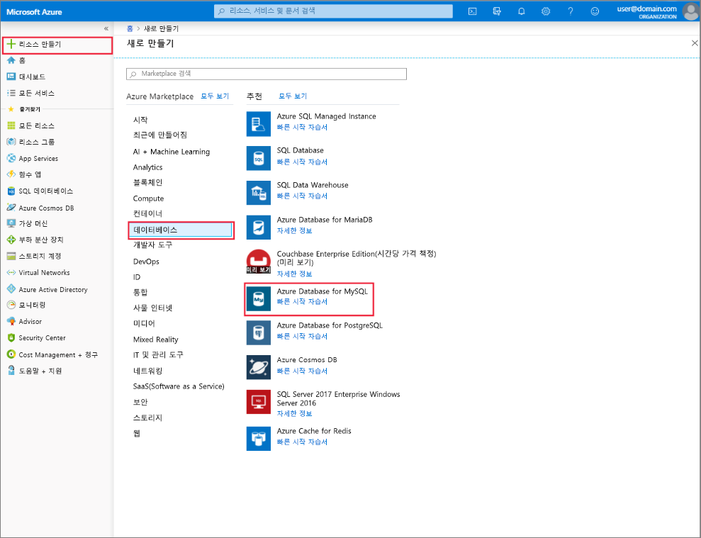

# Azure Portal을 사용한 MySQL용 Azure Database 서버 만들기 및 관리
이 항목에서는 새로운 MySQL용 Azure Database 서버를 빠르게 만들 수 있는 방법을 설명합니다. 또한 Azure Portal을 사용하여 서버를 관리하는 방법에 대한 정보를 포함합니다. 서버 관리에는 서버 세부 정보 및 데이터베이스를 보고, 암호를 다시 설정하고, 리소스 크기를 조정하고, 서버를 삭제하는 것이 포함됩니다.

## Azure Portal에 로그인
[Azure Portal](https://portal.azure.com)에 로그인합니다.

## Azure Database for MySQL 서버 만들기
다음과 단계를 수행하여 “mydemoserver”라는 Azure Database for MySQL 서버를 만듭니다.

1. Azure Portal의 왼쪽 위 모서리에 있는 **리소스 만들기** 단추를 클릭합니다.

2. 새로 만들기 페이지에서 **데이터베이스**를 선택하고 데이터베이스 페이지에서 **MySQL용 Azure Database**를 선택합니다.

    > MySQL용 Azure Database 서버는 정의된 [계산 및 스토리지 리소스](./concepts-pricing-tiers.md) 세트를 사용하여 만들어집니다. 데이터베이스는 Azure 리소스 그룹 및 MySQL용 Azure Database 서버에서 만들어집니다.

   

3. 다음 정보를 사용하여 MySQL용 Azure Database 양식을 작성합니다.

    | **양식 필드** | **필드 설명** |
    |----------------|-----------------------|
    | *서버 이름* | mydemoserver(서버 이름은 전역적으로 고유함) |
    | *구독* | mysubscription(드롭다운 메뉴에서 선택) |
    | *리소스 그룹* | myresourcegroup(새 리소스 그룹을 만들거나 기존 그룹 선택) |
    | *원본 선택* | 비어 있음(빈 MySQL 서버 만들기) |
    | *서버 관리자 로그인* | myadmin(관리자 계정 이름을 설정함) |
    | *암호* | 관리자 계정 암호 설정 |
    | *암호 확인* | 관리자 계정 암호를 확인합니다. |
    | *위치*: | 동남 아시아(북유럽과 미국 서부 사이에서 선택) |
    | *버전* | 5.7(Azure Database for MySQL 서버 버전 선택) |

4. **가격 책정 계층**을 클릭하고 새 서버의 서비스 계층 및 성능 수준을 지정합니다. **범용** 탭을 선택합니다. *5세대*, *vCore 2개*, *5GB* 및 *7일*은 **세대 계산**, **vCore**, **저장소** 및 **백업 보존 기간**에 대한 기본 값입니다. 해당 슬라이더를 그대로 둘 수 있습니다. 지역 중복 저장소에서 서버 백업을 사용하도록 설정하려면 **백업 중복 옵션**에서 **지역 중복**을 선택합니다.

   

5. **만들기**를 클릭하여 서버를 프로비전합니다. 프로비전하는 데 몇 분이 걸립니다.

    > 배포를 쉽게 추적할 수 있도록 **대시보드에 고정** 옵션을 선택합니다.

## MySQL용 Azure Database 서버 업데이트
새 서버가 프로비전된 후에는, 관리자 암호 재설정 및 vCore나 저장소를 변경하여 서버 확장 또는 축소를 비롯하여 기존 서버를 구성할 수 있는 옵션이 몇 가지 있습니다.

### 관리자 암호 변경
1. 서버 **개요**에서 **암호 다시 설정**을 클릭하여 암호 재설정 창을 표시합니다.

   

2. 아래와 같이 창에 새 암호를 입력하고 암호를 확인합니다.

   

3. **확인**을 클릭하여 새 암호를 저장합니다.

### vCore 규모 확장/축소

1. **설정** 아래에 있는 **가격 책정 계층**을 클릭합니다.

2. 슬라이더를 원하는 값으로 이동하여 **vCore** 설정을 변경합니다.

    

3. **확인**을 클릭하여 변경 내용을 저장합니다.

### Storage 확장

1. **설정** 아래에 있는 **가격 책정 계층**을 클릭합니다.

2. 슬라이더를 원하는 값으로 이동하여 **Storage** 설정을 변경합니다.

    

3. **확인**을 클릭하여 변경 내용을 저장합니다.

## MySQL용 Azure Database 서버 삭제

1. 서버 **개요**에서 **삭제** 단추를 클릭하여 삭제 확인 프롬프트를 엽니다.

    

2. 이중 확인을 위해 입력 상자에 서버 이름을 입력합니다.

    

3. **삭제** 단추를 클릭하여 서버 삭제를 확인합니다. 알림 표시줄에 “MySQL 서버를 삭제함" 팝업이 나타날 때까지 기다립니다.

## MySQL용 Azure Database 데이터베이스 나열
서버 **개요**에서 맨 아래 데이터베이스 타일이 보일 때까지 아래로 스크롤합니다. 서버의 모든 데이터베이스가 테이블에 나열되어 있습니다.

   

## MySQL용 Azure Database 서버의 세부 정보 보기
서버에 대한 세부 정보를 보려면 **설정** 아래 있는 **속성**을 클릭합니다.

## 다음 단계

[빠른 시작: Azure Portal을 사용하여 Azure Database for MySQL 서버 만들기](./quickstart-create-mysql-server-database-using-azure-portal.md)