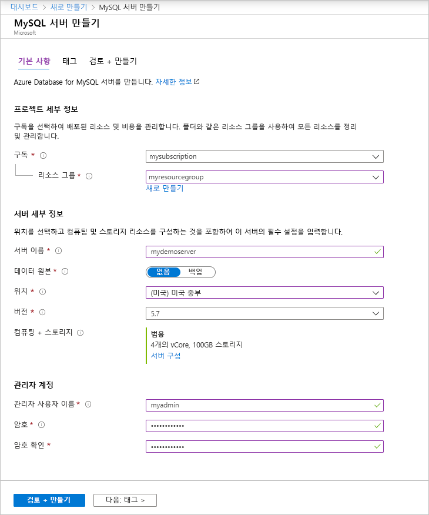
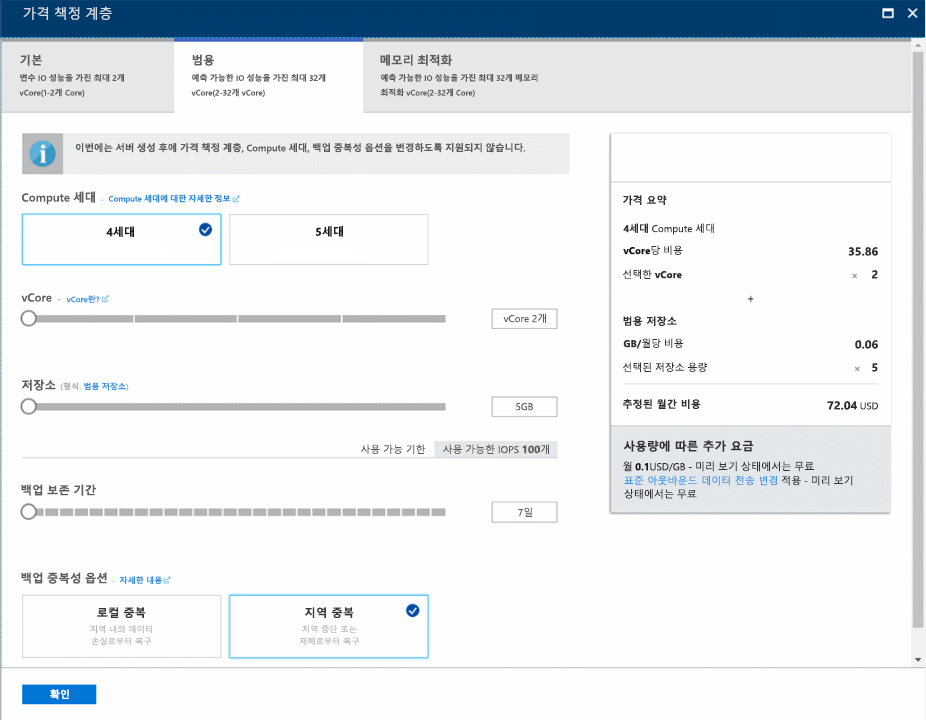
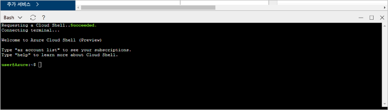
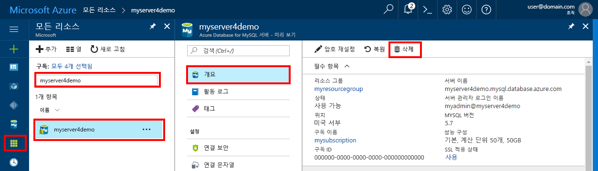

# <a name="create-an-azure-database-for-mysql-server-by-using-the-azure-portal"></a>Azure Portal을 사용하여 Azure Database for MySQL 서버 만들기

Azure Database for MySQL은 클라우드에서 고가용성 MySQL 데이터베이스를 실행, 관리 및 확장하는 데 사용하는 관리되는 서비스입니다. 이 빠른 시작에서는 Azure Portal을 사용하여 약 5분 안에 Azure Database for MySQL 서버를 만드는 방법을 보여 줍니다.  

Azure 구독이 아직 없는 경우 시작하기 전에 [Azure 체험 계정](https://azure.microsoft.com/free/)을 만듭니다.

## <a name="sign-in-to-the-azure-portal"></a>Azure Portal에 로그인
웹 브라우저를 연 다음 [Azure Portal](https://portal.azure.com/)로 이동합니다. 자격 증명을 입력하여 포털에 로그인합니다. 기본 보기는 서비스 대시보드입니다.

## <a name="create-an-azure-database-for-mysql-server"></a>Azure Database for MySQL 서버 만들기
Azure Database for MySQL 서버는 정의된 [계산 및 저장소 리소스](./concepts-compute-unit-and-storage.md) 집합을 사용하여 만듭니다. 서버는 [Azure 리소스 그룹](../azure-resource-manager/resource-group-overview.md) 내에 만듭니다.

다음 단계에 따라 Azure Database for MySQL 서버를 만듭니다.

1. 포털의 왼쪽 상단 모서리에서 **리소스 만들기** 단추(+)를 선택합니다.

2. **데이터베이스** > **Azure Database for MySQL**을 차례로 선택합니다. 또한 검색 상자에서 **MySQL**을 입력하여 해당 서비스를 찾을 수도 있습니다.

   

3. 새 서버 세부 정보 양식을 다음 정보로 작성합니다.
   
   

    **설정** | **제안 값** | **필드 설명** 
    ---|---|---
    서버 이름 | 고유 서버 이름 | Azure Database for MySQL 서버를 식별하는 고유한 이름을 선택합니다. 예를 들어 mydemoserver가 있습니다. 제공한 서버 이름에 *.mysql.database.azure.com* 도메인 이름이 추가됩니다. 서버 이름은 소문자, 숫자 및 하이픈(-) 문자만 포함할 수 있으며, 3-63자여야 합니다.
    구독 | 사용자의 구독 | 서버에 사용할 Azure 구독을 선택합니다. 구독이 여러 개인 경우, 리소스에 대해 요금이 청구되는 구독을 선택합니다.
    리소스 그룹 | *myresourcegroup* | 새 또는 기존 리소스 그룹 이름을 제공합니다.    리소스 그룹|*myresourcegroup*| 새 리소스 그룹 이름 또는 구독의 기존 이름입니다.
    원본 선택 | *비어 있음* | 새 서버를 처음부터 만들려면 *비어 있음*을 선택합니다. (기존 Azure Database for MySQL 서버의 지역 백업에서 서버를 만드는 경우 *백업*을 선택합니다).
    서버 관리자 로그인 | myadmin | 서버에 연결할 때 사용할 로그인 계정입니다. 관리자 로그인 이름은 **azure_superuser**, **admin**, **administrator**, **root**, **guest** 또는 **public**일 수 없습니다.
    암호 | *사용자 선택* | 서버 관리자 계정의 새 암호를 제공합니다. 8-128자여야 합니다. 암호는 영어 대문자, 영어 소문자, 숫자(0-9), 특수 문자(!, $, #, % 등) 중 세 가지 범주의 문자를 포함해야 합니다.
    암호 확인 | *사용자 선택*| 관리자 계정 암호를 확인합니다.
    위치 | *사용자와 가장 가까운 지역*| 사용자 또는 다른 Azure 응용 프로그램에 가장 가까운 위치를 선택합니다.
    버전 | *최신 버전*| 최신 버전입니다(다른 버전이 필요한 특정 요구 사항이 없는 경우).
    가격 책정 계층  | **범용**, **4세대**, **2개 vCore**, **5GB**, **7일**, **지역 중복** | 새 서버에 대한 계산, 저장소 및 백업 구성입니다. **가격 책정 계층**을 선택합니다. 그런 다음, **범용** 탭을 선택합니다. *4세대*, *2개 vCore*, *5GB* 및 *7일*은 **세대 계산**, **vCore**, **저장소** 및 **백업 보존 기간**에 대한 기본 값입니다. 해당 슬라이더를 그대로 둘 수 있습니다. 지역 중복 저장소에서 서버 백업을 사용하도록 설정하려면 **백업 중복 옵션**에서 **지역 중복**을 선택합니다. 이 가격 책정 계층 선택을 저장하려면 **확인**을 선택합니다. 다음 스크린샷은 이러한 선택을 캡처한 것입니다.
  
    > [!IMPORTANT]
    > 여기에 지정하는 서버 관리자 로그인 및 암호는 이 빠른 시작의 뒷부분에서 서버 및 해당 데이터베이스에 로그인하는 데 필요합니다. 나중에 사용하기 위해 이 정보를 기억하거나 기록합니다.
    > 

   

4.  **만들기**를 선택하여 서버를 프로비전합니다. 프로비전에는 최대 20분이 걸릴 수 있습니다.
   
5.  배포 프로세스를 모니터링하려면 도구 모음에서 **알림**(벨 아이콘)을 클릭합니다.
   
  기본적으로 서버 아래에 **information_schema**, **mysql**, **performance_schema** 및 **sys** 데이터베이스가 만들어집니다.

## <a name="configure-a-server-level-firewall-rule"></a>서버 수준 방화벽 규칙 구성

Azure Database for MySQL 서비스는 서버 수준에서 방화벽을 만듭니다. 그러면 외부 응용 프로그램 및 도구에서 서버 또는 서버의 모든 데이터베이스에 대한 연결이 허용되지 않습니다. 단, 특정 IP 주소에 대해 방화벽을 여는 방화벽 규칙을 만든 경우는 예외입니다. 

1.   배포가 완료되면 서버를 찾습니다. 필요한 경우 검색할 수 있습니다. 예를 들어 왼쪽 메뉴에서 **모든 리소스**를 선택합니다. 그런 다음, 서버 이름(예: **mydemoserver**)을 입력하여 새로 만든 서버를 검색합니다. 검색 결과 목록에서 서버 이름을 선택합니다. 서버에 대한 **개요** 페이지가 열리고 추가 구성을 위한 옵션이 제공됩니다.

2. 서버 페이지에서 **연결 보안**을 선택합니다.

3.  **방화벽 규칙** 제목 아래에서 **규칙 이름** 열의 빈 텍스트 상자를 선택하여 방화벽 규칙을 만들기 시작합니다. 

   이 빠른 시작에서는 각 열의 상자에서 다음 값을 입력하여 모든 IP 주소를 서버에 허용해 보겠습니다.

   규칙 이름 | 시작 IP | 종료 IP 
   ---|---|---
   AllowAllIps |  0.0.0.0 | 255.255.255.255
   
   

   모든 IP 주소 허용은 안전하지 않습니다. 이 예제는 편의상 제공되지만 실제 시나리오에서는 응용 프로그램 및 사용자에 대해 추가할 정확한 IP 주소 범위를 파악해야 합니다. 

4. **연결 보안** 페이지의 위쪽 도구 모음에서 **저장**을 선택합니다. 계속하기 전에 업데이트가 성공적으로 완료되었다는 알림이 나타날 때까지 기다립니다. 

   > [!NOTE]
   > Azure Database for MySQL에 대한 연결은 포트 3306을 통해 통신합니다. 회사 네트워크 내에서 연결하려고 하면 3306 포트를 통한 아웃바운드 트래픽이 허용되지 않을 수 있습니다. 이 경우 IT 부서에서 3306 포트를 열지 않으면 서버에 연결할 수 없습니다.
   > 

## <a name="get-the-connection-information"></a>연결 정보 가져오기
데이터베이스 서버에 연결하려면 전체 서버 이름 및 관리자 로그인 자격 증명이 필요합니다. 빠른 시작 문서의 앞부분에서 이러한 값을 기록했을 수도 있습니다. 그렇지 않은 경우 Azure Portal의 서버 **개요** 페이지 또는 **속성** 페이지에서 서버 이름과 로그인 정보를 쉽게 찾을 수 있습니다.

이러한 값을 찾으려면 다음 단계를 수행합니다. 

1. 서버의 **개요** 페이지를 엽니다. **서버 이름** 및 **서버 관리자 로그인 이름**을 기록해 둡니다. 

2. 각 필드 위에 커서를 올려 놓으면 텍스트 오른쪽에 복사 아이콘이 나타납니다. 필요에 따라 복사 아이콘을 선택하여 값을 복사합니다.

이 예에서 서버 이름은 **mydemoserver.mysql.database.azure.com**이고, 서버 관리자 로그인은 **myadmin@mydemoserver**입니다.

## <a name="connect-to-mysql-by-using-the-mysql-command-line-tool"></a>mysql 명령줄 도구를 사용하여 MySQL에 연결
Azure Database for MySQL 서버 연결하기 위해 사용할 수 있는 여러 응용 프로그램이 있습니다. 

이제 [mysql](https://dev.mysql.com/doc/refman/5.7/en/mysql.html) 명령줄 도구를 사용하여 서버에 연결하는 방법을 자세히 설명해 보겠습니다. 또한 추가 소프트웨어를 설치하지 않고 여기서 설명하는 대로 웹 브라우저 및 Azure Cloud Shell을 사용할 수도 있습니다. mysql 유틸리티를 로컬로 설치한 경우 여기서도 연결할 수 있습니다.

1. Azure Portal의 오른쪽 위에 있는 터미널 아이콘(**>_**)을 통해 Azure Cloud Shell을 시작합니다.


2.  Azure Cloud Shell이 브라우저에서 열리며. 여기서 bash 셸 명령을 입력할 수 있습니다.

   

3. Cloud Shell 프롬프트에서 mysql 명령줄을 입력하여 Azure Database for MySQL 서버에 연결합니다.

    mysql 유틸리티를 사용하여 Azure Database for MySQL 서버에 연결하려면 다음 형식을 사용합니다.

    ```bash
    mysql --host <fully qualified server name> --user <server admin login name>@<server name> -p
    ```

    예를 들어 다음 명령은 예제 서버에 연결합니다.

    ```azurecli-interactive
    mysql --host mydemoserver.mysql.database.azure.com --user myadmin@mydemoserver -p
    ```

    mysql 매개 변수 |제안 값|설명
    ---|---|---
    --host | *서버 이름* | 이전에 Azure Database for MySQL 서버를 만들 때 사용한 서버 이름 값입니다. 예제 서버는 **mydemoserver.mysql.database.azure.com**입니다. 예제와 같이 정규화된 도메인 이름(**\*.mysql.database.azure.com**)을 사용합니다. 서버 이름을 잊어버린 경우 이전 섹션의 단계에 따라 연결 정보를 가져옵니다. 
    --user | *서버 관리자 로그인 이름* |이전에 Azure Database for MySQL 서버를 만들 때 제공한 서버 관리자 로그인 사용자 이름입니다. 사용자 이름을 잊어버린 경우 이전 섹션의 단계에 따라 연결 정보를 가져옵니다. 형식은 *username@servername*입니다.
    -p | *메시지가 표시될 때까지 대기* |메시지가 표시되면 서버를 만들 때 제공한 암호와 동일한 암호를 제공합니다. 입력하는 암호 문자는 입력 시 bash 프롬프트에 표시되지 않습니다. 암호를 입력한 후 **Enter**를 선택합니다.

   연결된 후에 mysql 유틸리티에서 명령을 입력할 수 있는 `mysql>` 프롬프트가 표시됩니다. 

   다음은 mysql 출력 예제입니다.

    ```bash
    Welcome to the MySQL monitor.  Commands end with ; or \g.
    Your MySQL connection id is 65505
    Server version: 5.6.26.0 MySQL Community Server (GPL)
    
    Copyright (c) 2000, 2017, Oracle and/or its affiliates. All rights reserved.
    
    Oracle is a registered trademark of Oracle Corporation and/or its
    affiliates. Other names may be trademarks of their respective
    owners.

    Type 'help;' or '\h' for help. Type '\c' to clear the current input statement.
    
    mysql>
    ```
    > [!TIP]
    > 방화벽이 Azure Cloud Shell의 IP 주소를 허용하도록 구성되지 않은 경우 다음 오류가 발생합니다.
    >
    > 오류 2003(28000): IP 주소가 123.456.789.0인 클라이언트는 서버에 액세스할 수 없습니다.
    >
    > 이 오류를 해결하려면 서버 구성이 문서의 "서버 수준 방화벽 규칙 구성" 섹션의 단계와 일치하는지 확인합니다.

4. 연결이 작동하는지 확인하려면 mysql> 프롬프트에서 `status`를 입력하여 서버 상태를 봅니다.

    ```sql
    status
    ```

   > [!TIP]
   > 추가 명령은 [MySQL 5.7 참조 설명서 - 4.5.1장](https://dev.mysql.com/doc/refman/5.7/en/mysql.html)을 참조하세요.

5.  다음 명령을 입력하여 **mysql>** 프롬프트에서 빈 데이터베이스를 만듭니다.
    ```sql
    CREATE DATABASE quickstartdb;
    ```
    명령을 완료하는 데 몇 분 정도 걸릴 수 있습니다. 

    Azure Database for MySQL 서버 내에서 하나 이상의 데이터베이스를 만들 수 있습니다. 서버당 단일 데이터베이스를 만들어 모든 리소스를 활용하도록 하거나 여러 데이터베이스를 만들어 리소스를 공유하도록 할 수 있습니다. 만들 수 있는 데이터베이스의 수는 제한되지 않지만, 여러 데이터베이스에서 동일한 서버 리소스를 공유합니다. 

6. 다음 명령을 입력하여 **mysql>** 프롬프트에서 데이터베이스를 나열합니다.

    ```sql
    SHOW DATABASES;
    ```

7.  `\q`를 입력한 다음, **Enter** 키를 선택하여 mysql 도구를 종료합니다. 완료되면 Azure Cloud Shell을 닫을 수 있습니다.

이제 Azure Database for MySQL 서버에 연결되어 빈 사용자 데이터베이스를 만들었습니다. 다음 섹션에서 계속해서 비슷한 연습을 해봅니다. 다음 연습에서는 다른 일반적인 도구인 MySQL Workbench를 사용하여 동일한 서버에 연결합니다.

## <a name="connect-to-the-server-by-using-the-mysql-workbench-gui-tool"></a>MySQL Workbench GUI 도구를 사용하여 서버에 연결
MySQL Workbench GUI 도구를 사용하여 서버에 연결하려면 다음 단계를 수행합니다.

1.  클라이언트 컴퓨터에서 MySQL Workbench 응용 프로그램을 엽니다. [MySQL Workbench 다운로드](https://dev.mysql.com/downloads/workbench/)에서 MySQL Workbench를 다운로드하고 설치할 수 있습니다.

2. 새 연결을 만듭니다. **MySQL 연결** 제목 옆에 있는 더하기 (+) 아이콘을 클릭합니다.

3. **새 연결 설정** 대화 상자의 **매개 변수** 탭에 서버 연결 정보를 입력합니다. 자리 표시자 값은 예로 표시됩니다. 호스트 이름, 사용자 이름 및 암호를 원하는 값으로 대체합니다.

   

    |설정 |제안 값|필드 설명|
    |---|---|---|
     연결 이름 | 데모 연결 | 이 연결에 대한 레이블입니다. |
    연결 방법 | 표준(TCP/IP) | 표준(TCP/IP)이면 충분합니다. |
    호스트 이름 | *서버 이름* | 이전에 Azure Database for MySQL 서버를 만들 때 사용한 서버 이름 값입니다. 예제 서버는 **mydemoserver.mysql.database.azure.com**입니다. 예제와 같이 정규화된 도메인 이름(**\*.mysql.database.azure.com**)을 사용합니다. 서버 이름을 잊어버린 경우 이전 섹션의 단계에 따라 연결 정보를 가져옵니다.|
     포트 | 3306 | Azure Database for MySQL 서버에 연결할 때 사용할 포트입니다. |
    사용자 이름 |  *서버 관리자 로그인 이름* | 이전에 Azure Database for MySQL 서버를 만들 때 제공한 서버 관리자 로그인 정보입니다. 예제 사용자 이름은 **myadmin@mydemoserver**입니다. 사용자 이름을 잊어버린 경우 이전 섹션의 단계에 따라 연결 정보를 가져옵니다. 형식은 *username@servername*입니다.
    암호 | *사용자 암호* | **자격 증명 모음에 저장...** 단추를 선택하여 암호를 저장합니다. |

4. **연결 테스트**를 선택하여 모든 매개 변수가 올바르게 구성되었는지 테스트합니다. 그런 다음 **확인**을 클릭하여 해당 연결을 저장합니다. 

    > [!NOTE]
    > SSL은 서버에서 기본적으로 적용되며 성공적으로 연결하려면 추가 구성이 필요합니다. 자세한 내용은 [MySQL용 Azure 데이터베이스에 안전하게 연결하기 위한 사용자 응용 프로그램의 SSL 연결 구성](./howto-configure-ssl.md)을 참조하세요. 이 빠른 시작에서 SSL을 사용하지 않도록 설정하려면 Azure Portal로 이동합니다. 그런 다음, [연결 보안] 페이지를 선택하여 **SSL 적용** 연결 토글 단추를 비활성화합니다.

## <a name="clean-up-resources"></a>리소스 정리
빠른 시작에서 만든 리소스는 두 가지 방법으로 정리할 수 있습니다. 리소스 그룹의 모든 리소스를 포함하고 있는 [Azure 리소스 그룹](../azure-resource-manager/resource-group-overview.md)을 삭제할 수 있습니다. 다른 리소스를 그대로 유지하려면 하나의 서버 리소스만 삭제합니다.

> [!TIP]
> 이 컬렉션의 다른 빠른 시작은 이 빠른 시작을 기반으로 하여 빌드됩니다. 빠른 시작을 계속 사용하려면 이 빠른 시작에서 만든 리소스를 정리하지 마세요. 계속 사용하지 않을 경우 다음 단계에 따라 이 빠른 시작에서 만든 모든 리소스를 삭제할 수 있습니다.
>

새로 만든 서버를 포함하여 전체 리소스 그룹을 삭제하려면 다음 단계를 수행합니다.

1.  Azure Portal에서 리소스 그룹을 찾습니다. 왼쪽 메뉴에서 **리소스 그룹**을 선택한 다음, 리소스 그룹의 이름(예: **myresourcegroup**)을 선택합니다.

2.  리소스 그룹 페이지에서 **삭제**를 선택합니다. 그런 다음, 상자에서 리소스 그룹의 이름(예: **myresourcegroup**)을 입력하여 삭제를 확인한 후 **삭제**를 선택합니다.

새로 만든 서버만 삭제하려면 다음 단계를 수행합니다.

1.  Azure Portal에서 서버를 찾습니다(아직 열려 있지 않은 경우). Azure Portal의 왼쪽 메뉴에서 **모든 리소스**를 선택합니다. 그런 다음, 만든 서버를 검색합니다.

2.  **개요** 페이지에서 **삭제**를 선택합니다. 

   

3.  삭제할 서버의 이름을 확인하고 영향을 받는 데이터베이스를 표시합니다. 상자에서 서버 이름(예: **mydemoserver**)을 입력합니다. **삭제**를 선택합니다.

## <a name="next-steps"></a>다음 단계

> [!div class="nextstepaction"]
> [첫 번째 Azure Database for MySQL 데이터베이스 디자인](./tutorial-design-database-using-portal.md)

