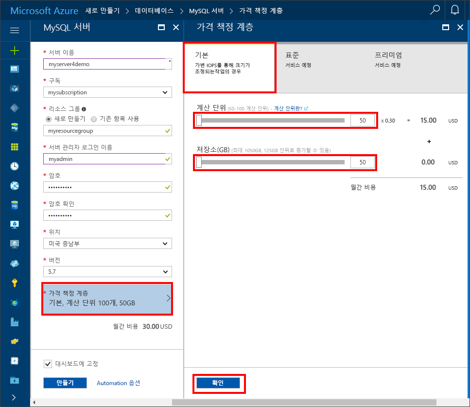

# <a name="design-your-first-azure-database-for-mysql-database"></a>첫 번째 Azure Database for MySQL 데이터베이스 디자인

Azure Database for MySQL은 클라우드에서 항상 사용 가능한 MySQL 데이터베이스를 실행, 관리 및 크기 조정할 수 있게 하는 관리 서비스입니다. Azure Portal을 사용하면 쉽게 서버를 관리하고 데이터베이스를 디자인할 수 있습니다.

이 자습서에서는 Azure Portal을 사용하여 다음을 수행하는 방법에 대해 알아봅니다.

> [!div class="checklist"]
> * Azure Database for MySQL 만들기
> * 서버 방화벽 구성
> * [mysql 명령줄 도구](https://dev.mysql.com/doc/refman/5.6/en/mysql.html)를 사용하여 데이터베이스 만들기
> * 샘플 데이터 로드
> * 쿼리 데이터
> * 데이터 업데이트
> * 데이터 복원

## <a name="log-in-to-the-azure-portal"></a>Azure 포털에 로그인
즐겨찾는 웹 브라우저를 열고 [Microsoft Azure Portal](https://portal.azure.com/)을 방문합니다. 자격 증명을 입력하여 포털에 로그인합니다. 기본 보기는 서비스 대시보드입니다.

## <a name="create-an-azure-database-for-mysql-server"></a>Azure Database for MySQL 서버 만들기
Azure Database for MySQL 서버는 정의된 [계산 및 저장소 리소스](./concepts-compute-unit-and-storage.md) 집합을 사용하여 만들어집니다. 서버는 [Azure 리소스 그룹](https://docs.microsoft.com/en-us/azure/azure-resource-manager/resource-group-overview) 내에 만들어집니다.

1.    **데이터베이스** -> **MySQL**로 이동합니다. **데이터베이스** 범주 아래에서 MySQL 서버를 찾을 수 없으면 **모두 표시**를 클릭하여 사용 가능한 모든 데이터베이스 서비스를 표시합니다. 또한 검색 상자에서 **MySQL**을 입력하여 해당 서비스를 빠르게 찾을 수도 있습니다.


2.    **MySQL** 아이콘을 클릭한 다음 **만들기**를 클릭합니다.

이 예제에서는 Azure Database for MySQL 양식을 다음 정보로 채웁니다.

| **양식 필드** | **필드 설명** |
|----------------|-----------------------|
| *서버 이름* | mysqlserver4demo(서버 이름은 전역적으로 고유해야 함) |
| *구독* | MySQLaaS(드롭다운에서 선택함) |
| *리소스 그룹* | myresource(리소스 그룹을 만들거나 기존 리소스 그룹을 사용함) |
| *서버 관리자 로그인* | myadmin(관리자 계정 이름을 설정함) |
| *암호* | 관리자 계정 암호를 설정합니다. |
| *암호 확인* | 관리자 계정 암호를 확인합니다. |
| *위치*: | 북유럽(**북유럽**과 **미국 서부**  중에서 선택함) |
| *버전* | 5.6(MySQL 서버 버전을 선택함) |
| *성능 구성* | 기본(**성능 계층**, **계산 단위**, **저장소**를 선택한 다음 **확인**을 클릭함) |

그런 다음에 **만들기**를 클릭합니다. 1 2분 안에 클라우드에서 실행되는 새 Azure Database for MySQL 서버를 갖게 됩니다. 도구 모음에서 **알림** 단추를 클릭하여 배포 프로세스를 모니터링합니다.

> [!TIP]
> Azure 서비스를 동일한 지역에 배포하고 가장 가까운 위치를 선택하는 것이 좋습니다. 또한 배포를 쉽게 추적할 수 있도록 **대시보드에 고정** 옵션을 선택할 수 있습니다.



## <a name="configure-firewall"></a>방화벽 구성
Azure Databases for MySQL은 방화벽으로 보호됩니다. 기본적으로 서버 및 서버 내의 데이터베이스에 대한 모든 연결은 거부됩니다. 처음으로 클라이언트에서 Azure Databases for MySQL에 연결하기 전에 먼저 방화벽을 구성하고 클라이언트의 공용 네트워크 IP 주소(또는 IP 주소 범위)를 허용 목록에 추가해야 합니다.

1.    새로 만든 서버를 클릭한 다음 **연결 보안**을 클릭합니다.


2.    **내 IP를 추가**하거나 여기서 방화벽 규칙을 구성할 수 있습니다. 규칙을 만든 후에 **저장**을 클릭해야 합니다.

이제 mysql 명령줄 도구 또는 MySQL Workbench GUI 도구를 사용하여 서버에 연결할 수 있습니다.

> Azure Databases for MySQL 서버는 3306 포트를 통해 통신합니다. 회사 네트워크 내에서 연결하려는 경우 3306 포트를 통한 아웃바운드 트래픽이 네트워크 방화벽에서 허용되지 않을 수 있습니다. 이 경우 IT 부서에서 3306 포트를 열지 않으면 Azure MySQL 서버에 연결할 수 없습니다

## <a name="get-connection-information"></a>연결 정보 가져오기
Azure Portal에서 Azure MySQL 서버의 정규화된 서버 이름을 가져옵니다. 정규화된 서버 이름을 사용하여 mysql 명령줄 도구를 통해 서버에 연결합니다.

1.    [Azure Portal](https://portal.azure.com/)의 왼쪽 메뉴에서 **모든 리소스**를 클릭하고 Azure Database for MySQL 서버를 클릭합니다.

2.    **속성**을 클릭합니다. **서버 이름** 및 **서버 관리자 로그인**을 기록해 둡니다.


이 예제에서 서버 이름은 *mysql4doc.database.windows.net*이고, 서버 관리자 로그인은 *mysqladmin@mysql4doc*입니다.

## <a name="connect-to-the-server-using-mysql"></a>mysql을 사용하여 서버에 연결
[mysql 명령줄 도구](https://dev.mysql.com/doc/refman/5.6/en/mysql.html)를 사용하여 Azure Database for MySQL 서버에 연결합니다. 이 예제에서 명령은 다음과 같습니다.
```cmd
mysql -h mysqlserver4demo.database.windows.net -u myadmin@mysqlserver4demo -p
```

## <a name="create-a-blank-database"></a>빈 데이터베이스 만들기
서버에 연결되면 사용할 빈 데이터베이스를 만듭니다.
```sql
CREATE DATABASE mysampledb;
```

프롬프트에서 다음 명령을 실행하여 새로 만든 이 데이터베이스에 대한 연결로 전환합니다.
```sql
USE mysampledb;
```

## <a name="create-tables-in-the-database"></a>데이터베이스에서 테이블 만들기
이제 Azure Database for MySQL 데이터베이스에 연결하는 방법을 알았으므로 몇 가지 기본 작업을 수행하는 방법을 살펴볼 수 있습니다.

먼저 테이블을 만들고 일부 데이터와 함께 로드할 수 있습니다. 인벤토리 정보를 저장하는 테이블을 만들어 보겠습니다.
```sql
CREATE TABLE inventory (
    id serial PRIMARY KEY, 
    name VARCHAR(50), 
    quantity INTEGER
);
```

## <a name="load-data-into-the-tables"></a>테이블에 데이터 로드
이제 테이블을 만들었으므로 이 테이블에 일부 데이터를 삽입할 수 있습니다. 열린 명령 프롬프트 창에서 다음 쿼리를 실행하여 데이터 행을 일부 삽입합니다.
```sql
INSERT INTO inventory (id, name, quantity) VALUES (1, 'banana', 150); 
INSERT INTO inventory (id, name, quantity) VALUES (2, 'orange', 154);
```

이제 앞에서 만든 테이블에 두 개의 샘플 데이터 행이 있습니다.

## <a name="query-and-update-the-data-in-the-tables"></a>테이블의 데이터 쿼리 및 업데이트
다음 쿼리를 실행하여 데이터베이스 테이블에서 정보를 검색합니다.
```sql
SELECT * FROM inventory;
```

또한 테이블의 데이터를 업데이트할 수도 있습니다
```sql
UPDATE inventory SET quantity = 200 WHERE name = 'banana';
```

이에 따라 데이터를 검색할 때 해당 행이 업데이트됩니다.
```sql
SELECT * FROM inventory;
```

## <a name="restore-a-database-to-a-previous-point-in-time"></a>이전 시점으로 데이터베이스 복원
실수로 이 테이블을 삭제했다고 가정해 보겠습니다. 이런 경우는 쉽게 복구할 수 없는 경우입니다. Azure Database for MySQL을 사용하면 마지막 시점에서 최대 35일 전의 특정 시점으로 되돌아가 이 시점의 새 서버로 복원할 수 있습니다. 이 새 서버를 사용하여 삭제된 데이터를 복구할 수 있습니다. 다음 단계에서는 테이블이 추가되기 이전 시점으로 샘플 서버를 복원합니다.

1- 서버에 대한 Azure Database for MySQL 페이지의 도구 모음에서 **복원**을 클릭합니다. **복원** 페이지가 열립니다.
.

2- **복원** 양식을 다음과 같은 필요한 정보로 채웁니다.

-    복원 지점: 데이터베이스를 변경하기 전의 특정 시점을 선택합니다.
-    대상 서버: 복원해 두려는 새 서버의 이름을 제공합니다.
-    위치: 지역은 선택할 수 없으며, 기본적으로 원본 서버와 동일합니다.
-    가격 책정 계층: 서버를 복원할 때 이 값을 변경할 수 없습니다. 원본 서버와 동일합니다.


3- **확인**을 클릭하여 서버를 테이블 삭제 이전의 [특정 시점으로 복원](./howto-restore-server-portal.md)합니다. 다른 특정 시점으로 서버를 복원하는 경우 서비스 계층에 대한 보존 기간 내에 있다면 중복된 새 서버를 지정한 시점의 원본 서버로 만들어집니다.

## <a name="next-steps"></a>다음 단계

이 자습서에서는 Azure Portal을 사용하여 다음을 수행하는 방법에 대해 알아보았습니다.

> [!div class="checklist"]
> * Azure Database for MySQL 만들기
> * 서버 방화벽 구성
> * [mysql 명령줄 도구](https://dev.mysql.com/doc/refman/5.6/en/mysql.html)를 사용하여 데이터베이스 만들기
> * 샘플 데이터 로드
> * 쿼리 데이터
> * 데이터 업데이트
> * 데이터 복원

[Azure Portal을 사용하여 Azure Database for MySQL 방화벽 규칙 만들기 및 관리](./howto-manage-firewall-using-portal.md)

