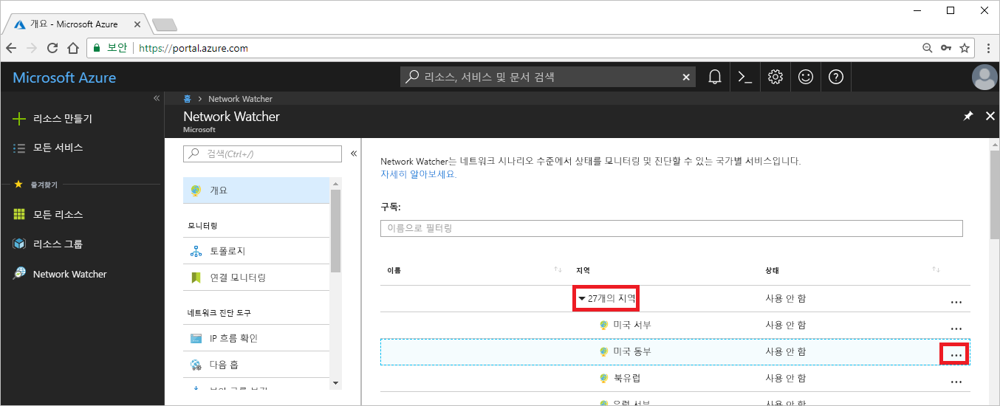
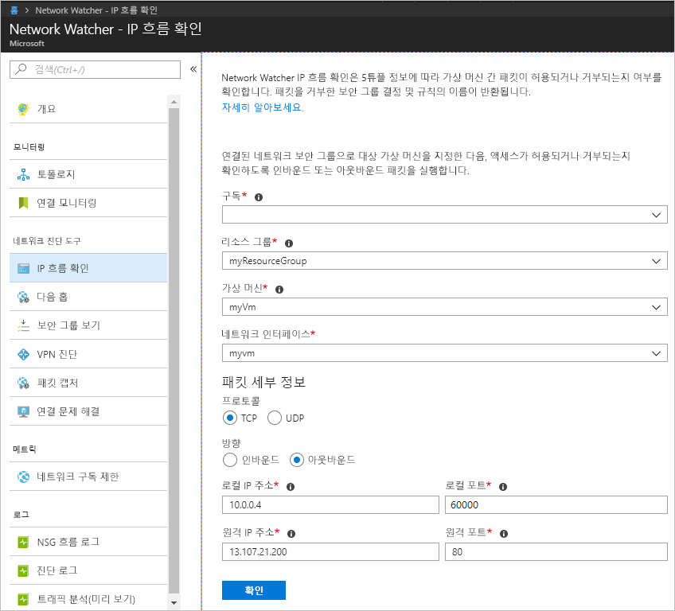
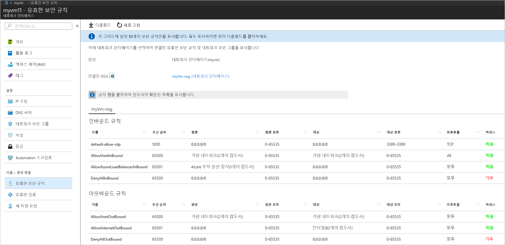
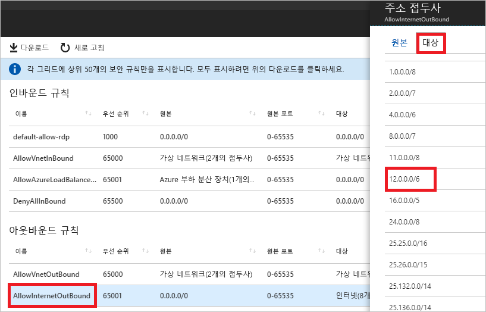

# 빠른 시작: Azure Portal을 사용하여 가상 머신 네트워크 트래픽 필터 문제 진단

이 빠른 시작에서 VM(가상 머신)을 배포한 다음, IP 주소와 URL 및 IP 주소에서 통신을 확인합니다. 통신 오류의 원인 및 해결 방법을 확인합니다.

Azure 구독이 아직 없는 경우 시작하기 전에 [체험 계정](https://azure.microsoft.com/free/?WT.mc_id=A261C142F)을 만듭니다.

## Azure에 로그인

Azure Portal ( https://portal.azure.com ) 에 로그인합니다.

## VM 만들기

1. Azure Portal의 왼쪽 위 모서리에 있는 **+ 리소스 만들기**를 선택합니다.
2. **컴퓨팅**을 선택한 다음, **Windows Server 2016 Datacenter** 또는 **Ubuntu Server** 버전을 선택합니다.
3. 다음 정보를 입력하거나 선택하고, 나머지 설정에 대한 기본값을 그대로 적용한 다음, **확인**을 선택합니다.

    |설정|값|
    |---|---|
    |Name|myVm|
    |사용자 이름| 선택한 사용자 이름을 입력합니다.|
    |암호| 선택한 암호를 입력합니다. 암호는 12자 이상이어야 하며 [정의된 복잡성 요구 사항](../virtual-machines/windows/faq.md?toc=%2fazure%2fnetwork-watcher%2ftoc.json#what-are-the-password-requirements-when-creating-a-vm)을 충족해야 합니다.|
    |구독| 구독을 선택합니다.|
    |리소스 그룹| **새로 만들기**를 선택하고 **myResourceGroup**을 입력합니다.|
    |위치| **미국 동부**를 선택합니다.|

4. VM에 대한 크기를 선택한 다음, **선택**을 선택합니다.
5. **설정** 아래에서 모든 기본값을 그대로 적용하고, **확인**을 선택합니다.
6. **요약**의 **만들기** 아래에서 **만들기**를 선택하여 VM 배포를 시작합니다. VM을 배포하는 데 몇 분이 걸립니다. 나머지 단계를 계속하기 전에 VM이 배포를 완료하도록 기다립니다.

## 네트워크 통신 테스트

Network Watcher와의 네트워크 통신을 테스트하려면 먼저 하나 이상의 Azure 지역에서 네트워크 감시자를 활성화한 다음, Network Watcher의 IP 흐름 확인 기능을 사용합니다.

### 네트워크 감시자 사용

하나 이상의 지역에서 이미 Network Watcher를 사용하도록 설정한 경우 [IP 흐름 확인 사용](#use-ip-flow-verify)으로 건너뜁니다.

1. 포털에서 **모든 서비스**를 선택합니다. **필터 상자**에 *Network Watcher*를 입력합니다. 검색 결과에 **Network Watcher**가 나타나면 이를 선택합니다.
2. 이전 단계에서 VM이 배포된 지역이기 때문에 미국 동부 지역에서 네트워크 감시자를 활성화합니다. **지역**을 선택하여 확장하고, 다음 그림처럼 **미국 동부** 오른쪽에서 **...** 를 선택합니다.

    

3. **Network Watcher 사용**을 선택합니다.

### IP 흐름 확인 사용

VM을 만들 때 Azure는 기본적으로 VM 간 네트워크 트래픽을 허용하고 거부합니다. 추가 트래픽 형식을 허용하거나 거부하여 나중에 Azure의 기본값을 재정의할 수 있습니다.

1. 포털에서 **모든 서비스**를 선택합니다. **모든 서비스** *필터* 상자에 *Network Watcher*를 입력합니다. 검색 결과에 **Network Watcher**가 나타나면 이를 선택합니다.
2. **네트워크 진단 도구**에서 **IP 흐름 확인**을 선택합니다.
3. 다음에 나오는 그림에 표시된 대로 구독을 선택하고, 다음 값을 입력하거나 선택한 다음, **검사**를 선택합니다.

    |설정            |값                                                                                              |
    |---------          |---------                                                                                          |
    | 리소스 그룹    | myResourceGroup 선택                                                                            |
    | 가상 머신   | myVm 선택                                                                                       |
    | Linux | myvm - VM을 만들 때 포털에서 만든 네트워크 인터페이스의 이름은 다릅니다. |
    | 프로토콜          | TCP                                                                                               |
    | 방향         | 아웃바운드                                                                                          |
    | 로컬 IP 주소  | 10.0.0.4                                                                                          |
    | 로컬 포트      | 60000                                                                                                |
    | 원격 IP 주소 | 13.107.21.200 - <www.bing.com>에 대한 주소 중 하나입니다.                                             |
    | 원격 포트       | 80                                                                                                |

    

    몇 초 후 반환되는 결과는 액세스가 **AllowInternetOutbound**라는 보안 규칙으로 인해 허용됨을 알립니다. 검사를 실행했을 때 검사를 실행하기 전에 기존 네트워크 감시자가 미국 동부 지역 이외의 지역에 있었던 경우 Network Watcher는 자동으로 미국 동부 지역에 네트워크 감시자를 생성했습니다.
4. **원격 IP 주소**를 **172.31.0.100**으로 변경하여 3단계를 다시 완료합니다. 반환되는 결과는 액세스가 **DefaultOutboundDenyAll**이라는 보안 규칙으로 인해 거부됨을 알립니다.
5. **방향**을 **인바운드**로, **로컬 포트**를 **80**으로 **원격 포트**를 **60000**으로 변경하여 3단계를 다시 완료합니다. 반환되는 결과는 액세스가 **DefaultInboundDenyAll**이라는 보안 규칙으로 인해 거부됨을 알립니다.

이제 VM 간 트래픽을 허용하거나 거부하는 보안 규칙을 알고 있으므로 문제를 해결하는 방법을 결정할 수 있습니다.

## 보안 규칙의 세부 정보 보기

1. [IP 흐름 확인 사용](#use-ip-flow-verify)의 3-5단계에서 규칙이 통신을 허용 또는 거부하는 이유를 확인하려면 VM에서 네트워크 인터페이스에 대해 유효한 보안 규칙을 검토합니다. 포털 맨 위에 있는 검색 상자에 *myvm*을 입력합니다. **myvm**(또는 네트워크 인터페이스의 이름이 무엇이든) 네트워크 인터페이스가 검색 결과에 나타나면 선택합니다.
2. 다음 그림과 같이 **지원 및 문제 해결**에서 **효과적인 보안 규칙**을 선택합니다.

    

    [IP 흐름 확인 사용](#use-ip-flow-verify)의 3단계에서 통신이 허용되는 원인이 **AllowInternetOutbound** 규칙 때문인 것을 학습했습니다. 이전 그림에서 규칙에 대한 **대상**이 **인터넷**인 것을 확인할 수 있습니다. 그러나 [IP 흐름 확인 사용](#use-ip-flow-verify)의 3단계에서 테스트한 주소인 13.107.21.200이 **인터넷**과 어떻게 관련되어 있는지 분명하지 않습니다.
3. **AllowInternetOutBound** 규칙을 선택한 다음, 다음 그림에 표시된 것처럼 **대상**을 선택합니다.

    

    목록의 접두사 중 하나는 IP 주소의 12.0.0.1-15.255.255.254 범위를 포함하는 **12.0.0.0/6**입니다. 13.107.21.200은 해당 주소 범위에 있으므로 **AllowInternetOutBound** 규칙은 아웃바운드 트래픽을 허용합니다. 또한 이 규칙을 재정의하는 2단계의 그림에 표시된 더 높은 우선 순위(낮은 수) 규칙이 없습니다. **주소 접두사** 상자를 닫습니다. 13.107.21.200에 대한 아웃바운드 통신을 거부하려면 IP 주소에 대한 포트 80 아웃바운드를 거부하는 더 높은 우선 순위를 가진 보안 규칙을 추가할 수 있습니다.
4. [IP 흐름 확인 사용](#use-ip-flow-verify)의 4단계에서 172.131.0.100에 대한 아웃바운드 검사를 실행할 때 **DefaultOutboundDenyAll** 규칙이 통신을 거부했음을 학습했습니다. 해당 규칙은 **대상**으로 **0.0.0.0/0**을 지정하는 2단계의 그림에 표시된 것처럼 **DenyAllOutBound** 규칙과 동일합니다. 이 규칙은 주소가 그림에 표시된 것처럼 다른 **아웃바운드 규칙**의 **대상** 내에 없기 때문에 172.131.0.100에 대한 아웃바운드 통신을 거부합니다. 아웃바운드 통신을 허용하려면 172.131.0.100 주소에 대해 포트 80에 대한 아웃바운드 트래픽을 허용하는 더 높은 우선 순위를 가진 보안 규칙을 추가할 수 있습니다.
5. [IP 흐름 확인 사용](#use-ip-flow-verify)의 5단계에서 172.131.0.100의 인바운드 검사를 실행할 때 **DefaultInboundDenyAll** 규칙이 통신을 거부했음을 학습했습니다. 해당 규칙은 2단계의 그림에 표시된 **DenyAllInBound** 규칙과 동일합니다. 172.31.0.100에서 VM에 대한 포트 80 인바운드를 허용하는 더 높은 우선 순위 규칙이 없으므로 **DenyAllInBound** 규칙이 적용됩니다. 인바운드 통신을 허용하려면 172.31.0.100에서 포트 80 인바운드를 허용하는 더 높은 우선 순위를 가진 보안 규칙을 추가할 수 있습니다.

이 빠른 시작에서 검사는 Azure 구성을 테스트했습니다. 검사가 예상된 결과를 반환하고 여전히 네트워크 문제가 있는 경우 VM과 통신하고 있는 엔드포인트 간에 방화벽이 없고 VM의 운영 체제에 통신을 허용하거나 거부하는 방화벽이 없는지 확인합니다.

## 리소스 정리

더 이상 필요하지 않은 경우 리소스 그룹 및 해당 그룹에 포함된 모든 리소스를 삭제합니다.

1. 포털 맨 위에 있는 **검색** 상자에 *myResourceGroup*을 입력합니다. 검색 결과에 **myResourceGroup**이 보이면 선택합니다.
2. **리소스 그룹 삭제**를 선택합니다.
3. **리소스 그룹 이름 입력:** 에 *myResourceGroup*을 입력하고 **삭제**를 선택합니다.

## 다음 단계

이 빠른 시작에서는 VM을 만들고 인바운드 및 아웃바운드 네트워크 트래픽 필터를 진단했습니다. VM 간 트래픽을 허용하거나 거부하는 네트워크 보안 그룹 규칙을 배웠습니다. [보안 규칙](../virtual-network/security-overview.md?toc=%2fazure%2fnetwork-watcher%2ftoc.json) 및 [보안 규칙을 만드는](../virtual-network/manage-network-security-group.md?toc=%2fazure%2fnetwork-watcher%2ftoc.json#create-a-security-rule) 방법에 대해 자세히 알아봅니다.

적절한 네트워크 트래픽 필터가 준비되어 있더라도 라우팅 구성으로 인해 VM에 대한 통신이 여전히 실패할 수 있습니다. VM 네트워크 라우팅 문제를 진단하는 방법을 알아보려면 [VM 라우팅 문제 진단](diagnose-vm-network-routing-problem.md)을 참조하거나 하나의 도구로 아웃바운드 라우팅, 대기 시간 및 트래픽 필터링 문제를 진단하려면 [연결 문제 해결](network-watcher-connectivity-portal.md)을 참조하세요.
