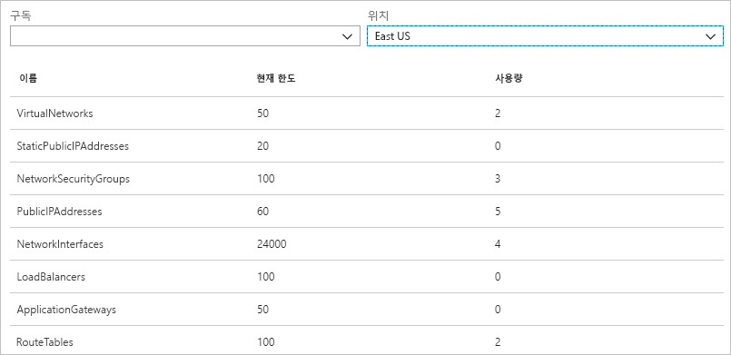
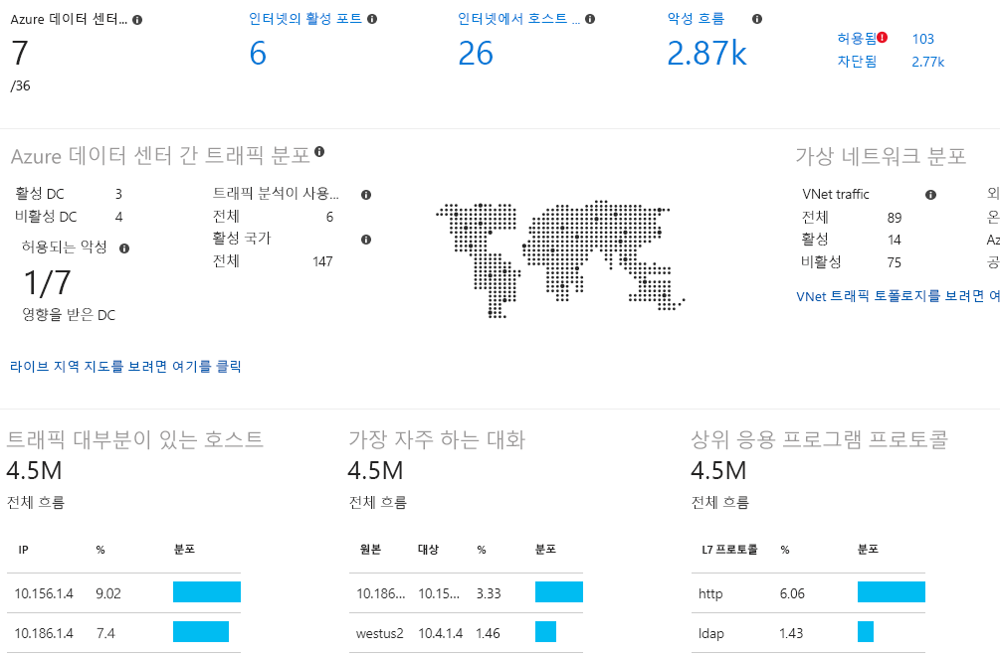

# Azure Network Watcher란?

Azure Network Watcher는 Azure 가상 네트워크의 리소스를 모니터링 및 진단하고 메트릭을 보고 그에 대한 로그를 활성화 또는 비활성화하는 도구를 제공합니다.

## 모니터링

### 가상 머신과 엔드포인트 간의 통신 모니터링

또 다른 VM(가상 머신), FQDN(정규화된 도메인 이름), URI(Uniform Resource Identifier) 또는 IPv4 주소가 엔드포인트일 수 있습니다. *연결 모니터* 기능은 VM과 엔드포인트 간의 통신을 일정한 간격으로 모니터링하고 연결, 대기 시간 및 네트워크 토폴로지 변경을 알립니다. 예를 들어 데이터베이스 서버 VM과 통신하는 웹 서버 VM이 있다고 가정해 보겠습니다. 사용자가 모르는 조직의 누군가가 웹 서버, 데이터베이스 서버 VM 또는 서브넷에 사용자 지정 경로 또는 네트워크 보안 규칙을 적용할 수 있습니다.

엔드포인트에 연결할 수 없으면 연결 문제 해결 기능이 그 원인을 알립니다. 가능한 원인으로 DNS 이름 확인 문제, VM 운영 체제 내의 CPU, 메모리 또는 방화벽, 사용자 지정 경로의 홉 형식, 또는 아웃바운드 연결의 VM 또는 서브넷의 사용자 지정 경로나 보안 규칙이 있습니다. Azure의 [보안 규칙](../virtual-network/security-overview.md?toc=%2fazure%2fnetwork-watcher%2ftoc.json#security-rules) 및 [경로 홉 형식](../virtual-network/virtual-networks-udr-overview.md?toc=%2fazure%2fnetwork-watcher%2ftoc.json)에 대해 알아봅니다.

연결 모니터는 시간 경과에 따라 관찰한 최소, 평균 및 최대 대기 시간도 제공합니다. 연결의 대기 시간을 알아본 후 Azure 리소스를 다른 Azure 지역으로 이동하여 대기 시간을 줄일 수 있다는 것을 확인할 수도 있습니다. [Azure 지역과 인터넷 서비스 공급자 간의 상대 대기 시간](#determine-relative-latencies-between-azure-regions-and-internet-service-providers) 및 [연결 모니터](connection-monitor.md)로 VM과 엔드포인트 간의 통신을 모니터링하는 방법의 결정에 대해 더 자세히 알아봅니다. 연결 모니터로 수행하는 것과 유사하게 시간 경과에 따른 연결을 모니터링하지 않고 어느 시점에 연결을 시험하려는 경우, [연결 문제 해결](#connection-troubleshoot) 기능을 사용합니다.

네트워크 성능 모니터는 네트워크 인프라의 다양한 지점 간 네트워크 성능을 모니터링하는 데 도움이 되는 클라우드 기반 하이브리드 네트워크 모니터링 솔루션입니다. 또한 서비스 및 응용 프로그램 엔드포인트에 대한 네트워크 연결을 모니터링하고 Azure ExpressRoute의 성능을 모니터링하는 데 도움이 됩니다. 네트워크 성능 모니터는 트래픽 블랙홀링, 라우팅 오류와 같은 네트워크 문제와 기존 네트워크 모니터링 방법으로 감지할 수 없는 문제를 감지합니다. 이 솔루션은 네트워크 링크에 임계값이 위반되면 경고를 생성하고 사용자에게 알립니다. 또한 네트워크 성능 문제를 적시에 감지하고 문제의 원인을 특정 네트워크 세그먼트 또는 장치로 국한시킵니다. [네트워크 성능 모니터](../log-analytics/log-analytics-network-performance-monitor.md?toc=%2fazure%2fnetwork-watcher%2ftoc.json)에 대해 자세히 알아봅니다.

### 가상 네트워크의 리소스와 해당 리소스의 관계 보기

리소스가 가상 네트워크에 추가됨에 따라 가상 네트워크에 무슨 리소스가 있는지, 해당 리소스들이 서로 어떤 관계에 있는지 해석하기 어려워질 수 있습니다. *토폴로지* 기능을 사용하면 가상 네트워크의 리소스에 대한 시각적 다이어그램 및 리소스 간의 관계를 생성할 수 있습니다. 다음 그림은 서브넷 3개, VM 2개, 네트워크 인터페이스, 공용 IP 주소, 네트워크 보안 그룹, 경로 설정 테이블 및 리소스 간의 관계를 포함한 가상 네트워크의 토폴로지 다이어그램 예제를 보여 줍니다.

그림의 편집 가능한 버전을 svg 형식으로 다운로드할 수 있습니다. [토폴로지 뷰](view-network-topology.md)에 대해 자세히 알아봅니다.

## 진단

### VM에 대한 네트워크 트래픽 필터링 문제 진단

VM을 배포하는 경우, Azure는 VM에 대한 트래픽을 허용하거나 거부할 수 있는 여러 기본 보안 규칙을 VM에 적용합니다. Azure의 기본 규칙을 재정의하거나 추가 규칙을 만들 수 있습니다. 어느 시점엔가 VM은 보안 규칙 때문에 다른 리소스와 통신할 수 없게 될 수 있습니다. *IP 흐름 확인* 기능을 사용하면 원본 및 대상 IPv4 주소, 포트, 프로토콜(TCP 또는 UDP) 및 트래픽 방향(인바운드 또는 아웃바운드)를 지정할 수 있습니다. 이때 IP 흐름 확인이 통신을 테스트하고 연결이 성공인지 실패인지 알립니다. 연결이 실패인 경우 IP 흐름 확인이 통신을 허용하거나 거부한 보안 규칙이 무엇인지 알리므로 문제를 해결할 수 있습니다. [가상 머신 네트워크 트래픽 필터 문제 진단](diagnose-vm-network-traffic-filtering-problem.md) 자습서를 완료하여 IP 흐름 확인에 대해 자세히 알아봅니다.

### VM에서 네트워크 경로 설정 문제 진단

가상 네트워크를 만들 때 Azure는 네트워크 트래픽에 대한 여러 기본 아웃바운드 경로를 만듭니다. 가상 네트워크에 배포된 VM 같은 모든 리소스에서 시작되는 아웃바운드 트래픽은 Azure의 기본 경로를 기반으로 경로 설정됩니다. Azure의 기본 경로를 재정의하거나 추가 경로를 만들 수 있습니다. VM이 특정 경로 때문에 다른 리소스와 더 이상 통신할 수 없다는 것을 알 수 있습니다. *다음 홉* 기능을 사용하면 원본 및 대상 IPv4 주소를 지정할 수 있습니다. 그러면 다음 홉이 통신을 테스트하고 트래픽을 경로 설정하는 데 사용한 다음 홉 형식이 무엇인지 알립니다. 이때 경로를 제거, 변경 또는 추가하거나 경로 설정 문제를 해결할 수 있습니다. [다음 홉](diagnose-vm-network-routing-problem.md) 기능에 대해 자세히 알아봅니다.

### VM에서의 아웃바운드 연결 진단

*연결 문제 해결* 기능을 사용하면 VM과 다른 VM, FQDN, URI 또는 IPv4 주소 간의 연결을 테스트할 수 있습니다. 이 테스트에서는 [연결 모니터](#connection-monitor) 기능을 사용할 때와 반환되는 것과 유사한 정보를 반환하지만 연결 모니터처럼 시간의 경과에 따라 모니터링하지 않고 어느 한 시점에 연결을 테스트합니다. [연결 문제 해결](network-watcher-connectivity-overview.md)을 사용하여 연결 문제를 해결하는 방법에 대해 자세히 알아봅니다.

### VM에 대한 패킷 캡처

고급 필터링 옵션과 세밀한 조정 컨트롤(예: 시간 및 크기 제한을 설정하는 기능)이 다양하게 제공됩니다. 캡처한 내용을 Azure Storage, VM의 디스크 또는 둘 다에 저장할 수 있습니다. 그런 다음, 여러 표준 네트워크 캡처 분석 도구를 사용하여 캡처 파일을 분석할 수 있습니다. [패킷 캡처](network-watcher-packet-capture-overview.md)에 대해 자세히 알아봅니다.

### Azure 가상 네트워크 게이트웨이 및 연결에 대한 문제 진단

가상 네트워크 게이트웨이는 온-프레미스 리소스와 Azure 가상 네트워크 간의 연결을 제공합니다. 게이트웨이 및 해당 연결을 모니터링하는 것은 통신이 끊기지 않도록 하는 데 중요합니다. *VPN 진단* 기능은 게이트웨이 및 연결을 진단하는 기능을 제공합니다. VPN 진단은 게이트웨이 또는 게이트웨이 연결의 상태를 진단하며 게이트웨이 및 게이트웨이 연결을 사용할 수 있는지 여부를 알립니다. 게이트웨이 또는 연결을 사용할 수 없는 경우 VPN 진단이 그 이유를 알려 주므로 문제를 해결할 수 있습니다. [네트워크 간 통신 문제 진단](diagnose-communication-problem-between-networks.md) 자습서를 완료하여 VPN 진단에 대해 자세히 알아봅니다.

### Azure 지역과 인터넷 서비스 공급자 간의 상대 대기 시간 결정

Network Watcher에 대해 Azure 지역 간 및 인터넷 서비스 공급자 간 대기 시간 정보를 쿼리할 수 있습니다. Azure 지역 간 및 인터넷 서비스 공급자 간 대기 시간을 알면 네트워크 응답 시간을 최적화하도록 Azure 리소스를 배포할 수 있습니다. [상대 대기 시간](view-relative-latencies.md)에 대해 자세히 알아봅니다.

### 네트워크 인터페이스에 대한 보안 규칙 보기

네트워크 인터페이스에 효과적인 보안 규칙은 네트워크 인터페이스 및 네트워크 인터페이스가 속한 서브넷에 적용된 모든 보안 규칙의 조합입니다.  *보안 그룹 뷰* 기능은 네트워크 인터페이스, 네트워크 인터페이스가 속한 서브넷 및 둘 다의 집합체에 적용된 모든 규칙을 보여 줍니다. 네트워크 인터페이스에 적용된 규칙이 무엇인지 알고 있으면 변경하려는 트래픽을 해당 규칙이 허용하거나 거부하는 경우 규칙을 추가, 제거 또는 변경할 수 있습니다. [보안 그룹 뷰](network-watcher-security-group-view-overview.md)에 대해 자세히 알아봅니다.

## 메트릭

네트워크 리소스 수에는 Azure 구독 및 하위 지역 내에서 만들 수 있는 [한도](../azure-subscription-service-limits.md?toc=%2fazure%2fnetwork-watcher%2ftoc.json#azure-resource-manager-virtual-networking-limits)가 있습니다. 한도에 도달하면 해당 구독 또는 하위 지역 내에서 리소스를 더 만들 수 없습니다. *네트워크 구독 한도* 기능은 구독 및 하위 지역에 배포한 각 네트워크 리소스의 수량 및 리소스 한도에 대한 요약을 제공합니다. 다음 그림은 예제 구독의 미국 동부 지역에 배포한 네트워크 리소스에 대한 부분 출력을 보여 줍니다.

이 정보는 향후 리소스 배포를 계획할 때 유용합니다.

## 로그

### 네트워크 보안 그룹에 대한 트래픽 분석

네트워크 보안 그룹(NSG)은 VM의 네트워크 인터페이스에 대한 인바운드 또는 아웃바운드 트래픽을 허용하거나 거부합니다. *NSG 흐름 로드* 기능을 사용하면 원본 및 대상 IP 주소, 포트, 프로토콜 및 NSG에서 트래픽을 허용했는지 또는 거부했는지 여부를 기록할 수 있습니다. PowerBI 및 *트래픽 분석* 기능 등 다양한 도구를 사용하여 로그를 분석할 수 있습니다. 트래픽 분석은 NSG 흐름 로그에 기록된 데이터의 풍부한 시각화를 제공합니다. 다음 그림은 트래픽 분석이 NSG 흐름 로그 데이터에서 제공하는 일부 정보 및 시각화를 보여 줍니다.

[가상 머신 간 로그 네트워크 트래픽](network-watcher-nsg-flow-logging-portal.md) 자습서를 완료하여 NSG 흐름 로그 및 [트래픽 분석](traffic-analytics.md)을 구현하는 방법에 대해 자세히 알아봅니다.

### 네트워크 리소스에 대한 진단 로그 보기

네트워크 보안 그룹, 공용 IP 주소, 부하 분산 장치, 가상 네트워크 게이트웨이 및 응용 프로그램 게이트웨이 등 Azure 네트워킹 리소스에 대한 진단을 기록할 수 있습니다. *진단 로그* 기능은 기존 네트워크 리소스에 대해 진단 로그를 생성하는 네트워크 리소스 진단 로그를 활성화 및 비활성화하는 단일 인터페이스를 제공합니다. Microsoft Power BI 및 Azure Log Analytics 같은 도구를 사용하여 진단 로그를 볼 수 있습니다. Azure 네트워크 진단 로그의 분석에 대해 더 자세히 알아보려면 [Log Analytics의 Azure 네트워크 솔루션](../log-analytics/log-analytics-azure-networking-analytics.md?toc=%2fazure%2fnetwork-watcher%2ftoc.json)을 참조하세요.

## Network Watcher 자동 사용
구독에서 가상 네트워크를 만들거나 업데이트하는 경우 가상 네트워크의 지역에서 Network Watcher가 자동으로 사용됩니다. 리소스에 대한 영향이나 Network Watcher를 자동으로 사용하도록 설정하는 데 관련된 요금이 발생하지 않습니다. 자세한 내용은 [Network Watcher 만들기](network-watcher-create.md)를 참조하세요.

## 다음 단계

Azure Network Watcher에 대한 개요를 살펴봤습니다. Network Watcher 사용을 시작하려면 IP 흐름 확인을 사용하여 가상 머신에 대한 일반적인 통신 문제를 진단합니다. 방법을 알아보려면 [가상 머신 네트워크 트래픽 필터 문제 진단](diagnose-vm-network-traffic-filtering-problem.md) 빠른 시작을 참조하세요.
