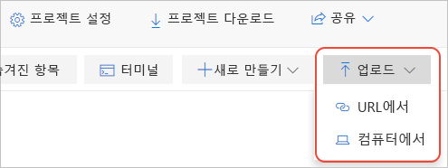

# 빠른 시작: 로컬 Jupyter Notebook 마이그레이션

사용자의 로컬 컴퓨터에 만든 Jupyter Notebook은 해당 사용자만 액세스할 수 있습니다. 다양한 수단을 통해 파일을 공유할 수 있지만, 받는 사람은 Notebook의 로컬 복사본을 얻게 되므로 이들이 변경하는 내용을 통합하기 어렵습니다. GitHub 같은 공유 온라인 리포지토리에 Notebook을 저장할 수도 있지만, 이렇게 하더라도 각 공동 작업자에게는 여전히 사용자와 동일한 구성의 로컬 Jupyter가 설치됩니다.

로컬 또는 리포지토리 기반 Notebook을 Azure Notebooks로 마이그레이션하면 공동 작업자와 즉시 공유할 수 있는 클라우드에 저장됩니다. 공동 작업자는 Notebook을 보고 실행할 브라우저만 있으면 되고, Azure Notebooks에 [로그인](quickstart-sign-in-azure-notebooks.md)하면 변경 작업을 수행할 수 있습니다.

이 빠른 시작에서는 Notebook을 로컬 컴퓨터 또는 다른 액세스 가능한 파일 URL로 마이그레이션하는 프로세스를 보여줍니다. Notebook을 GitHub 리포지토리에서 마이그레이션하려면 [빠른 시작: Notebook 복제](quickstart-clone-jupyter-notebook.md)를 참조하세요.

## Azure Notebooks에서 프로젝트 만들기

1. [Azure Notebooks](https://notebooks.azure.com)로 이동하여 로그인합니다. (자세한 내용은 [빠른 시작 - Azure Notebooks에 로그인](quickstart-sign-in-azure-notebooks.md)을 참조하세요.)

1. 공개 프로필 페이지 맨 위에 있는 **내 프로젝트**를 선택합니다.

    

1. **내 프로젝트** 페이지에서 **+ 새 프로젝트**(바로 가기 키: n)를 선택합니다. 브라우저 창이 좁은 경우 이 단추가 **+** 기호로만 표시될 수 있습니다.

    

1. 나타나는 **새 프로젝트 만들기** 팝업에서 마이그레이션하려는 Notebook의 적절한 값을 **프로젝트 이름** 및 **프로젝트 ID** 필드에 입력하고, **공용 프로젝트** 및 **README.md 만들기**에 대한 옵션을 취소하고, **만들기**를 선택합니다.

## 로컬 Notebook 업로드

1. 프로젝트 페이지에서 **업로드**(브라우저 창이 작은 경우 위쪽 화살표만 표시될 수 있음)를 선택하고 1을 선택합니다. 나타나는 팝업에서, Notebook이 로컬 파일 시스템에 있으면 **컴퓨터에서**를 선택하고 Notebook이 온라인에 있으면 **URL에서**를 선택합니다.

    

   (마찬가지로 Notebook이 GitHub 리포지토리에 있으면 [빠른 시작: Notebook 복제](quickstart-clone-jupyter-notebook.md)의 단계를 대신 수행합니다.)

   - **컴퓨터에서**를 사용하는 경우 *.ipynb* 파일을 팝업으로 끌어서 놓거나 **파일 선택**을 선택한 다음, 가져오려는 파일을 찾아서 선택합니다. 그런 다음, **Upload**(업로드)를 선택합니다. 업로드된 파일의 이름은 로컬 파일과 똑같은 이름으로 지정됩니다. ( *.ipynb_checkpoints* 폴더의 콘텐츠를 업로드할 필요가 없습니다.)

     

   - **URL에서**를 사용하는 경우 **파일 URL** 필드에 원본 주소를 입력하고 **파일 이름**에 프로젝트의 Notebook에 할당할 파일 이름을 입력합니다. 그런 다음, **Upload**(업로드)를 선택합니다. 별도의 URL을 사용하는 파일이 여러 개 있는 경우 **+ 파일 추가** 명령을 사용하여 입력한 첫 번째 URL을 검사합니다. 그러면 다른 파일에 대한 새 필드가 팝업에 제공됩니다.

     

1. 새로 업로드된 Notebook을 열고 실행하여 콘텐츠 및 작업을 확인합니다. 여기까지 마쳤으면 **파일** > **중지 및 닫기**를 선택하여 Notebook을 닫습니다.

1. 업로드된 노트북의 링크를 공유하려면 프로젝트에서 파일을 마우스 오른쪽 단추로 클릭하고 **링크 복사**(바로 가기 키: y)를 선택한 다음, 해당 링크를 적절한 메시지에 붙여넣습니다. 또는 프로젝트 페이지에서 **공유** 컨트롤을 사용하여 전체 프로젝트를 공유할 수도 있습니다.

1. Notebook이 아닌 파일을 편집하려면 프로젝트에서 파일을 마우스 오른쪽 단추로 클릭하고 **파일 편집**(바로 가기 키: i)을 선택합니다. 기본 작업 **실행**(바로 가기 키: r)은 파일 콘텐츠를 보여줄 뿐이며 편집을 허용하지 않습니다.

## 다음 단계

> [!div class="nextstepaction"]
> [자습서: 선형 회귀를 위해 Jupyter 노트 실행 만들기](tutorial-create-run-jupyter-notebook.md)
