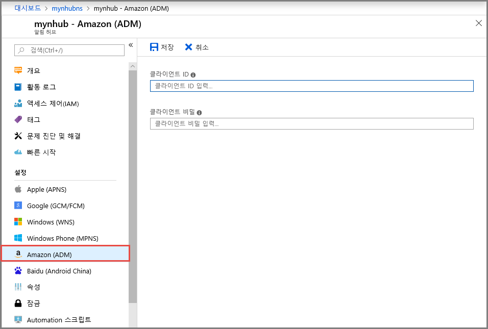

# Azure portal에서 알림 허브에 대 한 Android 장치 메시징 (ADM) 설정 구성
이 문서에서는 Azure portal을 사용 하 여 Azure 알림 허브에 대 한 Android 장치 메시징 (ADM) 설정을 구성 하는 방법을 보여 줍니다. 

## 필수 조건
알림 허브를 아직 만들지 않은 경우 지금 만듭니다. 자세한 내용은 [Azure Portal에 Azure 알림 허브 만들기](create-notification-hub-portal.md)를 참조하세요. 

## Android 디바이스 메시징 구성

다음 절차는 알림 허브에 대 한 Amazon 장치 메시징 (ADM) 설정을 구성 하는 단계를 제공 합니다. 

1. Azure portal에서에 **알림 허브** 페이지에서 **ADM (Amazon)** 왼쪽된 메뉴에서.
2. **클라이언트 ID** 및 **클라이언트 비밀**에 대한 값을 입력합니다.
3. **저장**을 선택합니다.
    
   

## 다음 단계
Azure Notification Hubs 및 Android 장치 메시징 (ADM)를 사용 하 여 Android 장치로 알림을 푸시하는 것에 대 한 단계별 지침이 포함 된 자습서를 참조 하세요 [Kindle 앱에 대 한 Notification Hubs를 사용 하 여 시작](notification-hubs-kindle-amazon-adm-push-notification.md)합니다.

