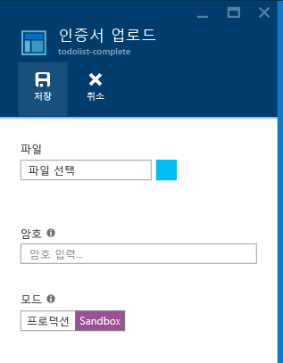
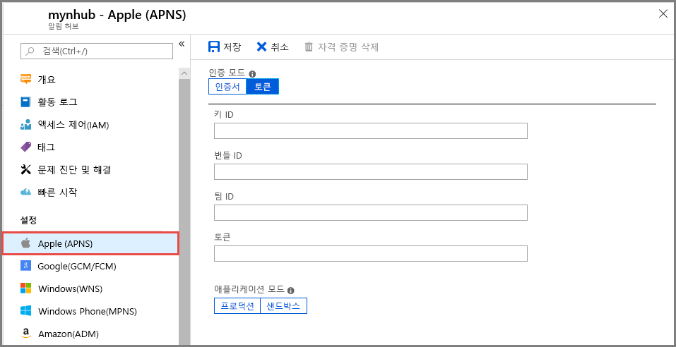
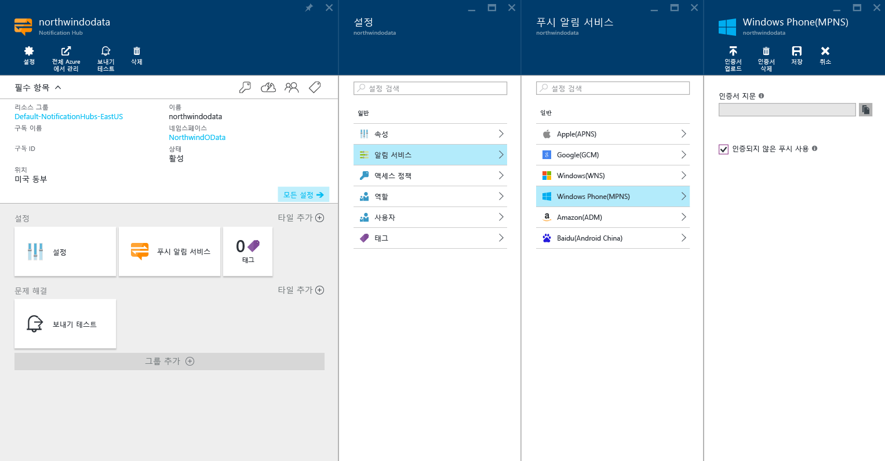

# Azure Portal의 알림 허브에서 푸시 알림 설정

Azure Notification Hubs는 사용하기 쉽고 확장 가능한 푸시 엔진을 제공합니다. Notification Hubs를 사용하여 모든 플랫폼(iOS, Android, Windows, Kindle, Baidu) 및 백 엔드(클라우드 또는 온-프레미스)에 알림을 보냅니다. 자세한 내용은 [Azure Notification Hubs란?](notification-hubs-push-notification-overview.md)를 참조하세요.

이 빠른 시작에서는 Notification Hubs의 PNS(플랫폼 알림 시스템) 설정을 사용하여 여러 플랫폼에서 푸시 알림을 설정합니다. 빠른 시작은 Azure Portal에서 수행할 단계를 보여줍니다.

알림 허브를 아직 만들지 않은 경우 지금 만듭니다. 자세한 내용은 [Azure Portal에 Azure 알림 허브 만들기](create-notification-hub-portal.md)를 참조하세요. 

## Apple Push Notification Service

APNS(Apple Push Notification Service)를 설정하려면 다음을 수행합니다.

1. Azure Portal의 **알림 허브** 페이지 왼쪽 메뉴에서 **Apple(APNS)** 을 선택합니다.

1. **인증 모드**의 경우 **인증서** 또는 **토큰**을 선택합니다.

   a. **인증서**를 선택한 경우:
   * 파일 아이콘을 선택한 다음, 업로드할 *.p12* 파일을 선택합니다.
   * 암호를 입력합니다.
   * **샌드박스** 모드를 선택합니다. 또는 스토어에서 앱을 구매한 사용자에게 푸시 알림을 보내려면 **프로덕션** 모드를 선택합니다.

     

   b. **토큰**을 선택한 경우:

   * **키 ID**, **번들 ID**, **팀 ID** 및 **토큰**에 대한 값을 입력합니다.
   * **샌드박스** 모드를 선택합니다. 또는 스토어에서 앱을 구매한 사용자에게 푸시 알림을 보내려면 **프로덕션** 모드를 선택합니다.

     

자세한 내용은 [Azure Notification Hubs를 사용하여 iOS에 푸시 알림](notification-hubs-ios-apple-push-notification-apns-get-started.md)을 참조하세요.

## Google Firebase Cloud Messaging

FCM(Google Firebase Cloud Messaging)에 대한 푸시 알림을 설정하려면 다음을 수행합니다.

1. Azure Portal의 **알림 허브** 페이지 왼쪽 메뉴에서 **Google(GCM/FCM)** 을 선택합니다. 
2. 앞에서 저장한 FCM 프로젝트의 **API 키**를 붙여넣습니다. 
3. **저장**을 선택합니다. 

   

이 단계를 완료하면 알림 허브 업데이트가 성공적으로 업데이트되었음을 나타내는 경고가 표시됩니다. **Save** 단추가 비활성화됩니다. 

자세한 내용은 [Notification Hubs 및 Google FCM을 사용하여 Android 디바이스에 푸시 알림](notification-hubs-android-push-notification-google-fcm-get-started.md)을 참조하세요.

## Windows Push Notification Service

WNS(Windows Push Notification Service)를 설정하려면 다음을 수행합니다.

1. Azure Portal의 **알림 허브** 페이지 왼쪽 메뉴에서 **Windows(WNS)** 를 선택합니다.
2. **패키지 SID** 및 **보안 키**에 사용할 값을 입력합니다.
3. **저장**을 선택합니다.

   

자세한 내용은 [Azure Notification Hubs를 사용하여 UWP에 알림 보내기](notification-hubs-windows-store-dotnet-get-started-wns-push-notification.md)를 참조하세요.

## Windows Phone용 Microsoft Push Notification Service

Windows Phone용 MPNS(Microsoft Push Notification Service)를 설정하려면 다음을 수행합니다. 

1. Azure Portal의 **알림 허브** 페이지 왼쪽 메뉴에서 **Windows Phone(MPNS)** 을 선택합니다.
1. 인증되지 않았거나 인증된 푸시 알림 사용:

   a. 인증되지 않은 푸시 알림을 사용하도록 설정하려면 **인증되지 않은 푸시 사용** > **저장**을 선택합니다.

      

   b. 인증된 푸시 알림을 사용하도록 설정하려면 다음을 수행합니다.
      * 도구 모음에서 **인증서 업로드**를 선택합니다.
      * 파일 아이콘을 선택한 다음, 인증서 파일을 선택합니다.
      * 인증서에 대한 암호를 입력합니다.
      * **확인**을 선택합니다.
      * **Windows Phone(MPNS)** 페이지에서 **저장**을 선택합니다.

자세한 내용은 [Notification Hubs를 사용하여 Windows Phone 앱에 푸시 알림](notification-hubs-windows-mobile-push-notifications-mpns.md)을 참조하세요.
      
## Amazon Device Messaging

ADM(Amazon Device Messaging)에 대한 푸시 알림을 설정하려면 다음을 수행합니다.

1. Azure Portal의 **알림 허브** 페이지 왼쪽 메뉴에서 **Amazon(ADM)** 을 선택합니다.
2. **클라이언트 ID** 및 **클라이언트 비밀**에 대한 값을 입력합니다.
3. **저장**을 선택합니다.
    
   

자세한 내용은 [Kindle 앱용 Notification Hubs 시작](notification-hubs-kindle-amazon-adm-push-notification.md)을 참조하세요.

## Baidu(Android China)

Baidu용 푸시 알림을 설정하려면 다음을 수행합니다.

1. Azure Portal의 **알림 허브** 페이지 왼쪽 메뉴에서 **Baidu(Android China)** 를 선택합니다. 
2. Baidu 클라우드 푸시 프로젝트의 Baidu 콘솔에서 가져온 **Api 키**를 입력합니다. 
3. Baidu 클라우드 푸시 프로젝트의 Baidu 콘솔에서 가져온 **비밀 키**를 입력합니다. 
4. **저장**을 선택합니다. 

    

이 단계를 완료하면 알림 허브 업데이트가 성공적으로 업데이트되었음을 나타내는 경고가 표시됩니다. **Save** 단추가 비활성화됩니다. 

자세한 내용은 [Baidu를 사용하여 Notification Hubs 시작](notification-hubs-baidu-china-android-notifications-get-started.md)을 참조하세요.

## 다음 단계
이 빠른 시작에서는 Azure Portal의 알림 허브에 대한 플랫폼 알림 시스템을 구성하는 방법을 알아봤습니다. 

알림을 다양한 플랫폼으로 푸시하는 방법에 대한 자세한 내용은 다음 자습서를 참조하세요.

- [Notification Hubs 및 APNS를 사용하여 iOS 디바이스에 알림 푸시](notification-hubs-ios-apple-push-notification-apns-get-started.md)
- [Notification Hubs 및 Google FCM을 사용하여 Android 디바이스에 알림 푸시](notification-hubs-android-push-notification-google-fcm-get-started.md)
- [Windows 디바이스에서 실행 중인 UWP 앱에 알림 푸시](notification-hubs-windows-store-dotnet-get-started-wns-push-notification.md)
- [MPNS를 사용하여 Windows Phone 8 앱에 푸시 알림](notification-hubs-windows-mobile-push-notifications-mpns.md)
- [Kindle 애플리케이션에 푸시 알림](notification-hubs-kindle-amazon-adm-push-notification.md)
- [Notification Hubs 및 Baidu 클라우드 푸시를 사용하여 푸시 알림](notification-hubs-baidu-china-android-notifications-get-started.md)
