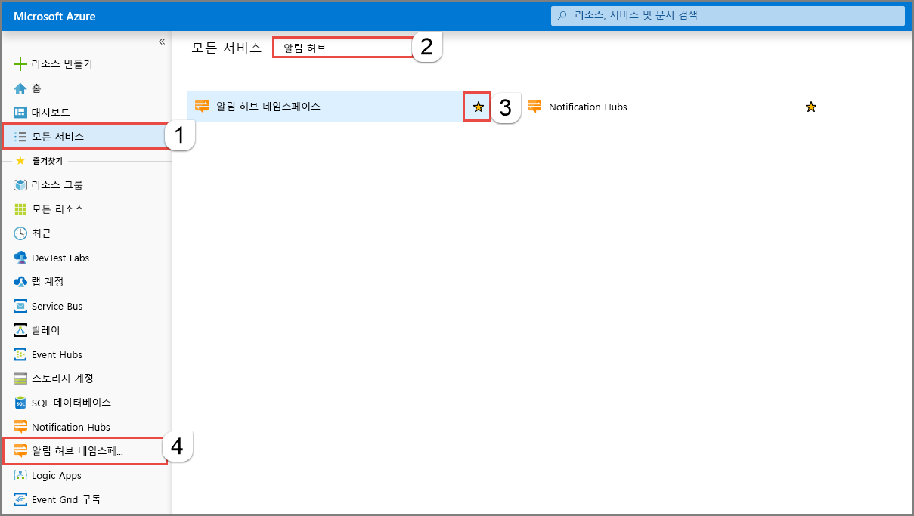
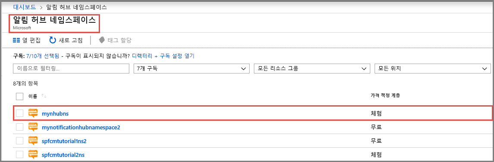
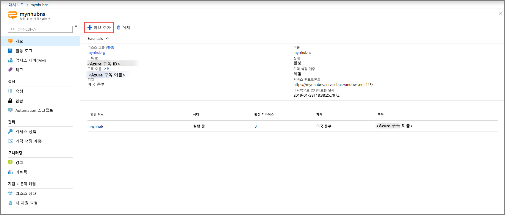
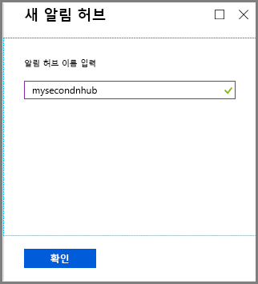
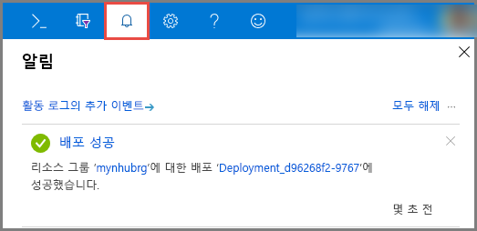

# Azure Portal을 사용하여 Azure 알림 허브 만들기 
Azure Notification Hubs는 모든 백 엔드(클라우드 또는 온-프레미스)에서 모든 플랫폼(iOS, Android, Windows, Kindle, Baidu 등)에 알림을 보낼 수 있도록 하는 사용하기 쉬운 스케일 아웃 푸시 엔진을 제공합니다. 서비스에 대한 자세한 내용은 [Azure Notification Hubs란?](notification-hubs-push-notification-overview.md)을 참조하세요.

이 빠른 시작에서는 Azure Portal에서 알림 허브를 만듭니다. 첫 번째 섹션에서는 해당 네임스페이스의 Notification Hubs 네임스페이스 및 허브를 만드는 단계가 나옵니다. 두 번째 섹션에서는 기존 Notification Hubs 네임스페이스에서 알림 허브를 만드는 단계가 나옵니다. 

## 네임스페이스 및 알림 허브 만들기
이 섹션에서는 네임스페이스 및 네임스페이스의 허브를 만듭니다. 

[!INCLUDE [notification-hubs-portal-create-new-hub](../../includes/notification-hubs-portal-create-new-hub.md)]

## 기존 네임스페이스에서 알림 허브 만들기
이 섹션에서는 기존 네임스페이스에서 알림 허브를 만듭니다. 

1. [Azure Portal](https://portal.azure.com)에 로그인합니다.
2. 왼쪽 메뉴에서 **모든 서비스**를 선택하고, **알림 허브**를 검색하고, **알림 허브 네임스페이스** 옆에 있는 **별**(`*`)을 선택하여 왼쪽 메뉴의 **즐겨찾기** 섹션에 추가합니다. **알림 허브 네임스페이스**를 선택합니다. 

      
3. **알림 허브 네임스페이스** 페이지에서 목록 중 자신의 네임스페이스를 선택합니다. 

      
1. **알림 허브 네임스페이스** 페이지에 있는 도구 모음에서 **허브 추가**를 선택합니다. 

      
4. **새 알림 허브** 페이지에서 알림 허브의 이름을 입력하고 **확인**을 선택합니다.

      
4. 새 허브의 배포 상태를 확인하려면 맨 위에 있는 **알림**(벨 아이콘)을 선택합니다. 알림 창을 닫으려면 오른쪽 모서리에 있는 **X**를 선택합니다. 

      
5. 목록에서 새 허브를 보려면 **알림 허브 네임스페이스** 웹 페이지를 새로 고칩니다. 

      ![[Azure Portal] - [알림] -> [리소스로 이동]](./media/create-notification-hub-portal/new-hub-in-list.png)
6. **알림 허브**를 선택하면 알림 허브에 대한 홈 페이지를 볼 수 있습니다. 

      ![[Azure Portal] - [알림] -> [리소스로 이동]](./media/create-notification-hub-portal/hub-home-page.png)

## 다음 단계
이 빠른 시작에서는 알림 허브를 만들었습니다. PNS(플랫폼 알림 시스템) 설정을 사용하여 허브를 구성하는 방법을 알아보려면 [PNS 설정을 사용하여 알림 허브 구성](configure-notification-hub-portal-pns-settings.md)을 참조하세요. 