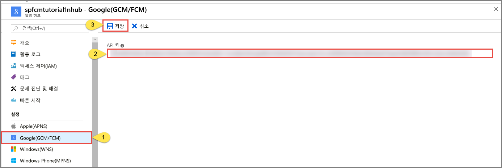

# <a name="tutorial-push-notifications-to-android-devices-by-using-azure-notification-hubs-and-google-firebase-cloud-messaging"></a>자습서: Azure Notification Hubs 및 Google Firebase Cloud Messaging을 사용하여 Android 디바이스에 알림 푸시

[!INCLUDE [notification-hubs-selector-get-started](../../includes/notification-hubs-selector-get-started.md)]

이 자습서에서는 Azure Notification Hubs 및 FCM(Firebase Cloud Messaging)을 사용하여 Android 애플리케이션에 알림을 푸시하는 방법을 보여줍니다. 이 자습서에서는 FCM(Firebase Cloud Messaging)을 사용하여 푸시 알림을 받는 빈 Android 앱을 만듭니다.

이 자습서에 대해 완료된 코드는 GitHub의 [여기](https://github.com/Azure/azure-notificationhubs-samples/tree/master/Android/GetStartedFirebase)서 다운로드할 수 있습니다.

이 자습서에서 수행하는 단계는 다음과 같습니다.

> [!div class="checklist"]
> * Android Studio 프로젝트를 만듭니다.
> * Firebase Cloud Messaging을 지원하는 Firebase 프로젝트를 만듭니다.
> * 알림 허브를 만듭니다.
> * 알림 허브에 앱을 연결합니다.
> * 앱을 테스트합니다.

## <a name="prerequisites"></a>필수 조건

이 자습서를 완료하려면 활성 Azure 계정이 있어야 합니다. 계정이 없는 경우 몇 분 만에 평가판 계정을 만들 수 있습니다. 자세한 내용은 [Azure 무료 체험](https://azure.microsoft.com/free/)을 참조하세요.

* 이 자습서에서는 위에서 언급한 활성 Azure 계정 외에도 [Android Studio](https://go.microsoft.com/fwlink/?LinkId=389797)최신 버전이 필요합니다.
* Firebase Cloud Messaging에 Android 2.3 이상이 필요합니다.
* Firebase Cloud Messaging에 Google 리포지토리 수정 27 이상이 필요합니다.
* Firebase Cloud Messaging에 Google Play Services 9.0.2 이상이 필요합니다.
* 이 자습서를 완료해야 다른 모든 Android 앱용 Notification Hubs 자습서를 진행할 수 있습니다.

## <a name="create-an-android-studio-project"></a>Android Studio 프로젝트 만들기

1. Android Studio를 시작합니다.
2. 메뉴에서 **File**을 선택하고, **New**를 가리키고, **New Project**를 선택합니다. 
2. **Choose your project** 페이지에서 **Empty Activity**를 선택하고, **Next**를 선택합니다. 
3. **Configure your project** 페이지에서 다음 단계를 수행합니다. 
    1. 애플리케이션의 **이름**을 입력합니다.
    2. 프로젝트 파일을 저장할 위치를 지정합니다. 
    3. **마침**을 선택합니다. 

        

## <a name="create-a-firebase-project-that-supports-fcm"></a>FCM을 지원하는 Firebase 프로젝트 만들기

[!INCLUDE [notification-hubs-enable-firebase-cloud-messaging](../../includes/notification-hubs-enable-firebase-cloud-messaging.md)]

## <a name="configure-a-notification-hub"></a>알림 허브 구성

[!INCLUDE [notification-hubs-portal-create-new-hub](../../includes/notification-hubs-portal-create-new-hub.md)]

### <a name="configure-firebase-cloud-messaging-settings-for-the-hub"></a>허브에 대한 Firebase Cloud Messaging 설정 구성

1. 왼쪽 메뉴의 **Settings** 아래에서 **Google (GCM/FCM)** 을 선택합니다. 
2. 앞에서 저장한 FCM 프로젝트의 **서버 키**를 붙여넣습니다. 
3. 도구 모음에서 **Save**를 선택합니다. 

    
4. Notification Hubs가 업데이트되었다는 경고 메시지가 표시됩니다. **Save** 단추가 비활성화됩니다. 

이제 알림 허브가 FCM과 작동하도록 구성되었으며, 푸시 알림을 받고 보내기 위해 앱을 등록하는 연결 문자열이 있습니다.

## <a id="connecting-app"></a>알림 허브에 앱 연결

### <a name="add-google-play-services-to-the-project"></a>프로젝트에 Google Play Services 추가

[!INCLUDE [Add Play Services](../../includes/notification-hubs-android-studio-add-google-play-services.md)]

### <a name="adding-azure-notification-hubs-libraries"></a>Azure Notification Hubs 라이브러리 추가

1. **앱**의 `Build.Gradle` 파일에서 **종속성** 섹션에 다음 줄을 추가합니다.

    ```text
    implementation 'com.microsoft.azure:notification-hubs-android-sdk:0.4@aar'
    implementation 'com.microsoft.azure:azure-notifications-handler:1.0.1@aar'
    ```

2. **종속성** 섹션 뒤에 다음 리포지토리를 추가합니다.

    ```text
    repositories {
        maven {
            url "http://dl.bintray.com/microsoftazuremobile/SDK"
        }
    }
    ```

### <a name="add-google-firebase-support"></a>Google Firebase 지원 추가

1. **앱**의 `Build.Gradle` 파일에서 **종속성** 섹션에 다음 줄을 추가(없는 경우)합니다. 

    ```text
    implementation 'com.google.firebase:firebase-core:16.0.0'
    ```

2. 파일 끝에 다음 플러그 인을 추가(없는 경우)합니다. 

    ```text
    apply plugin: 'com.google.gms.google-services'
    ```

### <a name="updating-the-androidmanifestxml"></a>AndroidManifest.xml 업데이트

1. FCM을 지원하려면 코드에서 [Google의 FirebaseInstanceId API](https://firebase.google.com/docs/reference/android/com/google/firebase/iid/FirebaseInstanceId)를 사용하여 [등록 토큰을 가져오는](https://firebase.google.com/docs/cloud-messaging/android/client#sample-register) 데 사용되는 인스턴스 ID 수신기 서비스를 구현해야 합니다. 이 자습서에서 클래스 이름은 `MyInstanceIDService`입니다.

    AndroidManifest.xml 파일의 `<application>` 태그 내부에 다음 서비스 정의를 추가합니다.

    ```xml
    <service android:name=".MyInstanceIDService">
        <intent-filter>
            <action android:name="com.google.firebase.INSTANCE_ID_EVENT"/>
        </intent-filter>
    </service>
    ```

2. FirebaseInstanceId API에서 FCM 등록 토큰을 받으면 해당 토큰을 사용하여 [Azure Notification Hubs에 등록합니다](notification-hubs-push-notification-registration-management.md). `RegistrationIntentService`라는 `IntentService`를 사용하여 백그라운드에서 이 등록을 지원합니다. 또한 이 서비스는 FCM 등록 토큰을 새로 고쳐야 합니다.

    AndroidManifest.xml 파일의 `<application>` 태그 내부에 다음 서비스 정의를 추가합니다.

    ```xml
    <service
        android:name=".RegistrationIntentService"
        android:exported="false">
    </service>
    ```

3. 알림을 받을 수신기도 정의해야 합니다. 다음 수신기 정의를 `<application>` 태그 안의 AndroidManifest.xml 파일에 추가합니다. 

    ```xml
    <receiver android:name="com.microsoft.windowsazure.notifications.NotificationsBroadcastReceiver"
        android:permission="com.google.android.c2dm.permission.SEND">
        <intent-filter>
            <action android:name="com.google.android.c2dm.intent.RECEIVE" />
            <category android:name="<your package name>" />
        </intent-filter>
    </receiver>
    ```

    > [!IMPORTANT]
    > `<your package NAME>` 자리 표시자를 `AndroidManifest.xml` 파일의 맨 위에 표시된 실제 패키지 이름으로 바꿉니다.
4. 도구 모음에서 **지금 동기화**를 선택합니다.
5. `</application>` 태그 **아래**에 다음과 같은 FCM 관련 필수 권한을 추가합니다.

    ```xml
    <uses-permission android:name="android.permission.INTERNET"/>
    <uses-permission android:name="android.permission.GET_ACCOUNTS"/>
    <uses-permission android:name="com.google.android.c2dm.permission.RECEIVE" />
    ```

### <a name="adding-code"></a>코드 추가

1. 프로젝트 뷰에서 **앱** > **src** > **기본** > **java**를 확장합니다. **java** 아래의 패키지 폴더를 마우스 오른쪽 단추로 클릭하고 **새로 만들기**, **Java 클래스**를 차례로 클릭합니다. 이름으로 `NotificationSettings`를 입력하고 **확인**을 선택합니다.

    아래의 `NotificationSettings` 클래스에 대한 코드에서 다음 세 개의 자리 표시자를 업데이트합니다.

   * **HubListenConnectionString**: 허브의 **DefaultListenAccessSignature** 연결 문자열입니다. [Azure Portal]의 허브에서 **액세스 정책**을 클릭하여 해당 연결 문자열을 복사할 수 있습니다.
   * **HubName**: [Azure Portal]의 허브 페이지에 표시되는 알림 허브 이름을 사용합니다.

     `NotificationSettings` 코드:

        ```java
        public class NotificationSettings {
            public static String HubName = "<Your HubName>";
            public static String HubListenConnectionString = "<Enter your DefaultListenSharedAccessSignature connection string>";
        }
        ```

    > [!IMPORTANT]
    > 알림 허브의 **이름**과 **DefaultListenSharedAccessSignature**를 입력하고 계속 진행합니다. 
2. `MyInstanceIDService`(이)라는 다른 클래스를 추가합니다. 이 클래스는 인스턴스 ID 수신기 서비스 구현입니다.

    이 클래스에 대한 코드는 `IntentService`를 호출하여 백그라운드에서 [FCM 토큰을 새로 고칩니다](https://developers.google.com/instance-id/guides/android-implementation#refresh_tokens).

    ```java
    import android.content.Intent;
    import android.util.Log;
    import com.google.firebase.iid.FirebaseInstanceIdService;

    public class MyInstanceIDService extends FirebaseInstanceIdService {

        private static final String TAG = "MyInstanceIDService";

        @Override
        public void onTokenRefresh() {

            Log.d(TAG, "Refreshing FCM Registration Token");

            Intent intent = new Intent(this, RegistrationIntentService.class);
            startService(intent);
        }
    };
    ```

3. `RegistrationIntentService`라는 프로젝트에 또 다른 새 클래스를 추가합니다. 이 클래스는 `IntentService` 인터페이스를 구현하고, [FCM 토큰 새로 고침](https://developers.google.com/instance-id/guides/android-implementation#refresh_tokens) 및 [알림 허브 등록](notification-hubs-push-notification-registration-management.md)을 처리합니다.

    이 클래스에 대해 다음 코드를 사용합니다.

    ```java
    import android.app.IntentService;
    import android.content.Intent;
    import android.content.SharedPreferences;
    import android.preference.PreferenceManager;
    import android.util.Log;
    import com.google.firebase.iid.FirebaseInstanceId;
    import com.microsoft.windowsazure.messaging.NotificationHub;

    public class RegistrationIntentService extends IntentService {

        private static final String TAG = "RegIntentService";

        private NotificationHub hub;

        public RegistrationIntentService() {
            super(TAG);
        }

        @Override
        protected void onHandleIntent(Intent intent) {

            SharedPreferences sharedPreferences = PreferenceManager.getDefaultSharedPreferences(this);
            String resultString = null;
            String regID = null;
            String storedToken = null;

            try {
                String FCM_token = FirebaseInstanceId.getInstance().getToken();
                Log.d(TAG, "FCM Registration Token: " + FCM_token);

                // Storing the registration ID that indicates whether the generated token has been
                // sent to your server. If it is not stored, send the token to your server,
                // otherwise your server should have already received the token.
                if (((regID=sharedPreferences.getString("registrationID", null)) == null)){

                    NotificationHub hub = new NotificationHub(NotificationSettings.HubName,
                            NotificationSettings.HubListenConnectionString, this);
                    Log.d(TAG, "Attempting a new registration with NH using FCM token : " + FCM_token);
                    regID = hub.register(FCM_token).getRegistrationId();

                    // If you want to use tags...
                    // Refer to : https://azure.microsoft.com/documentation/articles/notification-hubs-routing-tag-expressions/
                    // regID = hub.register(token, "tag1,tag2").getRegistrationId();

                    resultString = "New NH Registration Successfully - RegId : " + regID;
                    Log.d(TAG, resultString);

                    sharedPreferences.edit().putString("registrationID", regID ).apply();
                    sharedPreferences.edit().putString("FCMtoken", FCM_token ).apply();
                }

                // Check if the token may have been compromised and needs refreshing.
                else if ((storedToken=sharedPreferences.getString("FCMtoken", "")) != FCM_token) {

                    NotificationHub hub = new NotificationHub(NotificationSettings.HubName,
                            NotificationSettings.HubListenConnectionString, this);
                    Log.d(TAG, "NH Registration refreshing with token : " + FCM_token);
                    regID = hub.register(FCM_token).getRegistrationId();

                    // If you want to use tags...
                    // Refer to : https://azure.microsoft.com/documentation/articles/notification-hubs-routing-tag-expressions/
                    // regID = hub.register(token, "tag1,tag2").getRegistrationId();

                    resultString = "New NH Registration Successfully - RegId : " + regID;
                    Log.d(TAG, resultString);

                    sharedPreferences.edit().putString("registrationID", regID ).apply();
                    sharedPreferences.edit().putString("FCMtoken", FCM_token ).apply();
                }

                else {
                    resultString = "Previously Registered Successfully - RegId : " + regID;
                }
            } catch (Exception e) {
                Log.e(TAG, resultString="Failed to complete registration", e);
                // If an exception happens while fetching the new token or updating our registration data
                // on a third-party server, this ensures that we'll attempt the update at a later time.
            }

            // Notify UI that registration has completed.
            if (MainActivity.isVisible) {
                MainActivity.mainActivity.ToastNotify(resultString);
            }
        }
    }
    ```

4. `MainActivity` 클래스에서 다음 `import` 문을 클래스 선언 위에 추가합니다.

    ```java
    import com.google.android.gms.common.ConnectionResult;
    import com.google.android.gms.common.GoogleApiAvailability;
    import com.microsoft.windowsazure.notifications.NotificationsManager;
    import android.content.Intent;
    import android.util.Log;
    import android.widget.TextView;
    import android.widget.Toast;
    ```

5. 클래스 위에 다음 멤버를 추가합니다. 이러한 필드를 사용하여 [Google에서 권장한 대로 Google Play 서비스의 가용성을 확인합니다](https://developers.google.com/android/guides/setup#ensure_devices_have_the_google_play_services_apk).

    ```java
    public static MainActivity mainActivity;
    public static Boolean isVisible = false;
    private static final String TAG = "MainActivity";
    private static final int PLAY_SERVICES_RESOLUTION_REQUEST = 9000;
    ```

6. `MainActivity` 클래스에서 Google Play 서비스의 가용성을 확인하는 다음 메서드를 추가합니다.

    ```java
    /**
    * Check the device to make sure it has the Google Play Services APK. If
    * it doesn't, display a dialog that allows users to download the APK from
    * the Google Play Store or enable it in the device's system settings.
    */

    private boolean checkPlayServices() {
        GoogleApiAvailability apiAvailability = GoogleApiAvailability.getInstance();
        int resultCode = apiAvailability.isGooglePlayServicesAvailable(this);
        if (resultCode != ConnectionResult.SUCCESS) {
            if (apiAvailability.isUserResolvableError(resultCode)) {
                apiAvailability.getErrorDialog(this, resultCode, PLAY_SERVICES_RESOLUTION_REQUEST)
                        .show();
            } else {
                Log.i(TAG, "This device is not supported by Google Play Services.");
                ToastNotify("This device is not supported by Google Play Services.");
                finish();
            }
            return false;
        }
        return true;
    }
    ```

7. `MainActivity` 클래스에서 `IntentService`를 호출하기 전에 Google Play 서비스를 확인하는 다음 코드를 추가하여 FCM 등록 토큰을 가져오고 알림 허브에 등록합니다.

    ```java
    public void registerWithNotificationHubs()
    {
        if (checkPlayServices()) {
            // Start IntentService to register this application with FCM.
            Intent intent = new Intent(this, RegistrationIntentService.class);
            startService(intent);
        }
    }
    ```

8. `MainActivity` 클래스의 `OnCreate` 메서드에서 활동이 생성되면 등록 프로세스를 시작하는 다음 코드를 추가합니다.

    ```java
    @Override
    protected void onCreate(Bundle savedInstanceState) {
        super.onCreate(savedInstanceState);
        setContentView(R.layout.activity_main);

        mainActivity = this;
        registerWithNotificationHubs();
        MyHandler.createChannelAndHandleNotifications(getApplicationContext());
    }
    ```

9. 앱 상태를 확인하고 앱에서 상태를 보고하려면 `MainActivity`에 이러한 추가 메서드를 추가합니다.

    ```java
    @Override
    protected void onStart() {
        super.onStart();
        isVisible = true;
    }

    @Override
    protected void onPause() {
        super.onPause();
        isVisible = false;
    }

    @Override
    protected void onResume() {
        super.onResume();
        isVisible = true;
    }

    @Override
    protected void onStop() {
        super.onStop();
        isVisible = false;
    }

    public void ToastNotify(final String notificationMessage) {
        runOnUiThread(new Runnable() {
            @Override
            public void run() {
                Toast.makeText(MainActivity.this, notificationMessage, Toast.LENGTH_LONG).show();
                TextView helloText = (TextView) findViewById(R.id.text_hello);
                helloText.setText(notificationMessage);
            }
        });
    }
    ```

10. `ToastNotify` 메서드는 *"Hello World"* `TextView` 컨트롤을 사용하여 앱에서 영구적으로 상태 및 알림을 보고합니다. **res** -> **layout** -> **activity_main.xml** 레이아웃에서 해당 컨트롤에 대한 다음 ID를 추가합니다.

    ```java
    android:id="@+id/text_hello"
    ```

11. 다음으로 AndroidManifest.xml에서 정의된 수신기에 대한 하위 클래스를 추가합니다. `MyHandler`라는 프로젝트에 또 다른 새 클래스를 추가합니다.

12. 그런 다음 `MyHandler.java`의 맨 위에 다음 import 문을 추가합니다.

    ```java
    import android.app.NotificationChannel;
    import android.app.NotificationManager;
    import android.app.PendingIntent;
    import android.content.Context;
    import android.content.Intent;
    import android.media.RingtoneManager;
    import android.net.Uri;
    import android.os.Build;
    import android.os.Bundle;
    import android.support.v4.app.NotificationCompat;
    import com.microsoft.windowsazure.notifications.NotificationsHandler;    
    import com.microsoft.windowsazure.notifications.NotificationsManager;
    ```

13. `MyHandler` 클래스에 대해 다음 코드를 추가하여 `com.microsoft.windowsazure.notifications.NotificationsHandler`의 하위 클래스로 만듭니다.

    이 코드는 `OnReceive` 메서드를 재정의하여 처리기에서 받은 알림을 보고합니다. 또한 처리기는 `sendNotification()` 메서드를 사용하여 Android 알림 관리자에 푸시 알림을 보냅니다. `sendNotification()` 메서드는 앱이 실행되지 않을 때, 알림이 수신될 때 실행해야 합니다.

    ```java
    public class MyHandler extends NotificationsHandler {
        public static final String NOTIFICATION_CHANNEL_ID = "nh-demo-channel-id";
        public static final String NOTIFICATION_CHANNEL_NAME = "Notification Hubs Demo Channel";
        public static final String NOTIFICATION_CHANNEL_DESCRIPTION = "Notification Hubs Demo Channel";
    
        public static final int NOTIFICATION_ID = 1;
        private NotificationManager mNotificationManager;
        NotificationCompat.Builder builder;
        Context ctx;
    
        @Override
        public void onReceive(Context context, Bundle bundle) {
            ctx = context;
            String nhMessage = bundle.getString("message");
            sendNotification(nhMessage);
            if (MainActivity.isVisible) {
                MainActivity.mainActivity.ToastNotify(nhMessage);
            }
        }
    
        private void sendNotification(String msg) {
    
            Intent intent = new Intent(ctx, MainActivity.class);
            intent.addFlags(Intent.FLAG_ACTIVITY_CLEAR_TOP);
    
            mNotificationManager = (NotificationManager)
                    ctx.getSystemService(Context.NOTIFICATION_SERVICE);
    
            PendingIntent contentIntent = PendingIntent.getActivity(ctx, 0,
                    intent, PendingIntent.FLAG_ONE_SHOT);
    
            Uri defaultSoundUri = RingtoneManager.getDefaultUri(RingtoneManager.TYPE_NOTIFICATION);
            NotificationCompat.Builder notificationBuilder = new NotificationCompat.Builder(
                    ctx,
                    NOTIFICATION_CHANNEL_ID)
                    .setContentText(msg)
                    .setPriority(NotificationCompat.PRIORITY_HIGH)
                    .setSmallIcon(android.R.drawable.ic_popup_reminder)
                    .setBadgeIconType(NotificationCompat.BADGE_ICON_SMALL);
    
            notificationBuilder.setContentIntent(contentIntent);
            mNotificationManager.notify(NOTIFICATION_ID, notificationBuilder.build());
        }
    
        public static void createChannelAndHandleNotifications(Context context) {
            if (Build.VERSION.SDK_INT >= Build.VERSION_CODES.O) {
                NotificationChannel channel = new NotificationChannel(
                        NOTIFICATION_CHANNEL_ID,
                        NOTIFICATION_CHANNEL_NAME,
                        NotificationManager.IMPORTANCE_HIGH);
                channel.setDescription(NOTIFICATION_CHANNEL_DESCRIPTION);
                channel.setShowBadge(true);
    
                NotificationManager notificationManager = context.getSystemService(NotificationManager.class);
                notificationManager.createNotificationChannel(channel);
                NotificationsManager.handleNotifications(context, "", MyHandler.class);
            }
        }
    }
    ```

14. Android Studio의 메뉴 모음에서 **빌드** > **프로젝트 다시 빌드**를 클릭하여 코드에 오류가 없는지 확인합니다. `ic_launcher` 아이콘에 대한 오류가 발생하는 경우 AndroidManifest.xml 파일에서 다음 명령문을 제거합니다. 

    ```
        android:icon="@mipmap/ic_launcher"
    ```
15. 디바이스에서 앱을 실행하고 알림 허브를 사용하여 성공적으로 등록되는지 확인합니다.

    > [!NOTE]
    > 인스턴스 ID 서비스의 `onTokenRefresh()` 메서드가 호출될 때까지 초기 시작 시 등록이 실패할 수 있습니다. 새로 고침은 알림 허브를 사용하여 등록을 성공적으로 시작해야 합니다.

    

## <a name="test-send-notification-from-the-notification-hub"></a>알림 허브에서 알림 테스트 보내기

다음 작업을 수행하여 [Azure Portal]에서 푸시 알림을 보낼 수 있습니다.

1. Azure Portal에서, 알림 허브에 대한 **알림 허브** 페이지의 **문제 해결** 섹션에서 **테스트 보내기**를 선택합니다.
3. **플랫폼**에 대해 **Android**를 선택합니다.
4. **보내기**를 선택합니다.  Android 디바이스에서 알림이 아직 보이지 않으면 모바일 앱을 실행하지 않았기 때문입니다. 모바일 앱을 실행한 후 **보내기** 단추를 다시 선택하여 알림 메시지를 표시합니다.
5. 맨 아래에 있는 목록에 작업의 **결과**가 표시됩니다.

    
6. 디바이스에 알림 메시지가 표시됩니다. 

    
    

[!INCLUDE [notification-hubs-sending-notifications-from-the-portal](../../includes/notification-hubs-sending-notifications-from-the-portal.md)]

### <a name="run-the-mobile-app-on-emulator"></a>에뮬레이터에서 모바일 앱 실행
에뮬레이터 내부에서 푸시 알림을 테스트하려는 경우 에뮬레이터 이미지가 앱에 대해 선택한 Google API 수준을 지원하는지 확인합니다. 이미지에서 네이티브 Google API를 지원하지 않으면 **SERVICE\_NOT\_AVAILABLE** 예외가 발생할 수 있습니다.

또한 **설정** > **계정**에서 실행 중인 에뮬레이터에 Google 계정을 추가했는지 확인합니다. 그렇지 않으면 GCM 등록 시 **AUTHENTICATION\_FAILED** 예외가 발생할 수 있습니다.

## <a name="next-steps"></a>다음 단계
이 자습서에서는 Firebase Cloud Messaging을 사용하여 Android 디바이스로 알림을 푸시했습니다. Google Cloud Messaging을 사용하여 알림을 푸시하는 방법을 알아보려면 다음 자습서를 계속 진행합니다.

> [!div class="nextstepaction"]
>[Google Cloud Messaging을 사용하여 Android 디바이스에 알림 푸시](notification-hubs-android-push-notification-google-gcm-get-started.md)

<!-- Images. -->

<!-- URLs. -->
[Get started with push notifications in Mobile Services]: ../mobile-services-javascript-backend-android-get-started-push.md  
[Mobile Services Android SDK]: https://go.microsoft.com/fwLink/?LinkID=280126&clcid=0x409
[Referencing a library project]: http://go.microsoft.com/fwlink/?LinkId=389800
[Notification Hubs Guidance]: notification-hubs-push-notification-overview.md
[Use Notification Hubs to push notifications to users]: notification-hubs-aspnet-backend-gcm-android-push-to-user-google-notification.md
[Use Notification Hubs to send breaking news]: notification-hubs-aspnet-backend-android-xplat-segmented-gcm-push-notification.md
[Azure Portal]: https://portal.azure.com
