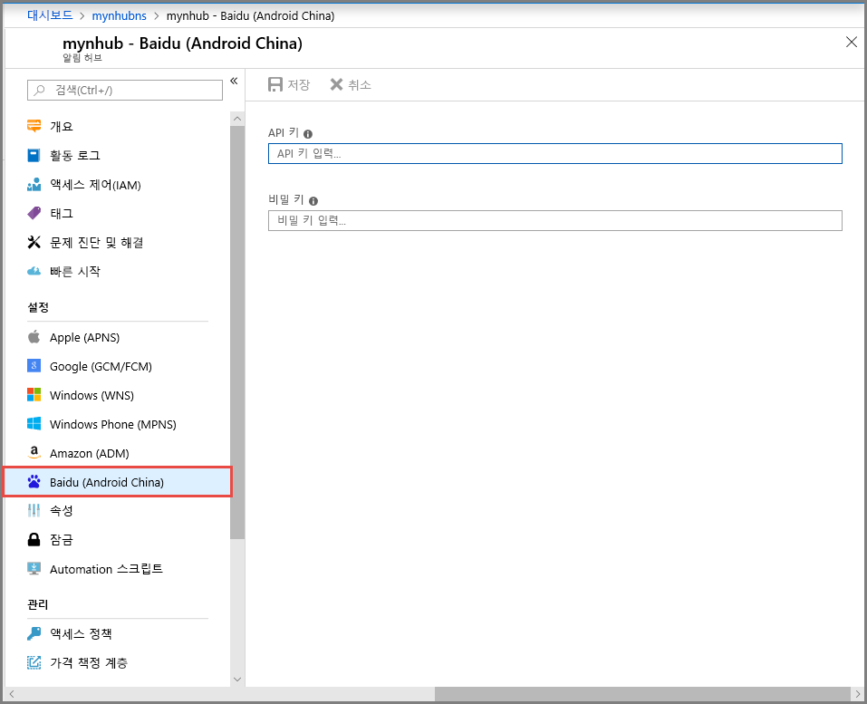
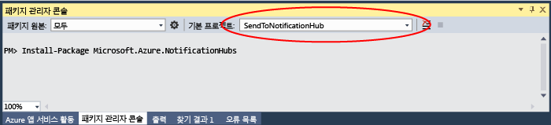

# <a name="get-started-with-notification-hubs-using-baidu"></a>Baidu를 사용하여 Notification Hubs 시작

[!INCLUDE [notification-hubs-selector-get-started](../../includes/notification-hubs-selector-get-started.md)]

Baidu 클라우드 푸시는 모바일 디바이스로 푸시 알림을 보내는 데 사용할 수 있는 중국어 클라우드 서비스입니다.

Google Play 및 FCM(Firebase Cloud Messaging)은 중국에서 사용할 수 없으므로 다른 앱 스토어 및 푸시 서비스를 사용해야 합니다. Baidu는 그 중 하나이며 현재 알림 허브에서 사용하는 것입니다.

## <a name="prerequisites"></a>필수 조건

이 자습서를 사용하려면 다음이 필요합니다.

* [Android 사이트](https://go.microsoft.com/fwlink/?LinkId=389797)에서 다운로드할 수 있는 Android SDK(Android Studio를 사용한다고 가정)입니다.
* [Baidu 푸시 Android SDK]

> [!NOTE]
> 이 자습서를 완료하려면 활성 Azure 계정이 있어야 합니다. 계정이 없는 경우 몇 분 만에 평가판 계정을 만들 수 있습니다. 자세한 내용은 [Azure 무료 체험](https://azure.microsoft.com/pricing/free-trial/?WT.mc_id=A0E0E5C02&amp;returnurl=http%3A%2F%2Fazure.microsoft.com%2Fen-us%2Fdocumentation%2Farticles%2Fnotification-hubs-baidu-get-started%2F)을 참조하세요.

## <a name="create-a-baidu-account"></a>Baidu 계정 만들기

Baidu를 사용하려면 Baidu 계정이 있어야 합니다. 이미 있는 경우 [Baidu 포털]에 로그인하고 다음 단계를 건너뜁니다. 그렇지 않은 경우 Baidu 계정을 만드는 방법은 다음 지침을 참조하세요.  

1. [Baidu 포털]로 이동하여 **登录**(**Login**) 링크를 클릭합니다. **立即注册**(**지금 등록**)을 클릭하여 새 계정 등록 프로세스를 시작합니다.

    

2. 필요한 세부 정보(전화/메일 주소, 암호 및 확인 코드)를 입력하고 注册(**등록**)을 클릭합니다.

    

3. 입력한 메일 주소로 Baidu 계정을 활성화할 수 있는 링크가 포함된 메일을 받게 됩니다.

    

4. 메일 계정으로 로그인하고 Baidu 활성화 메일을 연 다음 활성화 링크를 클릭하여 Baidu 계정을 활성화합니다.

    

활성화된 Baidu 계정이 있으면 [Baidu 포털]에 로그인합니다.

## <a name="create-a-baidu-cloud-push-project"></a>Baidu 클라우드 푸시 프로젝트 만들기

Baidu 클라우드 푸시 프로젝트를 만들면 앱 ID, API 키 및 비밀 키를 받게 됩니다.

1. [Baidu 포털]에 로그인한 후 **更多>>**(**추가**)를 클릭합니다.

    

2. **站长与开发者服务**(**웹 마스터 및 개발자 서비스**) 섹션까지 아래로 스크롤한 후 **百度云推送**(**Baidu 클라우드 푸시**)를 클릭합니다.

    

3. 다음 페이지에서 오른쪽 위 모서리의 **登录**(**로그인**)을 클릭합니다.

    

4. 그런 다음, 이 페이지에서 **创建应用**(**애플리케이션 만들기**)를 클릭합니다.

    

5. 다음 페이지에서 创建新应用(**새 애플리케이션 만들기**)를 클릭합니다.

    

6. 애플리케이션 이름을 입력하고 创建(**만들기**)를 클릭합니다.

    

7. Baidu 클라우드 푸시 프로젝트를 성공적으로 만들면 **AppID**, **API 키** 및 **비밀 키**가 포함된 페이지가 표시됩니다. 나중에 사용할 API 키와 비밀 키를 적어 둡니다.

    

8. 왼쪽 창에서 创建通知(**알림 만들기**)를 클릭하여 푸시 알림에 대해 프로젝트를 구성합니다.

    

## <a name="configure-a-new-notification-hub"></a>새 알림 허브 구성

[!INCLUDE [notification-hubs-portal-create-new-hub](../../includes/notification-hubs-portal-create-new-hub.md)]

&emsp;&emsp;6. 알림 허브에서 **Notification Services**를 선택한 다음 **Baidu(Android China)** 를 선택합니다.

&emsp;&emsp;&emsp;&emsp;

&emsp;&emsp;7. Baidu 알림 설정 섹션까지 아래로 스크롤합니다. Baidu 클라우드 푸시 프로젝트의 Baidu 콘솔에서 가져온 API 키 및 비밀 키를 입력합니다. 그런 다음 저장을 클릭합니다.

&emsp;&emsp;&emsp;&emsp;

이제 알림 허브가 Baidu와 작동하도록 구성됩니다. 푸시 알림을 보내고 받도록 앱을 등록하는 **연결 문자열**을 갖습니다.

액세스 연결 정보 창에서 `DefaultListenSharedAccessSignature` 및 `DefaultFullSharedAccessSignature`를 적어 둡니다.

## <a name="connect-your-app-to-the-notification-hub"></a>알림 허브에 앱 연결

1. Android Studio에서 새 Android 프로젝트를 만듭니다(파일 > 새로 만들기 > 새 프로젝트).

    

2. 애플리케이션 이름을 입력하고 Minimum Required SDK 버전이 API 16: Android 4.1로 설정되어 있는지 확인합니다. **또한 패키지 이름(应用包名)이 Baidu 클라우드 푸시 포털과 동일한지 확인하세요.**

    

3. 다음을 클릭하고 만들기 작업 창이 표시될 때까지 마법사를 계속 진행합니다. 빈 작업이 선택되었는지 확인하고 마침을 선택하여 새로운 Android 애플리케이션을 만듭니다.

    

4. 프로젝트 빌드 대상이 올바르게 설정되었는지 확인합니다.

5. 그런 다음 Azure Notification Hubs 라이브러리를 추가합니다. 앱의 `Build.Gradle` 파일에서 종속성 섹션에 다음 줄을 추가합니다.

    ```javascript
    implementation 'com.microsoft.azure:notification-hubs-android-sdk:0.6@aar'
    implementation 'com.microsoft.azure:azure-notifications-handler:1.0.1@aar'
    ```

    종속성 섹션 뒤에 다음 리포지토리를 추가합니다.

    ```javascript
    repositories {
        maven {
            url "https://dl.bintray.com/microsoftazuremobile/SDK"
        }
    }
    ```

    목록 충돌을 방지하려면 다음 코드를 프로젝트의 `Manifest.xml` 파일에 추가합니다.

    ```xml
    <manifest package="YOUR.PACKAGE.NAME"
    xmlns:tools="http://schemas.android.com/tools"
    xmlns:android="http://schemas.android.com/apk/res/android">
    ```

    `<application/>` 태그에 다음 코드를 추가해야 합니다.

    ```xml
    <application
        tools:replace="android:allowBackup,icon,theme,label">
    ```

6. [Baidu 푸시 Android SDK](https://push.baidu.com/doc/android/api)를 다운로드하고 압축을 풉니다. libs 폴더에 `pushservice-x.y.z jar` 파일을 복사합니다. 그런 다음, Android 애플리케이션의 `src/main/jniLibs`(새 폴더 만들기) 폴더에 `.so` 파일을 복사합니다.

    

7. 프로젝트의 `libs` 폴더에서 `pushervice-x.y.z.jar` 파일을 마우스 오른쪽 단추로 클릭하고 **라이브러리로 추가**를 선택하여 프로젝트에서 이 라이브러리를 포함시킵니다.

    

8. Android 프로젝트의 `AndroidManifest.xml` 파일을 열고 Baidu SDK에 필요한 사용 권한을 추가합니다. **패키지 이름으로 `YOURPACKAGENAME`을 대체합니다**.

    ```xml
    <uses-permission android:name="android.permission.INTERNET" />
    <uses-permission android:name="android.permission.READ_PHONE_STATE" />
    <uses-permission android:name="android.permission.ACCESS_NETWORK_STATE" />
    <uses-permission android:name="android.permission.RECEIVE_BOOT_COMPLETED" />
    <uses-permission android:name="android.permission.WRITE_SETTINGS" />
    <uses-permission android:name="android.permission.VIBRATE" />
    <uses-permission android:name="android.permission.WRITE_EXTERNAL_STORAGE" />
    <uses-permission android:name="android.permission.DISABLE_KEYGUARD" />
    <uses-permission android:name="android.permission.ACCESS_COARSE_LOCATION" />
    <uses-permission android:name="android.permission.ACCESS_WIFI_STATE" />
    <uses-permission android:name="android.permission.ACCESS_DOWNLOAD_MANAGER" />
    <uses-permission android:name="android.permission.DOWNLOAD_WITHOUT_NOTIFICATION" />
    <uses-permission android:name="android.permission.EXPAND_STATUS_BAR" />
    !! <uses-permission android:name="baidu.push.permission.WRITE_PUSHINFOPROVIDER.YOURPACKAGENAME" />
    !!<permission android:name="baidu.push.permission.WRITE_PUSHINFOPROVIDER.YOURPACKAGENAME"android:protectionLevel="normal" />

    ```

9. 예를 들어 `com.example.BaiduTest`와 같은 *yourprojectname*을 대체하여 `.MainActivity` 작업 요소 뒤의 애플리케이션 요소 내에 다음 구성을 추가합니다.

    ```xml
    <activity
        android:name="com.baidu.android.pushservice.richmedia.MediaViewActivity"
        android:configChanges="orientation|keyboardHidden"
        android:label="MediaViewActivity" />
    <activity
        android:name="com.baidu.android.pushservice.richmedia.MediaListActivity"
        android:configChanges="orientation|keyboardHidden"
        android:label="MediaListActivity"
        android:launchMode="singleTask" />

    <!-- Push application definition message -->
    <receiver android:name=".MyPushMessageReceiver">
        <intent-filter>

            <!-- receive push message-->
            <action android:name="com.baidu.android.pushservice.action.MESSAGE" />
            <!-- receive bind,unbind,fetch,delete.. message-->
            <action android:name="com.baidu.android.pushservice.action.RECEIVE" />
            <action android:name="com.baidu.android.pushservice.action.notification.CLICK" />
        </intent-filter>
    </receiver>

    <receiver
        android:name="com.baidu.android.pushservice.PushServiceReceiver"
        android:process=":bdservice_v1">
        <intent-filter>
            <action android:name="android.intent.action.BOOT_COMPLETED" />
            <action android:name="android.net.conn.CONNECTIVITY_CHANGE" />
            <action android:name="com.baidu.android.pushservice.action.notification.SHOW" />
            <action android:name="com.baidu.android.pushservice.action.media.CLICK" />
            <action android:name="android.intent.action.MEDIA_MOUNTED" />
            <action android:name="android.intent.action.USER_PRESENT" />
            <action android:name="android.intent.action.ACTION_POWER_CONNECTED" />
            <action android:name="android.intent.action.ACTION_POWER_DISCONNECTED" />
        </intent-filter>
    </receiver>

    <receiver
        android:name="com.baidu.android.pushservice.RegistrationReceiver"
        android:process=":bdservice_v1">
        <intent-filter>
            <action android:name="com.baidu.android.pushservice.action.METHOD" />
            <action android:name="com.baidu.android.pushservice.action.BIND_SYNC" />
        </intent-filter>
        <intent-filter>
            <action android:name="android.intent.action.PACKAGE_REMOVED" />

            <data android:scheme="package" />
        </intent-filter>
    </receiver>

    <service
        android:name="com.baidu.android.pushservice.PushService"
        android:exported="true"
        android:process=":bdservice_v1">
        <intent-filter>
            <action android:name="com.baidu.android.pushservice.action.PUSH_SERVICE" />
        </intent-filter>
    </service>

    <service
        android:name="com.baidu.android.pushservice.CommandService"
        android:exported="true" />

    <!-- Adapt the ContentProvider declaration required for the Android N system, and the write permissions include the application package name-->
    <provider
        android:name="com.baidu.android.pushservice.PushInfoProvider"
        android:authorities="com.baidu.push.example.bdpush"
        android:exported="true"
        android:protectionLevel="signature"
        android:writePermission="baidu.push.permission.WRITE_PUSHINFOPROVIDER. yourprojectname  " />

    <!-- API Key of the Baidu application -->
    <meta-data
        android:name="api_key"
        !!   android:value="api_key" />
    </application>
    ```

10. `ConfigurationSettings.java`라는 새 클래스를 프로젝트에 추가합니다.

    ```java
    public class ConfigurationSettings {
        public static String API_KEY = "...";
        public static String NotificationHubName = "...";
        public static String NotificationHubConnectionString = "...";
    }
    ```

    Baidu 클라우드 프로젝트에서 API_KEY로 `API_KEY` 문자열의 값을 설정합니다.

    [Azure Portal]에서 알림 허브 이름으로 `NotificationHubName` 문자열의 값을 설정한 다음 [Azure Portal]에서 `DefaultListenSharedAccessSignature`로 `NotificationHubConnectionString`을 설정합니다.

11. MainActivity.java를 열고 onCreate 메서드에 다음을 추가합니다.

    ```java
    PushManager.startWork(this, PushConstants.LOGIN_TYPE_API_KEY,  API_KEY );
    ```

12. `MyPushMessageReceiver.java`라는 새 클래스를 추가하고 여기에 다음 코드를 추가합니다. 이 클래스는 Baidu 푸시 서버에서 수신된 푸시 알림을 처리합니다.

    ```java
    package your.package.name;

    import android.content.Context;
    import android.content.Intent;
    import android.os.AsyncTask;
    import android.text.TextUtils;
    import android.util.Log;

    import com.baidu.android.pushservice.PushMessageReceiver;
    import com.microsoft.windowsazure.messaging.NotificationHub;
    import org.json.JSONException;
    import org.json.JSONObject;

    import java.util.List;

    public class MyPushMessageReceiver extends PushMessageReceiver {

        public static final String TAG = MyPushMessageReceiver.class
                .getSimpleName();
        public static NotificationHub hub = null;
        public static String mChannelId, mUserId;

        @Override
        public void onBind(Context context, int errorCode, String appid,
                        String userId, String channelId, String requestId) {
            String responseString = "onBind errorCode=" + errorCode + " appid="
                    + appid + " userId=" + userId + " channelId=" + channelId
                    + " requestId=" + requestId;
            Log.d(TAG, responseString);

            if (errorCode == 0) {
                // Binding successful
                Log.d(TAG, " Binding successful");
            }
            try {
                if (hub == null) {
                    hub = new NotificationHub(
                            ConfigurationSettings.NotificationHubName,
                            ConfigurationSettings.NotificationHubConnectionString,
                            context);
                    Log.i(TAG, "Notification hub initialized");
                }
            } catch (Exception e) {
                Log.e(TAG, e.getMessage());
            }
            mChannelId = channelId;
            mUserId = userId;

            registerWithNotificationHubs();
        }
        private void registerWithNotificationHubs() {

            new AsyncTask<Void, Void, Void>() {
                @Override
                protected Void doInBackground(Void... params) {
                    try {
                        hub.registerBaidu(mUserId, mChannelId);
                        Log.i(TAG, "Registered with Notification Hub - '"
                                + ConfigurationSettings.NotificationHubName + "'"
                                + " with UserId - '"
                                + mUserId + "' and Channel Id - '"
                                + mChannelId + "'");
                    } catch (Exception e) {
                        Log.e(TAG, e.getMessage());
                    }
                    return null;
                }
            }.execute(null, null, null);
        }

        @Override
        public void onMessage(Context context, String message,
                            String customContentString) {
            String messageString = " onMessage=\"" + message
                    + "\" customContentString=" + customContentString;
            Log.d(TAG, messageString);
            if (!TextUtils.isEmpty(customContentString)) {
                JSONObject customJson = null;
                try {
                    customJson = new JSONObject(customContentString);
                    String myvalue = null;
                    if (!customJson.isNull("mykey")) {
                        myvalue = customJson.getString("mykey");
                    }
                } catch (JSONException e) {
                    e.printStackTrace();
                }
            }

        }

        @Override
        public void onNotificationArrived(Context context, String title, String description, String customContentString) {
            String notifyString = " Notice Arrives onNotificationArrived  title=\"" + title
                    + "\" description=\"" + description + "\" customContent="
                    + customContentString;
            Log.d(TAG, notifyString);
            if (!TextUtils.isEmpty(customContentString)) {
                JSONObject customJson = null;
                try {
                    customJson = new JSONObject(customContentString);
                    String myvalue = null;
                    if (!customJson.isNull("mykey")) {
                        myvalue = customJson.getString("mykey");
                    }
                } catch (JSONException e) {
                    // TODO Auto-generated catch block
                    e.printStackTrace();
                }
            }
        }

        @Override
        public void onNotificationClicked(Context context, String title, String description, String customContentString) {
            String notifyString = " onNotificationClicked title=\"" + title + "\" description=\""
                    + description + "\" customContent=" + customContentString;
            Log.d(TAG, notifyString);
            Intent intent = new Intent(context.getApplicationContext(),MainActivity.class);
            intent.putExtra("title",title);
            intent.putExtra("description",description);
            intent.putExtra("isFromNotify",true);
            intent.addFlags(Intent.FLAG_ACTIVITY_NEW_TASK);
            context.getApplicationContext().startActivity(intent);

        }

        @Override
        public void onSetTags(Context context, int errorCode,
                            List<String> successTags, List<String> failTags, String requestId) {
            String responseString = "onSetTags errorCode=" + errorCode
                    + " successTags=" + successTags + " failTags=" + failTags
                    + " requestId=" + requestId;
            Log.d(TAG, responseString);

        }

        @Override
        public void onDelTags(Context context, int errorCode,
                            List<String> successTags, List<String> failTags, String requestId) {
            String responseString = "onDelTags errorCode=" + errorCode
                    + " successTags=" + successTags + " failTags=" + failTags
                    + " requestId=" + requestId;
            Log.d(TAG, responseString);

        }

        @Override
        public void onListTags(Context context, int errorCode, List<String> tags,
                            String requestId) {
            String responseString = "onListTags errorCode=" + errorCode + " tags="
                    + tags;
            Log.d(TAG, responseString);

        }

        @Override
        public void onUnbind(Context context, int errorCode, String requestId) {
            String responseString = "onUnbind errorCode=" + errorCode
                    + " requestId = " + requestId;
            Log.d(TAG, responseString);

            if (errorCode == 0) {
                // Unbinding is successful
                Log.d(TAG, " Unbinding is successful ");
            }
        }
    }
    ```

## <a name="send-notifications-to-your-app"></a>앱에 알림 보내기

다음 화면과 같이 알림 허브 구성 화면의 **보내기** 단추를 사용하여 [Azure Portal]에서 알림 수신을 신속하게 테스트할 수 있습니다.


푸시 알림은 일반적으로 호환 라이브러리를 사용하는 Mobile Services 또는 ASP.NET과 같은 백 엔드 서비스에서 전송됩니다. 백 엔드에 라이브러리를 사용할 수 없는 경우 직접 REST API를 사용하여 알림 메시지를 보낼 수도 있습니다.

간단히 하기 위해 이 자습서는 .NET SDK로 알림을 전송하는 방법에 대한 데모로 콘솔 앱을 사용합니다. 그러나 ASP.NET 백 엔드에서 알림을 보내기 위한 다음 단계로 [Notification Hubs를 사용하여 사용자에게 알림을 푸시](notification-hubs-aspnet-backend-windows-dotnet-wns-notification.md)하는 것이 좋습니다. 

다음은 알림을 보내기 위한 다양한 접근 방법입니다.

* **REST 인터페이스**:  [REST 인터페이스](https://msdn.microsoft.com/library/windowsazure/dn223264.aspx)를 사용하여 백 엔드 플랫폼에서 알림을 지원할 수 있습니다.
* **Microsoft Azure Notification Hubs .NET SDK**: Visual Studio용 Nuget 패키지 관리자에서 [Install-Package Microsoft.Azure.NotificationHubs](https://www.nuget.org/packages/Microsoft.Azure.NotificationHubs/)를 실행합니다.
* **Node.js**: [Node.js에서 Notification Hubs를 사용하는 방법](notification-hubs-nodejs-push-notification-tutorial.md)
* **Mobile Apps**: Notification Hubs와 통합된 Azure App Service Mobile Apps 백 엔드에서 알림을 보내는 방법에 대한 예제는 [모바일 앱에 푸시 알림 추가](../app-service-mobile/app-service-mobile-windows-store-dotnet-get-started-push.md)를 참조하세요.
* **Java/PHP**: REST API를 사용하여 알림을 보내는 방법에 대한 예는 “Java/PHP에서 Notification Hubs를 사용하는 방법”([Java](notification-hubs-java-push-notification-tutorial.md) | [PHP](notification-hubs-php-push-notification-tutorial.md))을 참조하세요.

## <a name="optional-send-notifications-from-a-net-console-app"></a>(선택 사항) .NET 콘솔 응용 프로그램에서 알림 보내기

이 섹션에서는 .NET 콘솔 앱을 사용하여 알림을 전송하는 방법을 보여줍니다.

1. 새 Visual C# 콘솔 애플리케이션을 만듭니다.

    

2. 패키지 관리자 콘솔 창에서 **기본 프로젝트**를 새 콘솔 애플리케이션 프로젝트로 설정한 후 콘솔 창에서 다음 명령을 실행합니다.

    ```shell
    Install-Package Microsoft.Azure.NotificationHubs
    ```

    이 명령은 [Microsoft.Azure.Notification Hubs NuGet 패키지](https://www.nuget.org/packages/Microsoft.Azure.NotificationHubs/)를 사용하는 Azure Notification Hubs SDK에 대한 참조를 추가합니다.

    

3. `Program.cs` 파일을 열고 다음 using 문을 추가합니다.

    ```csharp
    using Microsoft.Azure.NotificationHubs;
    ```

4. `Program` 클래스에서 다음 메서드를 추가하고 보유한 값으로 `DefaultFullSharedAccessSignatureSASConnectionString` 및 `NotificationHubName`을 대체합니다.

    ```csharp
    private static async void SendNotificationAsync()
    {
        NotificationHubClient hub = NotificationHubClient.CreateClientFromConnectionString("DefaultFullSharedAccessSignatureSASConnectionString", "NotificationHubName");
        string message = "{\"title\":\"((Notification title))\",\"description\":\"Hello from Azure\"}";
        var result = await hub.SendBaiduNativeNotificationAsync(message);
    }
    ```

5. `Main` 메서드에 다음 줄을 추가합니다.

    ```csharp
    SendNotificationAsync();
    Console.ReadLine();
    ```

## <a name="test-your-app"></a>앱 테스트

실제 휴대폰에서 이 앱을 테스트하려면 USB 케이블을 사용하여 휴대폰을 컴퓨터에 연결하면 됩니다. 이 작업은 연결된 전화기의 앱을 로드합니다.

에뮬레이터를 사용하여 이 앱을 테스트하려면 Android Studio 상단 도구 모음에서 **실행**을 클릭하고 앱을 선택합니다. 그러면 에뮬레이터가 시작되고 앱이 로드되어 실행됩니다.

앱이 Baidu 푸시 알림 서비스에서 `userId` 및 `channelId`를 검색하고 알림 허브에 등록합니다.

테스트 알림을 보내려면 [Azure Portal]의 디버그 탭을 사용할 수 있습니다. Visual Studio에 대해 .NET 콘솔 애플리케이션을 빌드한 경우 Visual Studio에서 F5 키를 눌러 애플리케이션을 실행합니다. 애플리케이션은 장치 또는 에뮬레이터의 상위 알림 영역에 표시되는 알림을 전송합니다.

<!-- URLs. -->
[Mobile Services Android SDK]: https://go.microsoft.com/fwLink/?LinkID=280126&clcid=0x409
[Baidu 푸시 Android SDK]: https://push.baidu.com/sdk/push_client_sdk_for_android
[Azure Portal]: https://portal.azure.com/
[Baidu 포털]: https://www.baidu.com/
