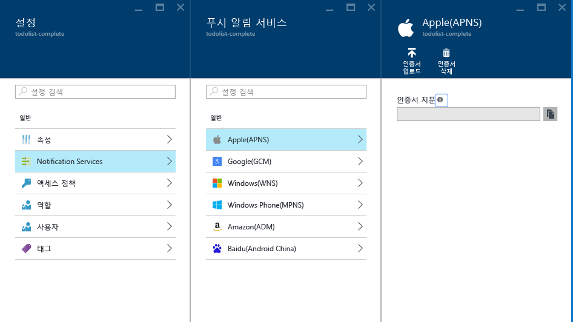

<properties
	pageTitle="Azure 알림 허브를 사용하여 iOS에 푸시 알림 보내기 | Microsoft Azure"
	description="이 자습서에서는 Azure 알림 허브를 사용하여 iOS 응용 프로그램으로 푸시 알림을 보내는 방법을 알아봅니다."
	services="notification-hubs"
	documentationCenter="ios"
    keywords="푸시 알림, 푸시알림,ios 푸시 알림"
	authors="wesmc7777"
	manager="dwrede"
	editor=""/>

<tags
	ms.service="notification-hubs"
	ms.workload="mobile"
	ms.tgt_pltfrm="mobile-ios"
	ms.devlang="objective-c"
	ms.topic="hero-article"
	ms.date="03/14/2016"
	ms.author="wesmc"/>

# Azure 알림 허브를 사용하여 iOS에 푸시 알림 보내기

[AZURE.INCLUDE [notification-hubs-selector-get-started](../../includes/notification-hubs-selector-get-started.md)]

##개요

> [AZURE.NOTE] 이 자습서를 완료하려면 활성 Azure 계정이 있어야 합니다. 계정이 없는 경우 몇 분 만에 무료 평가판 계정을 만들 수 있습니다. 자세한 내용은 [Azure 무료 체험](https://azure.microsoft.com/pricing/free-trial/?WT.mc_id=A0E0E5C02&amp;returnurl=http%3A%2F%2Fazure.microsoft.com%2Fko-KR%2Fdocumentation%2Farticles%2Fnotification-hubs-ios-get-started)을 참조하세요.

이 자습서에서는 Azure 알림 허브를 사용하여 iOS 응용 프로그램에 푸시 알림을 보내는 방법을 보여 줍니다. [APNS(Apple Push Notification Service)](https://developer.apple.com/library/ios/documentation/NetworkingInternet/Conceptual/RemoteNotificationsPG/Chapters/ApplePushService.html)를 사용하여 푸시 알림을 받는 빈 iOS 앱을 만듭니다.

완료하면 알림 허브를 사용하여 앱을 실행하는 모든 장치로 푸시 알림을 브로드캐스트할 수 있습니다.

## 시작하기 전에

[AZURE.INCLUDE [notification-hubs-hero-slug](../../includes/notification-hubs-hero-slug.md)]

이 자습서에 대해 완료된 코드는 [GitHub](https://github.com/Azure/azure-notificationhubs-samples/tree/master/iOS/GetStartedNH/GetStarted)에서 찾을 수 있습니다.

##필수 조건

이 자습서를 사용하려면 다음이 필요합니다.

+ [모바일 서비스 iOS SDK 버전 1.2.4]
+ [Xcode] 최신 버전
+ iOS 8(이상) 지원 장치
+ [Apple 개발자 프로그램](https://developer.apple.com/programs/) 멤버 자격

   > [AZURE.NOTE] 푸시 알림에 대한 구성 요구 사항 때문에 iOS 시뮬레이터 대신 실제 iOS 장치(iPhone 또는 iPad)에서 푸시 알림을 배포 및 테스트해야 합니다.

이 자습서를 완료해야 다른 모든 iOS 앱용 알림 허브 자습서를 진행할 수 있습니다.

[AZURE.INCLUDE [알림 허브가 Apple 푸시 알림 사용](../../includes/notification-hubs-enable-apple-push-notifications.md)]

##iOS 푸시 알림에 대해 알림 허브 구성

이 섹션에서는 새 알림 허브를 만들고 사용자가 만든 **.p12** 푸시 알림을 사용하여 APNS로 인증을 구성하는 방법을 단계별로 안내합니다. 이미 만든 알림 허브를 사용하려는 경우 5단계로 건너뛸 수 있습니다.

[AZURE.INCLUDE [notification-hubs-portal-create-new-hub](../../includes/notification-hubs-portal-create-new-hub.md)]

<ol start="6">
<li>

<b>설정</b> 블레이드에서 <b>알림 서비스</b> 단추를 클릭한 다음 <b>Apple(APNS)</b>을 선택합니다. <b>인증서 업로드</b>를 클릭하고 앞에서 내보낸 <b>.p12</b> 파일을 선택합니다. 또한 올바른 암호를 지정합니다.

개발용이므로 <b>샌드박스</b> 모드를 선택합니다. 스토어에서 앱을 구매한 사용자에게 푸시 알림을 보내려는 경우에만 <b>프로덕션</b>을 사용합니다.

</li>
</ol>
&emsp;&emsp;

&emsp;&emsp;

이제 알림 허브가 APNS와 작동하도록 구성되었으며 앱을 등록하고 푸시 알림을 보내기 위한 연결 문자열이 있습니다.

##알림 허브에 iOS 앱 연결

1. Xcode에서 새 iOS 프로젝트를 만들고 **응용 프로그램 단일 보기** 템플릿을 선택합니다.

   	![Xcode - 단일 보기 응용 프로그램][8]

2. 새 프로젝트에 대한 옵션을 설정할 때 Apple 개발자 포털에서 이전에 번들 ID를 설정한 경우에 사용한 동일한 **제품 이름** 및 **조직 식별자**를 사용해야 합니다.

	![Xcode - 프로젝트 옵션][11]

3. **대상** 아래에서 프로젝트 이름을 클릭하고 **빌드 설정** 탭을 클릭한 다음 **코드 서명 ID**를 확장하고 **디버그**에서 코드 서명 ID를 설정합니다. **수준**을 **기본**에서 **전체**로 설정/해제하고 이전에 만든 프로비전 프로필에 **프로필을 프로비전**합니다.

	Xcode에서 만든 새 프로비전 프로필이 보이지 않으면 서명 ID에 대한 프로필을 새로 고칩니다. 메뉴 모음에서 **Xcode**, **기본 설정**, **계정** 탭, **세부 정보 보기** 단추, 서명 ID를 차례로 클릭한 다음 오른쪽 아래 모서리에 있는 새로 고침 단추를 클릭합니다.

   	![Xcode - 프로비전 프로필][9]

4. [모바일 서비스 iOS SDK 버전 1.2.4]를 다운로드하고 파일의 압축을 풉니다. Xcode에서 프로젝트를 마우스 오른쪽 단추로 클릭하고 **파일 추가** 옵션을 클릭하여 **WindowsAzureMessaging.framework** 폴더를 Xcode 프로젝트에 추가합니다. **필요한 경우 항목 복사**를 선택한 다음 **추가**를 클릭합니다.

	>[AZURE.NOTE] 알림 허브 SDK는 현재 Xcode 7의 bitcode를 지원하지 않습니다. 프로젝터의 **빌드 옵션**에서 **Bitcode 사용**을 **No**로 설정해야 합니다.

   	![Azure SDK 압축 해제][10]

5. `HubInfo.h`라는 프로젝트에 새 헤더 파일을 추가합니다. 이 파일에는 알림 허브에 대한 상수가 들어 있습니다. 다음 정의를 추가하고 문자열 리터럴 자리 표시자를 *허브 이름* 및 앞에서 메모해둔 *DefaultListenSharedAccessSignature* 으로 바꿉니다.

		#ifndef HubInfo_h
		#define HubInfo_h
		
			#define HUBNAME @"<Enter the name of your hub>"
			#define HUBLISTENACCESS @"<Enter your DefaultListenSharedAccess connection string"
		
		#endif /* HubInfo_h */

6. `AppDelegate.h` 파일을 열고 다음 import 지시문을 추가합니다.

         #import <WindowsAzureMessaging/WindowsAzureMessaging.h> 
		 #import "HubInfo.h"
		
7. `AppDelegate.m file`에서 iOS 버전에 따라 `didFinishLaunchingWithOptions` 메서드에 다음 코드를 추가합니다. 이 코드는 APNS로 장치 핸들을 등록합니다.

	iOS 8의 경우

	 	UIUserNotificationSettings *settings = [UIUserNotificationSettings settingsForTypes:UIUserNotificationTypeSound |
												UIUserNotificationTypeAlert | UIUserNotificationTypeBadge categories:nil];

    	[[UIApplication sharedApplication] registerUserNotificationSettings:settings];
    	[[UIApplication sharedApplication] registerForRemoteNotifications];

	iOS 8 이전 버전의 경우

         [[UIApplication sharedApplication] registerForRemoteNotificationTypes: UIRemoteNotificationTypeAlert | UIRemoteNotificationTypeBadge | UIRemoteNotificationTypeSound];

8. 같은 파일에 다음 메서드를 추가합니다. 이 코드는 사용자가 HubInfo.h에서 지정한 연결 정보를 사용하여 알림 허브에 연결합니다. 그런 다음 알림 허브에서 알림을 보낼 수 있도록 알림 허브에 장치 토큰을 제공합니다.

	    - (void)application:(UIApplication *)application didRegisterForRemoteNotificationsWithDeviceToken:(NSData *) deviceToken {
		    SBNotificationHub* hub = [[SBNotificationHub alloc] initWithConnectionString:HUBLISTENACCESS
										notificationHubPath:HUBNAME];

		    [hub registerNativeWithDeviceToken:deviceToken tags:nil completion:^(NSError* error) {
		        if (error != nil) {
		            NSLog(@"Error registering for notifications: %@", error);
		        }
				else {
				    [self MessageBox:@"Registration Status" message:@"Registered"];
				}
	    	}];
		}

		-(void)MessageBox:(NSString *)title message:(NSString *)messageText
		{
			UIAlertView *alert = [[UIAlertView alloc] initWithTitle:title message:messageText delegate:self
				cancelButtonTitle:@"OK" otherButtonTitles: nil];
			[alert show];
		}

9. 같은 파일에서 앱이 활성 상태일 때 알림이 수신되는 경우 **UIAlert**를 표시하려면 다음 메서드를 추가합니다.

        - (void)application:(UIApplication *)application didReceiveRemoteNotification: (NSDictionary *)userInfo {
		    NSLog(@"%@", userInfo);
		    [self MessageBox:@"Notification" message:[[userInfo objectForKey:@"aps"] valueForKey:@"alert"]];
		}

10. 실패하지 않았음을 확인하기 위해 장치에서 앱을 빌드 및 실행합니다.

## 테스트 푸시 알림 보내기

허브 블레이드의 **문제 해결** 섹션을 통해(*보내기 테스트* 옵션 사용) [Azure 포털]에서 푸시 알림을 보내서 앱의 푸시 알림 수신을 테스트할 수 있습니다.

![Azure 포털 - 보내기 테스트][30]

[AZURE.INCLUDE [notification-hubs-sending-notifications-from-the-portal](../../includes/notification-hubs-sending-notifications-from-the-portal.md)]

## (선택 사항) 앱에서 푸시 알림 보내기

앱 내에서 푸시 알림을 보내려는 경우 REST 인터페이스를 사용하여 푸시 알림을 보내는 이 섹션의 예를 참조하세요.

1. Xcode에서 `Main.storyboard`를 열고 개체 라이브러리에서 다음 UI 구성 요소를 추가하여 사용자가 앱에서 푸시 알림을 보낼 수 있습니다.

	- 레이블 텍스트가 없는 레이블입니다. 알림을 보내는 오류 보고에 사용됩니다. **줄** 속성은 **0**으로 설정해야 하므로 오른쪽 및 왼쪽 여백과 보기의 위쪽에 크기가 자동으로 제한됩니다.
	- **자리 표시자** 텍스트를 사용한 텍스트 필드가 **알림 메시지 입력**으로 설정됩니다. 아래와 같이 레이블 바로 아래에 있는 필드를 제한합니다. 뷰 컨트롤러를 콘센트 대리자로 설정합니다.
	- **알림 보내기**라는 단추는 텍스트 필드의 바로 아래 및 가로 가운데로 제한됩니다.

	뷰는 다음과 같이 표시되어야 합니다.

	![Xcode 디자이너][32]

2. 보기에 연결된 레이블 및 텍스트 필드에 [출선을 추가](https://developer.apple.com/library/ios/recipes/xcode_help-IB_connections/chapters/CreatingOutlet.html)하고 `interface` 정의를 업데이트하여 `UITextFieldDelegate` 및 `NSXMLParserDelegate`를 지원합니다. REST API 호출 및 응답 구문 분석을 지원할 수 있도록 아래에 표시된 3개의 속성 선언을 추가합니다.

	ViewController.h 파일은 다음과 같이 표시 되어야 합니다.

		#import <UIKit/UIKit.h>

		@interface ViewController : UIViewController <UITextFieldDelegate, NSXMLParserDelegate>
		{
			NSXMLParser *xmlParser;
		}

		// Make sure these outlets are connected to your UI by ctrl+dragging
		@property (weak, nonatomic) IBOutlet UITextField *notificationMessage;
		@property (weak, nonatomic) IBOutlet UILabel *sendResults;

		@property (copy, nonatomic) NSString *statusResult;
		@property (copy, nonatomic) NSString *currentElement;

		@end

3. `HubInfo.h`를 열고 허브에 알림을 보내는 데 사용할 다음 상수를 추가합니다. 자리 표시자 문자열 리터럴을 실제 *DefaultFullSharedAccessSignature* 연결 문자열로 대체합니다.

		#define API_VERSION @"?api-version=2015-01"
		#define HUBFULLACCESS @"<Enter Your DefaultFullSharedAccess Connection string>"

4. 다음 `#import` 문을 `ViewController.h` 파일에 추가합니다.

		#import <CommonCrypto/CommonHMAC.h>
		#import "HubInfo.h"

5. `ViewController.m`에서 인터페이스 구현에 다음 코드를 추가합니다. 이 코드는 *DefaultFullSharedAccessSignature* 연결 문자열을 구문 분석합니다. [REST API 참조](http://msdn.microsoft.com/library/azure/dn495627.aspx)에서 설명한 것처럼 이 구문 분석된 정보는 **권한 부여** 요청 헤더를 위한 SaS 토큰을 생성하는데 사용됩니다.

		NSString *HubEndpoint;
		NSString *HubSasKeyName;
		NSString *HubSasKeyValue;

		-(void)ParseConnectionString
		{
			NSArray *parts = [HUBFULLACCESS componentsSeparatedByString:@";"];
			NSString *part;

			if ([parts count] != 3)
			{
				NSException* parseException = [NSException exceptionWithName:@"ConnectionStringParseException"
					reason:@"Invalid full shared access connection string" userInfo:nil];

				@throw parseException;
			}

			for (part in parts)
			{
				if ([part hasPrefix:@"Endpoint"])
				{
					HubEndpoint = [NSString stringWithFormat:@"https%@",[part substringFromIndex:11]];
				}
				else if ([part hasPrefix:@"SharedAccessKeyName"])
				{
					HubSasKeyName = [part substringFromIndex:20];
				}
				else if ([part hasPrefix:@"SharedAccessKey"])
				{
					HubSasKeyValue = [part substringFromIndex:16];
				}
			}
		}

6. `ViewController.m`에서 `viewDidLoad` 메서드를 업데이트하여 뷰가 로드할 때 연결 문자열을 구문 분석합니다. 아래와 같이 인터페이스 구현에 유틸리티 메서드를 추가합니다.

		- (void)viewDidLoad
		{
			[super viewDidLoad];
			[self ParseConnectionString];
			[_notificationMessage setDelegate:self];
		}

		-(NSString *)CF_URLEncodedString:(NSString *)inputString
		{
		   return (__bridge NSString *)CFURLCreateStringByAddingPercentEscapes(NULL, (CFStringRef)inputString,
				NULL, (CFStringRef)@"!*'();:@&=+$,/?%#[]", kCFStringEncodingUTF8);
		}

		-(void)MessageBox:(NSString *)title message:(NSString *)messageText
		{
			UIAlertView *alert = [[UIAlertView alloc] initWithTitle:title message:messageText delegate:self
				cancelButtonTitle:@"OK" otherButtonTitles: nil];
			[alert show];
		}

7. `ViewController.m`의 인터페이스 구현에 [REST API 참조](http://msdn.microsoft.com/library/azure/dn495627.aspx)에서 설명한 것처럼 **권한 부여** 헤더에 제공할 SaS 권한 부여 토큰을 생성하는 다음 코드를 추가합니다.

		-(NSString*) generateSasToken:(NSString*)uri
		{
			NSString *targetUri;
			NSString* utf8LowercasedUri = NULL;
			NSString *signature = NULL;
			NSString *token = NULL;

			@try
			{
				// Add expiration
				uri = [uri lowercaseString];
				utf8LowercasedUri = [self CF_URLEncodedString:uri];
				targetUri = [utf8LowercasedUri lowercaseString];
				NSTimeInterval expiresOnDate = [[NSDate date] timeIntervalSince1970];
				int expiresInMins = 60; // 1 hour
				expiresOnDate += expiresInMins * 60;
				UInt64 expires = trunc(expiresOnDate);
				NSString* toSign = [NSString stringWithFormat:@"%@\n%qu", targetUri, expires];

				// Get an hmac_sha1 Mac instance and initialize with the signing key
				const char *cKey  = [HubSasKeyValue cStringUsingEncoding:NSUTF8StringEncoding];
				const char *cData = [toSign cStringUsingEncoding:NSUTF8StringEncoding];
				unsigned char cHMAC[CC_SHA256_DIGEST_LENGTH];
				CCHmac(kCCHmacAlgSHA256, cKey, strlen(cKey), cData, strlen(cData), cHMAC);
				NSData *rawHmac = [[NSData alloc] initWithBytes:cHMAC length:sizeof(cHMAC)];
				signature = [self CF_URLEncodedString:[rawHmac base64EncodedStringWithOptions:0]];

				// Construct authorization token string
				token = [NSString stringWithFormat:@"SharedAccessSignature sig=%@&se=%qu&skn=%@&sr=%@",
					signature, expires, HubSasKeyName, targetUri];
			}
			@catch (NSException *exception)
			{
				[self MessageBox:@"Exception Generating SaS Token" message:[exception reason]];
			}
			@finally
			{
				if (utf8LowercasedUri != NULL)
					CFRelease((CFStringRef)utf8LowercasedUri);
				if (signature != NULL)
				CFRelease((CFStringRef)signature);
			}

			return token;
		}

8. Ctrl 키를 누른 채로 **알림 전송** 버튼을 `ViewController.m`으로 끌어 **Touch Down** 이벤트에 **SendNotificationMessage**라는 작업을 추가합니다. 다음 코드로 메서드를 업데이트하여 REST API를 사용하여 알림을 전송합니다.

		- (IBAction)SendNotificationMessage:(id)sender
		{
			self.sendResults.text = @"";
			[self SendNotificationRESTAPI];
		}

		- (void)SendNotificationRESTAPI
		{
		    NSURLSession* session = [NSURLSession
                             sessionWithConfiguration:[NSURLSessionConfiguration defaultSessionConfiguration]
                             delegate:nil delegateQueue:nil];

			// Apple Notification format of the notification message
		    NSString *json = [NSString stringWithFormat:@"{"aps":{"alert":"%@"}}",
								self.notificationMessage.text];

			// Construct the message's REST endpoint
			NSURL* url = [NSURL URLWithString:[NSString stringWithFormat:@"%@%@/messages/%@", HubEndpoint,
												HUBNAME, API_VERSION]];

			// Generate the token to be used in the authorization header
			NSString* authorizationToken = [self generateSasToken:[url absoluteString]];

			//Create the request to add the APNs notification message to the hub
			NSMutableURLRequest *request = [NSMutableURLRequest requestWithURL:url];
			[request setHTTPMethod:@"POST"];
			[request setValue:@"application/json;charset=utf-8" forHTTPHeaderField:@"Content-Type"];

			// Signify Apple notification format
			[request setValue:@"apple" forHTTPHeaderField:@"ServiceBusNotification-Format"];

			//Authenticate the notification message POST request with the SaS token
			[request setValue:authorizationToken forHTTPHeaderField:@"Authorization"];

			//Add the notification message body
			[request setHTTPBody:[json dataUsingEncoding:NSUTF8StringEncoding]];

			// Send the REST request
		    NSURLSessionDataTask* dataTask = [session dataTaskWithRequest:request
				completionHandler:^(NSData *data, NSURLResponse *response, NSError *error)
			{
		        NSHTTPURLResponse* httpResponse = (NSHTTPURLResponse*) response;
		        if (error || (httpResponse.statusCode != 200 && httpResponse.statusCode != 201))
		        {
		            NSLog(@"\nError status: %d\nError: %@", httpResponse.statusCode, error);
		        }
				if (data != NULL)
				{
		        	xmlParser = [[NSXMLParser alloc] initWithData:data];
		        	[xmlParser setDelegate:self];
		       		[xmlParser parse];
		    	}
		    }];
		    [dataTask resume];
		}

9. `ViewController.m`에서 텍스트 필드에 대한 키보드 닫기를 지원하려면 다음 대리자 메서드를 추가합니다. 인터페이스 디자이너에서 텍스트 필드에서 뷰 컨트롤러 아이콘으로 Ctrl + 드래그하여 뷰 컨트롤러를 콘센트 대리자로 설정합니다.

		//===[ Implement UITextFieldDelegate methods ]===

		-(BOOL)textFieldShouldReturn:(UITextField *)textField
		{
			[textField resignFirstResponder];
			return YES;
		}

10. `ViewController.m`에서 `NSXMLParser`을 사용하여 응답 구문 분석을 지원하려면 다음 대리자 메서드를 추가합니다.

		//===[ Implement NSXMLParserDelegate methods ]===

		-(void)parserDidStartDocument:(NSXMLParser *)parser
		{
		    self.statusResult = @"";
		}

		-(void)parser:(NSXMLParser *)parser didStartElement:(NSString *)elementName
			namespaceURI:(NSString *)namespaceURI qualifiedName:(NSString *)qName
			attributes:(NSDictionary *)attributeDict
		{
		    NSString * element = [elementName lowercaseString];
		    NSLog(@"*** New element parsed : %@ ***",element);

		    if ([element isEqualToString:@"code"] | [element isEqualToString:@"detail"])
		    {
		        self.currentElement = element;
		    }
		}

		-(void) parser:(NSXMLParser *)parser foundCharacters:(NSString *)parsedString
		{
		    self.statusResult = [self.statusResult stringByAppendingString:
		        [NSString stringWithFormat:@"%@ : %@\n", self.currentElement, parsedString]];
		}

		-(void)parserDidEndDocument:(NSXMLParser *)parser
		{
			// Set the status label text on the UI thread
			dispatch_async(dispatch_get_main_queue(),
			^{
				[self.sendResults setText:self.statusResult];
			});
		}

11. 프로젝트를 빌드하고 오류가 없는지 확인 합니다.

> [AZURE.NOTE] bitcode 지원에 대한 Xcode7에 빌드 오류가 발생하는 경우 **빌드 설정** -> **Bitcode 사용(ENABLE\_BITCODE)**을 **아니요**로 변경해야 합니다. 알림 허브 SDK는 현재 bitcode를 지원하지 않습니다.

Apple [로컬 및 푸시 알림 프로그래밍 가이드]에서 가능한 모든 알림 페이로드를 찾아볼 수 있습니다.

##앱이 푸시 알림을 받을 수 있는지 확인합니다.

iOS에서 푸시 알림을 테스트하려면 실제 iOS 장치에 앱을 배포해야 합니다. iOS 시뮬레이터를 사용하여 Apple 푸시 알림을 보낼 수 없습니다.

1. 앱을 실행하고 등록이 성공했는지 확인한 다음 **확인**을 누릅니다.

	![iOS 앱 푸시 알림 등록 테스트][33]

2. 위에서 설명한 것처럼, [Azure 포털]에서 테스트 푸시 알림을 보낼 수 있습니다. 앱에서 푸시 알림을 보내기 위한 코드를 추가한 경우 텍스트 필드 안쪽을 클릭하여 알림 메시지를 입력합니다. 그런 다음 키보드에서 **보내기** 단추 또는 보기에서 **알림 보내기** 단추를 눌러서 알림 메시지를 보냅니다.

	![iOS 앱 푸시 알림 전송 테스트][34]

3. 특정 알림 허브에서 보내는 알림을 수신하도록 등록된 모든 장치에 푸시 알림이 전송됩니다.

	![iOS 앱 푸시 알림 수신 테스트][35]

##다음 단계

이 간단한 예제에서는 등록된 모든 iOS 장치로 포시 알림을 브로드캐스트합니다. 다음 학습 단계로 [.NET 백 엔드를 통한 Azure 알림 허브의 iOS 사용자 알림] 자습서를 권장합니다. 태그를 사용하여 푸시 알림을 보내는 백 엔드를 만드는 과정을 소개하는 자습서입니다.

또한 사용자를 관심 그룹별로 분할하려면 [알림 허브를 사용하여 뉴스 속보 보내기] 자습서로 이동할 수 있습니다.

알림 허브에 대한 일반적인 정보는 [알림 허브 지침]을 참조하세요.

<!-- Images. -->

[6]: ./media/notification-hubs-ios-get-started/notification-hubs-configure-ios.png
[8]: ./media/notification-hubs-ios-get-started/notification-hubs-create-ios-app.png
[9]: ./media/notification-hubs-ios-get-started/notification-hubs-create-ios-app2.png
[10]: ./media/notification-hubs-ios-get-started/notification-hubs-create-ios-app3.png
[11]: ./media/notification-hubs-ios-get-started/notification-hubs-xcode-product-name.png

[30]: ./media/notification-hubs-ios-get-started/notification-hubs-test-send.png

[31]: ./media/notification-hubs-ios-get-started/notification-hubs-ios-ui.png
[32]: ./media/notification-hubs-ios-get-started/notification-hubs-storyboard-view.png
[33]: ./media/notification-hubs-ios-get-started/notification-hubs-test1.png
[34]: ./media/notification-hubs-ios-get-started/notification-hubs-test2.png
[35]: ./media/notification-hubs-ios-get-started/notification-hubs-test3.png

<!-- URLs. -->
[모바일 서비스 iOS SDK 버전 1.2.4]: http://aka.ms/kymw2g
[Mobile Services iOS SDK]: http://go.microsoft.com/fwLink/?LinkID=266533
[Submit an app page]: http://go.microsoft.com/fwlink/p/?LinkID=266582
[My Applications]: http://go.microsoft.com/fwlink/p/?LinkId=262039
[Live SDK for Windows]: http://go.microsoft.com/fwlink/p/?LinkId=262253

[Get started with Mobile Services]: /develop/mobile/tutorials/get-started-ios
[Azure Classic Portal]: https://manage.windowsazure.com/
[알림 허브 지침]: http://msdn.microsoft.com/library/jj927170.aspx
[Xcode]: https://go.microsoft.com/fwLink/p/?LinkID=266532
[iOS Provisioning Portal]: http://go.microsoft.com/fwlink/p/?LinkId=272456

[Get started with push notifications in Mobile Services]: ../mobile-services-javascript-backend-ios-get-started-push.md
[.NET 백 엔드를 통한 Azure 알림 허브의 iOS 사용자 알림]: notification-hubs-aspnet-backend-ios-notify-users.md
[알림 허브를 사용하여 뉴스 속보 보내기]: notification-hubs-ios-send-breaking-news.md

[로컬 및 푸시 알림 프로그래밍 가이드]: http://developer.apple.com/library/mac/#documentation/NetworkingInternet/Conceptual/RemoteNotificationsPG/Chapters/ApplePushService.html#//apple_ref/doc/uid/TP40008194-CH100-SW1
[Azure 포털]: https://portal.azure.com

<!---HONumber=AcomDC_0323_2016-->