# <a name="tutorial-push-location-based-notifications-with-azure-notification-hubs-and-bing-spatial-data"></a>자습서: Azure Notification Hubs 및 Bing 공간 데이터로 위치 기반 알림 푸시
이 자습서에서는 Azure Notification Hubs 및 Bing 공간 데이터로 위치 기반 푸시 알림을 전달하는 방법을 알아봅니다. 

이 자습서에서 수행하는 단계는 다음과 같습니다.

> [!div class="checklist"]
> * 데이터 원본 설정
> * UWP 애플리케이션 설정
> * 백 엔드 설정
> * UWP(유니버설 Windows 플랫폼) 앱에서 푸시 알림 테스트


## <a name="prerequisites"></a>필수 조건

- **Azure 구독**. Azure 구독이 아직 없는 경우 시작하기 전에 [체험](https://azure.microsoft.com/free/) 계정을 만듭니다.
- [Visual Studio 2015 업데이트 1](https://www.visualstudio.com/downloads/download-visual-studio-vs.aspx) 이상([Community Edition](https://go.microsoft.com/fwlink/?LinkId=691978&clcid=0x409)) 
- 최신 버전의 [Azure SDK](https://azure.microsoft.com/downloads/). 
- [Bing 맵 개발자 센터 계정](https://www.bingmapsportal.com/) (무료로 만들거나 Microsoft 계정으로 연결할 수 있음). 

## <a name="set-up-the-data-source"></a>데이터 원본 설정

1. [Bing 맵 개발자 센터](https://www.bingmapsportal.com/)에 로그인합니다. 
2. 위쪽 탐색 모음에서 **데이터 원본**을 선택하고, **데이터 원본 관리**를 선택합니다. 

    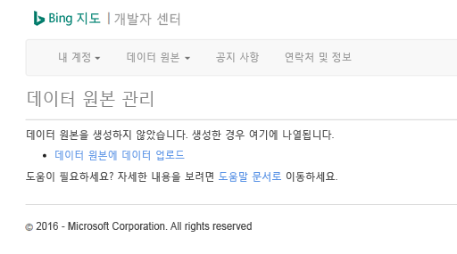
3. 기존 데이터 원본이 없는 경우 데이터 원본 만들기에 대한 링크가 표시됩니다. **데이터 원본으로 데이터 업로드**를 선택합니다. **데이터 원본** > **데이터 업로드** 메뉴를 사용할 수도 있습니다. 

    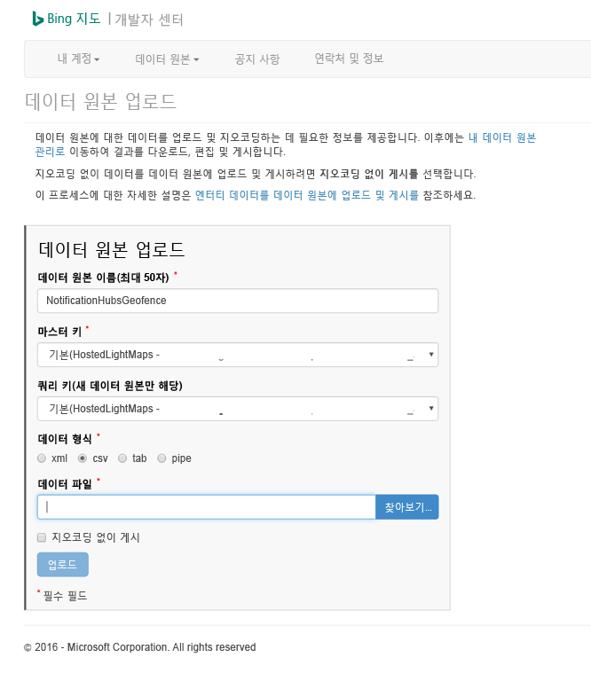

4. 다음 콘텐츠로 하드 드라이브에 **NotificationHubsGeofence.pipe** 파일을 만듭니다. 이 자습서에서는 San Francisco 해안 영역을 둘러싸는 파이프 기반 샘플 파일을 사용합니다.

    ```
    Bing Spatial Data Services, 1.0, TestBoundaries
    EntityID(Edm.String,primaryKey)|Name(Edm.String)|Longitude(Edm.Double)|Latitude(Edm.Double)|Boundary(Edm.Geography)
    1|SanFranciscoPier|||POLYGON ((-122.389825 37.776598,-122.389438 37.773087,-122.381885 37.771849,-122.382186 37.777022,-122.389825 37.776598))
    ```

    파이프 파일은 이 엔터티를 나타냅니다.
    
    
5. **데이터 원본 업로드** 페이지에서 다음 작업을 수행합니다.
    1. **데이터 형식**에 대해 **파이프**를 선택합니다.
    2. 이전 단계에서 만든 **NotificationHubGeofence.pipe** 파일을 찾고 선택합니다. 
    3. **업로드** 단추를 선택합니다. 
    
    > [!NOTE]
    > **쿼리 키**와 다른 **마스터 키**에 대한 새 키를 지정하라는 메시지가 표시될 수 있습니다. 대시보드를 통해 새 키를 만들고 데이터 원본 업로드 페이지를 새로 고칩니다.
6. 데이터 파일을 업로드하면 데이터 원본을 게시하는지 확인해야 합니다. 이전에 했던 것처럼 **데이터 원본** -> **데이터 원본 관리**를 선택합니다. 
7. 목록에서 데이터 원본을 선택하고, **동작** 열에서 **게시**를 선택합니다. 

    
8. **게시된 데이터 원본** 탭으로 전환하고, 목록에 데이터 원본이 표시되는지 확인합니다.

    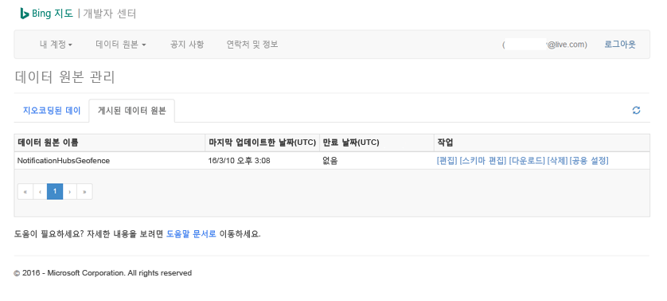

9. **편집**을 선택합니다. 데이터에 도입한 위치가(한 눈에) 표시됩니다.

    

    이 시점에서 포털은 사용자가 만든 지역 구분에 대한 경계를 보여주지 않습니다. 지정된 위치가 오른쪽 주변에 있다는 것을 확인하기만 하면 됩니다.
8. 이제 데이터 원본에 대한 모든 요구 사항을 갖추었습니다. Bing 맵 개발자 센터에서 API 호출에 대한 요청 URL의 세부 정보를 얻으려면 **데이터 원본**을 선택하고 **데이터 원본 정보**를 선택합니다.

    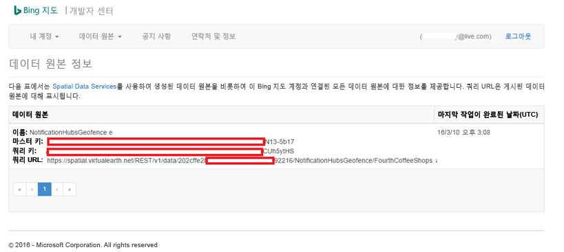

    **쿼리 URL**은 장치가 현재 위치의 경계 내에 있는지 여부를 확인하기 위해 쿼리를 실행할 수 있는 엔드포인트입니다. 이 검사를 수행하려면 추가된 다음 매개 변수를 사용하여 쿼리 URL에 대한 가져오기 호출을 실행합니다.

    ```
    ?spatialFilter=intersects(%27POINT%20LONGITUDE%20LATITUDE)%27)&$format=json&key=QUERY_KEY
    ```

    Bing 맵은 디바이스가 지역 구분 내에 있는지 여부를 확인하기 위해 자동으로 계산을 수행합니다. 브라우저(또는 cURL)를 통해 요청을 실행하면 표준 JSON 응답을 받습니다.

    

    지점이 실제로 지정된 경계 내에 있는 경우에만 이 응답이 발생합니다. 그렇지 않은 경우 빈 **결과** 버킷을 받습니다.

    

## <a name="set-up-the-uwp-application"></a>UWP 애플리케이션 설정

1. Visual Studio에서 **비어 있는 앱(유니버설 Windows)** 형식의 새 프로젝트를 시작합니다.

    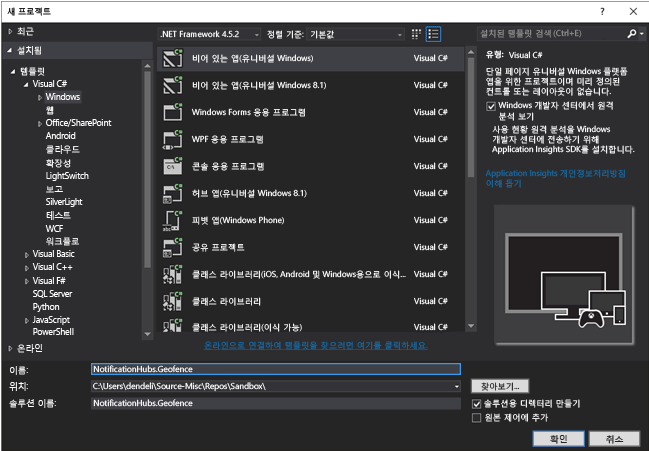

    프로젝트 생성이 완료되면 앱 자체에 대한 테스트 도구가 있어야 합니다. 이제 지역 구분 인프라에 모든 항목을 설정해 보겠습니다. 이 솔루션에 대해 Bing 서비스를 사용하기 때문에 특정 위치 프레임을 쿼리할 수 있는 공용 REST API 엔드포인트가 있습니다.

    http://spatial.virtualearth.net/REST/v1/data/

    다음 매개 변수를 지정하여 작동시킵니다.

    - **데이터 원본 ID** 및 **데이터 원본 이름** – Bing 맵 API에서 데이터 원본은 작업하는 위치 및 업무 시간 등 다양하게 버킷 구성된 메타데이터를 포함합니다.  
    - **엔터티 이름** – 알림에 대한 참조 지점으로 사용하려는 엔터티. 
    - **Bing 맵 API 키** – Bing 개발자 센터 계정을 만들 경우 이전에 얻은 키입니다.

    이제 데이터 원본을 준비했으므로 UWP 애플리케이션에서 작업을 시작할 수 있습니다.
2. 애플리케이션에 대한 위치 서비스를 사용하도록 설정합니다. **솔루션 탐색기**에서 `Package.appxmanifest` 파일을 엽니다.

    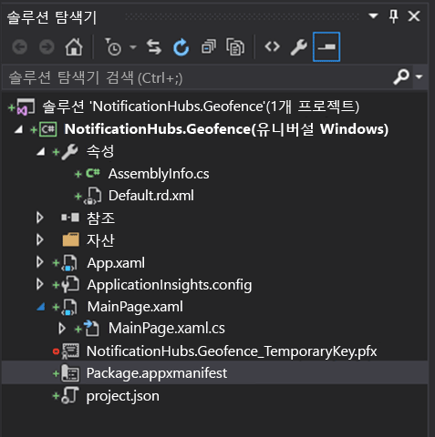
3. 방금 연 패키지 속성 탭에서 **기능** 탭으로 전환하고, **위치**를 선택합니다.

    

4. 솔루션에 `Core`라는 새 폴더를 만들고, `LocationHelper.cs`라는 새 파일을 추가합니다.

    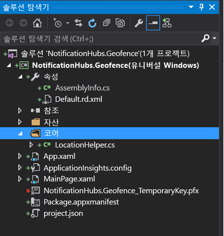

    `LocationHelper` 클래스에는 시스템 API를 통해 사용자 위치를 가져오는 코드가 있습니다.

    ```csharp
    using System;
    using System.Threading.Tasks;
    using Windows.Devices.Geolocation;

    namespace NotificationHubs.Geofence.Core
    {
        public class LocationHelper
        {
            private static readonly uint AppDesiredAccuracyInMeters = 10;

            public async static Task<Geoposition> GetCurrentLocation()
            {
                var accessStatus = await Geolocator.RequestAccessAsync();
                switch (accessStatus)
                {
                    case GeolocationAccessStatus.Allowed:
                        {
                            Geolocator geolocator = new Geolocator { DesiredAccuracyInMeters = AppDesiredAccuracyInMeters };

                            return await geolocator.GetGeopositionAsync();
                        }
                    default:
                        {
                            return null;
                        }
                }
            }

        }
    }
    ```

    UWP 앱에서 사용자의 위치 가져오기에 대해 자세히 알아보려면 [사용자의 위치 가져오기](https://msdn.microsoft.com/library/windows/apps/mt219698.aspx)를 참조하세요.

5. 위치 취득이 실제로 작동하는지 확인하려면 기본 페이지(`MainPage.xaml.cs`)의 코드 쪽을 엽니다. `MainPage` 생성자에서 `Loaded` 이벤트에 대한 새 이벤트 처리기를 만듭니다.

    ```csharp
    public MainPage()
    {
        this.InitializeComponent();
        this.Loaded += MainPage_Loaded;
    }
    ```

    이벤트 처리기의 구현은 다음과 같습니다.

    ```csharp
    private async void MainPage_Loaded(object sender, RoutedEventArgs e)
    {
        var location = await LocationHelper.GetCurrentLocation();

        if (location != null)
        {
            Debug.WriteLine(string.Concat(location.Coordinate.Longitude,
                " ", location.Coordinate.Latitude));
        }
    }
    ```
6. 애플리케이션을 실행하고 사용자의 위치에 액세스할 수 있도록 허용합니다.

    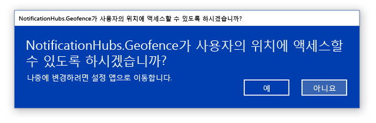
7. 애플리케이션이 시작되면 **출력** 창에서 좌표를 볼 수 있어야 합니다.

    

    이제 위치 취득이 작동합니다. 로드됨 이벤트 처리기를 더 이상 사용하지 않기 때문에 원하는 경우 삭제할 수 있습니다.
8. 다음 단계는 변경된 위치를 파악하는 작업입니다. `LocationHelper` 클래스에서 `PositionChanged`에 대한 이벤트 처리기를 추가합니다.

    ```csharp
    geolocator.PositionChanged += Geolocator_PositionChanged;
    ```

    구현은 **출력** 창에서 위치 좌표를 보여줍니다.

    ```csharp
    private static async void Geolocator_PositionChanged(Geolocator sender, PositionChangedEventArgs args)
    {
        await CoreApplication.MainView.CoreWindow.Dispatcher.RunAsync(CoreDispatcherPriority.Normal, () =>
        {
            Debug.WriteLine(string.Concat(args.Position.Coordinate.Longitude, " ", args.Position.Coordinate.Latitude));
        });
    }
    ```

## <a name="set-up-the-backend"></a>백 엔드 설정
1. [GitHub에서 .NET 백 엔드 샘플](https://github.com/Azure/azure-notificationhubs-samples/tree/master/dotnet/NotifyUsers)을 다운로드합니다. 
2. 다운로드가 완료되면 `NotifyUsers` 폴더를 연 다음, Visual Studio에서 `NotifyUsers.sln` 파일을 엽니다. 
3. `AppBackend` 프로젝트를 **시작 프로젝트** 로 설정하고 시작합니다.

    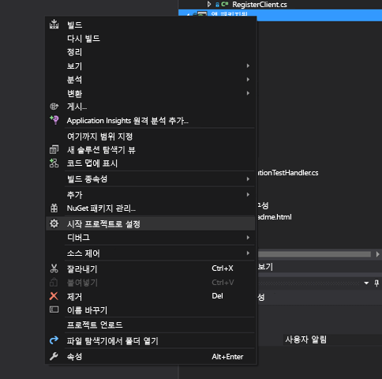

    프로젝트는 이미 대상 디바이스에 푸시 알림을 전송하도록 구성되었으므로 두 가지가 필요합니다. 알림 허브에 맞는 연결 문자열을 지정하고 사용자가 지역 구분 내에 있는 경우 알림을 보내도록 경계 식별을 추가합니다.
4. 연결 문자열을 구성하려면 `Models` 폴더에서 `Notifications.cs`를 엽니다. `NotificationHubClient.CreateClientFromConnectionString` 함수는 [Azure Portal](https://portal.azure.com)에서 얻을 수 있는 알림 허브에 대한 정보를 포함해야 합니다(**설정**에서 **액세스 정책** 페이지를 살펴봄). 업데이트된 구성 파일을 저장합니다.
5. Bing 맵 API 결과에 대한 모델을 만듭니다. `Models` 폴더를 열고 **추가** > **클래스**를 선택하는 것이 가장 쉬운 방법입니다. 이름을 `GeofenceBoundary.cs`로 지정합니다. 완료되면 첫 번째 섹션에서 가져온 API 응답에서 JSON을 복사합니다. Visual Studio에서 **편집** > **선택하여 붙여넣기** > **JSON을 클래스로 붙여넣기**를 사용합니다. 

    이러한 방식으로 의도한 대로 개체를 역직렬화하도록 합니다. 결과 클래스 집합은 다음 클래스와 유사합니다.

    ```csharp
    namespace AppBackend.Models
    {
        public class Rootobject
        {
            public D d { get; set; }
        }

        public class D
        {
            public string __copyright { get; set; }
            public Result[] results { get; set; }
        }

        public class Result
        {
            public __Metadata __metadata { get; set; }
            public string EntityID { get; set; }
            public string Name { get; set; }
            public float Longitude { get; set; }
            public float Latitude { get; set; }
            public string Boundary { get; set; }
            public string Confidence { get; set; }
            public string Locality { get; set; }
            public string AddressLine { get; set; }
            public string AdminDistrict { get; set; }
            public string CountryRegion { get; set; }
            public string PostalCode { get; set; }
        }

        public class __Metadata
        {
            public string uri { get; set; }
        }
    }
    ```
6. 다음으로 `Controllers` > `NotificationsController.cs`를 엽니다. 대상 경도 및 위도에 대한 계정에 게시 호출을 업데이트합니다. 이를 수행하려면 함수 시그니처 `latitude` 및 `longitude`라는 두 문자열을 추가합니다.

    ```csharp
    public async Task<HttpResponseMessage> Post(string pns, [FromBody]string message, string to_tag, string latitude, string longitude)
    ```
7. `ApiHelper.cs`이라는 프로젝트 내에서 새 클래스를 만들고 Bing에 연결하는 데 사용하여 지점 경계 교차점을 확인합니다. 다음 코드에 나와 있는 것처럼 `IsPointWithinBounds` 함수를 구현합니다.

    ```csharp
    public class ApiHelper
    {
        public static readonly string ApiEndpoint = "{YOUR_QUERY_ENDPOINT}?spatialFilter=intersects(%27POINT%20({0}%20{1})%27)&$format=json&key={2}";
        public static readonly string ApiKey = "{YOUR_API_KEY}";

        public static bool IsPointWithinBounds(string longitude,string latitude)
        {
            var json = new WebClient().DownloadString(string.Format(ApiEndpoint, longitude, latitude, ApiKey));
            var result = JsonConvert.DeserializeObject<Rootobject>(json);
            if (result.d.results != null && result.d.results.Count() > 0)
            {
                return true;
            }
            else
            {
                return false;
            }
        }
    }
    ```

    > [!IMPORTANT]
    > API 끝점을 앞의 Bing 개발자 센터에서 얻은 쿼리 URL로 대체하도록 합니다(API 키에도 동일하게 적용). 

    쿼리에 대한 결과가 있는 경우, 즉, 지정된 지점이 지역 구분의 경계 내에 있으므로 함수는 `true`을 반환합니다. 결과가 없는 경우 Bing은 지점이 조회 프레임 외부에 있다고 알리므로 함수는 `false`를 반환합니다.
8. `NotificationsController.cs`에서 전환 문 앞을 검사합니다.

    ```csharp
    if (ApiHelper.IsPointWithinBounds(longitude, latitude))
    {
        switch (pns.ToLower())
        {
            case "wns":
                //// Windows 8.1 / Windows Phone 8.1
                var toast = @"<toast><visual><binding template=""ToastText01""><text id=""1"">" +
                            "From " + user + ": " + message + "</text></binding></visual></toast>";
                outcome = await Notifications.Instance.Hub.SendWindowsNativeNotificationAsync(toast, userTag);

                // Windows 10 specific Action Center support
                toast = @"<toast><visual><binding template=""ToastGeneric""><text id=""1"">" +
                            "From " + user + ": " + message + "</text></binding></visual></toast>";
                outcome = await Notifications.Instance.Hub.SendWindowsNativeNotificationAsync(toast, userTag);

                break;
        }
    }
    ```

## <a name="test-push-notifications-in-the-uwp-app"></a>UWP 앱에서 푸시 알림 테스트

1. UWP 앱에서 이제 알림을 테스트할 수 있어야 합니다. `LocationHelper` 클래스 내에서 새 함수 `SendLocationToBackend`를 만듭니다.

    ```csharp
    public static async Task SendLocationToBackend(string pns, string userTag, string message, string latitude, string longitude)
    {
        var POST_URL = "http://localhost:8741/api/notifications?pns=" +
            pns + "&to_tag=" + userTag + "&latitude=" + latitude + "&longitude=" + longitude;

        using (var httpClient = new HttpClient())
        {
            try
            {
                await httpClient.PostAsync(POST_URL, new StringContent("\"" + message + "\"",
                    System.Text.Encoding.UTF8, "application/json"));
            }
            catch (Exception ex)
            {
                Debug.WriteLine(ex.Message);
            }
        }
    }
    ```

    > [!NOTE]
    > `POST_URL`을 배포된 웹 응용 프로그램의 위치로 설정합니다. 이제 로컬에서 실행해도 되지만 공용 버전을 배포할 경우 외부 공급자로 호스트해야 합니다.
1. 푸시 알림을 위해 UWP 앱을 등록합니다. Visual Studio에서 **프로젝트** > **저장** > **스토어와 앱 연결**을 선택합니다.

    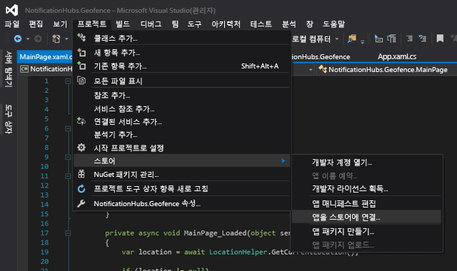
3. 개발자 계정에 로그인하면 기존 앱을 선택하거나 새로 만들고 해당 앱과 패키지를 연결해야 합니다. 
4. 개발자 센터로 이동하고 만든 앱을 엽니다. **서비스** > **푸시 알림** > **라이브 서비스 사이트**를 선택합니다.

    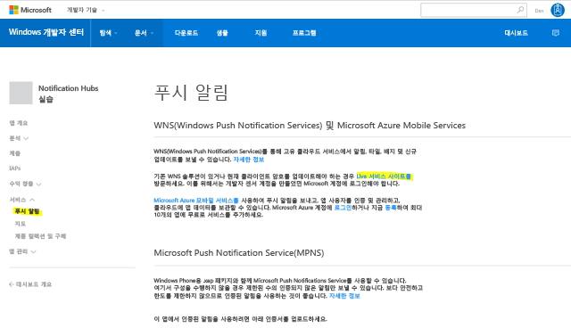
5. 사이트에서 **애플리케이션 암호** 및 **패키지 SID**를 적어둡니다. Azure Portal에서 알림 허브를 열고, **설정** > **Notification Services** > **WNS(Windows)** 를 선택하고 필수 필드에 정보를 입력해야 합니다.

    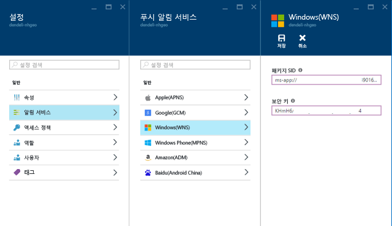
6. **저장**을 선택합니다.
7. **솔루션 탐색기**에서 **참조**를 열고 **NuGet 패키지 관리**를 선택합니다. **Microsoft Azure Service Bus 관리된 라이브러리**에 참조를 추가합니다. `WindowsAzure.Messaging.Managed`를 검색하고 프로젝트에 추가합니다.

    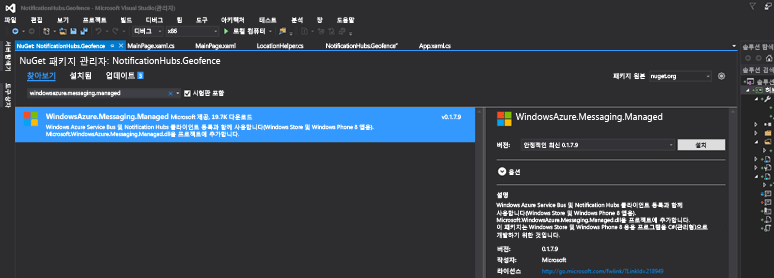

7. 테스트하기 위해 `MainPage_Loaded` 이벤트 처리기를 다시 한 번 만들고, 이 코드 조각을 추가합니다.

    ```csharp
    var channel = await PushNotificationChannelManager.CreatePushNotificationChannelForApplicationAsync();

    var hub = new NotificationHub("HUB_NAME", "HUB_LISTEN_CONNECTION_STRING");
    var result = await hub.RegisterNativeAsync(channel.Uri);

    // Displays the registration ID so you know it was successful
    if (result.RegistrationId != null)
    {
        Debug.WriteLine("Reg successful.");
    }
    ```

    코드는 알림 허브로 앱을 등록합니다. 준비가 되었습니다. 
8. `LocationHelper`의 `Geolocator_PositionChanged` 처리기 내부에 강제로 지역 구분 내부의 위치를 배치하는 테스트 코드의 조각을 추가할 수 있습니다.

    ```csharp
    await LocationHelper.SendLocationToBackend("wns", "TEST_USER", "TEST", "37.7746", "-122.3858");
    ```

9. 실제 좌표(현재 경계 내에 없을 수 있음)를 전달하지 않고 미리 정의된 테스트 값을 사용하기 때문에 업데이트에 표시된 알림을 확인합니다.

    

## <a name="next-steps"></a>다음 단계
솔루션이 프로덕션을 준비하도록 수행해야 하는 두 가지 단계가 있습니다.

1. 먼저 지역 구분이 동적인지 확인해야 합니다. 기존 데이터 원본 내에서 새 경계를 업로드할 수 있도록 Bing API와 함께 몇 가지 작업이 필요합니다. 자세한 내용은 [Bing 공간 Data Services API 설명서](https://msdn.microsoft.com/library/ff701734.aspx)를 참조하세요.
2. 둘째, 맞는 참가자에게 배달했는지 확인하기 위해 작업을 수행하는 경우 [태그 지정](notification-hubs-tags-segment-push-message.md)을 통해 대상을 지정할 수 있습니다.

이 자습서에 표시된 솔루션은 다양한 대상 플랫폼이 있을 수 있는 시나리오를 설명하므로 시스템 관련 기능에 대해 지역 구분을 제한하지 않습니다. 즉, 유니버설 Windows 플랫폼은 [지역 구분을 기본으로 검색](https://msdn.microsoft.com/windows/uwp/maps-and-location/set-up-a-geofence)하는 기능을 제공합니다.


