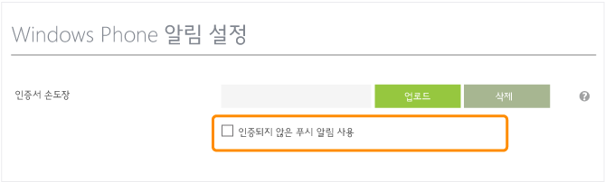

<properties
	pageTitle="Windows Phone에 대한 Azure 알림 허브 시작 | Microsoft Azure"
	description="이 자습서에서는 Azure 알림 허브를 사용하여 Windows Phone 8 또는 Windows Phone 8.1 Silverlight 응용 프로그램에 푸시 알림을 보내는 방법을 알아봅니다."
	services="notification-hubs"
	documentationCenter="windows"
	authors="wesmc7777"
	manager="dwrede"
	editor="dwrede"/>

<tags
	ms.service="notification-hubs"
	ms.workload="mobile"
	ms.tgt_pltfrm="mobile-windows-phone"
	ms.devlang="dotnet"
	ms.topic="hero-article"
	ms.date="10/21/2015"
	ms.author="wesmc"/>

# Windows Phone에 대한 알림 허브 시작

[AZURE.INCLUDE [notification-hubs-selector-get-started](../../includes/notification-hubs-selector-get-started.md)]

##개요

이 자습서에서는 Azure 알림 허브를 사용하여 Windows Phone 8 또는 Windows Phone 8.1 Silverlight 응용 프로그램에 푸시 알림을 보내는 방법을 보여 줍니다. Windows Phone 8.1(비 Silverlight)을 대상으로 하는 경우 [Windows 범용](notification-hubs-windows-store-dotnet-get-started.md) 버전을 참조하세요. 이 자습서에서는 MPNS(Microsoft 푸시 알림 서비스)를 사용하여 푸시 알림을 받는 빈 Windows Phone 8 앱을 만듭니다. 완료하면 알림 허브를 사용하여 앱을 실행하는 모든 장치로 푸시 알림을 브로드캐스트할 수 있습니다.

> [AZURE.NOTE]알림 허브 Windows Phone SDK에서는 Windows Phone 8.1 Silverlight 앱에서의 WNS(Windows 푸시 알림 서비스) 사용을 지원하지 않습니다. Windows Phone 8.1 Silverlight 앱에서 MPNS 대신 WNS를 사용하려면 REST API를 사용하는 [알림 허브 - Windows Phone Silverlight 자습서]를 따릅니다.

이 자습서에서는 알림 허브를 사용하는 간단한 브로드캐스트 시나리오를 보여 줍니다.

##필수 조건

이 자습서를 사용하려면 다음이 필요합니다.

+ [Visual Studio 2012 Express for Windows Phone] 이상 버전

이 자습서를 완료해야 다른 모든 Windows Phone 8 앱용 알림 허브 자습서를 진행할 수 있습니다.

> [AZURE.NOTE]이 자습서를 완료하려면 활성 Azure 계정이 있어야 합니다. 계정이 없는 경우 몇 분 만에 무료 평가판 계정을 만들 수 있습니다. 자세한 내용은 [Azure 무료 체험](http://azure.microsoft.com/pricing/free-trial/?WT.mc_id=A0E0E5C02&amp;returnurl=http%3A%2F%2Fazure.microsoft.com%2Fko-KR%2Fdocumentation%2Farticles%2Fnotification-hubs-windows-phone-get-started%2F)을 참조하세요.

##알림 허브 만들기

[AZURE.INCLUDE [notification-hubs-portal-create-new-hub](../../includes/notification-hubs-portal-create-new-hub.md)]

<ol start="7">
<li>
<b>구성</b> 탭을 클릭한 후 <b>Windows Phone 알림 설정</b> 섹션에서 <b>인증되지 않은 푸시 알림 사용</b> 확인란을 클릭합니다.

</li>
</ol>

&emsp;&emsp;

이제 Windows Phone의 인증되지 않은 알림을 보낼 수 있는 허브가 생성 및 구성되었습니다.

> [AZURE.NOTE]이 자습서에서는 인증되지 않은 모드로 MPNS를 사용합니다. MPNS 인증되지 않은 모드에는 각 채널로 보낼 수 있는 알림에 대한 제한이 있습니다. 알림 허브는 인증서를 업로드할 수 있도록 하여 [MPNS 인증 모드](http://msdn.microsoft.com/library/windowsphone/develop/ff941099.aspx)를 지원합니다.

##알림 허브에 앱 연결

1. Visual Studio에서 새 Windows Phone 8 응용 프로그램을 만듭니다.

   	![][13]

	Visual Studio 2013 업데이트 2 이상에서는 대신 Windows Phone Silverlight 응용 프로그램을 만듭니다.

	![][11]

2. Visual Studio에서 솔루션을 마우스 오른쪽 단추로 클릭한 후 **NuGet 패키지 관리**를 클릭합니다.

	그러면 **NuGet 패키지 관리** 대화 상자가 표시됩니다.

3. `WindowsAzure.Messaging.Managed`를 검색하고 **설치**를 클릭한 후 사용 약관에 동의합니다.

	![][20]

	그러면 <a href="http://nuget.org/packages/WindowsAzure.Messaging.Managed/">WindowsAzure.Messaging.Managed NuGet 패키지</a>를 사용하여 Windows용 Azure 메시징 라이브러리에 대한 참조가 다운로드, 설치 및 추가됩니다.

4. App.xaml.cs 파일을 열고 다음 `using` 문을 추가합니다.

        using Microsoft.Phone.Notification;
        using Microsoft.WindowsAzure.Messaging;

5. App.xaml.cs의 **Application\_Launching** 메서드 맨 위에 다음 코드를 추가합니다.

	    var channel = HttpNotificationChannel.Find("MyPushChannel");
        if (channel == null)
        {
            channel = new HttpNotificationChannel("MyPushChannel");
            channel.Open();
            channel.BindToShellToast();
        }

        channel.ChannelUriUpdated += new EventHandler<NotificationChannelUriEventArgs>(async (o, args) =>
        {
            var hub = new NotificationHub("<hub name>", "<connection string>");
            await hub.RegisterNativeAsync(args.ChannelUri.ToString());
        });

    허브 이름과 이전 섹션에서 얻은 **DefaultListenSharedAccessSignature**라는 연결 문자열을 삽입해야 합니다. 이 코드는 MPNS에서 앱의 채널 URI를 검색한 후 해당 채널 URI를 알림 허브에 등록합니다. 또한 이 코드는 응용 프로그램이 시작될 때마다 채널 URI가 알림 허브에 등록되도록 보장합니다.

	>[AZURE.NOTE]이 자습서에서는 알림 메시지를 장치로 보냅니다. 타일 알림을 보내는 경우 채널에서 **BindToShellTile** 메서드를 대신 호출해야 합니다. 알림 메시지와 타일 알림을 둘 다 지원하려면 **BindToShellTile** 및 **BindToShellToast**를 둘 다 호출합니다.

6. 솔루션 탐색기에서 **속성**을 확장하고 WMAppManifest.xml 파일을 연 후 **기능** 탭을 클릭하고 **ID\_CAP\_PUSH\_NOTIFICATION** 기능이 선택되었는지 확인합니다.

   	![][14]

   	이제 앱이 푸시 알림을 받을 수 있습니다.

7. F5 키를 눌러 앱을 실행합니다.

	등록 메시지가 표시됩니다.

##백 엔드에서 알림 보내기

<a href="http://msdn.microsoft.com/library/windowsazure/dn223264.aspx">REST 인터페이스</a>를 통해 모든 백 엔드에서 알림 허브를 사용하여 알림을 보낼 수 있습니다. 이 자습서에서는 .NET 콘솔 응용 프로그램을 사용하여 알림을 보냅니다. 알림 허브와 통합된 Azure 모바일 서비스 백 엔드에서 알림을 보내는 방법에 대한 예제는 "모바일 서비스에서 푸시 알림 시작"([.NET backend](../mobile-services-javascript-backend-windows-phone-get-started-push.md) | [JavaScript backend](../mobile-services-javascript-backend-windows-phone-get-started-push.md))을 참조하세요. REST API를 사용하여 알림을 보내는 방법에 대한 예는 "Java/PHP에서 알림 허브를 사용하는 방법"([Java](notification-hubs-java-backend-how-to.md) | [PHP](notification-hubs-php-backend-how-to.md))을 참조하세요.

1. 솔루션을 마우스 오른쪽 단추로 클릭하고, **추가** 및 **새 프로젝트...**를 선택한 후에 **Visual C#** 아래에서 **Windows** 및 **콘솔 응용 프로그램**을 클릭하고 **확인**을 클릭합니다.

   	![][6]

	그러면 새 Visual C# 콘솔 응용 프로그램이 솔루션에 추가됩니다. 별도의 솔루션에서 이 작업을 수행할 수도 있습니다.

4. 마우스 오른쪽 단추를 클릭하고 **도구**를 클릭하고 **라이브러리 패키지 관리자**를 클릭한 다음 **패키지 관리자 콘솔**을 클릭합니다.

	그러면 패키지 관리자 콘솔이 표시됩니다.

5.  패키지 관리자 콘솔 창에서 **기본 프로젝트**를 새 콘솔 응용 프로그램 프로젝트로 설정한 후 콘솔 창에서 다음 명령을 실행합니다.

        Install-Package Microsoft.Azure.NotificationHubs

	그러면 <a href="http://www.nuget.org/packages/Microsoft.Azure.NotificationHubs/">Microsoft.Azure.Notification Hubs NuGet 패키지</a>를 사용하는 Azure 알림 허브 SDK에 대한 참조가 추가됩니다.

6. Program.cs 파일을 열고 다음 `using` 문을 추가합니다.

        using Microsoft.Azure.NotificationHubs;

6. **Program** 클래스에서 다음 메서드를 추가합니다.

        private static async void SendNotificationAsync()
        {
            NotificationHubClient hub = NotificationHubClient
				.CreateClientFromConnectionString("<connection string with full access>", "<hub name>");
            string toast = "<?xml version="1.0" encoding="utf-8"?>" +
                "<wp:Notification xmlns:wp="WPNotification">" +
                   "<wp:Toast>" +
                        "<wp:Text1>Hello from a .NET App!</wp:Text1>" +
                   "</wp:Toast> " +
                "</wp:Notification>";
            await hub.SendMpnsNativeNotificationAsync(toast);
        }

	"hub name" 자리 표시자를 포털의 **알림 허브** 탭에 나타나는 알림 허브의 이름으로 바꿔야 합니다. 또한 연결 문자열 자리 표시자를 "알림 허브 구성" 섹션에서 가져온 **DefaultFullSharedAccessSignature** 라는 연결 문자열로 바꿉니다.

	>[AZURE.NOTE]**수신 대기** 권한이 아니라 **모든** 권한을 가진 연결 문자열을 사용해야 합니다. 수신 대기 권한 문자열은 알림을 보낼 수 있는 권한이 없습니다.

4. **Main 메서드**에 다음 줄을 추가합니다.

         SendNotificationAsync();
		 Console.ReadLine();

5. Windows Phone 에뮬레이터를 실행하고 앱을 닫은 상태에서 콘솔 응용 프로그램 프로젝트를 기본 시작 프로젝트로 설정한 후 F5 키를 눌러 앱을 실행합니다.

	알림 메시지가 수신됩니다. 알림 배너를 누르면 앱이 로드됩니다.

MSDN의 [알림 카탈로그] 및 [타일 카탈로그] 항목에서 가능한 모든 페이로드를 찾을 수 있습니다.

##다음 단계

이 간단한 예제에서는 모든 Windows Phone 8 장치로 알림을 브로드캐스트했습니다. 특정 사용자를 대상으로 하려면 [알림 허브를 사용하여 사용자에게 알림 푸시](영문) 자습서를 참조하세요. 사용자를 관심 그룹별로 분할하려면 [알림 허브를 사용하여 뉴스 속보 보내기](영문)를 참조하세요. [알림 허브 지침]에서 알림 허브 사용 방법을 자세히 알아보세요.

<!-- Images. -->
[6]: ./media/notification-hubs-windows-phone-get-started/notification-hub-create-console-app.png
[7]: ./media/notification-hubs-windows-phone-get-started/notification-hub-create-from-portal.png
[8]: ./media/notification-hubs-windows-phone-get-started/notification-hub-create-from-portal2.png
[9]: ./media/notification-hubs-windows-phone-get-started/notification-hub-select-from-portal.png
[10]: ./media/notification-hubs-windows-phone-get-started/notification-hub-select-from-portal2.png
[11]: ./media/notification-hubs-windows-phone-get-started/notification-hub-create-wp-silverlight-app.png
[12]: ./media/notification-hubs-windows-phone-get-started/notification-hub-connection-strings.png

[13]: ./media/notification-hubs-windows-phone-get-started/notification-hub-create-wp-app.png
[14]: ./media/notification-hubs-windows-phone-get-started/mobile-app-enable-push-wp8.png
[15]: ./media/notification-hubs-windows-phone-get-started/notification-hub-pushauth.png
[20]: ./media/notification-hubs-windows-phone-get-started/notification-hub-windows-universal-app-install-package.png
[213]: ./media/notification-hubs-windows-phone-get-started/notification-hub-create-console-app.png

<!-- URLs. -->
[Visual Studio 2012 Express for Windows Phone]: https://go.microsoft.com/fwLink/p/?LinkID=268374
[Azure portal]: https://manage.windowsazure.com/
[알림 허브 지침]: http://msdn.microsoft.com/library/jj927170.aspx
[MPNS authenticated mode]: http://msdn.microsoft.com/library/windowsphone/develop/ff941099(v=vs.105).aspx
[알림 허브를 사용하여 사용자에게 알림 푸시]: notification-hubs-aspnet-backend-windows-dotnet-notify-users.md
[알림 허브를 사용하여 뉴스 속보 보내기]: notification-hubs-windows-phone-send-breaking-news.md
[알림 카탈로그]: http://msdn.microsoft.com/library/windowsphone/develop/jj662938(v=vs.105).aspx
[타일 카탈로그]: http://msdn.microsoft.com/library/windowsphone/develop/hh202948(v=vs.105).aspx
[Notification Hub - WP Silverlight tutorial]: https://github.com/Azure/azure-notificationhubs-samples/tree/master/PushToSLPhoneApp

<!---HONumber=Oct15_HO4-->