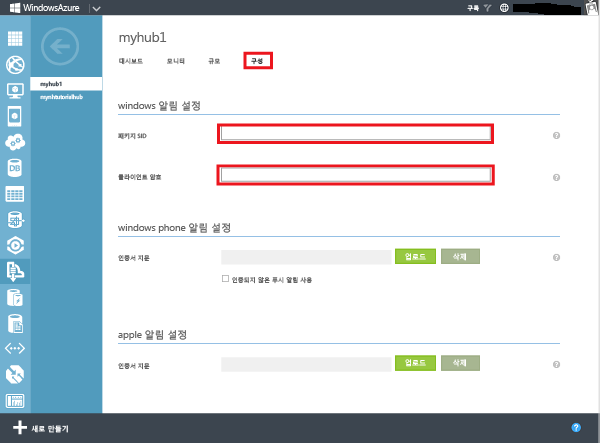

# <a name="tutorial-send-notifications-to-universal-windows-platform-apps-by-using-azure-notification-hubs"></a>자습서: Azure Notification Hubs를 사용하여 유니버설 Windows 플랫폼 앱에 알림 보내기

[!INCLUDE [notification-hubs-selector-get-started](../../includes/notification-hubs-selector-get-started.md)]

이 자습서에서는 알림 허브를 만들어 UWP(유니버설 Windows 플랫폼) 앱에 푸시 알림을 보냅니다. WNS(Windows 푸시 알림 서비스)를 사용하여 푸시 알림을 받는 새 Windows 스토어 앱을 만듭니다. 그런 다음, 알림 허브를 사용하여 앱을 실행하는 모든 디바이스로 푸시 알림을 브로드캐스트할 수 있습니다.

> [!NOTE]
> [GitHub](https://github.com/Azure/azure-notificationhubs-samples/tree/master/dotnet/GetStartedWindowsUniversal)에서 이 자습서에 대해 완료된 코드를 찾을 수 있습니다.

이 자습서에서 수행하는 단계는 다음과 같습니다.

> [!div class="checklist"]
> * Windows 스토어에서 앱 만들기
> * 알림 허브 만들기
> * 샘플 Windows 앱 만들기
> * 테스트 알림 보내기

## <a name="prerequisites"></a>필수 조건

- **Azure 구독**. Azure 구독이 아직 없는 경우 시작하기 전에 [Azure 체험 계정을 만듭니다](https://azure.microsoft.com/free/?WT.mc_id=A261C142F).
- [Microsoft Visual Studio Community 2015](https://www.visualstudio.com/products/visual-studio-community-vs) 이상 버전
- [UWP 앱 개발 도구 설치](https://msdn.microsoft.com/windows/uwp/get-started/get-set-up)
- 활성 Windows 스토어 계정

이 자습서를 완료해야 다른 모든 UWP 앱용 Notification Hubs 자습서를 진행할 수 있습니다.

## <a name="create-an-app-in-windows-store"></a>Windows 스토어에서 앱 만들기

UWP 앱으로 푸시 알림을 보내려면 앱을 Windows 스토어와 연결합니다. 그런 다음 WNS와 통합되도록 알림 허브를 구성합니다.

1. [Windows 개발자 센터](https://dev.windows.com/overview)로 이동하여 Microsoft 계정으로 로그인한 다음, **새 앱 만들기**를 선택합니다.

    
2. 앱의 이름을 입력한 다음, **제품 이름 예약**을 선택합니다. 이렇게 하면 앱을 새로 Windows 스토어에 등록하게 됩니다.

    
3. **앱 관리**를 확장하고, **WNS/MPNS**를 선택한 다음, **Live 서비스 사이트**를 선택합니다. Microsoft 계정으로 로그인 새 탭에서 **애플리케이션 등록 포털**이 열립니다. 또는 [애플리케이션 등록 포털](https://apps.dev.microsoft.com)로 직접 이동하고, 이 페이지로 이동하도록 애플리케이션 이름을 선택할 수 있습니다.

    
4. **애플리케이션 비밀** 암호 및 **패키지 SID(보안 식별자)** 를 메모해 둡니다.

    >[!WARNING]
    >애플리케이션 암호와 패키지 SID는 중요한 보안 자격 증명입니다. 다른 사람과 공유하지 말고 앱과 함께 분산하지 마세요.

## <a name="create-a-notification-hub"></a>알림 허브 만들기

[!INCLUDE [notification-hubs-portal-create-new-hub](../../includes/notification-hubs-portal-create-new-hub.md)]

### <a name="configure-wns-settings-for-the-hub"></a>허브에 대한 WNS 설정을 구성합니다.

1. **알림 설정** 범주에서 **Windows(WNS)** 를 선택합니다.
2. 이전 섹션에서 적어둔 **패키지 SID** 및 **보안 키**에 대한 값을 입력합니다.
3. 도구 모음에서 **저장**을 클릭합니다.

    

이제 알림 허브가 WNS와 작동하도록 구성됩니다. 앱을 등록하고 알림을 보내기 위한 연결 문자열이 있습니다.

## <a name="create-a-sample-windows-app"></a>샘플 Windows 앱 만들기

1. Visual Studio에서 **파일** 메뉴를 열고 **새로 만들기**를 선택한 다음, **프로젝트**를 선택합니다.
2. **새 프로젝트** 대화 상자에서 다음 단계를 완료합니다.

    1. **Visual C#** 을 확장합니다.
    2. **Windows 범용**을 선택합니다.
    3. **비어 있는 앱(유니버설 Windows)** 을 선택합니다.
    4. 프로젝트의 **이름** 을 입력합니다.
    5. **확인**을 선택합니다.

        
3. **대상** 및 **최소** 플랫폼 버전에 대한 기본값을 그대로 적용하고, **확인**을 선택합니다.
4. 솔루션 탐색기에서 Windows 스토어 앱 프로젝트를 마우스 오른쪽 단추로 클릭하고 **스토어**를 선택한 후 **응용 프로그램을 스토어에 연결...** 을 선택합니다. **응용 프로그램을 Windows 스토어에 연결** 마법사가 나타납니다.
5. 마법사에서 Microsoft 계정으로 로그인합니다.
6. 2단계에서 등록한 앱을 선택하고 **다음**을 선택한 후 **연결**을 선택합니다. 이렇게 하면 필요한 Windows 스토어 등록 정보가 애플리케이션 매니페스트에 추가됩니다.
7. Visual Studio에서 솔루션을 마우스 오른쪽 단추로 클릭한 후 **NuGet 패키지 관리**를 선택합니다. **NuGet 패키지 관리** 창이 열립니다.
8. 검색 상자에 **WindowsAzure.Messaging.Managed**를 입력하고 **설치**를 선택한 다음, 사용 약관에 동의합니다.

    ![NuGet 패키지 관리 창][20]

    이 작업은 [Microsoft.Azure.NotificationHubs NuGet 패키지](https://www.nuget.org/packages/Microsoft.Azure.NotificationHubs)를 사용하여 Windows용 Azure Notification Hubs 라이브러리를 다운로드하고, 설치하고, 참조를 추가합니다.
9. `App.xaml.cs` 프로젝트 파일을 열고 다음 명령문을 추가합니다.

    ```csharp
    using Windows.Networking.PushNotifications;
    using Microsoft.WindowsAzure.Messaging;
    using Windows.UI.Popups;
    ```

10. 프로젝트의 `App.xaml.cs` 파일에서 `App` 클래스를 찾아 다음 `InitNotificationsAsync` 메서드 정의를 추가합니다.

    ```csharp
    private async void InitNotificationsAsync()
    {
        var channel = await PushNotificationChannelManager.CreatePushNotificationChannelForApplicationAsync();

        var hub = new NotificationHub("<your hub name>", "<Your DefaultListenSharedAccessSignature connection string>");
        var result = await hub.RegisterNativeAsync(channel.Uri);

        // Displays the registration ID so you know it was successful
        if (result.RegistrationId != null)
        {
            var dialog = new MessageDialog("Registration successful: " + result.RegistrationId);
            dialog.Commands.Add(new UICommand("OK"));
            await dialog.ShowAsync();
        }
    }
    ```

    이 코드는 WNS에서 앱의 채널 URI를 검색한 후 해당 채널 URI를 알림 허브에 등록합니다.

    >[!NOTE]
    > `hub name` 자리 표시자를 Azure Portal에 표시되는 알림 허브의 이름으로 바꿉니다. 또한 연결 문자열 자리 표시자를 이전 섹션에 있는 알림 허브의 **액세스 정책** 페이지에서 가져온 `DefaultListenSharedAccessSignature` 연결 문자열로 바꿉니다.

11. `App.xaml.cs`의 `OnLaunched` 이벤트 처리기 맨 위에서 다음 호출을 새 `InitNotificationsAsync` 메서드에 추가합니다.

    ```csharp
    InitNotificationsAsync();
    ```

    이 작업은 애플리케이션이 시작될 때마다 채널 URI가 알림 허브에 등록되도록 보장합니다.

12. 앱을 실행하려면 키보드의 **F5** 키를 누릅니다. 등록 키를 포함하는 대화 상자가 표시됩니다. 대화 상자를 닫으려면 **확인**을 클릭합니다.

    

이제 앱에서 알림을 받을 수 있습니다.

## <a name="send-test-notifications"></a>테스트 알림 보내기

[Azure 포털](https://portal.azure.com/)에서 알림을 보내어 앱에서 알림 받기를 신속하게 테스트할 수 있습니다.

1. Azure Portal에서 개요 탭으로 전환하고, 도구 모음에서 **테스트 보내기**를 선택합니다.

    
2. **테스트 보내기** 창에서 다음 작업을 수행합니다.
    1. **플랫폼**에 대해 **Windows**를 선택합니다.
    2. **알림 유형**에 대해 **알림**을 선택합니다.
    3. **보내기**를 선택합니다.

        
3. 창의 맨 아래에 있는 **결과** 목록에서 보내기 작업의 결과가 표시됩니다. 경고 메시지도 표시됩니다.

    
4. 바탕 화면에 **테스트 메시지**라는 알림 메시지가 표시됩니다.

    

## <a name="next-steps"></a>다음 단계

이 자습서에서는 포털 또는 콘솔 앱을 사용하여 모든 Windows 디바이스로 브로드캐스트 알림을 보냈습니다. 특정 디바이스로 알림을 푸시하는 방법을 알아보려면 다음 자습서를 계속 진행합니다.

> [!div class="nextstepaction"]
>[특정 디바이스에 알림 푸시](
notification-hubs-windows-notification-dotnet-push-xplat-segmented-wns.md)

<!-- Images. -->
[13]: ./media/notification-hubs-windows-store-dotnet-get-started/notification-hub-create-console-app.png
[14]: ./media/notification-hubs-windows-store-dotnet-get-started/notification-hub-windows-toast.png
[19]: ./media/notification-hubs-windows-store-dotnet-get-started/notification-hub-windows-reg.png
[20]: ./media/notification-hubs-windows-store-dotnet-get-started/notification-hub-windows-universal-app-install-package.png

<!-- URLs. -->
[Use Notification Hubs to push notifications to users]: notification-hubs-aspnet-backend-windows-dotnet-wns-notification.md
[Use Notification Hubs to send breaking news]: notification-hubs-windows-notification-dotnet-push-xplat-segmented-wns.md
[toast catalog]: https://msdn.microsoft.com/library/windows/apps/hh761494.aspx
[tile catalog]: https://msdn.microsoft.com/library/windows/apps/hh761491.aspx
[badge overview]: https://msdn.microsoft.com/library/windows/apps/hh779719.aspx
