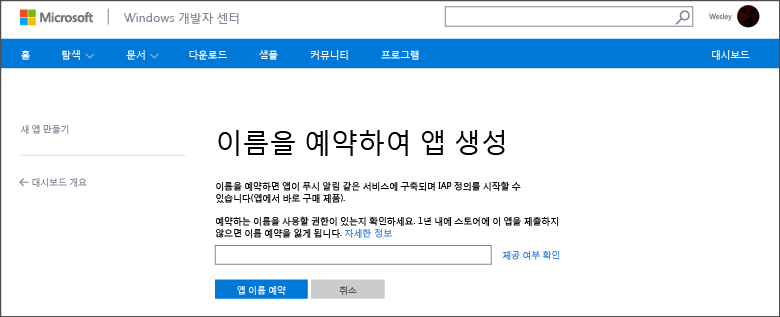
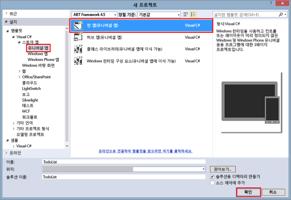
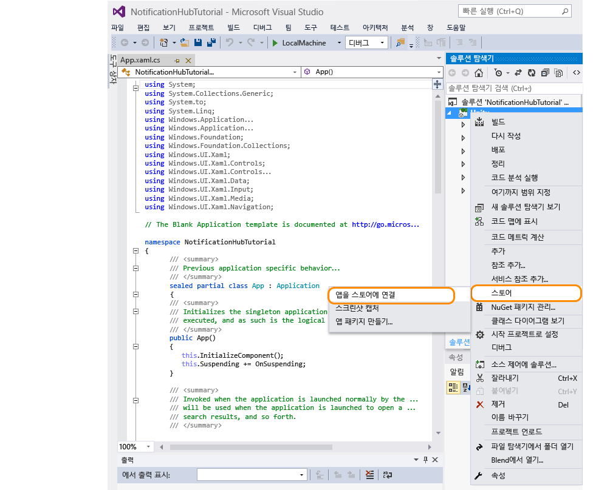
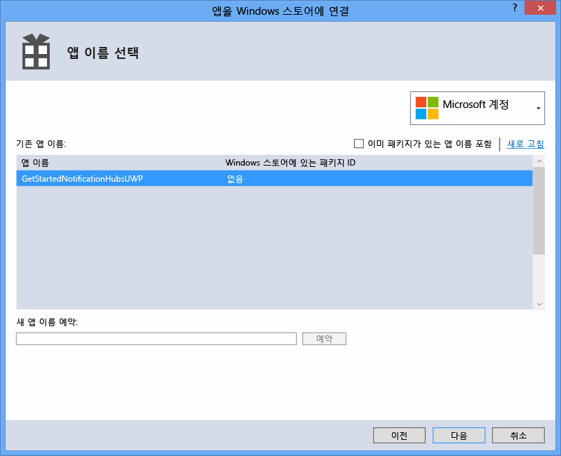
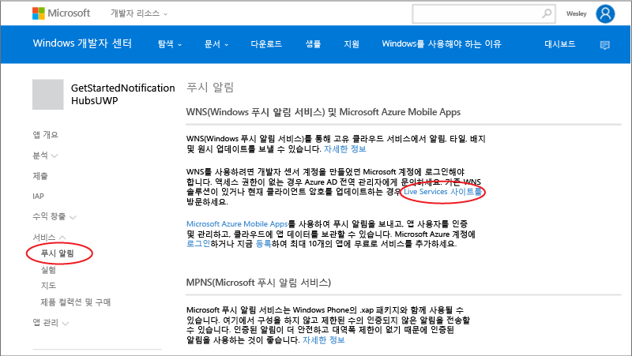
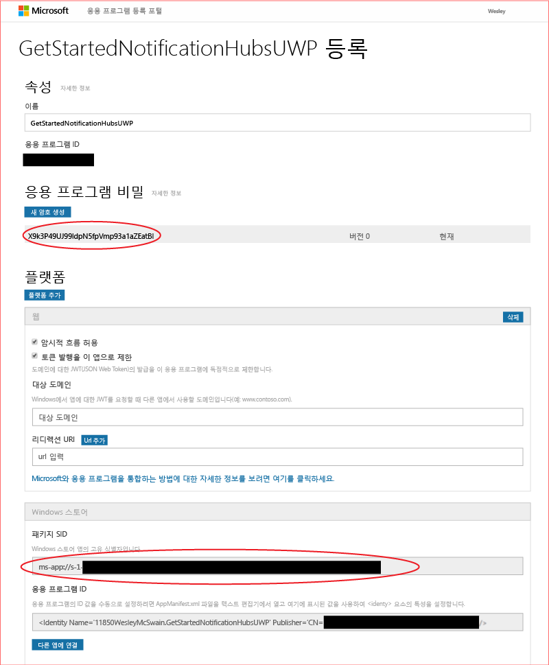

<properties
	pageTitle="Windows 유니버설 플랫폼 앱용 Azure 알림 허브 시작 | Microsoft Azure"
	description="이 자습서에서는 Azure 알림 허브를 사용하여 Windows 유니버설 플랫폼 응용 프로그램으로 알림을 푸시하는 방법을 알아봅니다."
	services="notification-hubs"
	documentationCenter="windows"
	authors="wesmc7777"
	manager="erikre"
	editor="erikre"/>

<tags
	ms.service="notification-hubs"
	ms.workload="mobile"
	ms.tgt_pltfrm="mobile-windows"
	ms.devlang="dotnet"
	ms.topic="hero-article"
	ms.date="10/03/2016"
	ms.author="wesmc"/>

# Windows 유니버설 플랫폼 앱용 알림 허브 시작

[AZURE.INCLUDE [notification-hubs-selector-get-started](../../includes/notification-hubs-selector-get-started.md)]

##개요

이 자습서에서는 Azure 알림 허브를 사용하여 UWP(유니버설 Windows 플랫폼) 앱에 푸시 알림을 보내는 방법을 보여 줍니다.

이 자습서에서는 WNS(Windows 푸시 알림 서비스)를 사용하여 푸시 알림을 받는 새 Windows 스토어 앱을 만듭니다. 완료하면 알림 허브를 사용하여 앱을 실행하는 모든 장치로 푸시 알림을 브로드캐스트할 수 있습니다.

## 시작하기 전에

[AZURE.INCLUDE [notification-hubs-hero-slug](../../includes/notification-hubs-hero-slug.md)]

이 자습서에 대해 완료된 코드는 GitHub의 [여기](https://github.com/Azure/azure-notificationhubs-samples/tree/master/dotnet/GetStartedWindowsUniversal)서 찾을 수 있습니다.

##필수 조건

이 자습서를 사용하려면 다음이 필요합니다.

+ [Microsoft Visual Studio Community 2015](https://www.visualstudio.com/products/visual-studio-community-vs) 이상 버전

+ [유니버설 Windows 앱 개발 도구 설치](https://msdn.microsoft.com/windows/uwp/get-started/get-set-up)

+ 활성 Azure 계정  계정이 없는 경우 몇 분 만에 무료 평가판 계정을 만들 수 있습니다. 자세한 내용은 [Azure 무료 평가판](https://azure.microsoft.com/pricing/free-trial/?WT.mc_id=A0E0E5C02&amp;returnurl=http%3A%2F%2Fazure.microsoft.com%2Fko-KR%2Fdocumentation%2Farticles%2Fnotification-hubs-windows-store-dotnet-get-started%2F)을 참조하세요.

+ 활성 Windows 스토어 계정

이 자습서를 완료해야 다른 모든 Windows 유니버설 플랫폼 앱용 알림 허브 자습서를 진행할 수 있습니다.

##Windows 스토어에 앱 등록

UWP 앱으로 푸시 알림을 보내려면 앱을 Windows 스토어와 연결해야 합니다. 그런 다음 WNS와 통합되도록 알림 허브를 구성해야 합니다.

1. 앱을 아직 등록하지 않은 경우 [Windows 개발자 센터](https://dev.windows.com/overview)로 이동하여 Microsoft 계정으로 로그인한 다음 **새 앱 만들기**를 클릭합니다.

2. 앱의 이름을 입력하고 **앱 이름 예약**을 클릭합니다.

   	

   	이렇게 하면 앱을 새로 Windows 스토어에 등록하게 됩니다.

3. Visual Studio에서 **비어 있는 앱** 템플릿을 사용하여 새 Visual C# 스토어 앱 프로젝트를 만들고 **확인**을 클릭합니다.

   	

4. 대상 및 최소 플랫폼 버전에 대한 기본값을 그대로 적용합니다.

5. 솔루션 탐색기에서 Windows 스토어 앱 프로젝트를 마우스 오른쪽 단추로 클릭하고 **스토어**를 클릭한 후 **응용 프로그램을 스토어에 연결...**을 클릭합니다.

   	

   	**응용 프로그램을 Windows 스토어에 연결** 마법사가 나타납니다.

6. 마법사에서 **로그인**을 클릭한 후 Microsoft 계정으로 로그인합니다.

7. 2단계에서 등록한 앱을 클릭하고 **다음**을 클릭한 후 **연결**을 클릭합니다.

   	

   	이렇게 하면 필요한 Windows 스토어 등록 정보가 응용 프로그램 매니페스트에 추가됩니다.

8. 새 앱을 위한 [Windows 개발자 센터](http://go.microsoft.com/fwlink/p/?LinkID=266582) 페이지로 돌아가 **서비스**, **푸시 알림**을 클릭한 후 **WNS(Windows 푸시 알림 서비스) 및 Microsoft Azure 모바일 앱**에서 **Live 서비스 사이트**를 클릭합니다.

   	

9. 앱에 대한 등록 페이지에서 **Windows 스토어** 플랫폼 설정에 있는 **응용 프로그램 암호** 암호 및 **패키지 SID(보안 식별자)**를 메모해 둡니다.

   	

 	> [AZURE.WARNING]
	응용 프로그램 암호와 패키지 SID는 중요한 보안 자격 증명입니다. 다른 사람과 공유하지 말고 앱과 함께 분산하지 마세요.

##알림 허브 구성

[AZURE.INCLUDE [notification-hubs-portal-create-new-hub](../../includes/notification-hubs-portal-create-new-hub.md)]

<ol start="6">
<li>
<b>Notification Services</b> 옵션 및 <b>Windows(WNS)</b> 옵션을 선택합니다. 그런 다음 <b>보안 키</b> 필드에 <b>응용 프로그램 암호</b> 암호를 입력합니다. 이전 섹션의 WNS에서 얻은 <b>패키지 SID</b> 값을 입력한 다음 <b>저장</b>을 클릭합니다.

</li>
</ol>

&emsp;&emsp;

이제 알림 허브가 WNS와 작동하도록 구성되었으며 앱을 등록하고 알림을 보내기 위한 연결 문자열이 있습니다.

##알림 허브에 앱 연결

1. Visual Studio에서 솔루션을 마우스 오른쪽 단추로 클릭한 후 **NuGet 패키지 관리**를 클릭합니다.

	그러면 **NuGet 패키지 관리** 대화 상자가 표시됩니다.

2. `WindowsAzure.Messaging.Managed`를 검색하고 **설치**를 클릭한 후 사용 약관에 동의합니다.

	![][20]

	그러면 <a href="http://nuget.org/packages/WindowsAzure.Messaging.Managed/">WindowsAzure.Messaging.Managed NuGet 패키지</a>를 사용하여 Windows용 Azure 메시징 라이브러리에 대한 참조가 다운로드, 설치 및 추가됩니다.

3. App.xaml.cs 프로젝트 파일을 열고 다음 `using` 문을 추가합니다.

        using Windows.Networking.PushNotifications;
        using Microsoft.WindowsAzure.Messaging;
		using Windows.UI.Popups;

4. 또한 App.xaml.cs에서 다음과 같은 **InitNotificationsAsync** 메서드 정의를 **App** 클래스에 추가합니다.

	    private async void InitNotificationsAsync()
        {
            var channel = await PushNotificationChannelManager.CreatePushNotificationChannelForApplicationAsync();

            var hub = new NotificationHub("< your hub name>", "<Your DefaultListenSharedAccessSignature connection string>");
			var result = await hub.RegisterNativeAsync(channel.Uri);

            // Displays the registration ID so you know it was successful
            if (result.RegistrationId != null)
            {
                var dialog = new MessageDialog("Registration successful: " + result.RegistrationId);
                dialog.Commands.Add(new UICommand("OK"));
                await dialog.ShowAsync();
            }

        }

    이 코드는 WNS에서 앱의 채널 URI를 검색한 후 해당 채널 URI를 알림 허브에 등록합니다.

    >[AZURE.NOTE] "허브 이름" 자리 표시자를 Azure 포털에 나타나는 알림 허브의 이름으로 바꿔야 합니다. 또한 연결 문자열 자리 표시자를 이전 섹션에 있는 알림 허브 **액세스 정책** 페이지에서 가져온 **DefaultListenSharedAccessSignature** 연결 문자열로 바꿉니다.

5. App.xaml.cs에서 **OnLaunched** 이벤트 처리기의 맨 위에 다음과 같은 새 **InitNotificationsAsync** 메서드 호출을 추가합니다.

        InitNotificationsAsync();

    이 코드는 응용 프로그램이 시작될 때마다 채널 URI가 알림 허브에 등록되도록 보장합니다.

6. **F5** 키를 눌러 앱을 실행합니다. 등록 키가 포함된 팝업 대화 상자가 표시됩니다.

   	![][19]

이제 앱에서 알림을 받을 수 있습니다.

##알림 보내기 

아래 화면과 같이 알림 허브의 **테스트 보내기** 단추를 사용하여 [Azure 포털](https://portal.azure.com/)에서 알림을 보내 앱의 알림 수신을 신속하게 테스트할 수 있습니다.

푸시 알림은 일반적으로 호환 라이브러리를 사용하는 모바일 서비스 또는 ASP.NET과 같은 백 엔드 서비스에서 전송됩니다. 백 엔드에 라이브러리를 사용할 수 없는 경우 직접 REST API를 사용하여 알림 메시지를 보낼 수도 있습니다.

이 자습서에서는 과정을 단순하게 유지하고 백엔드 서비스 대신 콘솔 응용 프로그램에서 알림 허브에 .NET SDK를 사용하여 알림을 보내서 클라이언트 앱의 테스트만 보여 줍니다. ASP.NET 백엔드에서 알림을 보내기 위한 다음 단계로 [알림 허브를 사용하여 사용자에게 알림을 푸시]하는 것이 좋습니다. 그러나 다음 접근 방식을 사용하여 알림을 보낼 수 있습니다.

* **REST 인터페이스**: [REST 인터페이스](http://msdn.microsoft.com/library/windowsazure/dn223264.aspx)를 사용하여 백엔드 플랫폼에서 알림을 지원할 수 있습니다.

* **Microsoft Azure 알림 허브 .NET SDK**: Visual Studio용 Nuget 패키지 관리자에서 [Install-Package Microsoft.Azure.NotificationHubs](https://www.nuget.org/packages/Microsoft.Azure.NotificationHubs/)를 실행합니다.

* **Node.js** : [Node.js에서 알림 허브 사용 방법](notification-hubs-nodejs-push-notification-tutorial.md).

* **Azure 모바일 앱**: 알림 허브와 통합된 Azure 모바일 앱에서 알림을 보내는 방법에 대한 예제는 [모바일 앱에 대한 푸시 알림 추가](../app-service-mobile/app-service-mobile-windows-store-dotnet-get-started-push.md)를 참조하세요

* **Java / PHP**: REST API를 사용하여 알림을 보내는 방법에 대한 예는 "Java/PHP에서 알림 허브를 사용하는 방법"([Java](notification-hubs-java-push-notification-tutorial.md) | [PHP](notification-hubs-php-push-notification-tutorial.md))을 참조하세요.

## (선택 사항) 콘솔 응용 프로그램에서 알림 보내기

.NET 콘솔 응용 프로그램을 사용하여 알림을 보내려면 다음 단계를 수행합니다.

1. 솔루션을 마우스 오른쪽 단추로 클릭하고, **추가** 및 **새 프로젝트...**를 선택한 후에 **Visual C#** 아래에서 **Windows** 및 **콘솔 응용 프로그램**을 클릭하고 **확인**을 클릭합니다.

   	![][13]

	새 Visual C# 콘솔 응용 프로그램이 솔루션에 추가됩니다. 별도의 솔루션에서 이 작업을 수행할 수도 있습니다.

2. Visual Studio에서 **도구**를 클릭하고 **NuGet 패키지 관리자**를 클릭한 다음 **패키지 관리자 콘솔**을 클릭합니다.

	그러면 Visual Studio에 패키지 관리자 콘솔이 표시됩니다.

3. 패키지 관리자 콘솔 창에서 **기본 프로젝트**를 새 콘솔 응용 프로그램 프로젝트로 설정한 후 콘솔 창에서 다음 명령을 실행합니다.

        Install-Package Microsoft.Azure.NotificationHubs

	그러면 <a href="http://www.nuget.org/packages/Microsoft.Azure.NotificationHubs/">Microsoft.Azure.Notification Hubs NuGet 패키지</a>를 사용하는 Azure 알림 허브 SDK에 대한 참조가 추가됩니다.

	

4. Program.cs 파일을 열고 다음 `using` 문을 추가합니다.

        using Microsoft.Azure.NotificationHubs;

5. **Program** 클래스에서 다음 메서드를 추가합니다.

        private static async void SendNotificationAsync()
        {
            NotificationHubClient hub = NotificationHubClient
				.CreateClientFromConnectionString("<connection string with full access>", "<hub name>");
            var toast = @"<toast><visual><binding template=""ToastText01""><text id=""1"">Hello from a .NET App!</text></binding></visual></toast>";
            await hub.SendWindowsNativeNotificationAsync(toast);
        }

   	"허브 이름" 자리 표시자를 Azure 포털에 나타나는 알림 허브의 이름으로 바꿔야 합니다. 또한 연결 문자열 자리 표시자를 "알림 허브 구성" 섹션에 있는 알림 허브 **액세스 정책** 페이지에서 가져온 **DefaultFullSharedAccessSignature** 연결 문자열로 바꿉니다.

	>[AZURE.NOTE]**수신 대기** 권한이 아니라 **모든** 권한을 가진 연결 문자열을 사용해야 합니다. 수신 대기 권한 문자열은 알림을 보낼 수 있는 권한이 없습니다.

6. **Main** 메서드에 다음 코드를 추가합니다.

         SendNotificationAsync();
		 Console.ReadLine();

7. Visual Studio에서 콘솔 응용 프로그램 프로젝트를 마우스 오른쪽 단추로 클릭하고 **시작 프로젝트로 설정**을 클릭하여 시작 프로젝트로 설정합니다. 그런 다음 **F5** 키를 눌러 응용 프로그램을 실행합니다.

   	![][14]

	그러면 등록된 모든 장치에 대한 알림 메시지를 수신하게 됩니다. 알림 배너를 클릭하거나 누르면 앱이 로드됩니다.

MSDN의 [알림 카탈로그], [타일 카탈로그] 및 [배지 개요] 항목에서 지원되는 모든 페이로드를 찾을 수 있습니다.

##다음 단계

이 간단한 예제에서는 포털 또는 콘솔 앱을 사용하여 모든 Windows 장치로 브로드캐스트 알림을 보냈습니다. 다음 단계로 [알림 허브를 사용하여 사용자에게 알림 푸시] 자습서를 수행하는 것이 좋습니다. 특정 사용자를 대상으로 하는 태그를 사용하여 ASP.NET 백엔드에서 알림을 보내는 방법을 보여 줍니다.

사용자를 관심 그룹별로 분할하려면 [알림 허브를 사용하여 뉴스 속보 보내기](영문)를 참조하십시오.

알림 허브에 대한 더 일반적인 정보를 알아보려면 [알림 허브 지침](notification-hubs-push-notification-overview.md)을 참조하세요.

<!-- Images. -->
[13]: ./media/notification-hubs-windows-store-dotnet-get-started/notification-hub-create-console-app.png
[14]: ./media/notification-hubs-windows-store-dotnet-get-started/notification-hub-windows-toast.png
[19]: ./media/notification-hubs-windows-store-dotnet-get-started/notification-hub-windows-reg.png
[20]: ./media/notification-hubs-windows-store-dotnet-get-started/notification-hub-windows-universal-app-install-package.png

<!-- URLs. -->

[알림 허브를 사용하여 사용자에게 알림 푸시]: notification-hubs-aspnet-backend-windows-dotnet-wns-notification.md
[알림 허브를 사용하여 사용자에게 알림을 푸시]: notification-hubs-aspnet-backend-windows-dotnet-wns-notification.md
[알림 허브를 사용하여 뉴스 속보 보내기]: notification-hubs-windows-notification-dotnet-push-xplat-segmented-wns.md

[알림 카탈로그]: http://msdn.microsoft.com/library/windows/apps/hh761494.aspx
[타일 카탈로그]: http://msdn.microsoft.com/library/windows/apps/hh761491.aspx
[배지 개요]: http://msdn.microsoft.com/library/windows/apps/hh779719.aspx

<!---HONumber=AcomDC_1005_2016-->