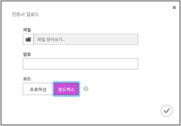
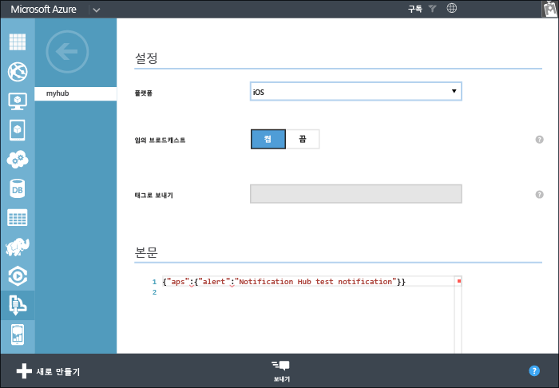

<properties
	pageTitle="Xamarin iOS 앱에 대한 알림 허브 시작 | Microsoft Azure"
	description="이 자습서에서 Azure 알림 허브를 사용하여 Xamarin iOS 응용 프로그램에 푸시 알림을 보내는 방법을 알아봅니다."
	services="notification-hubs"
	documentationCenter="xamarin"
	authors="ysxu"
	manager="dwrede"
	editor=""/>

<tags
	ms.service="notification-hubs"
	ms.workload="mobile"
	ms.tgt_pltfrm="mobile-xamarin-ios"
	ms.devlang="dotnet"
	ms.topic="hero-article"
	ms.date="10/21/2015"
	ms.author="yuaxu"/>

# 알림 허브 시작

[AZURE.INCLUDE [notification-hubs-selector-get-started](../../includes/notification-hubs-selector-get-started.md)]

##개요

이 자습서에서는 Azure 알림 허브를 사용하여 iOS 응용 프로그램에 푸시 알림을 보내는 방법을 보여 줍니다. APNS(Apple 푸시 알림 서비스)를 사용하여 푸시 알림을 받는 빈 Xamarin.iOS 앱을 만듭니다. 완료하면 알림 허브를 사용하여 앱을 실행하는 모든 장치로 푸시 알림을 브로드캐스트할 수 있습니다. 완성된 코드는 [NotificationHubs 앱][GitHub] 샘플에서 확인할 수 있습니다.

이 자습서에서는 알림 허브를 사용하는 간단한 브로드캐스트 시나리오를 보여 줍니다.

##필수 조건

이 자습서를 사용하려면 다음이 필요합니다.

+ [Xcode 6.0][Install Xcode]
+ iOS 7.0(이상) 지원 장치
+ iOS 개발자 프로그램 멤버 자격
+ [Xamarin.iOS]
+ [Azure 모바일 서비스 구성 요소]

   >[AZURE.NOTE]푸시 알림에 대한 구성 요구 사항 때문에 시뮬레이터 대신 iOS 지원 장치(iPhone 또는 iPad)에서 푸시 알림을 배포 및 테스트해야 합니다.

이 자습서를 완료해야 다른 모든 Xamarin.iOS 앱용 알림 허브 자습서를 진행할 수 있습니다.

> [AZURE.IMPORTANT]이 자습서를 완료하려면 활성 Azure 계정이 있어야 합니다. 계정이 없는 경우 몇 분 만에 무료 평가판 계정을 만들 수 있습니다. 자세한 내용은 [Azure 무료 체험](http://azure.microsoft.com/pricing/free-trial/?WT.mc_id=A643EE910&amp;returnurl=http%3A%2F%2Fazure.microsoft.com%2Fko-KR%2Fdocumentation%2Farticles%2Fpartner-xamarin-notification-hubs-ios-get-started)을 참조하세요.

[AZURE.INCLUDE [알림 허브가 Apple 푸시 알림 사용](../../includes/notification-hubs-enable-apple-push-notifications.md)]

##알림 허브 구성

이 섹션에서는 새 알림 허브를 만들고 사용자가 만든 **.p12** 푸시 알림을 사용하여 APNS로 인증을 구성하는 방법을 단계별로 안내합니다. 이미 만든 알림 허브를 사용하려는 경우 5단계로 건너뛸 수 있습니다.

[AZURE.INCLUDE [notification-hubs-portal-create-new-hub](../../includes/notification-hubs-portal-create-new-hub.md)]

<ol start="7">
<li>

위쪽의 <b>구성</b> 탭을 클릭하고 인증서 지문을 업로드하는 Apple 알림 설정에서 <b>업로드</b> 단추를 클릭합니다. 그런 다음 앞서 내보낸 <b>.p12</b> 인증서 및 인증서의 암호를 선택합니다.

개발용이므로 <b>샌드박스</b> 모드를 선택합니다. 스토어에서 앱을 구매한 사용자에게 푸시 알림을 보내려는 경우에만 <b>프로덕션</b>을 사용합니다.

</li>
</ol>
&emsp;&emsp;

&emsp;&emsp;

이제 알림 허브가 APNS과 작동하도록 구성되었으며 앱을 등록하고 알림을 보내기 위한 연결 문자열이 있습니다.

##알림 허브에 앱 연결

#### 새 프로젝트 만들기

1. Xamarin Studio에서 새 iOS 프로젝트를 만들고 **통합 API** > **단일 보기 응용 프로그램** 템플릿을 선택합니다.

   	![][31]

2. Azure 메시징 구성 요소에 대한 참조를 추가합니다. 솔루션 보기에서 프로젝트에 대한 **구성 요소** 폴더를 마우스 오른쪽 단추로 클릭하고 **구성 요소 더 가져오기**를 선택합니다. **Azure 메시징** 구성 요소를 검색하여 프로젝트에 추가합니다.

3. **AppDelegate.cs**에서 다음 using 문을 추가합니다.

    using WindowsAzure.Messaging;

4. **SBNotificationHub** 인스턴스를 선언합니다.

		private SBNotificationHub Hub { get; set; }

5. 다음 변수를 사용하여 **Constants.cs** 클래스를 만듭니다.

        // Azure app-specific connection string and hub path
        public const string ConnectionString = "<Azure connection string>";
        public const string NotificationHubPath = "<Azure hub path>";

6. **AppDelegate.cs**에서 **FinishedLaunching()**을 다음과 일치하도록 업데이트합니다.

        public override bool FinishedLaunching(UIApplication application, NSDictionary launchOptions)
        {
            UIRemoteNotificationType notificationTypes = UIRemoteNotificationType.Alert |
                UIRemoteNotificationType.Badge | UIRemoteNotificationType.Sound;
            UIApplication.SharedApplication.RegisterForRemoteNotificationTypes(notificationTypes);

            return true;
        }

7. **AppDelegate.cs**의 **RegisteredForRemoteNotifications()** 메서드를 재정의합니다.

        public override void RegisteredForRemoteNotifications(UIApplication application, NSData deviceToken)
        {
            Hub = new SBNotificationHub(Constants.ConnectionString, Constants.NotificationHubPath);

            Hub.UnregisterAllAsync (deviceToken, (error) => {
                if (error != null)
                {
                    Console.WriteLine("Error calling Unregister: {0}", error.ToString());
                    return;
                }

                NSSet tags = null; // create tags if you want
                Hub.RegisterNativeAsync(deviceToken, tags, (errorCallback) => {
                    if (errorCallback != null)
                        Console.WriteLine("RegisterNativeAsync error: " + errorCallback.ToString());
                });
            });
        }

8. **AppDelegate.cs**의 **ReceivedRemoteNotification()** 메서드를 재정의합니다.

        public override void ReceivedRemoteNotification(UIApplication application, NSDictionary userInfo)
        {
            ProcessNotification(userInfo, false);
        }

9. **AppDelegate.cs**에 다음 **ProcessNotification()** 메서드를 만듭니다.

        void ProcessNotification(NSDictionary options, bool fromFinishedLaunching)
        {
            // Check to see if the dictionary has the aps key.  This is the notification payload you would have sent
            if (null != options && options.ContainsKey(new NSString("aps")))
            {
                //Get the aps dictionary
                NSDictionary aps = options.ObjectForKey(new NSString("aps")) as NSDictionary;

                string alert = string.Empty;

                //Extract the alert text
                // NOTE: If you're using the simple alert by just specifying
                // "  aps:{alert:"alert msg here"}  ", this will work fine.
                // But if you're using a complex alert with Localization keys, etc.,
                // your "alert" object from the aps dictionary will be another NSDictionary.
                // Basically the JSON gets dumped right into a NSDictionary,
                // so keep that in mind.
                if (aps.ContainsKey(new NSString("alert")))
                    alert = (aps [new NSString("alert")] as NSString).ToString();

                //If this came from the ReceivedRemoteNotification while the app was running,
                // we of course need to manually process things like the sound, badge, and alert.
                if (!fromFinishedLaunching)
                {
                    //Manually show an alert
                    if (!string.IsNullOrEmpty(alert))
                    {
                        UIAlertView avAlert = new UIAlertView("Notification", alert, null, "OK", null);
                        avAlert.Show();
                    }
                }
            }
        }

    > [AZURE.NOTE]네트워크 연결이 없는 경우를 처리하도록 **FailedToRegisterForRemoteNotifications()**를 재정의할 수 있습니다.

10. 장치에서 앱을 실행합니다.

## 알림 보내기

아래 화면과 같이 알림 허브의 디버그 탭을 통해 Azure 포털에서 알림을 보내서 앱의 알림 수신을 테스트할 수 있습니다.

푸시 알림은 일반적으로 호환 라이브러리를 사용하는 모바일 서비스 또는 ASP.NET과 같은 백 엔드 서비스에서 전송됩니다. 백 엔드에 라이브러리를 사용할 수 없는 경우 직접 REST API를 사용하여 알림 메시지를 보낼 수도 있습니다.

이 자습서에서는 과정을 단순하게 유지하고 백엔드 서비스 대신 콘솔 응용 프로그램에서 알림 허브에 .NET SDK를 사용하여 알림을 보내서 클라이언트 앱의 테스트만 보여 줍니다. ASP.NET 백엔드에서 알림을 보내기 위한 다음 단계로 [알림 허브를 사용하여 사용자에게 알림을 푸시](notification-hubs-aspnet-backend-ios-notify-users.md)하는 것이 좋습니다. 그러나 다음 접근 방식을 사용하여 알림을 보낼 수 있습니다.

* **REST 인터페이스**: [REST 인터페이스](http://msdn.microsoft.com/library/windowsazure/dn223264.aspx)를 사용하여 백엔드 플랫폼에서 알림을 지원할 수 있습니다.

* **Microsoft Azure 알림 허브 .NET SDK**: Visual Studio용 Nuget 패키지 관리자에서 [Install-Package Microsoft.Azure.NotificationHubs](https://www.nuget.org/packages/Microsoft.Azure.NotificationHubs/)를 실행합니다.

* **Node.js** : [Node.js에서 알림 허브 사용 방법](notification-hubs-nodejs-how-to-use-notification-hubs.md).

* **Azure 모바일 서비스**: 알림 허브와 통합된 Azure 모바일 서비스 백 엔드에서 알림을 보내는 방법에 대한 예는 "모바일 서비스에서 푸시 알림 시작"([.NET 백 엔드](../mobile-services/mobile-services-javascript-backend-windows-store-dotnet-get-started-push.md) | [JavaScript backend](../mobile-services/mobile-services-javascript-backend-windows-store-dotnet-get-started-push.md))을 참조하세요.

* **Java / PHP**: REST API를 사용하여 알림을 보내는 방법에 대한 예는 "Java/PHP에서 알림 허브를 사용하는 방법"([Java](notification-hubs-java-backend-how-to.md) | [PHP](notification-hubs-php-backend-how-to.md))을 참조하세요.

####(선택 사항) .NET 콘솔 앱에서 알림 보내기

이 섹션에서는 .NET 콘솔 앱을 사용하여 알림을 보냅니다.

1. 새 Visual C# 콘솔 응용 프로그램을 만듭니다.

   	![][213]

2. Visual Studio에서 **도구**를 클릭하고 **NuGet 패키지 관리자**를 클릭한 다음 **패키지 관리자 콘솔**을 클릭합니다.

	그러면 Visual Studio에 패키지 관리자 콘솔이 표시됩니다.

3. 패키지 관리자 콘솔 창에서 **기본 프로젝트**를 새 콘솔 응용 프로그램 프로젝트로 설정한 후 콘솔 창에서 다음 명령을 실행합니다.

        Install-Package Microsoft.Azure.NotificationHubs

	그러면 <a href="http://www.nuget.org/packages/Microsoft.Azure.NotificationHubs/">Microsoft.Azure.Notification Hubs NuGet 패키지</a>를 사용하는 Azure 알림 허브 SDK에 대한 참조가 추가됩니다.

	

4. Program.cs 파일을 열고 다음 `using` 문을 추가합니다.

        using Microsoft.Azure.NotificationHubs;

3. `Program` 클래스에 다음 메서드를 추가합니다.

        private static async void SendNotificationAsync()
        {
            NotificationHubClient hub = NotificationHubClient.CreateClientFromConnectionString("<connection string with full access>", "<hub name>");
            var alert = "{"aps":{"alert":"Hello from .NET!"}}";
            await hub.SendAppleNativeNotificationAsync(alert);
        }

4. `Main` 메서드에 다음 줄을 추가합니다.

         SendNotificationAsync();
		 Console.ReadLine();

5. F5 키를 눌러 앱을 실행합니다. 장치에 대한 경고를 받게 됩니다. Wi-Fi를 사용하는 경우 연결에 문제가 없는지 확인하세요.

Apple [Local and Push Notification Programming Guide]에서 가능한 모든 페이로드를 찾아볼 수 있습니다.

####(선택 사항) 모바일 서비스에서 알림 보내기

이 섹션에서는 노드 스크립트를 통해 모바일 서비스를 사용하여 알림을 보냅니다.

모바일 서비스를 사용하여 알림을 보내려면 [모바일 서비스 시작]을 따른 후 다음을 수행하세요.

1. [Azure 포털]에 로그인하고 모바일 서비스를 선택합니다.

2. 맨 위에 있는 **스케줄러** 탭을 선택합니다.

   	![][215]

3. 새 예약된 작업을 만들고 이름을 삽입한 후 **요청 시**를 선택합니다.

   	![][216]

4. 작업이 만들어졌으면 작업 이름을 클릭합니다. 그런 다음 위쪽 막대에서 **스크립트** 탭을 클릭합니다.

5. 스케줄러 함수 내에 다음 스크립트를 삽입합니다. 자리 표시자를 알림 허브 이름과 앞에서 얻은 *DefaultFullSharedAccessSignature*의 연결 문자열로 바꿔야 합니다. **저장**을 클릭합니다.

		var azure = require('azure');
		var notificationHubService = azure.createNotificationHubService('<Hubname>', '<SAS Full access >');
		notificationHubService.apns.send(
	    	null,
    		{"aps":
        		{
          		"alert": "Hello from Mobile Services!"
        		}
    		},
    		function (error)
    		{
	        	if (!error) {
    	        	console.warn("Notification successful");
        		}
    		}
		);

6. 아래쪽 막대에서 **한 번 실행**을 클릭합니다. 장치에 대한 경고를 받게 됩니다.

##다음 단계

이 간단한 예제에서는 모든 iOS 장치로 알림을 브로드캐스트합니다. 특정 사용자를 대상으로 하려면 [알림 허브를 사용하여 사용자에게 알림 푸시](영문) 자습서를 참조하세요. 사용자를 관심 그룹별로 분할하려면 [알림 허브를 사용하여 뉴스 속보 보내기](영문)를 참조하세요. 알림 허브 사용 방법에 대해 자세히 알아보려면 [알림 허브 지침] 및 [iOS용 알림 허브 방법]을 참조하세요.

<!-- Images. -->

[213]: ./media/partner-xamarin-notification-hubs-ios-get-started/notification-hub-create-console-app.png

[215]: ./media/partner-xamarin-notification-hubs-ios-get-started/notification-hub-scheduler1.png
[216]: ./media/partner-xamarin-notification-hubs-ios-get-started/notification-hub-scheduler2.png

[31]: ./media/partner-xamarin-notification-hubs-ios-get-started/notification-hub-create-ios-app.png

<!-- URLs. -->
[Mobile Services iOS SDK]: http://go.microsoft.com/fwLink/?LinkID=266533
[Submit an app page]: http://go.microsoft.com/fwlink/p/?LinkID=266582
[My Applications]: http://go.microsoft.com/fwlink/p/?LinkId=262039
[Live SDK for Windows]: http://go.microsoft.com/fwlink/p/?LinkId=262253

[모바일 서비스 시작]: /develop/mobile/tutorials/get-started-xamarin-ios
[Azure 포털]: https://manage.windowsazure.com/
[알림 허브 지침]: http://msdn.microsoft.com/library/jj927170.aspx
[iOS용 알림 허브 방법]: http://msdn.microsoft.com/library/jj927168.aspx
[Install Xcode]: https://go.microsoft.com/fwLink/p/?LinkID=266532
[iOS Provisioning Portal]: http://go.microsoft.com/fwlink/p/?LinkId=272456

[알림 허브를 사용하여 사용자에게 알림 푸시]: /manage/services/notification-hubs/notify-users-aspnet
[알림 허브를 사용하여 뉴스 속보 보내기]: /manage/services/notification-hubs/breaking-news-dotnet

[Local and Push Notification Programming Guide]: http://developer.apple.com/library/mac/#documentation/NetworkingInternet/Conceptual/RemoteNotificationsPG/Chapters/ApplePushService.html#//apple_ref/doc/uid/TP40008194-CH100-SW1
[Apple Push Notification Service]: http://go.microsoft.com/fwlink/p/?LinkId=272584

[Azure 모바일 서비스 구성 요소]: http://components.xamarin.com/view/azure-mobile-services/
[GitHub]: http://go.microsoft.com/fwlink/p/?LinkId=331329
[Xamarin.iOS]: http://xamarin.com/download
[WindowsAzure.Messaging]: https://github.com/infosupport/WindowsAzure.Messaging.iOS

<!---HONumber=Oct15_HO4-->