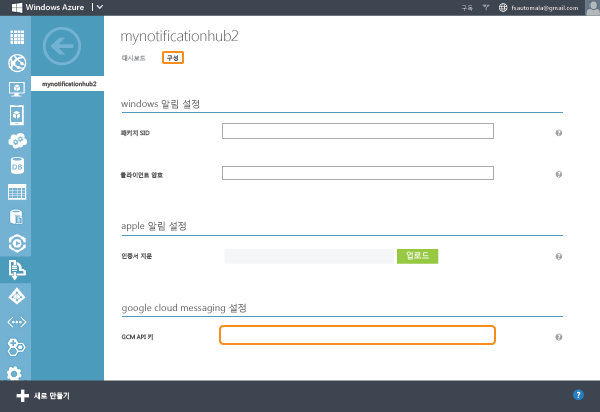
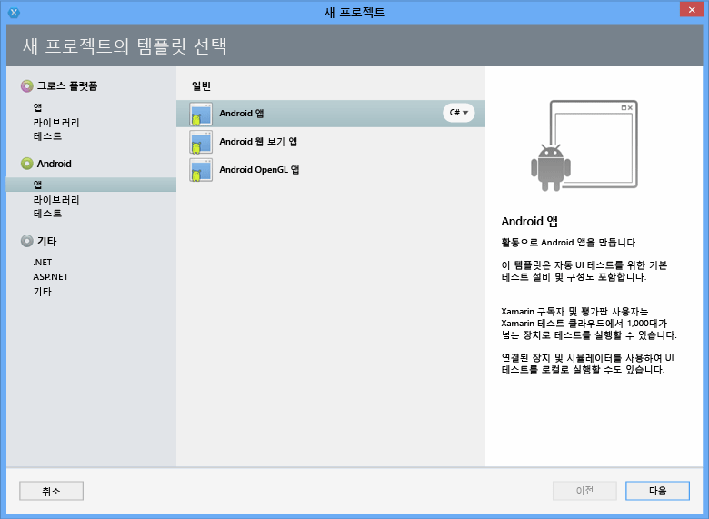
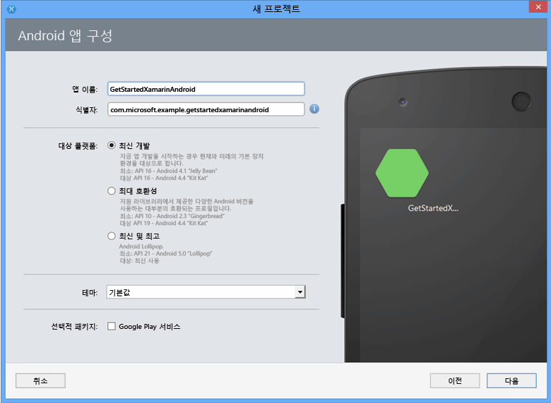
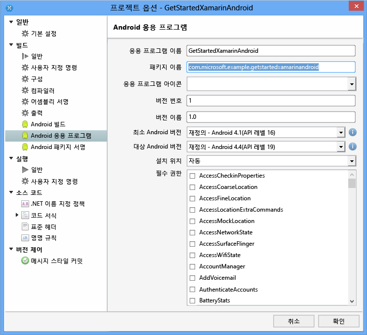

# Android용 Xamarin을 통해 알림 허브 시작
[!INCLUDE [notification-hubs-selector-get-started](../../includes/notification-hubs-selector-get-started.md)]

## 개요
이 자습서에서는 Azure 알림 허브를 사용하여 Xamarin.Android 응용 프로그램에 푸시 알림을 보내는 방법을 보여 줍니다. GCM(Google Cloud Messaging)을 사용하여 푸시 알림을 받는 빈 Xamarin.Android 앱을 만듭니다. 완료하면 알림 허브를 사용하여 앱을 실행하는 모든 장치로 푸시 알림을 브로드캐스트할 수 있습니다. 완성된 코드는 [NotificationHubs 앱][GitHub] 샘플에서 사용할 수 있습니다.

이 자습서에서는 알림 허브를 사용하는 간단한 브로드캐스트 시나리오를 보여 줍니다.

## 시작하기 전에
[!INCLUDE [notification-hubs-hero-slug](../../includes/notification-hubs-hero-slug.md)]

이 자습서에 대해 완료된 코드는 GitHub의 [여기](https://github.com/Azure/azure-notificationhubs-samples/tree/master/dotnet/Xamarin/GetStartedXamarinAndroid)서 찾을 수 있습니다.

## 필수 조건
이 자습서를 사용하려면 다음이 필요합니다.

* Windows의 Xamarin이 포함된 Visual Studio 또는 Mac OS X의 Xamarin Studio. 전체 설치 지침은 [Visual Studio 및 Xamarin을 위한 설정 및 설치](https://msdn.microsoft.com/library/mt613162.aspx)에 있습니다.
* 활성 Google 계정
* [Azure 메시징 구성 요소]
* [Google Cloud Messaging 클라이언트 구성 요소]

이 자습서를 완료해야 다른 모든 Xamarin.Android 앱용 알림 허브 자습서를 진행할 수 있습니다.

> [!IMPORTANT]
> 이 자습서를 완료하려면 활성 Azure 계정이 있어야 합니다. 계정이 없는 경우 몇 분 만에 평가판 계정을 만들 수 있습니다. 자세한 내용은 [Azure 무료 체험](https://azure.microsoft.com/pricing/free-trial/?WT.mc_id=A9C9624B5&amp;returnurl=http%3A%2F%2Fazure.microsoft.com%2Fen-us%2Fdocumentation%2Farticles%2Fpartner-xamarin-notification-hubs-android-get-started%2F)을 참조하세요.
> 
> 

## Google Cloud Messaging 사용
[!INCLUDE [mobile-services-enable-Google-cloud-messaging](../../includes/mobile-services-enable-google-cloud-messaging.md)]

## 알림 허브 구성
[!INCLUDE [notification-hubs-portal-create-new-hub](../../includes/notification-hubs-portal-create-new-hub.md)]

<ol start="5">

<li>
맨 위에 있는 <b>구성</b> 탭을 선택하고 이전 섹션에서 받은 <b>API 키</b> 값을 입력한 후 <b>저장</b>을 선택합니다.

</li>
</ol>
&emsp;&emsp;

이제 알림 허브가 GCM과 작동하도록 구성되었으며 알림을 받고 푸시 알림을 보내도록 앱을 등록하기 위한 연결 문자열이 있습니다.

## 알림 허브에 앱 연결
먼저 새 프로젝트를 만듭니다.
1. Xamarin Studio에서 **새 솔루션** > **Android 앱**을 선택한 후 **다음**을 선택합니다.
   
      

2. **앱 이름**과 **식별자**를 입력합니다. 지원하려는 **대상 플랫폼**, **다음**, **만들기**를 차례로 선택합니다.
   
      

    그러면 새 Android 프로젝트가 만들어집니다.

3. 솔루션 보기에서 새 프로젝트를 마우스 오른쪽 단추로 클릭하고 **옵션**를 선택하여 프로젝트 속성을 엽니다. **Build** 섹션에서 **Android Application** 항목을 선택합니다.
   
    **Package name** 의 첫 문자는 소문자여야 합니다.
   
   > [!IMPORTANT]
   > 패키지 이름의 첫 문자는 소문자여야 합니다. 그렇지 않으면 아래에서 푸시 알림에 대한 **BroadcastReceiver** 및 **IntentFilter**를 등록할 때 응용 프로그램 매니페스트 오류가 표시됩니다.
   > 
   > 
   
      
4. 또는 **최소 Android 버전** 을 다른 API 수준으로 설정합니다.
5. **대상 Android 버전** 을 대상으로 지정할 다른 API 버전으로 설정합니다(API 수준 8 이상이어야 함).
6. **확인**을 선택하고 프로젝트 옵션 대화 상자를 닫습니다.

### 프로젝트에 필요한 구성 요소 추가
Xamarin Component Store에서 제공되는 Google Cloud Messaging 클라이언트는 Xamarin.Android에서 푸시 알림을 지원하는 프로세스를 간소화합니다.

1. Xamarin.Android 앱에서 구성 요소 폴더를 마우스 오른쪽 단추로 클릭하고 **구성 요소 더 가져오기**를 선택합니다.
2. **Azure 메시징** 구성 요소를 검색하고 프로젝트에 구성 요소를 추가합니다.
3. **Google Cloud Messaging 클라이언트** 구성 요소를 검색하고 프로젝트에 구성 요소를 추가합니다.

### 프로젝트에서 알림 허브 설정
1. Android 앱 및 알림 허브에 대해 다음 정보를 수집합니다.
   
   * **GoogleProjectNumber**: Google 개발자 포털의 앱 개요에서 이 프로젝트의 번호 값을 가져옵니다. 앞서 포털에서 앱을 생성할 때 이 값을 기입해 두었습니다.
   * **연결 문자열 수신 대기**: [Azure 클래식 포털]의 대시보드에서 **연결 문자열 보기**를 선택합니다. 이 값에 대해 *DefaultListenSharedAccessSignature* 연결 문자열을 복사합니다.
   * **허브 이름**: [Azure 클래식 포털]에서 허브의 이름입니다. 예를 들어 *mynotificationhub2*입니다.
     
2. Xamarin 프로젝트에 대해 **Constants.cs** 클래스를 만들고 클래스에 다음 상수 값을 정의합니다. 자리 표시자는 해당 값으로 바꿉니다.
     
        public static class Constants
        {
     
           public const string SenderID = "<GoogleProjectNumber>"; // Google API Project Number
           public const string ListenConnectionString = "<Listen connection string>";
           public const string NotificationHubName = "<hub name>";
        }
3. **MainActivity.cs**에 다음 using 문을 추가합니다.
   
        using Android.Util;
        using Gcm.Client;
4. 앱 실행 중에 경고 대화 상자를 표시하는 데 사용할 `MainActivity` 클래스에 인스턴스 변수를 추가합니다.
   
        public static MainActivity instance;
5. **MainActivity** 클래스에 다음 메서드를 만듭니다.
   
        private void RegisterWithGCM()
        {
            // Check to ensure everything's set up right
            GcmClient.CheckDevice(this);
            GcmClient.CheckManifest(this);
   
            // Register for push notifications
            Log.Info("MainActivity", "Registering...");
            GcmClient.Register(this, Constants.SenderID);
        }
6. **MainActivity.cs**의 `OnCreate` 메서드에서 `instance` 변수를 초기화하고 `RegisterWithGCM`에 호출을 추가합니다.
   
        protected override void OnCreate (Bundle bundle)
        {
            instance = this;
   
            base.OnCreate (bundle);
   
            // Set your view from the "main" layout resource
            SetContentView (Resource.Layout.Main);
   
            // Get your button from the layout resource,
            // and attach an event to it
            Button button = FindViewById<Button> (Resource.Id.myButton);
   
            RegisterWithGCM();
        }
7. **MyBroadcastReceiver**라는 새 클래스를 만듭니다.
   
   > [!NOTE]
   > 아래에서 **BroadcastReceiver** 클래스를 처음부터 만드는 과정을 설명합니다. 그러나 수동으로 **MyBroadcastReceiver.cs**를 만드는 대신 [NotificationHubs 샘플][GitHub]에 포함된 샘플 Xamarin.Android 프로젝트에 있는 **GcmService.cs** 파일을 참조하면 더 빠르게 만들 수 있습니다. 또한 **GcmService.cs** 를 복제하고 클래스 이름을 변경하면 빨리 시작할 수 있습니다.
   > 
   > 
8. 다음 using 문을 **MyBroadcastReceiver.cs** 에 추가합니다.(앞에서 만든 구성 요소 및 어셈블리 참조)
   
        using System.Collections.Generic;
        using System.Text;
        using Android.App;
        using Android.Content;
        using Android.Util;
        using Gcm.Client;
        using WindowsAzure.Messaging;
9. **MyBroadcastReceiver.cs**에서 **using** 문과 **namespace** 선언 사이에 다음 사용 권한 요청을 추가합니다.
   
        [assembly: Permission(Name = "@PACKAGE_NAME@.permission.C2D_MESSAGE")]
        [assembly: UsesPermission(Name = "@PACKAGE_NAME@.permission.C2D_MESSAGE")]
        [assembly: UsesPermission(Name = "com.google.android.c2dm.permission.RECEIVE")]
   
        //GET_ACCOUNTS is needed only for Android versions 4.0.3 and below
        [assembly: UsesPermission(Name = "android.permission.GET_ACCOUNTS")]
        [assembly: UsesPermission(Name = "android.permission.INTERNET")]
        [assembly: UsesPermission(Name = "android.permission.WAKE_LOCK")]
10. **MyBroadcastReceiver.cs**에서 **MyBroadcastReceiver** 클래스를 다음과 일치하도록 변경합니다.
   
        [BroadcastReceiver(Permission=Gcm.Client.Constants.PERMISSION_GCM_INTENTS)]
        [IntentFilter(new string[] { Gcm.Client.Constants.INTENT_FROM_GCM_MESSAGE },
            Categories = new string[] { "@PACKAGE_NAME@" })]
        [IntentFilter(new string[] { Gcm.Client.Constants.INTENT_FROM_GCM_REGISTRATION_CALLBACK },
            Categories = new string[] { "@PACKAGE_NAME@" })]
        [IntentFilter(new string[] { Gcm.Client.Constants.INTENT_FROM_GCM_LIBRARY_RETRY },
            Categories = new string[] { "@PACKAGE_NAME@" })]
        public class MyBroadcastReceiver : GcmBroadcastReceiverBase<PushHandlerService>
        {
            public static string[] SENDER_IDS = new string[] { Constants.SenderID };
   
            public const string TAG = "MyBroadcastReceiver-GCM";
        }
11. **MyBroadcastReceiver.cs**에서 **GcmServiceBase**에서 파생된 **PushHandlerService** 클래스를 추가합니다. 클래스에 **Service** 특성을 적용해야 합니다.
    
         [Service] // Must use the service tag
         public class PushHandlerService : GcmServiceBase
         {
             public static string RegistrationID { get; private set; }
             private NotificationHub Hub { get; set; }
    
             public PushHandlerService() : base(Constants.SenderID)
                {
                 Log.Info(MyBroadcastReceiver.TAG, "PushHandlerService() constructor");
             }
         }
12. **GcmServiceBase**는 **OnRegistered()**, **OnUnRegistered()**, **OnMessage()**, **OnRecoverableError()** 및 **OnError()** 메서드를 구현합니다. **PushHandlerService** 구현 클래스는 이러한 메서드를 재정의해야 하며, 해당 메서드는 알림 허브와 상호 작용에 대한 응답으로 발생합니다.
13. **PushHandlerService**의 **OnRegistered()** 메서드를 다음 코드로 재정의합니다.
    
         protected override void OnRegistered(Context context, string registrationId)
         {
             Log.Verbose(MyBroadcastReceiver.TAG, "GCM Registered: " + registrationId);
             RegistrationID = registrationId;
    
             createNotification("PushHandlerService-GCM Registered...",
                                 "The device has been Registered!");
    
             Hub = new NotificationHub(Constants.NotificationHubName, Constants.ListenConnectionString,
                                         context);
             try
             {
                 Hub.UnregisterAll(registrationId);
             }
             catch (Exception ex)
             {
                 Log.Error(MyBroadcastReceiver.TAG, ex.Message);
             }
    
             //var tags = new List<string>() { "falcons" }; // create tags if you want
             var tags = new List<string>() {};
    
             try
             {
                 var hubRegistration = Hub.Register(registrationId, tags.ToArray());
             }
             catch (Exception ex)
             {
                 Log.Error(MyBroadcastReceiver.TAG, ex.Message);
             }
         }
    
    > [!NOTE]
    > 위의 **OnRegistered()** 코드에서 태그를 지정하여 특정 메시징 채널에 등록하는 기능을 확인해야 합니다.
    > 
    > 
14. 다음 코드를 사용하여 **PushHandlerService**의 **OnMessage** 메서드를 재정의합니다.
    
        protected override void OnMessage(Context context, Intent intent)
        {
            Log.Info(MyBroadcastReceiver.TAG, "GCM Message Received!");
    
            var msg = new StringBuilder();
    
            if (intent != null && intent.Extras != null)
            {
                foreach (var key in intent.Extras.KeySet())
                    msg.AppendLine(key + "=" + intent.Extras.Get(key).ToString());
            }
    
            string messageText = intent.Extras.GetString("message");
            if (!string.IsNullOrEmpty (messageText))
            {
                createNotification ("New hub message!", messageText);
            }
            else
            {
                createNotification ("Unknown message details", msg.ToString ());
            }
        }
15. 알림이 수신되면 사용자에게 알리도록 다음 **createNotification** 및 **dialogNotify** 메서드를 **PushHandlerService**에 추가합니다.
    
    > [!NOTE]
    > Android 버전 5.0 이후의 알림 설계는 이전 버전과 상당한 차이가 있습니다. Android 5.0에서 이를 테스트할 때는 알림 수신을 위해 앱을 실행해야 합니다. 자세한 내용은 [Android 알림](http://go.microsoft.com/fwlink/?LinkId=615880)을 참조하세요.
    > 
    > 
    
        void createNotification(string title, string desc)
        {
            //Create notification
            var notificationManager = GetSystemService(Context.NotificationService) as NotificationManager;
    
            //Create an intent to show UI
            var uiIntent = new Intent(this, typeof(MainActivity));
    
            //Create the notification
            var notification = new Notification(Android.Resource.Drawable.SymActionEmail, title);
    
            //Auto-cancel will remove the notification once the user touches it
            notification.Flags = NotificationFlags.AutoCancel;
    
            //Set the notification info
            //we use the pending intent, passing our ui intent over, which will get called
            //when the notification is tapped.
            notification.SetLatestEventInfo(this, title, desc, PendingIntent.GetActivity(this, 0, uiIntent, 0));
    
            //Show the notification
            notificationManager.Notify(1, notification);
            dialogNotify (title, desc);
        }
    
        protected void dialogNotify(String title, String message)
        {
    
            MainActivity.instance.RunOnUiThread(() => {
                AlertDialog.Builder dlg = new AlertDialog.Builder(MainActivity.instance);
                AlertDialog alert = dlg.Create();
                alert.SetTitle(title);
                alert.SetButton("Ok", delegate {
                    alert.Dismiss();
                });
                alert.SetMessage(message);
                alert.Show();
            });
        }
16. 코드가 컴파일되도록 추상 멤버 **OnUnRegistered()**, **OnRecoverableError()** 및 **OnError()**를 재정의합니다.
    
        protected override void OnUnRegistered(Context context, string registrationId)
        {
            Log.Verbose(MyBroadcastReceiver.TAG, "GCM Unregistered: " + registrationId);
    
            createNotification("GCM Unregistered...", "The device has been unregistered!");
        }
    
        protected override bool OnRecoverableError(Context context, string errorId)
        {
            Log.Warn(MyBroadcastReceiver.TAG, "Recoverable Error: " + errorId);
    
            return base.OnRecoverableError (context, errorId);
        }
    
        protected override void OnError(Context context, string errorId)
        {
            Log.Error(MyBroadcastReceiver.TAG, "GCM Error: " + errorId);
        }

## 에뮬레이터에서 앱 실행
에뮬레이터에서 이 앱을 실행하는 경우 Google API를 지원하는 AVD(Android Virtual Device)를 사용해야 합니다.

> [!IMPORTANT]
> 푸시 알림을 받으려면 Android 가상 장치에서 Google 계정을 설정해야 합니다. (에뮬레이터에서 **설정**으로 이동하고 **계정 추가**를 선택합니다.) 에뮬레이터가 인터넷에 연결되어 있어야 합니다.
> 
> [!NOTE]
> Android 버전 5.0 이후의 알림 설계는 이전 버전과 상당한 차이가 있습니다. 자세한 내용은 [Android 알림](http://go.microsoft.com/fwlink/?LinkId=615880)을 참조하세요.
> 
> 

1. **도구**에서 **Android Emulator Manager 열기**를 선택하고 해당 장치를 선택한 후 **편집**을 선택합니다.
   
      ![][18]
2. **대상**에서 **Google API**를 선택하고 **확인**을 선택합니다.
   
      ![][19]
3. 위쪽 도구 모음에서 **실행**을 선택하고 앱을 선택합니다. 에뮬레이터가 시작되고 앱이 실행됩니다.
   
   앱이 GCM에서 *registrationId* 를 검색하고 알림 허브에 등록됩니다.

## 백 엔드에서 알림 보내기
아래 화면과 같이 알림 허브의 디버그 탭을 통해 [Azure 클래식 포털] 에서 알림을 보내서 앱의 알림 수신을 테스트할 수 있습니다.

![][30]

푸시 알림은 일반적으로 호환 라이브러리를 통해 모바일 서비스 또는 ASP.NET과 같은 백 엔드 서비스에서 전송됩니다. 백 엔드에 라이브러리를 사용할 수 없는 경우 직접 REST API를 사용하여 알림 메시지를 보낼 수도 있습니다.

알림을 보내기 위해 검토할 수 있는 다른 자습서 목록은 다음과 같습니다.

* ASP.NET: [알림 허브를 사용하여 사용자에게 알림 푸시]를 참조하세요.
* Azure 알림 허브 Java SDK: Java에서 알림을 보내는 방법은 [Java에서 알림 허브를 사용하는 방법](notification-hubs-java-push-notification-tutorial.md) 을 참조하세요. 이는 Eclipse for Android Development에서 테스트되었습니다.
* PHP: [PHP에서 알림 허브를 사용하는 방법](notification-hubs-php-push-notification-tutorial.md)을 참조하세요.

이 자습서의 다음 부분에서는 .NET 콘솔 앱을 사용하고 노드 스크립트를 통해 모바일 서비스를 사용하여 알림을 보냅니다.

#### (선택 사항) .NET 앱을 사용하여 알림 보내기
이 섹션에서는 .NET 콘솔 앱을 사용하여 알림을 보냅니다.

1. 새 Visual C# 콘솔 응용 프로그램을 만듭니다.
   
      ![][20]
2. Visual Studio에서 **도구** > **NuGet 패키지 관리자**를 선택한 다음 **패키지 관리자 콘솔**을 선택합니다.
   
    그러면 Visual Studio에 패키지 관리자 콘솔이 표시됩니다.
3. 패키지 관리자 콘솔 창에서 **기본 프로젝트**를 새 콘솔 응용 프로그램 프로젝트로 설정한 후 콘솔 창에서 다음 명령을 실행합니다.
   
        Install-Package Microsoft.Azure.NotificationHubs
   
    그러면 <a href="http://www.nuget.org/packages/Microsoft.Azure.NotificationHubs/">Microsoft.Azure.Notification Hubs NuGet 패키지</a>를 사용하는 Azure Notification Hubs SDK에 대한 참조가 추가됩니다.
   
    
4. Program.cs 파일을 열고 다음 `using` 문을 추가합니다.
   
        using Microsoft.Azure.NotificationHubs;
5. `Program` 클래스에 다음 메서드를 추가합니다. 자리 표시자 텍스트를 *DefaultFullSharedAccessSignature* 연결 문자열과 [Azure 클래식 포털]의 허브 이름을 사용하여 업데이트합니다.
   
        private static async void SendNotificationAsync()
        {
            NotificationHubClient hub = NotificationHubClient.CreateClientFromConnectionString("<connection string with full access>", "<hub name>");
            await hub.SendGcmNativeNotificationAsync("{ \"data\" : {\"message\":\"Hello from Azure!\"}}");
        }
6. **Main** 메서드에 다음 줄을 추가합니다.
   
         SendNotificationAsync();
         Console.ReadLine();
7. F5 키를 눌러 앱을 실행합니다. 그러면 앱에서 알림을 받게 됩니다.
   
      ![][21]

#### (선택 사항) 모바일 서비스를 사용하여 알림 보내기
1. [모바일 서비스 시작]을 수행합니다.
2. [Azure 클래식 포털]에 로그인하고 모바일 서비스를 선택합니다.
3. 맨 위에 있는 **스케줄러** 탭을 선택합니다.
   
      ![][22]
4. 새 예약된 작업을 만들고 이름을 삽입한 후 **요청 시**를 선택합니다.
   
      ![][23]
5. 작업이 만들어졌으면 작업 이름을 선택합니다. 그런 다음 위쪽 표시줄에서 **스크립트** 탭을 선택합니다.
6. 스케줄러 함수 내에 다음 스크립트를 삽입합니다. 자리 표시자를 알림 허브 이름과 앞에서 얻은 *DefaultFullSharedAccessSignature* 의 연결 문자열로 바꿔야 합니다. **저장**을 선택합니다.
   
        var azure = require('azure');
        var notificationHubService = azure.createNotificationHubService('<hub name>', '<connection string>');
        notificationHubService.gcm.send(null,'{"data":{"message" : "Hello from Mobile Services!"}}',
          function (error)
          {
            if (!error) {
               console.warn("Notification successful");
            }
            else
            {
              console.warn("Notification failed" + error);
            }
          }
        );
7. 아래쪽 표시줄에서 **한 번 실행**을 선택합니다. 그러면 알림 메시지가 수신되어야 합니다.

## 다음 단계
이 간단한 예제에서는 모든 Android 장치로 알림을 브로드캐스트합니다. 특정 사용자를 대상으로 하려면 [알림 허브를 사용하여 사용자에게 알림 푸시](영문) 자습서를 참조하세요. 사용자를 관심 그룹별로 분할하려면 [알림 허브를 사용하여 뉴스 속보 보내기](영문)를 참조하세요. 알림 허브 사용 방법에 대해 자세히 알아보려면 [알림 허브 지침] 및 [Android용 알림 허브 방법]을 참조하세요.

<!-- Anchors. -->
[Enable Google Cloud Messaging]: #register
[Configure your Notification Hub]: #configure-hub
[Connecting your app to the Notification Hub]: #connecting-app
[Run your app with the emulator]: #run-app
[Send notifications from your back-end]: #send
[Next steps]:#next-steps

<!-- Images. -->

[11]: ./media/partner-xamarin-notification-hubs-android-get-started/notification-hub-configure-android.png

[13]: ./media/partner-xamarin-notification-hubs-android-get-started/notification-hub-create-xamarin-android-app1.png
[15]: ./media/partner-xamarin-notification-hubs-android-get-started/notification-hub-create-xamarin-android-app3.png

[18]: ./media/partner-xamarin-notification-hubs-android-get-started/notification-hub-create-android-app7.png
[19]: ./media/partner-xamarin-notification-hubs-android-get-started/notification-hub-create-android-app8.png

[20]: ./media/partner-xamarin-notification-hubs-android-get-started/notification-hub-create-console-app.png
[21]: ./media/partner-xamarin-notification-hubs-android-get-started/notification-hub-android-toast.png
[22]: ./media/partner-xamarin-notification-hubs-android-get-started/notification-hub-scheduler1.png
[23]: ./media/partner-xamarin-notification-hubs-android-get-started/notification-hub-scheduler2.png

[30]: ./media/partner-xamarin-notification-hubs-android-get-started/notification-hubs-debug-hub-gcm.png

<!-- URLs. -->
[Submit an app page]: http://go.microsoft.com/fwlink/p/?LinkID=266582
[My Applications]: http://go.microsoft.com/fwlink/p/?LinkId=262039
[Live SDK for Windows]: http://go.microsoft.com/fwlink/p/?LinkId=262253
[모바일 서비스 시작]: /develop/mobile/tutorials/get-started-xamarin-android/#create-new-service
[JavaScript and HTML]: /develop/mobile/tutorials/get-started-with-push-js

[Azure 클래식 포털]: https://manage.windowsazure.com/
[wns object]: http://go.microsoft.com/fwlink/p/?LinkId=260591
[알림 허브 지침]: http://msdn.microsoft.com/library/jj927170.aspx
[Android용 알림 허브 방법]: http://msdn.microsoft.com/library/dn282661.aspx

[알림 허브를 사용하여 사용자에게 알림 푸시]: /manage/services/notification-hubs/notify-users-aspnet
[알림 허브를 사용하여 뉴스 속보 보내기]: /manage/services/notification-hubs/breaking-news-dotnet
[GCMClient Component page]: http://components.xamarin.com/view/GCMClient
[Xamarin.NotificationHub GitHub page]: https://github.com/SaschaDittmann/Xamarin.NotificationHub
[GitHub]: http://go.microsoft.com/fwlink/p/?LinkId=331329
[Google Cloud Messaging 클라이언트 구성 요소]: http://components.xamarin.com/view/GCMClient/
[Azure 메시징 구성 요소]: http://components.xamarin.com/view/azure-messaging
