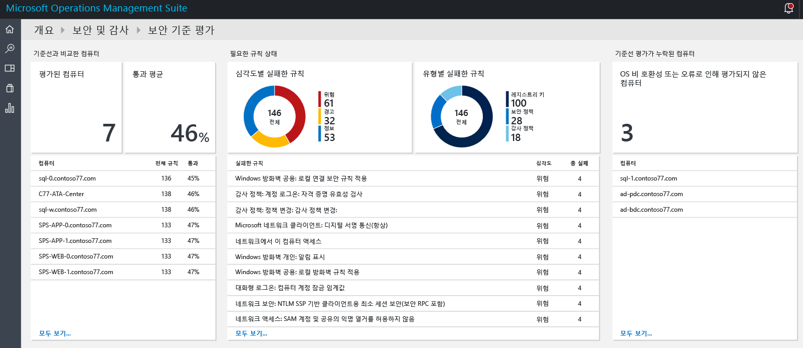
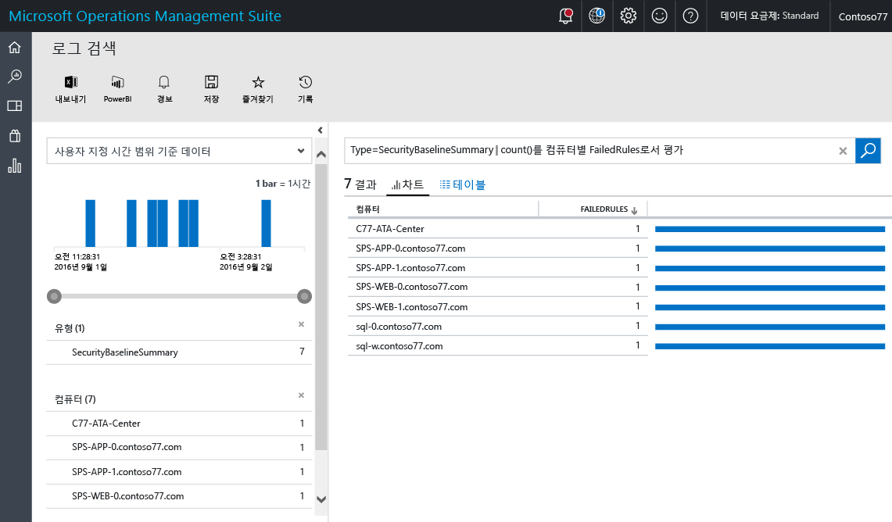
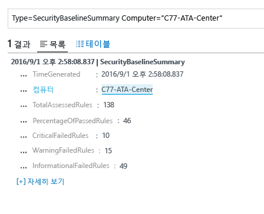
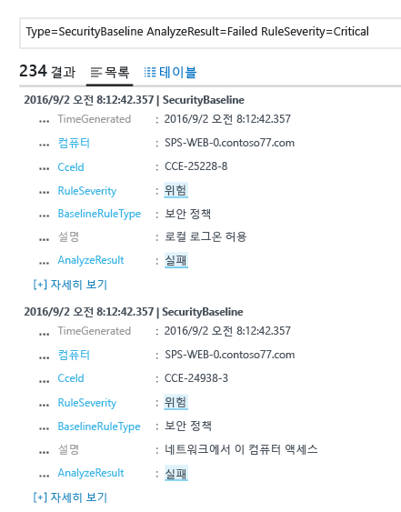

# Operations Management Suite 보안 및 감사 솔루션의 기준 평가
이 문서를 통해 [OMS(Operations Management Suite) 보안 및 감사 솔루션](operations-management-suite-overview.md) 기준 평가 기능을 사용하여 모니터링된 리소스의 보안 상태에 액세스할 수 있습니다.

## 기준 평가란?
전 세계 산업 및 정부 조직과 함께 Microsoft에서는 보안 수준이 높은 서버 배포를 나타내는 Windows 구성을 정의합니다. 이 구성은 일련의 레지스트리 키, 감사 정책 설정 및 이러한 설정에 대한 Microsoft의 권장된 값과 함께 보안 정책 설정을 설명합니다. 이러한 규칙 집합을 보안 기준이라고 합니다. OMS 보안 및 감사 초기 평가 기능은 규정 준수를 위해 모든 컴퓨터를 원활하게 검색할 수 있습니다. 

세 가지 유형의 규칙이 있습니다.

* **레지스트리 규칙**: 레지스트리 키가 올바르게 설정되어 있는지 확인합니다.
* **감사 정책 규칙**: 감사 정책과 관한 규칙입니다.
* **보안 정책 규칙**: 컴퓨터에 대한 사용자의 사용 권한에 관한 규칙입니다.

> [!NOTE]
> 이 기능의 간략한 개요는 [OMS 보안을 사용하여 보안 구성 기준 평가](https://blogs.technet.microsoft.com/msoms/2016/08/12/use-oms-security-to-assess-the-security-configuration-baseline/)를 참조하세요.
> 
> 

## 보안 기준 평가
대시보드를 사용하여 OMS 보안 및 감사에서 모니터링되는 모든 컴퓨터에 대한 현재 보안 기준 평가를 검토할 수 있습니다.  보안 기준 평가 대시보드에 액세스하려면 다음 단계를 실행합니다.

1. **Microsoft Operations Management Suite** 기본 대시보드에서 **보안 및 감사** 타일을 클릭합니다.
2. **보안 및 감사** 대시보드에서 **보안 도메인**의 **기준 평가**를 클릭합니다. 다음 이미지처럼 **보안 기준 평가** 대시보드가 나타납니다.
   
    

이 대시보드는 세 가지 주요 영역으로 구성되어 있습니다.

* **컴퓨터를 기준에 비교**: 이 섹션에서는 액세스된 컴퓨터 수 및 평가를 통과한 컴퓨터 비율을 요약하여 제공합니다. 또한 평가에 대해 상위 10개의 컴퓨터 및 백분율 결과를 제공합니다.
* **필수 규칙 상태**: 이 섹션에서는 심각도별 실패한 규칙 및 유형별 실패한 규칙을 알아보려고 합니다. 첫 번째 그래프를 확인하여 대부분의 실패한 규칙이 중요한지 아닌지를 신속하게 식별할 수 있습니다. 또한 상위 10개의 실패한 규칙 및 심각도 목록을 제공합니다. 두 번째 그래프에서는 평가하는 동안 실패한 규칙의 유형을 보여 줍니다. 
* **기준 평가가 누락된 컴퓨터**:이 섹션에서는 운영 체제 비호환성 또는 오류로 인해 액세스되지 않는 컴퓨터를 나열합니다. 

### 기준에 비교한 컴퓨터에 액세스
이상적으로 모든 컴퓨터는 보안 기준 평가와 호환되어야 합니다. 그러나 어떤 상황에서는 호환되지 않을 수 있습니다. 보안 관리 프로세스의 일부로 보안 평가 테스트를 모두 통과하지 못한 컴퓨터를 검토하는 작업을 포함하는 것이 중요합니다. 이를 신속하게 시각화하려면 **기준에 비교한 컴퓨터** 섹션에 있는 **액세스한 컴퓨터** 옵션을 선택합니다. 다음 화면에서 볼 수 있듯이 컴퓨터의 목록을 보여 주는 로그 검색 결과가 표시되어야 합니다.

검색 결과가 테이블 형식으로 표시되며 여기서 첫 번째 열에는 컴퓨터 이름이 표시되고 두 번째 열에는 실패한 규칙 수가 표시됩니다. 실패한 규칙의 종류에 대한 정보를 검색하려면 컴퓨터 이름 외에도 실패한 규칙 수를 클릭합니다. 다음 이미지에 나와 있는 것과 같은 결과가 표시됩니다.

이 검색 결과에는 액세스된 규칙, 실패한 중요한 규칙 수, 경고 규칙 및 정보가 실패한 규칙의 합계가 있습니다.

### 필수 규칙 상태 액세스
평가를 통과한 컴퓨터의 백분율에 관한 정보를 가져온 후에 중요도에 따라 실패하는 규칙에 대한 자세한 정보를 얻을 수 있습니다. 이 시각화를 통해 다음 평가에서 먼저 호환될 컴퓨터를 결정하도록 우선 순위를 지정할 수 있습니다. **심각도별 실패한 규칙** 타일의 **필수 규칙 상태**에 있는 그래프의 중요한 부분 위로 마우스를 이동하고 클릭합니다. 다음 화면과 유사한 결과가 표시되어야 합니다.

 

이 로그 결과에서 실패한 기준 규칙, 이 규칙의 설명 및 이 보안 규칙의 CCE(Common Configuration Enumeration) ID의 유형이 표시됩니다. 이러한 특성은 대상 컴퓨터에서 이 문제를 해결하는 정정 작업을 충분히 수행해야 합니다.

> [!NOTE]
> CCE에 대한 자세한 정보는 [National Vulnerability Database](https://nvd.nist.gov/cce/index.cfm)에 액세스하세요.
> 
> 

### 기준 평가가 누락된 컴퓨터에 액세스
OMS는 Windows Server 2008 R2에서 Windows Server 2012 R2까지 도메인 구성원 기준 프로필을 지원합니다. Windows Server 2016 기준은 계획은 아직 최종본이 아니며 게시되는 즉시 추가됩니다. OMS 보안 및 감사 기준 평가를 통해 검색된 다른 모든 운영 체제는 **기준 평가가 누락된 컴퓨터** 섹션에 표시됩니다.

## 참고 항목
이 문서에서는 OMS 보안 및 감사 기준 평가에 대해 알아보았습니다. OMS 보안에 대해 자세히 알아보려면 다음 문서를 참조하세요.

* [OMS(Operations Management Suite) 개요](operations-management-suite-overview.md)
* [Operations Management Suite 보안 및 감사 솔루션의 보안 경고 모니터링 및 응답](oms-security-responding-alerts.md)
* [Operations Management Suite 보안 및 감사 솔루션의 리소스 모니터링](oms-security-monitoring-resources.md)

<!--HONumber=Oct16_HO2-->

