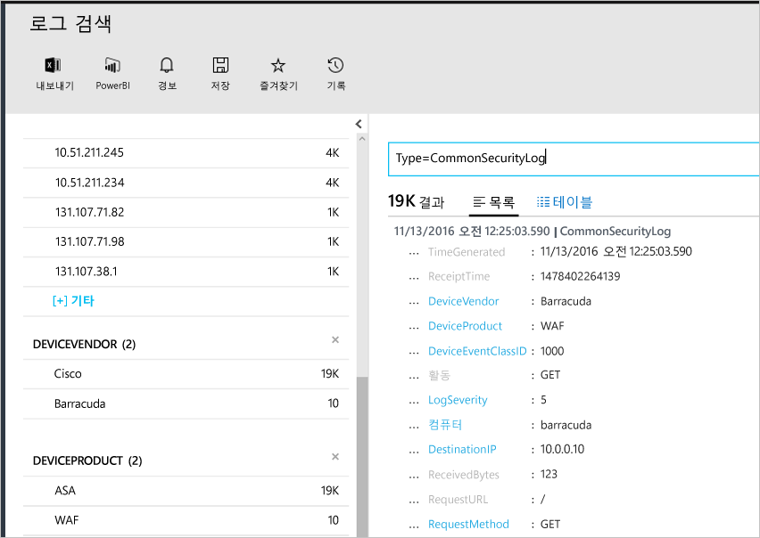

# <a name="connecting-your-security-products-to-the-operations-management-suite-oms-security-and-audit-solution"></a>OMS(Operations Management Suite) 보안 및 감사 솔루션에 보안 제품 연결 
이 문서를 통해 보안 제품을 OMS 보안 및 감사 솔루션에 연결할 수 있습니다. 다음 원본이 지원됩니다.

- CEF(일반 이벤트 형식) 이벤트
- Cisco ASA 이벤트


## <a name="what-is-cef"></a>CEF란 무엇인가요?
CEF(일반 이벤트 형식)는 많은 보안 공급 업체에서 여러 플랫폼 간에 이벤트 상호 운용성을 허용하기 위해 사용하는 Syslog 메시지를 기반으로 한 산업 표준 형식입니다. OMS 보안 및 감사 솔루션은 CEF를 사용하는 데이터 수집을 지원합니다. 이 기능은 OMS 보안과 보안 제품을 연결할 수 있습니다. 

OMS에 데이터 원본을 연결하여 이 플랫폼의 일부인 다음과 같은 기능을 활용할 수 있습니다.

- 검색 및 상관 관계
- 감사
- 경고
- 위협 인텔리전스
- 주목할 만한 문제

## <a name="collection-of-security-solution-logs"></a>보안 솔루션 로그 수집

OMS 보안은 Syslogs 및 [Cisco ASA](https://blogs.technet.microsoft.com/msoms/2016/08/25/add-your-cisco-asa-logs-to-oms-security/) 로그에 CEF를 사용하는 로그의 컬렉션을 지원합니다. 이 예제에서 원본(로그를 생성하는 컴퓨터)은 syslog-ng 데몬을 실행하는 Linux 컴퓨터이며 대상은 OMS 보안입니다. Linux 컴퓨터를 준비하려면 다음 작업을 수행해야 합니다.

- Linux용 OMS 에이전트 버전 1.2.0-25 이상을 다운로드합니다.
- [이 문서](https://github.com/Microsoft/OMS-Agent-for-Linux/blob/master/docs/OMS-Agent-for-Linux.md#steps-to-install-the-oms-agent-for-linux)에서 **빠른 설치 가이드** 섹션을 따라 작업 영역을 에이전트에 설치하고 시작합니다.

일반적으로 에이전트는 로그를 생성한 컴퓨터와 다른 컴퓨터에 설치됩니다. 에이전트 컴퓨터에 로그를 전달하려면 일반적으로 다음 단계가 필요합니다.

- 로깅 제품/컴퓨터를 구성하여 에이전트 컴퓨터에서 syslog 데몬(rsyslog 또는 syslog-ng)에 필수 이벤트를 전달합니다.
- 에이전트 컴퓨터에서 syslog 데몬이 원격 시스템에서 메시지를 수신하도록 합니다.

에이전트 시스템에서 이벤트는 syslog 데몬에서 로컬 UDP 포트 25226로 보내야 합니다. 에이전트는 이 포트에서 들어오는 이벤트를 수신 대기합니다. 다음은 로컬 시스템에서 에이전트로 모든 이벤트를 보내는 구성 예제입니다(로컬 설정에 맞게 구성을 수정할 수 있음).

1. 터미널 창을 열고 */etc/syslog-ng /* 디렉터리로 이동합니다. 
2. *security-config-omsagent.conf*라는 새 파일을 만들고 다음 내용을 추가합니다. OMS_facility = local4
    
    filter f_local4_oms { facility(local4); };

    destination security_oms { tcp("127.0.0.1" port(25226)); };

    log { source(src); filter(f_local4_oms); destination(security_oms); };
    
3. *security_events.conf*라는 파일을 다운로드하고 OMS 에이전트 컴퓨터의 */etc/opt/microsoft/omsagent/conf/omsagent.d/*에 배치합니다.
4. syslog 데몬을 다시 시작하려면 아래 명령을 입력합니다. *syslog-ng 실행의 경우:*
    
    ```
    sudo service rsyslog restart
    ```

    *rsyslog를 실행하기 위해*
    
    ```
    /etc/init.d/syslog-ng restart
    ```
5. OMS 에이전트를 다시 시작하려면 아래 명령을 입력합니다.

    *rsyslog-ng를 실행하기 위해*
    
    ```
    sudo service omsagent restart
    ```

    *rsyslog를 실행하기 위해*
    
    ```
    systemctl restart omsagent
    ```
6. OMS 에이전트 로그에 오류가 없는지 확인하려면 아래 명령을 입력하고 결과를 검토합니다.

    ``` 
    tail /var/opt/microsoft/omsagent/log/omsagent.log
    ```

## <a name="reviewing-collected-security-events"></a>수집된 보안 이벤트 검토

[!include[log-analytics-log-search-nextgeneration](../../includes/log-analytics-log-search-nextgeneration.md)]

구성이 끝난 후에 보안 이벤트는 OMS 보안에 의해 수집되기 시작합니다. 해당 이벤트를 시각화하려면 로그 검색을 열고 검색 필드에 *Type=CommonSecurityLog* 명령을 입력한 다음 ENTER 키를 누릅니다. 다음 예제에서는 이 명령의 결과를 보여 줍니다. 이 경우에 OMS 보안이 여러 공급 업체의 보안 로그를 이미 수집하게 됩니다.
   


이 검색을 단일 공급 업체로 구체화할 수 있습니다. 예를 들어, Cisco 로그를 온라인으로 시각화하려면 다음을 입력합니다. *Type=CommonSecurityLog DeviceVendor=Cisco* "CommonSecurityLog"에는 기본 확장을 포함하는 CEF 헤더에 대해 미리 정의된 필드가 포함되는 반면 "사용자 지정 확장"인지 여부와 상관없이 다른 확장은 "AdditionalExtensions" 필드에 삽입됩니다. 사용자 정의 필드 기능을 사용하여 전용 필드를 가져올 수 있습니다. 

### <a name="accessing-computers-missing-baseline-assessment"></a>기준 평가가 누락된 컴퓨터에 액세스
OMS는 Windows Server 2008 R2에서 Windows Server 2012 R2까지 도메인 구성원 기준 프로필을 지원합니다. Windows Server 2016 기준은 계획은 아직 최종본이 아니며 게시되는 즉시 추가됩니다. OMS 보안 및 감사 기준 평가를 통해 검색된 다른 모든 운영 체제는 **기준 평가가 누락된 컴퓨터** 섹션에 표시됩니다.

## <a name="see-also"></a>참고 항목
이 문서에서는 CEF 솔루션을 OMS에 연결하는 방법을 알아보았습니다. OMS 보안에 대해 자세히 알아보려면 다음 문서를 참조하세요.

* [OMS(Operations Management Suite) 개요](operations-management-suite-overview.md)
* [Operations Management Suite 보안 및 감사 솔루션의 보안 경고 모니터링 및 응답](oms-security-responding-alerts.md)
* [Operations Management Suite 보안 및 감사 솔루션의 리소스 모니터링](oms-security-monitoring-resources.md)

