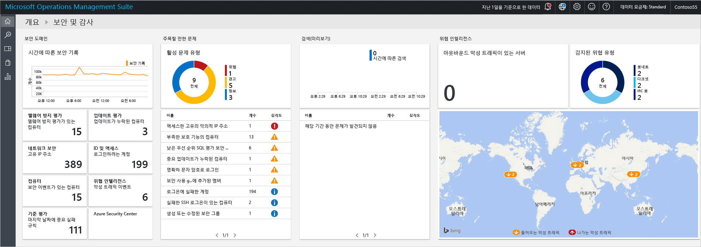
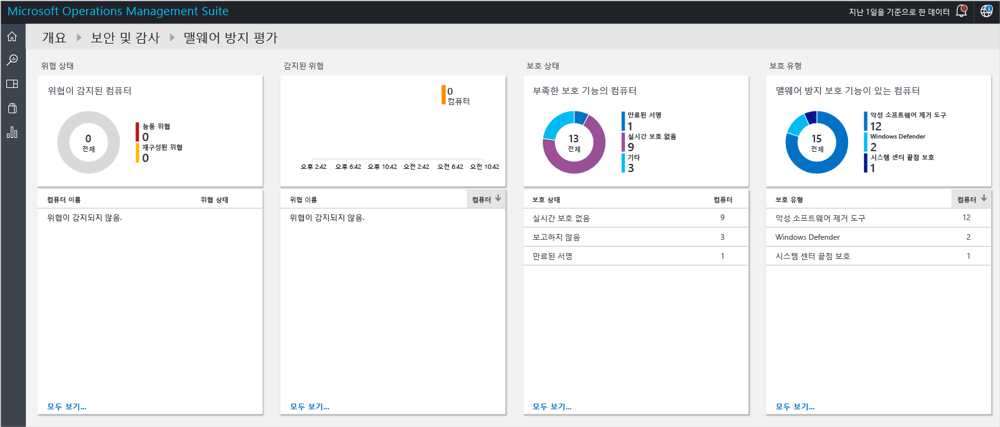
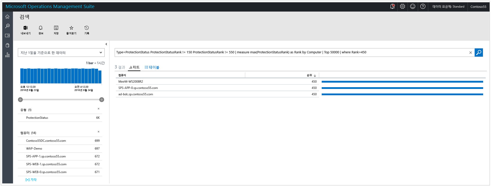
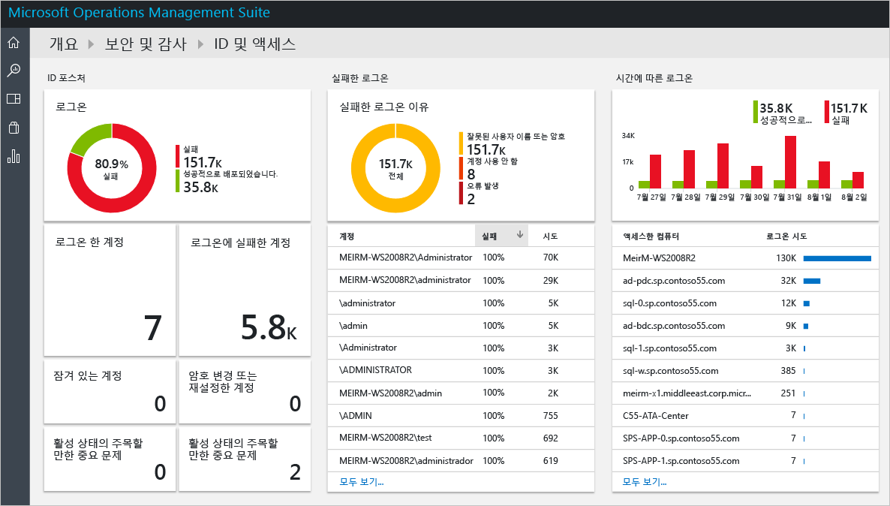
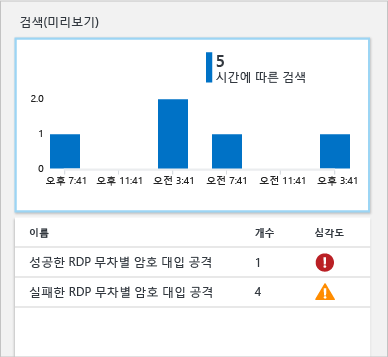
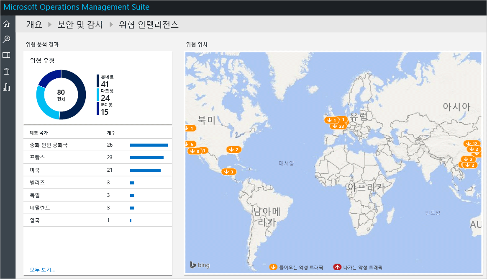

# Operations Management Suite 보안 및 감사 솔루션 시작
이 문서는 각 옵션을 안내하여 OMS(Operations Management Suite) 보안 및 감사 솔루션 기능을 빠르게 시작할 수 있도록 도와줍니다.

## OMS란?
OMS(Microsoft Operations Management Suite)는 온-프레미스 및 클라우드 인프라를 관리 및 보호하도록 도와주는 Microsoft의 클라우드 기반 IT 관리 솔루션입니다. OMS에 대한 자세한 내용은 [Operations Management Suite](https://technet.microsoft.com/library/mt484091.aspx)문서를 참조하세요.

## OMS 보안 및 감사 대시보드
OMS 보안 및 감사 솔루션은 주의가 필요한 주요 문제에 대한 기본 제공 검색 쿼리를 통해 조직의 IT 보안 상태에 대한 포괄적인 뷰를 제공합니다. **보안 및 감사** 대시보드는 OMS의 보완과 관련된 모든 정보를 볼 수 있는 홈 화면입니다. 이 대시보드에서 컴퓨터의 보안 상태를 대략적으로 확인할 수 있으며 지난 24시간, 7일, 기타 사용자 지정 기간 동안 발생한 모든 이벤트를 확인할 수도 있습니다. **보안 및 감사** 대시보드에 액세스하려면 다음 단계를 수행합니다.

1. **Microsoft Operations Management Suite** 기본 대시보드에서 왼쪽의 **설정** 타일을 클릭합니다.
2. **설정** 블레이드의 **솔루션**에서 **보안 및 감사** 옵션을 클릭합니다.
3. **보안 및 감사** 대시보드가 나타납니다.
   
    

OMS에서 모니터링하는 장치가 없는 상태에서 이 대시보드를 처음으로 액세스하는 경우 타일이 에이전트에서 얻은 데이터로 채워지지 않습니다. 에이전트를 설치하면 채워지는 데 약간의 시간이 소요되므로 처음에는 클라우드로 업로드되는 동안 일부 데이터가 누락될 수 있습니다.  이 경우 일부 타일에 유형의 정보가 없는 것은 정상입니다. Windows 시스템에 OMS 에이전트를 설치하는 방법은 [OMS에 Windows 컴퓨터 직접 연결](https://technet.microsoft.com/library/mt484108.aspx)을 참조하고 Linux 시스템에서 이 작업을 수행하는 방법은 [OMS에 Linux 컴퓨터 연결](https://technet.microsoft.com/library/mt622052.aspx)을 참조하세요.

> [!NOTE]
> 에이전트는 컴퓨터 이름, IP 주소, 사용자 이름 등 설정된 현재 이벤트를 기반으로 정보를 수집합니다. 그러나 문서/파일, 데이터베이스 이름 또는 개인 데이터가 수집되지 않습니다.   
> 
> 

솔루션은 주요 고객 과제를 해결하는 논리, 시각화 및 데이터 취득 규칙의 모음입니다. 보안 및 감사는 하나의 솔루션이며 다른 솔루션은 별도로 추가할 수 있습니다. 새 솔루션을 추가하는 방법은 [솔루션 추가](https://technet.microsoft.com/library/mt674635.aspx) 문서를 참조하세요.

OMS 보안 및 감사 대시보드는 네 가지 주요 범주로 구성되어 있습니다.

* **보안 도메인**: 이 영역에서는 시간별 보안 기록을 탐색하고 맬웨어 평가, 업데이트 평가, 네트워크 보안, ID 및 액세스 정보, 보안 이벤트가 있는 컴퓨터에 액세스하고 Azure Security Center 대시보드에 빠르게 액세스할 수 있습니다.
* **주목할 만한 문제**: 이 옵션에서는 해결되지 않은 문제의 수와 이러한 문제의 심각도를 빠르게 식별할 수 있습니다.
* **감지(미리 보기)**: 리소스에 대해 수행한 대로 보안 경고를 시각화하여 공격 패턴을 식별할 수 있습니다.
* **위협 인텔리전스**: 아웃바운드 악성 IP 트래픽이 있는 서버의 총 수, 악성 위협의 유형, 이러한 IP가 발생한 위치를 보여주는 맵을 시각화하여 공격 패턴을 식별할 수 있습니다. 
* **일반적 보안 쿼리**: 이 옵션은 환경을 모니터링하는 데 사용할 수 있는 가장 일반적인 보안 쿼리의 목록을 제공합니다. 이러한 쿼리 중 하나를 클릭하면 해당 쿼리의 결과가 포함된 **Search** 블레이드가 열립니다.

> [!NOTE]
> OMS가 데이터를 안전하게 유지하는 방식을 자세히 알아보려면 OMS가 데이터를 보호하는 방식을 참조하세요.
> 
> 

## 보안 도메인
리소스를 모니터링할 때는 환경의 현재 상태를 빠르게 액세스하는 것이 중요합니다. 하지만 과거에 발생한 이벤트를 추적하여 현재 환경에서 발생하고 있는 상태를 잘 이해하는 것도 중요합니다. 

> [!NOTE]
> 데이터 보존은 OMS 가격 책정 계획을 따릅니다. 자세한 내용은 [Microsoft Operations Management Suite](https://www.microsoft.com/server-cloud/operations-management-suite/pricing.aspx) 가격 책정 페이지를 참조하세요.
> 
> 

사고 대응 및 과학 수사 시나리오에서는 **시간별 보안 기록** 타일의 결과를 직접적으로, 유용하게 사용할 수 있습니다.

이 타일을 클릭하면 아래와 같이 지난 7일간 데이터의 **보안 이벤트**(Type=SecurityEvents) 쿼리 결과가 표시된 **Search** 블레이드가 열립니다.

[!include[log-analytics-log-search-nextgeneration](../../includes/log-analytics-log-search-nextgeneration.md)]

검색 결과는 두 창으로 구분됩니다. 왼쪽 창에는 발견된 보안 이벤트의 수, 이러한 이벤트가 발견된 컴퓨터, 이러한 컴퓨터에서 발견된 계정의 수 및 활동 유형이 표시됩니다. 오른쪽 창에는 컴퓨터 이름, 이벤트 활동과 함께 보안 이벤트의 총 결과와 시간별 뷰가 표시됩니다. 또한 **자세히 표시**를 클릭하면 이벤트 데이터, 이벤트 ID, 이벤트 소스 등 이 이벤트에 대한 추가 정보가 표시됩니다.

> [!NOTE]
> OMS 검색 쿼리에 대한 자세한 내용은 [OMS 검색 참조](https://technet.microsoft.com/library/mt450427.aspx)를 읽으세요.
> 
> 

### 맬웨어 방지 평가
이 옵션에서는 적절히 보호되지 않는 컴퓨터와 맬웨어로 손상된 컴퓨터를 빠르게 식별할 수 있습니다. 모니터링되는 서버에서 맬웨어 평가 상태 및 검색된 위협을 읽은 다음 데이터를 클라우드의 OMS 서비스로 전송하여 처리합니다. 위협이 검색된 서버와 적절히 보호되지 않는 서버는 맬웨어 평가 대시보드에 표시되며, 이 대시보드는 **맬웨어 방지 평가** 타일을 클릭한 후 액세스할 수 있습니다. 

OMS 대시보드에서 사용 가능한 다른 라이브 타일과 마찬가지로 이 타일을 클릭하면 쿼리 결과가 포함된 **Search** 블레이드가 열립니다. 이 옵션의 **보호 상태**에서 **보고하지 않음** 옵션을 클릭하면 아래와 같이 컴퓨터의 이름 및 순위가 포함된 단일 항목을 보여주는 쿼리 결과가 표시됩니다.

> [!NOTE]
> *순위*는 보호 상태(켬, 끔, 업데이트됨 등)와 검색된 위협을 반영하여 지정되는 등급입니다. 순위를 숫자로 표시할 경우 집계를 할 수 있습니다.
> 
> 

컴퓨터의 이름을 클릭하면 이 컴퓨터의 보호 상태가 시간 순서로 표시됩니다. 이 보기는 맬웨어 방지 프로그램이 설치된 적이 있지만 나중에 제거되었는지 여부를 확인하는 시나리오에 매우 유용합니다.   

### 업데이트 평가
이 옵션에서는 잠재적 보안 문제에 대한 전반적 노출을 확인하고 이러한 업데이트가 환경에 중요한지 여부 또는 얼마나 중요한가를 빠르게 판단할 수 있습니다. OMS 보안 및 감사 솔루션은 이러한 업데이트의 시각화만 제공하며, 실제 데이터 소스는 OMS 내의 다른 모듈인 [업데이트 관리 솔루션](oms-solution-update-management.md)입니다. 다음은 업데이트의 예제입니다.

> [!NOTE]
> 업데이트 관리 솔루션에 대한 자세한 내용은 [OMS의 업데이트 관리 솔루션](oms-solution-update-management.md)을 참조하세요.
> 
> 

### ID 및 액세스
ID는 엔터프라이즈의 제어 평면으로서 ID 보호가 최우선순위가 되어야 합니다. 과거에는 조직 주변에 경계가 있었고 그러한 경계가 기본적인 방어막 중 하나였지만 오늘날에는 점점 더 많은 앱이 클라우드로 이동함에 따라 ID가 새로운 경계가 되고 있습니다. 

> [!NOTE]
> 현재는 데이터가 보안 이벤트 로그인 데이터(이벤트 ID 4624)만 기준으로 하며 향후에는 Office365 로그인 및 Azure AD 데이터도 포함될 예정입니다.
> 
> 

ID 활동을 모니터링함으로써 문제가 발생하기 전에 사전 대응 조치를 취하거나 사후 대응을 통해 공격 시도를 중단할 수 있습니다. **ID 및 액세스** 대시보드는 실패한 로그온 시도 수, 실패한 로그온에 사용된 사용자 계정, 잠긴 계정, 비밀번호가 변경 또는 초기화된 계정, 현재 로그인된 계정 수를 포함하여 ID 상태를 개략적으로 표시합니다. 

**ID 및 액세스** 타일을 클릭하면 다음과 같은 대시보드가 표시됩니다.

이 대시보드에 표시되는 정보를 통해 잠재적으로 의심스러운 활동을 즉시 식별할 수 있습니다. 예를 들어 **관리자** 자격으로 로그인하려는 338회의 시도가 있었고 이 시도의 100%가 실패했습니다. 원인은 이 계정에 대한 무차별 공격 때문일 수 있습니다. 이 계정을 클릭하면 이 잠재적 공격의 대상 리소스를 확인할 수 있는 추가 정보가 표시됩니다.

상세 보고서에는 대상 컴퓨터, 로그온 유형(이 경우는 네트워크 로그온), 활동(이 경우는 이벤트 4625), 각 시도의 포괄적 타임라인을 포함하여 이 이벤트에 대한 중요 정보가 표시됩니다. 

### 컴퓨터
이 타일은 해결되지 않은 보안 이벤트가 있는 모든 컴퓨터에 액세스하는 데 사용할 수 있습니다. 이 타일을 클릭하면 보안 이벤트 및 각 컴퓨터의 이벤트 수가 포함된 컴퓨터 목록이 표시됩니다.

각 컴퓨터를 클릭하여 조사를 계속하고 플래그가 지정된 보안 이벤트를 검토할 수 있습니다.

### 위협 인텔리전스

IT 관리자는 OMS 보안 및 감사에 제공되는 위협 인텔리전스 옵션을 사용하여 환경에 대한 보안 위협을 식별할 수 있습니다. 예를 들어 특정 컴퓨터가 봇넷의 일부인이 여부를 식별할 수 있습니다. 공격자가 컴퓨터를 명령 및 컨트롤에 몰래 연결하는 맬웨어를 불법으로 설치할 경우 해당 컴퓨터가 봇넷의 노드가 되었다고 합니다. darknet 같은 지하 통신 채널에서 오는 잠재적 위협도 식별할 수 있습니다. [Operations Management Suite 보안 및 감사 솔루션의 보안 경고 모니터링 및 응답](oms-security-responding-alerts.md) 문서를 읽고 위협 인텔리전스에 대해 자세히 알아보세요.

일부 시나리오에서는 모니터링되는 한 컴퓨터에서 잠재적인 악성 IP에 액세스한 것을 확인할 수 있습니다.

이 경고와 같은 범주 내의 다른 경고는 [Microsoft 위협 인텔리전스](https://youtu.be/O4WtxgUrDc8)를 활용하여 OMS 보안을 통해 생성됩니다. 위협 인텔리전스 데이터는 Microsoft에서 수집하며 업계 선두적인 위협 인텔리전스 공급자로부터 구입합니다. 이 데이터는 자주 업데이트되며 빠르게 변화하는 위협에 대해 대응합니다. 이러한 특성으로 인해 보안 경고를 [조사](https://blogs.technet.microsoft.com/msoms/2016/12/08/investigating-suspicious-activity-in-a-hybrid-cloud-with-oms-security/)하는 동안 다른 보안 정보 원본과 결합되어야 합니다. 

### 기준 평가

전 세계 산업 및 정부 조직과 함께 Microsoft에서는 보안 수준이 높은 서버 배포를 나타내는 Windows 구성을 정의합니다. 이 구성은 일련의 레지스트리 키, 감사 정책 설정 및 이러한 설정에 대한 Microsoft의 권장된 값과 함께 보안 정책 설정을 설명합니다. 이러한 규칙 집합을 보안 기준이라고 합니다. 이 옵션에 대한 자세한 내용은 [Operations Management Suite 보안 및 감사 솔루션의 기준 평가](oms-security-baseline.md)를 참조하세요.

### Azure Security Center
이 타일은 기본적으로 Azure Security Center 대시보드에 액세스하는 바로 가기입니다. 이 솔루션에 대한 자세한 내용은 [Azure Security Center 시작](../security-center/security-center-get-started.md)을 참조하세요.

## 주목할 만한 문제
이 옵션 그룹의 기본 의도는 문제를 위험, 경고, 정보 제공으로 분류하여 환경의 문제를 빠르게 확인할 수 있도록 하는 것입니다. 미해결 문제 유형 타일은 이러한 문제를 시각적으로 표현한 것이지만 상세 정보를 확인할 수 없기 때문에 문제의 이름(NAME), 발생한 개체 수(COUNT), 중요도(SEVERITY)가 표시된 타일 아랫부분을 사용해야 합니다.

**보안 도메인** 그룹의 다양한 영역에서 환경의 가장 중요한 문제를 한 곳에서 볼 수 있도록 시각화하며 위의 문제는 해당 영역에 이미 표시되어 있습니다.

## 감지(미리 보기)
이 옵션의 주 목적은 IT에서 해당 환경 및 이 위협의 심각도에 대한 잠재적 위협을 신속하게 식별하는 것입니다.

이 옵션은 [인시던트 대응을 조사](https://blogs.msdn.microsoft.com/azuresecurity/2016/11/30/investigating-suspicious-activity-in-a-hybrid-cloud-with-oms-security/)하는 과정에 사용되어 평가를 수행하고 공격에 대한 자세한 정보를 가져올 수 있습니다.

> [!NOTE]
> 인시던트 대응에 OMS를 사용하는 방법에 대한 자세한 내용은 [인시던트 대응에 대한 Azure Security Center 및 Microsoft Operations Management Suite를 활용하는 방법](https://channel9.msdn.com/Blogs/Taste-of-Premier/ToP1703) 비디오를 시청하세요.
> 
> 

## 위협 인텔리전스
보안 및 감사 솔루션의 새로운 위협 인텔리전스 섹션은 가능한 공격 패턴을 몇 가지 방법으로 시각화합니다(예: 아웃바운드 악성 IP 트래픽이 있는 서버의 총 수, 악성 위협의 유형, 이러한 IP가 발생한 위치를 보여주는 맵). 이 맵과 상호 작용하면서 IP를 클릭하여 자세한 정보를 확인할 수 있습니다.

맵의 노란색 압정은 악성 IP에서 들어오는 트래픽을 나타냅니다. 서버가 인터넷의 악성 트래픽에 노출되는 경우는 거의 없지만 이러한 시도를 검토하여 성공할 수 없도록 하는 것이 좋습니다. 이러한 표시는 IIS 로그, WireData 및 Windows 방화벽 로그를 기반으로 합니다.  

## 일반적 보안 쿼리
사용 가능한 일반적 보안 쿼리는 리소스 정보를 빠르게 액세스하고 사용자의 환경 요구 사항에 따라 사용자 지정하는 데 유용할 수 있습니다. 이러한 일반적 쿼리는 다음과 같습니다.

* 모든 보안 활동
* "computer01.contoso.com" 컴퓨터의 보안 활동(사용하는 컴퓨터 이름으로 대체)
* "computer01.contoso.com" 컴퓨터 및 "관리자" 계정의 보안 활동(사용하는 컴퓨터 이름 및 계정 이름으로 대체)
* 컴퓨터별 로그온 활동
* 임의 컴퓨터에서 Microsoft 맬웨어 방지 프로그램을 종료한 계정
* Microsoft 맬웨어 방지 프로그램을 종료한 컴퓨터
* "hash.exe"를 실행한 컴퓨터(다른 프로세스 이름으로 대체)
* 실행된 모든 프로세스 이름
* 계정별 로그온 활동
* "computer01.contoso.com" 컴퓨터에 원격으로 로그온한 계정(사용하는 컴퓨터 이름으로 대체)

## 참고 항목
이 문서에서는 OMS 보안 및 감사 솔루션을 소개했습니다. OMS 보안에 대해 자세히 알아보려면 다음 문서를 참조하세요.

* [OMS(Operations Management Suite) 개요](operations-management-suite-overview.md)
* [Operations Management Suite 보안 및 감사 솔루션의 보안 경고 모니터링 및 응답](oms-security-responding-alerts.md)
* [Operations Management Suite 보안 및 감사 솔루션의 리소스 모니터링](oms-security-monitoring-resources.md)

