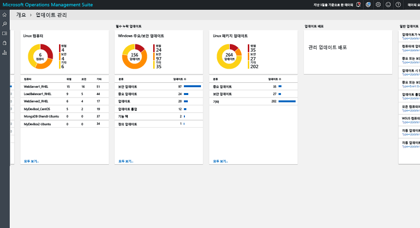
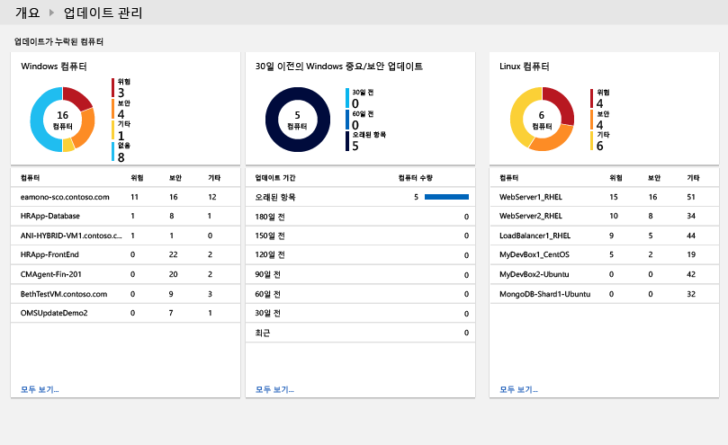
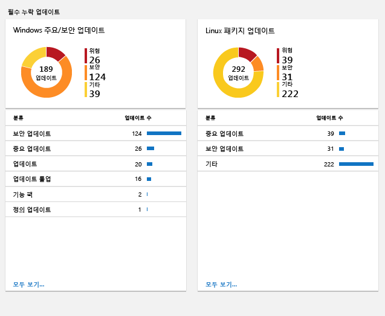
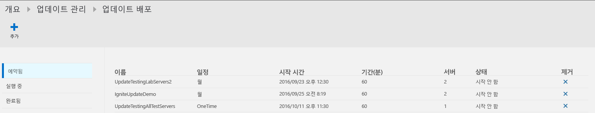
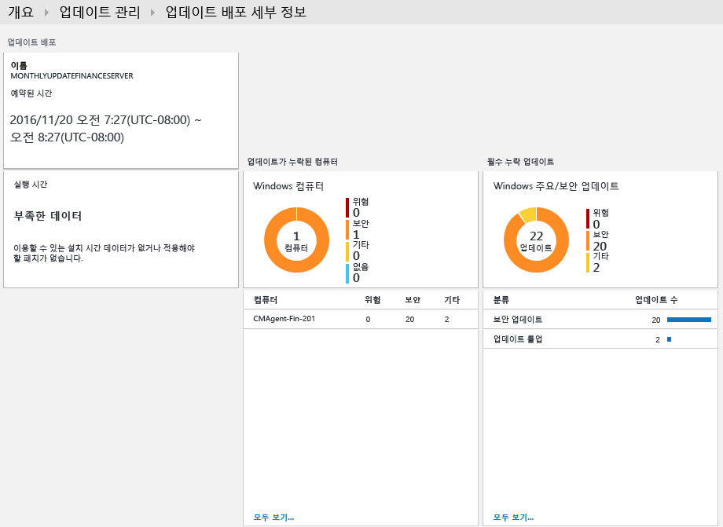
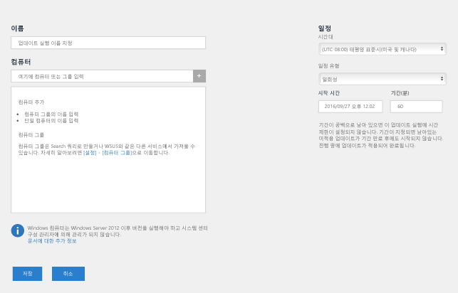
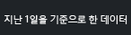
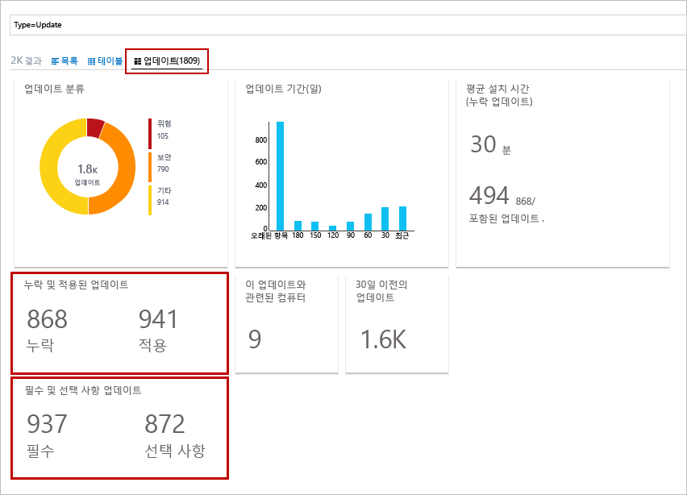
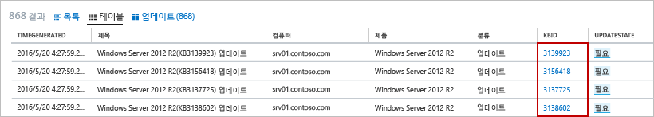
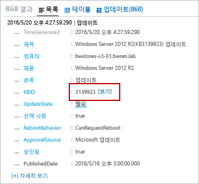

# OMS의 업데이트 관리 솔루션
OMS의 업데이트 관리 솔루션을 사용하면 Windows 및 Linux 컴퓨터에 대한 업데이트를 관리할 수 있습니다.  모든 에이전트 컴퓨터에서 사용 가능한 업데이트의 상태를 신속하게 평가하고 서버에 대한 필수 업데이트를 설치하는 프로세스를 시작할 수 있습니다. 

## 필수 조건
* 솔루션은 Windows Server 2008 이상에 대한 업데이트 평가 및 Windows Server 2012 이상에 대한 업데이트 배포 수행만을 지원합니다.  Server Core 및 Nano 서버 설치 옵션은 지원되지 않습니다.
* Windows 클라이언트 운영 체제는 지원되지 않습니다.  
* Windows 에이전트는 WSUS(Windows Server Update Services) 서버와 통신하도록 구성되거나 Microsoft Update에 대한 액세스 권한이 있어야 합니다.  
  
  > [!NOTE]
  > System Center Configuration Manager에서 동시에 Windows 에이전트를 관리할 수 없습니다.  
  > 
  > 
* Linux 에이전트에는 업데이트 리포지토리에 대한 액세스 권한이 있어야 합니다.  Linux용 OMS 에이전트를 [GitHub](https://github.com/microsoft/oms-agent-for-linux)에서 다운로드할 수 있습니다. 

## 구성
다음 단계를 수행하여 업데이트 관리 솔루션을 OMS 작업 영역에 추가하고 Linux 에이전트를 추가합니다. Windows 에이전트는 추가 구성 없이 자동으로 추가됩니다.

> [!NOTE]
> 이 솔루션을 사용하도록 설정하면 이 솔루션에 포함된 Runbook을 지원하기 위해 OMS 작업 영역에 연결된 모든 Windows 컴퓨터가 자동으로 Hybrid Runbook Worker로 구성됩니다.  그러나 자동화 계정에서 이미 정의한 모든 Hybrid Worker 그룹에 등록되지 않았습니다.  솔루션과 Hybrid Runbook Worker 그룹 멤버 자격에 동일한 계정을 사용하는 한 자동화 Runbook을 지원하기 위해 자동화 계정의 Hybrid Runbook Worker 그룹에 추가될 수 있습니다.  이 기능은 Hybrid Runbook Worker의 7.2.12024.0 버전에 추가되었습니다.   

1. 솔루션 갤러리에서 [OMS 솔루션 추가](../log-analytics/log-analytics-add-solutions.md)에 설명된 프로세스를 사용하여 OMS 작업 영역에 업데이트 관리 솔루션을 추가합니다.  
2. OMS 포털에서 **설정** 및 **연결된 원본**을 차례로 선택합니다.  **작업 영역 ID** 및 **기본 키** 또는 **보조 키** 중 하나를 적어둡니다.
3. 각 Linux 컴퓨터에 대해 다음 단계를 수행합니다.
   
   a.    다음 명령을 실행하여 최신 버전의 Linux용 OMS 에이전트를 설치합니다.  <Workspace ID>을 작업 영역 ID로 바꾸고 <Key>를 기본 또는 보조 키로 바꿉니다.
   
        cd ~
        wget https://raw.githubusercontent.com/Microsoft/OMS-Agent-for-Linux/master/installer/scripts/onboard_agent.sh && sh onboard_agent.sh -w <WorkspaceID>  -s <PrimaryKey> -d opinsights.azure.com 

   b. 에이전트를 제거하려면 [Linux용 OMS 에이전트 제거](https://github.com/Microsoft/OMS-Agent-for-Linux/blob/master/docs/OMS-Agent-for-Linux.md#uninstalling-the-oms-agent-for-linux) 섹션에 설명된 프로세스를 사용하세요.  

## 관리 팩
System Center Operations Manager 관리 그룹이 OMS 작업 영역에 연결된 경우 이 솔루션을 추가할 때 다음 관리 팩이 System Center Operations Manager에 설치됩니다. 이 관리 팩에 대한 구성 또는 유지 관리는 필요 없습니다. 

* Microsoft System Center Advisor 업데이트 평가 인텔리전스 팩(Microsoft.IntelligencePacks.UpdateAssessment)
* Microsoft.IntelligencePack.UpdateAssessment.Configuration(Microsoft.IntelligencePack.UpdateAssessment.Configuration)
* 업데이트 배포 MP

솔루션 관리 팩이 업데이트되는 방법에 대한 자세한 내용은 [Log Analytics에 Operations Manager 연결](../log-analytics/log-analytics-om-agents.md)을 참조하세요.

## 데이터 수집
### 지원되는 에이전트
다음 표는 이 솔루션이 지원하는 연결된 소스를 설명합니다.

| 연결된 소스 | 지원됨 | 설명 |
| --- | --- | --- |
| Windows 에이전트 |예 |솔루션은 Windows 에이전트에서 시스템 업데이트에 대한 정보를 수집하고 필수 업데이트를 설치하기 시작합니다. |
| Linux 에이전트 |예 |솔루션은 Linux 에이전트에서 시스템 업데이트에 대한 정보를 수집합니다. |
| Operations Manager 관리 그룹 |예 |솔루션은 연결된 관리 그룹의 에이전트에서 시스템 업데이트에 대한 정보를 수집합니다. Operations Manager 에이전트에서 Log Analytics로 직접 연결은 필요하지 않습니다. 데이터는 관리 그룹에서 OMS 리포지토리로 전달됩니다. |
| Azure 저장소 계정 |아니요 |Azure Storage는 시스템 업데이트에 대한 정보를 포함하지 않습니다. |

### 수집 빈도
관리되는 Windows 컴퓨터 각각의 경우 검색은 하루에 두 번 수행됩니다.  업데이트를 설치하면 15분 내로 해당 정보가 업데이트됩니다.  

관리되는 Linux 컴퓨터 각각의 경우 검색은 세 시간마다 수행됩니다.  

## 솔루션 사용
업데이트 관리 솔루션을 OMS 작업 영역에 추가할 때 OMS 대시보드에 **업데이트 관리** 타일이 추가됩니다. 이 타일이 현재 시스템 업데이트가 필요한 환경에서 컴퓨터 수의 개수와 그래픽 표현을 표시합니다.  
  

## 업데이트 평가 보기
**업데이트 관리** 타일을 클릭하여 **업데이트 관리** 대시보드를 엽니다. 대시보드는 다음 표의 열을 포함하고 있습니다. 각 열은 지정된 범위 및 시간 범위에 대한 열의 기준과 일치하는 최대 열 개의 항목을 나열합니다. 열 아래쪽의 **모두 보기**를 클릭하거나 열 헤더를 클릭하여 모든 레코드를 반환하는 로그 검색을 실행할 수 있습니다.

| 열 | 설명 |
| --- | --- |
| **업데이트를 누락한 컴퓨터** | |
| 중요 또는 보안 업데이트 |누락된 업데이트의 수로 정렬된 업데이트를 누락한 상위 10대의 컴퓨터를 나열합니다. 컴퓨터 이름을 클릭하여 해당 컴퓨터에 대한 모든 업데이트 레코드를 반환하는 로그 검색을 실행합니다. |
| 30일보다 오래된 중요 또는 보안 업데이트 |데이트 업데이트가 게시된 후의 시간 길이별로 그룹화된 중요 또는 보안 업데이트를 누락한 컴퓨터 수를 식별합니다. 항목 중 하나를 클릭하여 모든 누락된 중요 업데이트를 반환하는 로그 검색을 실행합니다. |
| **필수 업데이트 누락** | |
| 중요 또는 보안 업데이트 |범주에서 업데이트를 누락한 컴퓨터 수로 정렬된 컴퓨터가 누락한 업데이트의 분류를 나열합니다. 분류를 클릭하여 해당 분류에 대한 모든 업데이트 레코드를 반환하는 로그 검색을 실행합니다. |
| **업데이트 배포** | |
| 업데이트 배포 |현재 예약된 업데이트 배포의 수 및 다음 예약된 업데이트가 실행될 때까지 기간입니다.  타일을 클릭하여 일정, 현재 실행 중인 업데이트 및 완료된 업데이트를 보거나 새 배포를 예약합니다. |

   
   
 
   
 
   

## 업데이트 설치
환경에서 모든 Windows 컴퓨터에 대한 업데이트를 평가하면 필수 업데이트가 *업데이트 배포*를 만들어 설치됩니다.  업데이트 배포는 하나 이상의 Windows 컴퓨터에 필수 업데이트를 예약하여 설치합니다.  포함되어야 하는 컴퓨터 또는 컴퓨터 그룹 외에도 배포에 대한 시간과 날짜를 명시합니다.  

Azure Automation의 runbook에서 업데이트가 설치됩니다.  이러한 runbook을 볼 수 없고 구성이 필요하지 않습니다.  업데이트 배포를 만든 경우 일정을 만들고 여기서 포함된 컴퓨터에 지정된 시간에 마스터 업데이트 runbook이 시작됩니다.  이 마스터 runbook은 필수 업데이트를 설치하는 각 Windows 에이전트에서 하위 runbook을 시작합니다.  

Azure Marketplace에서 사용할 수 있는 주문형 RHEL(Red Hat Enterprise Linux) 이미지에서 만든 가상 컴퓨터는 Azure에 배포된 [RHUI(Red Hat Update Infrastructure)](../virtual-machines/linux/update-infrastructure-redhat.md)에 액세스하도록 등록됩니다.  다른 모든 Linux 배포판은 지원되는 방법에 따라 배포판 온라인 파일 리포지토리에서 업데이트되어야 합니다.  

### 업데이트 배포 보기
**업데이트 배포** 타일을 클릭하여 기존 업데이트 배포의 목록을 볼 수 있습니다.  **예약됨**, **실행 중** 및 **완료됨**와 같은 상태별로 그룹화합니다.      

각 업데이트 배포에 표시된 속성을 다음 테이블에서 설명합니다.

| 속성 | 설명 |
| --- | --- |
| 이름 |업데이트 배포 이름입니다. |
| 일정 |일정의 형식입니다.  *OneTime*은 현재 유일하게 가능한 값입니다. |
| 시작 시간 |업데이트 배포를 시작하도록 예약한 날짜 및 시간입니다. |
| 기간 |업데이트 배포를 실행할 수 있는 분 수입니다.  이 기간 내에서 모든 업데이트가 설치되지 않은 경우 나머지 업데이트는 다음 업데이트 배포까지 기다려야 합니다. |
| 서버 |업데이트 배포에 영향을 받는 컴퓨터의 수입니다. |
| 가동 상태 |업데이트 배포의 현재 상태입니다.  가능한 값은 다음과 같습니다. - 시작 안함 - 실행 중 - 완료됨 |

업데이트 배포를 클릭하여 다음 테이블에서 열을 포함하는 해당 세부 정보 화면을 확인합니다.  업데이트 배포가 아직 시작되지 않은 경우 이러한 열이 채워지지 않습니다. 

| 열 | 설명 |
| --- | --- |
| **컴퓨터 결과** | |
| 성공적으로 완료됨 |업데이트 배포에서 컴퓨터의 수를 상태별로 나열합니다.  상태를 클릭하여 업데이트 배포에 대한 해당 상태와 함께 모든 업데이트 레코드를 반환하는 로그 검색을 실행합니다. |
| 컴퓨터 설치 상태 |업데이트 배포에 포함된 컴퓨터 및 업데이트가 제대로 설치된 비율을 나열합니다. 항목 중 하나를 클릭하여 모든 누락된 중요 업데이트를 반환하는 로그 검색을 실행합니다. |
| **업데이트 인스턴스 결과** | |
| 인스턴스 설치 상태 |범주에서 업데이트를 누락한 컴퓨터 수로 정렬된 컴퓨터가 누락한 업데이트의 분류를 나열합니다. 컴퓨터를 클릭하여 해당 컴퓨터에 대한 모든 업데이트 레코드를 반환하는 로그 검색을 실행합니다. |

   

### 업데이트 배포 만들기
**새 업데이트 배포** 페이지를 열려면 화면 맨 위에 있는 **추가** 단추를 클릭하여 새 업데이트 배포를 만듭니다.  다음 테이블에서 속성의 값을 제공해야 합니다.

| 속성 | 설명 |
| --- | --- |
| 이름 |업데이트 배포를 식별하는 고유 이름입니다. |
| 표준 시간대 |시작 시간에 사용할 표준 시간대입니다. |
| 시작 시간 |업데이트 배포를 시작할 날짜 및 시간입니다. |
| 기간 |업데이트 배포를 실행할 수 있는 분 수입니다.  이 기간 내에서 모든 업데이트가 설치되지 않은 경우 나머지 업데이트는 다음 업데이트 배포까지 기다려야 합니다. |
| 컴퓨터 |업데이트 배포에 포함할 컴퓨터 또는 컴퓨터 그룹의 이름입니다.  드롭다운 목록에서 하나 이상의 항목을 선택합니다. |

   

### 시간 범위
기본적으로 업데이트 관리 솔루션에서 분석된 데이터의 범위는 최근 1일 이내에 생성된 모든 연결된 관리 그룹에서 시작됩니다. 

데이터의 시간 범위를 변경하려면 대시보드 위쪽에서 **데이터 기반**을 선택합니다. 지난 7일, 1일 또는 6시간 내에 생성되거나 업데이트된 레코드를 선택할 수 있습니다. 또는 **사용자 지정** 을 선택하고 사용자 지정 날짜 범위를 지정할 수 있습니다.     

## Log Analytics 레코드
업데이트 관리 솔루션은 OMS 리포지토리에 두 가지 유형의 레코드를 만듭니다.

### 업데이트 레코드
**업데이트**라는 형식의 레코드가 각 컴퓨터에 설치되었거나 필요한 각 업데이트에 만들어집니다. 업데이트 레코드는 다음 테이블의 속성을 가집니다.

| 속성 | 설명 |
| --- | --- |
| 형식 |*업데이트* |
| SourceSystem |업데이트의 설치를 승인하는 원본입니다. 가능한 값은 다음과 같습니다. - Microsoft 업데이트 - Windows 업데이트 - SCCM - Linux 서버(패키지 관리자에서 가져옴) |
| 승인됨 |설치에 대한 업데이트를 승인했는지 여부를 명시합니다.  Linux 서버의 경우 패치가 OMS에서 관리되지 않기 때문에 현재 선택 사항입니다. |
| Windows용 분류 |업데이트의 분류입니다. 가능한 값은 다음과 같습니다. - 응용 프로그램 - 중요 업데이트 - 정의 업데이트 - 기능 팩 - 보안 업데이트 - 서비스 팩 - 업데이트 롤업 - 업데이트 |
| Linux용 분류 |업데이트의 분류입니다. 가능한 값은 다음과 같습니다. - 중요 업데이트 - 보안 업데이트 - 기타 업데이트 |
| 컴퓨터 |컴퓨터의 이름입니다. |
| InstallTimeAvailable |동일한 업데이트를 설치하는 다른 에이전트에서 설치 시간을 사용할 수 있는지 여부를 명시합니다. |
| InstallTimePredictionSeconds |동일한 업데이트를 설치하는 다른 에이전트를 기반으로 예상된 설치 시간(초)입니다. |
| KBID |업데이트에 대해 설명하는 KB 문서의 ID입니다. |
| ManagementGroupName |SCOM 에이전트의 경우 관리 그룹의 이름.  다른 에이전트의 경우 AOI-<workspace ID>입니다. |
| MSRCBulletinID |업데이트에 대해 설명하는 Microsoft 보안 게시판의 ID입니다. |
| MSRCSeverity |Microsoft 보안 게시판의 심각도입니다. 가능한 값은 다음과 같습니다. - 중요 - 중요 - 보통 |
| 옵션 |업데이트가 선택 사항인지 여부를 명시합니다. |
| 제품 |업데이트가 되는 제품의 이름입니다.  **보기**를 클릭하여 브라우저에서 문서를 엽니다. |
| PackageSeverity |Linux 배포판 공급 업체에서 보고한 대로 이 업데이트에서 수정된 취약점의 심각도입니다. |
| PublishDate |업데이트가 설치된 날짜 및 시간입니다. |
| RebootBehavior |업데이트가 강제로 다시 부팅하는지 여부를 명시합니다. 가능한 값은 다음과 같습니다. - canrequestreboot - neverreboots |
| RevisionNumber |업데이트의 수정 버전 번호입니다. |
| SourceComputerId |컴퓨터를 고유하게 식별하는 GUID입니다. |
| TimeGenerated |레코드가 마지막 업데이트된 날짜 및 시간입니다. |
| 제목 |업데이트의 제목입니다. |
| UpdateID |업데이트를 고유하게 식별하는 GUID입니다. |
| UpdateState |이 컴퓨터에 업데이트가 설치되어 있는지 여부를 명시합니다. 가능한 값은 다음과 같습니다. - 설치됨 - 이 컴퓨터에 업데이트가 설치되어 있습니다. - 필요함 - 업데이트가 설치되어 있지 않으며 이 컴퓨터에 필요합니다. |

 
**업데이트**의 형식을 포함한 레코드를 반환하는 로그 검색을 수행하는 경우 검색에 의해 반환되는 업데이트를 요약하는 일련의 타일을 표시하는 **업데이트** 보기를 선택할 수 있습니다. **누락 및 적용된 업데이트** 및 **필수 및 선택적 업데이트** 타일에 있는 항목을 클릭하여 해당 업데이트 집합에 대한 보기의 범위를 지정할 수 있습니다. **목록** 또는 **테이블** 보기를 선택하여 개별 레코드를 반환합니다.  

  

**테이블** 보기에서 모든 레코드의 **KBID**를 클릭하여 KB 문서를 포함한 브라우저를 열 수 있습니다. 이를 통해 특정 업데이트의 세부 정보를 신속하게 읽을 수 있습니다.  

**목록** 보기에서 KBID 옆에 있는 **보기** 링크를 클릭하여 KB 문서를 엽니다. 

### UpdateSummary 레코드
형식이 **UpdateSummary**인 레코드가 각 Windows 에이전트 컴퓨터에 만들어집니다. 이 레코드는 업데이트를 위해 컴퓨터를 검색할 때마다 업데이트됩니다. **UpdateSummary** 레코드는 다음 테이블의 속성을 가집니다.

| 속성 | 설명 |
| --- | --- |
| 형식 |UpdateSummary |
| SourceSystem |OpsManager |
| 컴퓨터 |컴퓨터의 이름입니다. |
| CriticalUpdatesMissing |컴퓨터에 누락된 중요 업데이트 수입니다. |
| ManagementGroupName |SCOM 에이전트의 경우 관리 그룹의 이름. 다른 에이전트의 경우 AOI-<workspace ID>입니다. |
| NETRuntimeVersion |컴퓨터에 설치된 .NET 런타임의 버전입니다. |
| OldestMissingSecurityUpdateBucket |이 컴퓨터에서 가장 오랫동안 누락된 보안 업데이트가 게시된 이후 시간을 분류하는 버킷입니다. 가능한 값은 다음과 같습니다. - 이전 - 180일 전 - 150일 전 - 120일 전 - 90일 전 - 60일 전 - 30일 전 - 최근 |
| OldestMissingSecurityUpdateInDays |이 컴퓨터에서 가장 오랫동안 누락된 보안 업데이트가 게시된 이후 일수입니다. |
| OsVersion |컴퓨터에 설치된 운영 체제의 버전입니다. |
| OtherUpdatesMissing |컴퓨터에 누락된 기타 업데이트 수입니다. |
| SecurityUpdatesMissing |컴퓨터에 누락된 보안 업데이트 수입니다. |
| SourceComputerId |컴퓨터를 고유하게 식별하는 GUID입니다. |
| TimeGenerated |레코드가 마지막 업데이트된 날짜 및 시간입니다. |
| TotalUpdatesMissing |컴퓨터에 누락된 업데이트 총수입니다. |
| WindowsUpdateAgentVersion |컴퓨터에 설치된 Windows Update 에이전트의 버전 번호입니다. |
| WindowsUpdateSetting |컴퓨터가 중요한 업데이트를 설치하는 방법에 대한 설정입니다. 가능한 값은 다음과 같습니다. - 사용 안 함 - 설치하기 전에 알림 - 예약된 설치 |
| WSUSServer |컴퓨터에서 사용하도록 구성된 경우 WSUS 서버의 URL입니다. |

## 샘플 로그 검색
다음 테이블은 이 솔루션에 의해 수집된 업데이트 레코드에 대한 샘플 로그 검색을 제공합니다. 

| 쿼리 | 설명 |
| --- | --- |
| 업데이트가 누락된 모든 컴퓨터 |Type=Update UpdateState=Needed Optional=false &#124; select Computer,Title,KBID,Classification,UpdateSeverity,PublishedDate |
| "COMPUTER01.contoso.com" 컴퓨터의 누락된 업데이트(사용하는 컴퓨터 이름으로 대체) |Type=Update UpdateState=Needed Optional=false Computer="COMPUTER01.contoso.com" &#124; select Computer,Title,KBID,Product,UpdateSeverity,PublishedDate |
| 중요 또는 보안 업데이트가 누락된 모든 컴퓨터 |Type=Update UpdateState=Needed Optional=false (Classification="Security Updates" OR Classification="Critical Updates") |
| 업데이트가 수동으로 적용된 컴퓨터에 필요한 중요 또는 보안 업데이트 |Type=Update UpdateState=Needed Optional=false (Classification="Security Updates" OR Classification="Critical Updates") Computer IN {Type=UpdateSummary WindowsUpdateSetting=Manual &#124; Distinct Computer} &#124; Distinct KBID |
| 중요 또는 보안 필수 업데이트가 누락된 컴퓨터의 오류 이벤트 |Type=Event EventLevelName=error Computer IN {Type=Update (Classification="Security Updates" OR Classification="Critical Updates") UpdateState=Needed Optional=false &#124; Distinct Computer} |
| 업데이트 롤업이 누락된 모든 컴퓨터 |Type=Update Optional=false Classification="Update Rollups" UpdateState=Needed &#124; select Computer,Title,KBID,Classification,UpdateSeverity,PublishedDate |
| 모든 컴퓨터에 누락된 업데이트 구분 |Type=Update UpdateState=Needed Optional=false &#124; Distinct Title |
| WSUS 컴퓨터 멤버 자격 |Type=UpdateSummary &#124; measure count() by WSUSServer |
| 자동 업데이트 구성 |Type=UpdateSummary &#124; measure count() by WindowsUpdateSetting |
| 자동 업데이트를 사용하지 않는 컴퓨터 |Type=UpdateSummary WindowsUpdateSetting=Manual |
| 패키지 업데이트를 사용할 수 있는 모든 Linux 컴퓨터 목록 |Type=Update and OSType=Linux and UpdateState!="Not needed" &#124; measure count() by Computer |
| 중요 또는 보안 취약점을 해결하는 패키지 업데이트를 사용할 수 있는 모든 Linux 컴퓨터 목록 |Type=Update and OSType=Linux and UpdateState!="Not needed" and (Classification="Critical Updates" OR Classification="Security Updates") &#124; measure count() by Computer |
| 사용 가능한 업데이트가 있는 모든 패키지 목록 |Type=Update and OSType=Linux and UpdateState!="Not needed" |
| 중요 또는 보안 취약점을 해결하는 업데이트를 사용할 수 있는 모든 패키지 목록 |Type=Update  and OSType=Linux and UpdateState!="Not needed" and (Classification="Critical Updates" OR Classification="Security Updates") |
| 사용할 수 있는 업데이트가 있는 모든 "Ubuntu" 컴퓨터 목록 |Type=Update and OSType=Linux and OSName = Ubuntu &#124; measure count() by Computer |

## 다음 단계
* [Log Analytics](../log-analytics/log-analytics-log-searches.md)의 로그 검색을 사용하여 자세한 업데이트 데이터 보기
* 관리되는 컴퓨터에 대한 업데이트 준수를 표시하는 [고유한 대시보드 만들기](../log-analytics/log-analytics-dashboards.md)
* 중요 업데이트가 컴퓨터에서 누락된 것으로 검색되거나 컴퓨터가 자동 업데이트를 사용하지 않도록 설정한 경우 [경고 만들기](../log-analytics/log-analytics-alerts.md)  

