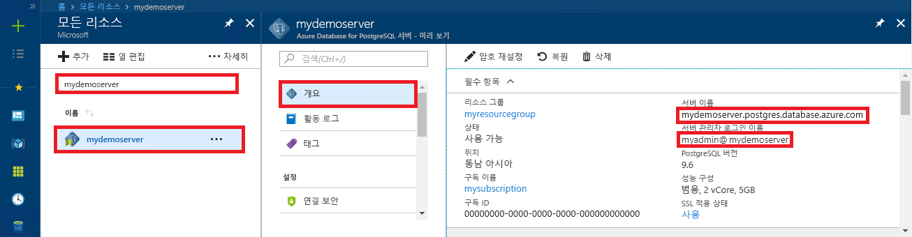

# <a name="azure-database-for-postgresql-use-go-language-to-connect-and-query-data"></a>PostgreSQL용 Azure Database: Go 언어를 사용하여 데이터 연결 및 쿼리
이 빠른 시작에서는 [Go](https://golang.org/) 언어(golang)로 작성된 코드를 사용하여 PostgreSQL용 Azure Database에 연결하는 방법을 보여줍니다. SQL 문을 사용하여 데이터베이스의 데이터를 쿼리, 삽입, 업데이트 및 삭제하는 방법을 보여 줍니다. 이 문서에서는 개발자가 Go를 사용하여 개발하는 것에 익숙하고 PostgreSQL용 Azure Database 작업에 익숙하지 않다고 가정합니다.

## <a name="prerequisites"></a>필수 조건
이 빠른 시작에서는 다음과 같은 가이드 중 하나에서 만들어진 리소스를 시작 지점으로 사용합니다.
- [DB 만들기 - 포털](quickstart-create-server-database-portal.md)
- [DB 만들기 - Azure CLI](quickstart-create-server-database-azure-cli.md)

## <a name="install-go-and-pq-connector"></a>Go 및 pq 커넥터 설치
사용자 컴퓨터에 [Go](https://golang.org/doc/install) 및 [Pure Go Postgres 드라이버(pq)](https://github.com/lib/pq)를 설치합니다. 사용하는 플랫폼에 따라 적절한 단계를 수행합니다.

### <a name="windows"></a> Windows
1. [설치 지침](https://golang.org/doc/install)에 따라 Microsoft Windows용 Go를 [다운로드](https://golang.org/dl/)하고 설치합니다.
2. [시작] 메뉴에서 [명령 프롬프트]를 선택합니다.
3. `mkdir  %USERPROFILE%\go\src\postgresqlgo`와 같이 프로젝트에 폴더를 만듭니다.
4. 디렉터리를 프로젝트 폴더로 변경합니다(예: `cd %USERPROFILE%\go\src\postgresqlgo`).
5. 소스 코드 디렉터리를 가리키도록 GOPATH에 대한 환경 변수를 설정합니다. `set GOPATH=%USERPROFILE%\go`
6. `go get github.com/lib/pq` 명령을 실행하여 [Pure Go Postgres 드라이버(pq)](https://github.com/lib/pq)를 설치합니다.

   요약하자면, Go 설치 후 명령 프롬프트에서 다음이 명령을 실행합니다.
   ```cmd
   mkdir  %USERPROFILE%\go\src\postgresqlgo
   cd %USERPROFILE%\go\src\postgresqlgo
   set GOPATH=%USERPROFILE%\go
   go get github.com/lib/pq
   ```

### <a name="linux-ubuntu"></a>Linux(Ubuntu)
1. Bash 셸을 시작합니다. 
2. `sudo apt-get install golang-go`를 실행하여 Go를 설치합니다.
3. 홈 디렉터리에서 프로젝트 폴더를 만듭니다(예: `mkdir -p ~/go/src/postgresqlgo/`).
4. 디렉터리를 폴더로 변경합니다(예: `cd ~/go/src/postgresqlgo/`).
5. 현재 홈 디렉터리의 go 폴더와 같이 유효한 소스 디렉터리를 가리키도록 GOPATH 환경 변수를 설정합니다. Bash 셸에서 `export GOPATH=~/go`를 실행하여 go 디렉터리를 현재 셸 세션에 대한 GOPATH로 추가합니다.
6. `go get github.com/lib/pq` 명령을 실행하여 [Pure Go Postgres 드라이버(pq)](https://github.com/lib/pq)를 설치합니다.

   요약하자면, 다음과 같은 Bash 명령을 실행합니다.
   ```bash
   sudo apt-get install golang-go
   mkdir -p ~/go/src/postgresqlgo/
   cd ~/go/src/postgresqlgo/
   export GOPATH=~/go/
   go get github.com/lib/pq
   ```

### <a name="apple-macos"></a>Apple macOS
1. 해당 플랫폼과 일치하는 [설치 지침](https://golang.org/doc/install)에 따라 Go를 다운로드하고 설치합니다. 
2. Bash 셸을 시작합니다. 
3. 홈 디렉터리에서 프로젝트 폴더를 만듭니다(예: `mkdir -p ~/go/src/postgresqlgo/`).
4. 디렉터리를 폴더로 변경합니다(예: `cd ~/go/src/postgresqlgo/`).
5. 현재 홈 디렉터리의 go 폴더와 같이 유효한 소스 디렉터리를 가리키도록 GOPATH 환경 변수를 설정합니다. Bash 셸에서 `export GOPATH=~/go`를 실행하여 go 디렉터리를 현재 셸 세션에 대한 GOPATH로 추가합니다.
6. `go get github.com/lib/pq` 명령을 실행하여 [Pure Go Postgres 드라이버(pq)](https://github.com/lib/pq)를 설치합니다.

   요약하자면, Go 설치 후 다음 bash 명령을 실행합니다.
   ```bash
   mkdir -p ~/go/src/postgresqlgo/
   cd ~/go/src/postgresqlgo/
   export GOPATH=~/go/
   go get github.com/lib/pq
   ```

## <a name="get-connection-information"></a>연결 정보 가져오기
PostgreSQL용 Azure Database에 연결하는 데 필요한 연결 정보를 가져옵니다. 정규화된 서버 이름 및 로그인 자격 증명이 필요합니다.

1. [Azure Portal](https://portal.azure.com/)에 로그인합니다.
2. Azure Portal의 왼쪽 메뉴에서 **모든 리소스**를 클릭한 다음, 방금 만든 서버를 검색합니다(예: **mydemoserver**).
3. 서버 이름을 클릭합니다.
4. 서버의 **개요** 패널에 있는 **서버 이름**과 **서버 관리자 로그인 이름**을 기록해 둡니다. 암호를 잊어버리면 이 패널에서 암호를 재설정할 수 있습니다.
 

## <a name="build-and-run-go-code"></a>Go 코드 작성 및 실행 
1. Golang 코드를 작성하려면 Microsoft Windows의 메모장, Ubuntu의 [vi](http://manpages.ubuntu.com/manpages/xenial/man1/nvi.1.html#contenttoc5) 또는 [Nano](https://www.nano-editor.org/), macOS의 TextEdit과 같은 일반 텍스트 편집기를 사용할 수 있습니다. 보다 풍부한 IDE(대화형 개발 환경)를 선호하는 경우 Jetbrains의 [Gogland](https://www.jetbrains.com/go/), Microsoft의 [Visual Studio Code](https://code.visualstudio.com/) 또는 [Atom](https://atom.io/)을 사용해 보세요.
2. 다음 섹션에서 Golang 코드를 텍스트 파일에 붙여넣고 파일 확장명 \*.go로 프로젝트 폴더에 저장합니다(예: Windows 경로 `%USERPROFILE%\go\src\postgresqlgo\createtable.go` 또는 Linux 경로 `~/go/src/postgresqlgo/createtable.go`).
3. 코드에서 `HOST`, `DATABASE`, `USER` 및 `PASSWORD` 상수를 찾아 예제 값을 사용자 고유의 값으로 바꿉니다.  
4. 명령 프롬프트 또는 Bash 셸을 시작합니다. 디렉터리를 프로젝트 폴더로 변경합니다. 예를 들어 Windows에서는 `cd %USERPROFILE%\go\src\postgresqlgo\`이고, Linux에서는 `cd ~/go/src/postgresqlgo/`를 실행합니다. 언급된 일부 IDE 환경에서는 셸 명령 없이 디버그 및 런타임 기능을 제공합니다.
5. `go run createtable.go` 명령을 입력하여 코드를 실행하고 응용 프로그램을 컴파일한 후 실행합니다. 
6. 또는 원시 애플리케이션 `go build createtable.go`에 코드를 빌드하려면 `createtable.exe`를 시작하여 애플리케이션을 실행합니다.

## <a name="connect-and-create-a-table"></a>테이블 연결 및 생성
**CREATE TABLE** SQL 문 다음에 테이블에 행을 추가하는 **INSERT INTO** SQL 문을 사용하여 테이블을 연결 및 생성하려면 다음 코드를 사용합니다.

이 코드는 [sql package](https://golang.org/pkg/database/sql/), PostgreSQL 서버와 통신할 때 드라이버로 사용되는 [pq package](https://godoc.org/github.com/lib/pq), 명령줄에 인쇄된 입력 및 출력을 위한 [fmt package](https://golang.org/pkg/fmt/) 등 세 개의 패키지를 가져옵니다.

이 코드는 [sql.Open()](https://godoc.org/github.com/lib/pq#Open) 메서드를 호출하여 Azure Database for PostgreSQL 데이터베이스에 연결하고 [db.Ping()](https://golang.org/pkg/database/sql/#DB.Ping) 메서드를 사용하여 연결을 확인합니다. [데이터베이스 핸들](https://golang.org/pkg/database/sql/#DB)은 이러한 과정 내내 사용되며 데이터베이스 서버에 대한 연결 풀을 보유합니다. 이 코드는 [Exec()](https://golang.org/pkg/database/sql/#DB.Exec) 메서드를 여러 번 호출하여 여러 SQL 명령을 실행합니다. 매번 사용자 지정 checkError() 메서드가 오류 발생 여부를 확인하여 오류가 발생하면 종료합니다.

`HOST`, `DATABASE`, `USER` 및 `PASSWORD` 매개 변수는 원하는 값으로 바꾸세요. 

```go
package main

import (
    "database/sql"
    "fmt"
    _ "github.com/lib/pq"
)

const (
    // Initialize connection constants.
    HOST     = "mydemoserver.postgres.database.azure.com"
    DATABASE = "mypgsqldb"
    USER     = "mylogin@mydemoserver"
    PASSWORD = "<server_admin_password>"
)

func checkError(err error) {
    if err != nil {
        panic(err)
    }
}

func main() {
    // Initialize connection string.
    var connectionString string = fmt.Sprintf("host=%s user=%s password=%s dbname=%s sslmode=require", HOST, USER, PASSWORD, DATABASE)

    // Initialize connection object.
    db, err := sql.Open("postgres", connectionString)
    checkError(err)

    err = db.Ping()
    checkError(err)
    fmt.Println("Successfully created connection to database")

    // Drop previous table of same name if one exists.
    _, err = db.Exec("DROP TABLE IF EXISTS inventory;")
    checkError(err)
    fmt.Println("Finished dropping table (if existed)")

    // Create table.
    _, err = db.Exec("CREATE TABLE inventory (id serial PRIMARY KEY, name VARCHAR(50), quantity INTEGER);")
    checkError(err)
    fmt.Println("Finished creating table")

    // Insert some data into table.
    sql_statement := "INSERT INTO inventory (name, quantity) VALUES ($1, $2);"
    _, err = db.Exec(sql_statement, "banana", 150)
    checkError(err)
    _, err = db.Exec(sql_statement, "orange", 154)
    checkError(err)
    _, err = db.Exec(sql_statement, "apple", 100)
    checkError(err)
    fmt.Println("Inserted 3 rows of data")
}
```

## <a name="read-data"></a>데이터 읽기
**SELECT** SQL 문을 사용하여 데이터를 연결하고 읽으려면 다음 코드를 사용하세요. 

이 코드는 [sql package](https://golang.org/pkg/database/sql/), PostgreSQL 서버와 통신할 때 드라이버로 사용되는 [pq package](https://godoc.org/github.com/lib/pq), 명령줄에 인쇄된 입력 및 출력을 위한 [fmt package](https://golang.org/pkg/fmt/) 등 세 개의 패키지를 가져옵니다.

이 코드는 [sql.Open()](https://godoc.org/github.com/lib/pq#Open) 메서드를 호출하여 Azure Database for PostgreSQL 데이터베이스에 연결하고 [db.Ping()](https://golang.org/pkg/database/sql/#DB.Ping) 메서드를 사용하여 연결을 확인합니다. [데이터베이스 핸들](https://golang.org/pkg/database/sql/#DB)은 이러한 과정 내내 사용되며 데이터베이스 서버에 대한 연결 풀을 보유합니다. select 쿼리는 [db.Query()](https://golang.org/pkg/database/sql/#DB.Query) 메서드를 호출하여 실행되고, 결과 행은 [행](https://golang.org/pkg/database/sql/#Rows) 형식의 변수에 보관됩니다. 코드는 [rows.Scan()](https://golang.org/pkg/database/sql/#Rows.Scan) 메서드를 사용하여 현재 행의 열 데이터 값을 읽고, 더 이상 행이 존재하지 않을 때까지 [rows.Next()](https://golang.org/pkg/database/sql/#Rows.Next) 반복기를 사용하여 행에 대해 반복됩니다. 각 행의 열 값은 콘솔에 출력됩니다. 매번 사용자 지정 checkError() 메서드가 오류 발생 여부를 확인하는 데 사용되고 오류가 발생하면 서둘러 종료합니다.

`HOST`, `DATABASE`, `USER` 및 `PASSWORD` 매개 변수는 원하는 값으로 바꾸세요. 

```go
package main

import (
    "database/sql"
    "fmt"
    _ "github.com/lib/pq"
)

const (
    // Initialize connection constants.
    HOST     = "mydemoserver.postgres.database.azure.com"
    DATABASE = "mypgsqldb"
    USER     = "mylogin@mydemoserver"
    PASSWORD = "<server_admin_password>"
)

func checkError(err error) {
    if err != nil {
        panic(err)
    }
}

func main() {

    // Initialize connection string.
    var connectionString string = fmt.Sprintf("host=%s user=%s password=%s dbname=%s sslmode=require", HOST, USER, PASSWORD, DATABASE)

    // Initialize connection object.
    db, err := sql.Open("postgres", connectionString)
    checkError(err)

    err = db.Ping()
    checkError(err)
    fmt.Println("Successfully created connection to database")

    // Read rows from table.
    var id int
    var name string
    var quantity int

    sql_statement := "SELECT * from inventory;"
    rows, err := db.Query(sql_statement)
    checkError(err)
    defer rows.Close()

    for rows.Next() {
        switch err := rows.Scan(&id, &name, &quantity); err {
        case sql.ErrNoRows:
            fmt.Println("No rows were returned")
        case nil:
            fmt.Printf("Data row = (%d, %s, %d)\n", id, name, quantity)
        default:
            checkError(err)
        }
    }
}
```

## <a name="update-data"></a>데이터 업데이트
**UPDATE** SQL 문을 사용하여 데이터를 연결하고 업데이트하려면 다음 코드를 사용합니다.

이 코드는 [sql package](https://golang.org/pkg/database/sql/), Postgres 서버와 통신할 때 드라이버로 사용되는 [pq package](https://godoc.org/github.com/lib/pq), 명령줄에 인쇄된 입력 및 출력을 위한 [fmt package](https://golang.org/pkg/fmt/) 등 세 개의 패키지를 가져옵니다.

이 코드는 [sql.Open()](https://godoc.org/github.com/lib/pq#Open) 메서드를 호출하여 Azure Database for PostgreSQL 데이터베이스에 연결하고 [db.Ping()](https://golang.org/pkg/database/sql/#DB.Ping) 메서드를 사용하여 연결을 확인합니다. [데이터베이스 핸들](https://golang.org/pkg/database/sql/#DB)은 이러한 과정 내내 사용되며 데이터베이스 서버에 대한 연결 풀을 보유합니다. 코드는 [Exec()](https://golang.org/pkg/database/sql/#DB.Exec) 메서드를 호출하여 테이블을 업데이트하는 SQL 문을 실행합니다. 사용자 지정 checkError() 메서드가 오류 발생 여부를 확인하는 데 사용되고 오류가 발생하면 서둘러 종료합니다.

`HOST`, `DATABASE`, `USER` 및 `PASSWORD` 매개 변수는 원하는 값으로 바꾸세요. 
```go
package main

import (
  "database/sql"
  _ "github.com/lib/pq"
  "fmt"
)

const (
    // Initialize connection constants.
    HOST     = "mydemoserver.postgres.database.azure.com"
    DATABASE = "mypgsqldb"
    USER     = "mylogin@mydemoserver"
    PASSWORD = "<server_admin_password>"
)

func checkError(err error) {
    if err != nil {
        panic(err)
    }
}

func main() {
    
    // Initialize connection string.
    var connectionString string = 
        fmt.Sprintf("host=%s user=%s password=%s dbname=%s sslmode=require", HOST, USER, PASSWORD, DATABASE)

    // Initialize connection object.
    db, err := sql.Open("postgres", connectionString)
    checkError(err)

    err = db.Ping()
    checkError(err)
    fmt.Println("Successfully created connection to database")

    // Modify some data in table.
    sql_statement := "UPDATE inventory SET quantity = $2 WHERE name = $1;"
    _, err = db.Exec(sql_statement, "banana", 200)
    checkError(err)
    fmt.Println("Updated 1 row of data")
}
```

## <a name="delete-data"></a>데이터 삭제
**DELETE** SQL 문을 사용하여 데이터를 연결하고 삭제하려면 다음 코드를 사용하세요. 

이 코드는 [sql package](https://golang.org/pkg/database/sql/), Postgres 서버와 통신할 때 드라이버로 사용되는 [pq package](https://godoc.org/github.com/lib/pq), 명령줄에 인쇄된 입력 및 출력을 위한 [fmt package](https://golang.org/pkg/fmt/) 등 세 개의 패키지를 가져옵니다.

이 코드는 [sql.Open()](https://godoc.org/github.com/lib/pq#Open) 메서드를 호출하여 Azure Database for PostgreSQL 데이터베이스에 연결하고 [db.Ping()](https://golang.org/pkg/database/sql/#DB.Ping) 메서드를 사용하여 연결을 확인합니다. [데이터베이스 핸들](https://golang.org/pkg/database/sql/#DB)은 이러한 과정 내내 사용되며 데이터베이스 서버에 대한 연결 풀을 보유합니다. 코드는 [Exec()](https://golang.org/pkg/database/sql/#DB.Exec) 메서드를 호출하여 테이블에서 행을 삭제하는 SQL 문을 실행합니다. 사용자 지정 checkError() 메서드가 오류 발생 여부를 확인하는 데 사용되고 오류가 발생하면 서둘러 종료합니다.

`HOST`, `DATABASE`, `USER` 및 `PASSWORD` 매개 변수는 원하는 값으로 바꾸세요. 
```go
package main

import (
  "database/sql"
  _ "github.com/lib/pq"
  "fmt"
)

const (
    // Initialize connection constants.
    HOST     = "mydemoserver.postgres.database.azure.com"
    DATABASE = "mypgsqldb"
    USER     = "mylogin@mydemoserver"
    PASSWORD = "<server_admin_password>"
)

func checkError(err error) {
    if err != nil {
        panic(err)
    }
}

func main() {
    
    // Initialize connection string.
    var connectionString string = 
        fmt.Sprintf("host=%s user=%s password=%s dbname=%s sslmode=require", HOST, USER, PASSWORD, DATABASE)

    // Initialize connection object.
    db, err := sql.Open("postgres", connectionString)
    checkError(err)

    err = db.Ping()
    checkError(err)
    fmt.Println("Successfully created connection to database")

    // Delete some data from table.
    sql_statement := "DELETE FROM inventory WHERE name = $1;"
    _, err = db.Exec(sql_statement, "orange")
    checkError(err)
    fmt.Println("Deleted 1 row of data")
}
```

## <a name="next-steps"></a>다음 단계
> [!div class="nextstepaction"]
> [내보내기 및 가져오기를 사용하여 데이터베이스 마이그레이션](./howto-migrate-using-export-and-import.md)
