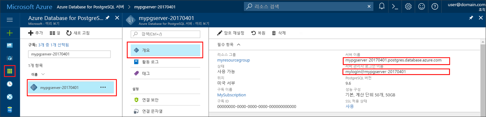

# <a name="azure-database-for-postgresql-use-nodejs-to-connect-and-query-data"></a>PostgreSQL용 Azure Database: Node.js를 사용하여 데이터 연결 및 쿼리
이 빠른 시작에서는 [Node.js](https://nodejs.org/) 응용 프로그램을 사용하여 Azure Database for PostgreSQL에 연결하는 방법을 보여줍니다. SQL 문을 사용하여 데이터베이스의 데이터를 쿼리, 삽입, 업데이트 및 삭제하는 방법을 보여 줍니다. 이 문서의 단계에서는 개발자가 Node.js를 사용하여 개발하는 것에 익숙하고 Azure Database for PostgreSQL 작업에 익숙하지 않다고 가정합니다.

## <a name="prerequisites"></a>필수 조건
이 빠른 시작에서는 다음과 같은 가이드 중 하나에서 만들어진 리소스를 시작 지점으로 사용합니다.
- [DB 만들기 - 포털](quickstart-create-server-database-portal.md)
- [DB 만들기 - CLI](quickstart-create-server-database-azure-cli.md)

다음과 같은 작업도 필요합니다.
- [Node.js](https://nodejs.org)

## <a name="install-pg-client"></a>Pg 클라이언트 설치
Node.js용 PostgreSQL 클라이언트인 [pg](https://www.npmjs.com/package/pg)를 설치합니다.

이렇게 하려면 pg 클라이언트를 설치하기 위한 명령줄에서 JavaScript에 대한 노드 패키지 관리자(npm)를 실행합니다.
```bash
npm install pg
```

설치된 패키지를 나열하여 설치를 확인합니다.
```bash
npm list
```

## <a name="get-connection-information"></a>연결 정보 가져오기
PostgreSQL용 Azure Database에 연결하는 데 필요한 연결 정보를 가져옵니다. 정규화된 서버 이름 및 로그인 자격 증명이 필요합니다.

1. [Azure Portal](https://portal.azure.com/)에 로그인합니다.
2. Azure Portal의 왼쪽 메뉴에서 **모든 리소스**를 클릭한 다음, 방금 만든 서버를 검색합니다(예: **mydemoserver**).
3. 서버 이름을 클릭합니다.
4. 서버의 **개요** 패널에 있는 **서버 이름**과 **서버 관리자 로그인 이름**을 기록해 둡니다. 암호를 잊어버리면 이 패널에서 암호를 재설정할 수 있습니다.
 

## <a name="running-the-javascript-code-in-nodejs"></a>Node.js에서 JavaScript 코드 실행
`node`를 입력하여 bash 셸, 터미널 또는 Windows 명령 프롬프트에서 Node.js를 시작한 다음, 예시 JavaScript 코드를 복사하여 프롬프트에 붙여넣어 대화형으로 실행할 수 있습니다. 또는 JavaScript 코드를 텍스트 파일로 저장하고 파일 이름을 매개 변수로 지정한 `node filename.js`를 시작하여 실행할 수 있습니다.

## <a name="connect-create-table-and-insert-data"></a>테이블 연결, 생성 및 데이터 삽입
**CREATE TABLE** 및 **INSERT INTO** SQL 문을 사용하여 데이터를 연결하고 로드하려면 다음 코드를 사용하세요.
[pg.Client](https://github.com/brianc/node-postgres/wiki/Client) 개체는 PostgreSQL 서버와 상호 작용하는 데 사용됩니다. [pg.Client.connect()](https://github.com/brianc/node-postgres/wiki/Client#method-connect) 함수는 서버에 연결하는 데 사용됩니다. [pg.Client.query()](https://github.com/brianc/node-postgres/wiki/Query) 함수는 PostgreSQL 데이터베이스에 대해 SQL 쿼리를 실행하는 데 사용됩니다. 

host, dbname, user 및 password 매개 변수는 서버 및 데이터베이스를 만들 때 지정한 값으로 바꾸세요.

```javascript
const pg = require('pg');

const config = {
    host: '<your-db-server-name>.postgres.database.azure.com',
    // Do not hard code your username and password.
    // Consider using Node environment variables.
    user: '<your-db-username>',     
    password: '<your-password>',
    database: '<name-of-database>',
    port: 5432,
    ssl: true
};

const client = new pg.Client(config);

client.connect(err => {
    if (err) throw err;
    else {
        queryDatabase();
    }
});

function queryDatabase() {
    const query = `
        DROP TABLE IF EXISTS inventory;
        CREATE TABLE inventory (id serial PRIMARY KEY, name VARCHAR(50), quantity INTEGER);
        INSERT INTO inventory (name, quantity) VALUES ('banana', 150);
        INSERT INTO inventory (name, quantity) VALUES ('orange', 154);
        INSERT INTO inventory (name, quantity) VALUES ('apple', 100);
    `;

    client
        .query(query)
        .then(() => {
            console.log('Table created successfully!');
            client.end(console.log('Closed client connection'));
        })
        .catch(err => console.log(err))
        .then(() => {
            console.log('Finished execution, exiting now');
            process.exit();
        });
}
```

## <a name="read-data"></a>데이터 읽기
**SELECT** SQL 문을 사용하여 데이터를 연결하고 읽으려면 다음 코드를 사용하세요. [pg.Client](https://github.com/brianc/node-postgres/wiki/Client) 개체는 PostgreSQL 서버와 상호 작용하는 데 사용됩니다. [pg.Client.connect()](https://github.com/brianc/node-postgres/wiki/Client#method-connect) 함수는 서버에 연결하는 데 사용됩니다. [pg.Client.query()](https://github.com/brianc/node-postgres/wiki/Query) 함수는 PostgreSQL 데이터베이스에 대해 SQL 쿼리를 실행하는 데 사용됩니다. 

host, dbname, user 및 password 매개 변수는 서버 및 데이터베이스를 만들 때 지정한 값으로 바꾸세요. 

```javascript
const pg = require('pg');

const config = {
    host: '<your-db-server-name>.postgres.database.azure.com',
    // Do not hard code your username and password.
    // Consider using Node environment variables.
    user: '<your-db-username>',     
    password: '<your-password>',
    database: '<name-of-database>',
    port: 5432,
    ssl: true
};

const client = new pg.Client(config);

client.connect(err => {
    if (err) throw err;
    else { queryDatabase(); }
});

function queryDatabase() {
  
    console.log(`Running query to PostgreSQL server: ${config.host}`);

    const query = 'SELECT * FROM inventory;';

    client.query(query)
        .then(res => {
            const rows = res.rows;

            rows.map(row => {
                console.log(`Read: ${JSON.stringify(row)}`);
            });

            process.exit();
        })
        .catch(err => {
            console.log(err);
        });
}
```

## <a name="update-data"></a>데이터 업데이트
**UPDATE** SQL 문을 사용하여 데이터를 연결하고 읽으려면 다음 코드를 사용하세요. [pg.Client](https://github.com/brianc/node-postgres/wiki/Client) 개체는 PostgreSQL 서버와 상호 작용하는 데 사용됩니다. [pg.Client.connect()](https://github.com/brianc/node-postgres/wiki/Client#method-connect) 함수는 서버에 연결하는 데 사용됩니다. [pg.Client.query()](https://github.com/brianc/node-postgres/wiki/Query) 함수는 PostgreSQL 데이터베이스에 대해 SQL 쿼리를 실행하는 데 사용됩니다. 

host, dbname, user 및 password 매개 변수는 서버 및 데이터베이스를 만들 때 지정한 값으로 바꾸세요. 

```javascript
const pg = require('pg');

const config = {
    host: '<your-db-server-name>.postgres.database.azure.com',
    // Do not hard code your username and password.
    // Consider using Node environment variables.
    user: '<your-db-username>',     
    password: '<your-password>',
    database: '<name-of-database>',
    port: 5432,
    ssl: true
};

const client = new pg.Client(config);

client.connect(err => {
    if (err) throw err;
    else {
        queryDatabase();
    }
});

function queryDatabase() {
    const query = `
        UPDATE inventory 
        SET quantity= 1000 WHERE name='banana';
    `;

    client
        .query(query)
        .then(result => {
            console.log('Update completed');
            console.log(`Rows affected: ${result.rowCount}`);
        })
        .catch(err => {
            console.log(err);
            throw err;
        });
}
```

## <a name="delete-data"></a>데이터 삭제
**DELETE** SQL 문을 사용하여 데이터를 연결하고 읽으려면 다음 코드를 사용하세요. [pg.Client](https://github.com/brianc/node-postgres/wiki/Client) 개체는 PostgreSQL 서버와 상호 작용하는 데 사용됩니다. [pg.Client.connect()](https://github.com/brianc/node-postgres/wiki/Client#method-connect) 함수는 서버에 연결하는 데 사용됩니다. [pg.Client.query()](https://github.com/brianc/node-postgres/wiki/Query) 함수는 PostgreSQL 데이터베이스에 대해 SQL 쿼리를 실행하는 데 사용됩니다. 

host, dbname, user 및 password 매개 변수는 서버 및 데이터베이스를 만들 때 지정한 값으로 바꾸세요. 

```javascript
const pg = require('pg');

const config = {
    host: '<your-db-server-name>.postgres.database.azure.com',
    // Do not hard code your username and password.
    // Consider using Node environment variables.
    user: '<your-db-username>',     
    password: '<your-password>',
    database: '<name-of-database>',
    port: 5432,
    ssl: true
};

const client = new pg.Client(config);

client.connect(err => {
    if (err) {
        throw err;
    } else {
        queryDatabase();
    }
});

function queryDatabase() {
    const query = `
        DELETE FROM inventory 
        WHERE name = 'apple';
    `;

    client
        .query(query)
        .then(result => {
            console.log('Delete completed');
            console.log(`Rows affected: ${result.rowCount}`);
        })
        .catch(err => {
            console.log(err);
            throw err;
        });
}
```

## <a name="next-steps"></a>다음 단계
> [!div class="nextstepaction"]
> [내보내기 및 가져오기를 사용하여 데이터베이스 마이그레이션](./howto-migrate-using-export-and-import.md)
