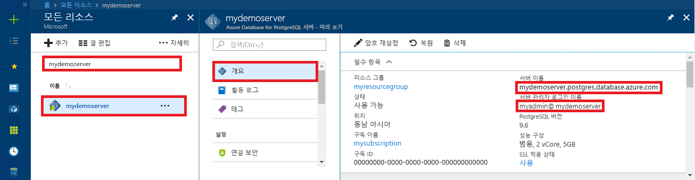

# <a name="azure-database-for-postgresql-use-php-to-connect-and-query-data"></a>Azure Database for PostgreSQL: PHP를 사용하여 데이터 연결 및 쿼리
이 빠른 시작에서는 [PHP](https://secure.php.net/manual/intro-whatis.php) 애플리케이션을 사용하여 Azure Database for PostgreSQL에 연결하는 방법을 보여줍니다. SQL 문을 사용하여 데이터베이스의 데이터를 쿼리, 삽입, 업데이트 및 삭제하는 방법을 보여 줍니다. 이 문서의 단계에서는 개발자가 PHP를 사용하여 개발하는 것에 익숙하고 Azure Database for PostgreSQL 작업에 익숙하지 않다고 가정합니다.

## <a name="prerequisites"></a>필수 조건
이 빠른 시작에서는 다음과 같은 가이드 중 하나에서 만들어진 리소스를 시작 지점으로 사용합니다.
- [DB 만들기 - 포털](quickstart-create-server-database-portal.md)
- [DB 만들기 - Azure CLI](quickstart-create-server-database-azure-cli.md)

## <a name="install-php"></a>PHP 설치
사용자의 서버에 PHP를 설치하거나 PHP를 포함하는 Azure [웹앱](../app-service/overview.md)을 만듭니다.

### <a name="windows"></a> Windows
- [PHP 7.1.4 스레드로부터 안전하지 않은(x64) 버전](https://windows.php.net/download#php-7.1) 다운로드
- PHP를 설치하고 [PHP 매뉴얼](https://secure.php.net/manual/install.windows.php)에서 자세한 구성 정보 참조
- 이 코드는 PHP 설치에 포함된 **pgsql** 클래스(ext/php_pgsql.dll)를 사용합니다. 
- 일반적으로 `C:\Program Files\PHP\v7.1\php.ini`에 있는 php.ini 구성 파일을 편집하여 **pgsql** 확장을 활성화했습니다. 구성 파일에는 `extension=php_pgsql.so` 텍스트가 있는 줄이 포함되어야 합니다. 표시되지 않는 경우 텍스트를 추가하고 파일을 저장합니다. 텍스트가 있지만 세미콜론 접두사로 주석 처리된 경우 세미콜론을 제거하여 주석 처리를 제거합니다.

### <a name="linux-ubuntu"></a>Linux(Ubuntu)
- [PHP 7.1.4 스레드로부터 안전하지 않은(x64) 버전](https://secure.php.net/downloads.php) 다운로드 
- PHP를 설치하고 [PHP 매뉴얼](https://secure.php.net/manual/install.unix.php)에서 자세한 구성 정보 참조
- 이 코드는 **pgsql** 클래스(php_pgsql.so)를 사용합니다. `sudo apt-get install php-pgsql`을 실행하여 설치합니다.
- `/etc/php/7.0/mods-available/pgsql.ini` 구성 파일을 편집하여 **pgsql** 확장을 활성화했습니다. 구성 파일에는 `extension=php_pgsql.so` 텍스트가 있는 줄이 포함되어야 합니다. 표시되지 않는 경우 텍스트를 추가하고 파일을 저장합니다. 텍스트가 있지만 세미콜론 접두사로 주석 처리된 경우 세미콜론을 제거하여 주석 처리를 제거합니다.

### <a name="macos"></a>MacOS
- [PHP 7.1.4 버전](https://secure.php.net/downloads.php) 다운로드
- PHP를 설치하고 [PHP 매뉴얼](https://secure.php.net/manual/install.macosx.php)에서 자세한 구성 정보 참조

## <a name="get-connection-information"></a>연결 정보 가져오기
PostgreSQL용 Azure Database에 연결하는 데 필요한 연결 정보를 가져옵니다. 정규화된 서버 이름 및 로그인 자격 증명이 필요합니다.

1. [Azure Portal](https://portal.azure.com/)에 로그인합니다.
2. Azure Portal의 왼쪽 메뉴에서 **모든 리소스**를 클릭한 다음, 방금 만든 서버를 검색합니다(예: **mydemoserver**).
3. 서버 이름을 클릭합니다.
4. 서버의 **개요** 패널에 있는 **서버 이름**과 **서버 관리자 로그인 이름**을 기록해 둡니다. 암호를 잊어버리면 이 패널에서 암호를 재설정할 수 있습니다.
 

## <a name="connect-and-create-a-table"></a>테이블 연결 및 생성
**CREATE TABLE** SQL 문 다음에 테이블에 행을 추가하는 **INSERT INTO** SQL 문을 사용하여 테이블을 연결 및 생성하려면 다음 코드를 사용합니다.

이 코드는 [pg_connect()](https://secure.php.net/manual/en/function.pg-connect.php) 메서드를 호출하여 PostgreSQL용 Azure Database에 연결합니다. 그런 다음 [pg_query()](https://secure.php.net/manual/en/function.pg-query.php) 메서드를 여러 번 호출하여 여러 명령을 실행하고 오류가 발생할 때마다 [pg_last_error()](https://secure.php.net/manual/en/function.pg-last-error.php) 메서드를 호출하여 세부 정보를 확인합니다. 그런 다음 [pg_close()](https://secure.php.net/manual/en/function.pg-close.php) 메서드를 호출하여 연결을 닫습니다.

`$host`, `$database`, `$user` 및 `$password` 매개 변수는 원하는 값으로 바꾸세요. 

```php
<?php
    // Initialize connection variables.
    $host = "mydemoserver.postgres.database.azure.com";
    $database = "mypgsqldb";
    $user = "mylogin@mydemoserver";
    $password = "<server_admin_password>";

    // Initialize connection object.
    $connection = pg_connect("host=$host dbname=$database user=$user password=$password") 
        or die("Failed to create connection to database: ". pg_last_error(). "<br/>");
    print "Successfully created connection to database.<br/>";

    // Drop previous table of same name if one exists.
    $query = "DROP TABLE IF EXISTS inventory;";
    pg_query($connection, $query) 
        or die("Encountered an error when executing given sql statement: ". pg_last_error(). "<br/>");
    print "Finished dropping table (if existed).<br/>";

    // Create table.
    $query = "CREATE TABLE inventory (id serial PRIMARY KEY, name VARCHAR(50), quantity INTEGER);";
    pg_query($connection, $query) 
        or die("Encountered an error when executing given sql statement: ". pg_last_error(). "<br/>");
    print "Finished creating table.<br/>";

    // Insert some data into table.
    $name = '\'banana\'';
    $quantity = 150;
    $query = "INSERT INTO inventory (name, quantity) VALUES ($1, $2);";
    pg_query($connection, $query) 
        or die("Encountered an error when executing given sql statement: ". pg_last_error(). "<br/>");

    $name = '\'orange\'';
    $quantity = 154;
    $query = "INSERT INTO inventory (name, quantity) VALUES ($name, $quantity);";
    pg_query($connection, $query) 
        or die("Encountered an error when executing given sql statement: ". pg_last_error(). "<br/>");

    $name = '\'apple\'';
    $quantity = 100;
    $query = "INSERT INTO inventory (name, quantity) VALUES ($name, $quantity);";
    pg_query($connection, $query) 
        or die("Encountered an error when executing given sql statement: ". pg_last_error()). "<br/>";

    print "Inserted 3 rows of data.<br/>";

    // Closing connection
    pg_close($connection);
?>
```

## <a name="read-data"></a>데이터 읽기
**SELECT** SQL 문을 사용하여 데이터를 연결하고 읽으려면 다음 코드를 사용하세요. 

 이 코드는 [pg_connect()](https://secure.php.net/manual/en/function.pg-connect.php) 메서드를 호출하여 PostgreSQL용 Azure Database에 연결합니다. 그런 다음 [pg_query()](https://secure.php.net/manual/en/function.pg-query.php) 메서드를 호출하여 SELECT 명령을 실행하고, 결과 집합에 결과를 보관하고, 오류가 발생할 때마다 [pg_last_error()](https://secure.php.net/manual/en/function.pg-last-error.php) 메서드를 호출하여 세부 정보를 확인합니다.  결과 집합을 읽으려면 루프에 행별로 [pg_fetch_row()](https://secure.php.net/manual/en/function.pg-fetch-row.php) 메서드를 호출하고, 행 데이터가 각 배열 위치에 열당 데이터 값이 하나 있는 배열 `$row`를 검색합니다.  결과 집합을 해제하려면 [pg_free_result()](https://secure.php.net/manual/en/function.pg-free-result.php) 메서드를 호출합니다. 그런 다음 [pg_close()](https://secure.php.net/manual/en/function.pg-close.php) 메서드를 호출하여 연결을 닫습니다.

`$host`, `$database`, `$user` 및 `$password` 매개 변수는 원하는 값으로 바꾸세요. 

```php
<?php
    // Initialize connection variables.
    $host = "mydemoserver.postgres.database.azure.com";
    $database = "mypgsqldb";
    $user = "mylogin@mydemoserver";
    $password = "<server_admin_password>";
    
    // Initialize connection object.
    $connection = pg_connect("host=$host dbname=$database user=$user password=$password")
                or die("Failed to create connection to database: ". pg_last_error(). "<br/>");

    print "Successfully created connection to database. <br/>";

    // Perform some SQL queries over the connection.
    $query = "SELECT * from inventory";
    $result_set = pg_query($connection, $query) 
        or die("Encountered an error when executing given sql statement: ". pg_last_error(). "<br/>");
    while ($row = pg_fetch_row($result_set))
    {
        print "Data row = ($row[0], $row[1], $row[2]). <br/>";
    }

    // Free result_set
    pg_free_result($result_set);

    // Closing connection
    pg_close($connection);
?>
```

## <a name="update-data"></a>데이터 업데이트
**UPDATE** SQL 문을 사용하여 데이터를 연결하고 업데이트하려면 다음 코드를 사용하세요.

이 코드는 [pg_connect()](https://secure.php.net/manual/en/function.pg-connect.php) 메서드를 호출하여 PostgreSQL용 Azure Database에 연결합니다. 그런 다음 [pg_query()](https://secure.php.net/manual/en/function.pg-query.php) 메서드를 호출하여 명령을 실행하고 오류가 발생할 때마다 [pg_last_error()](https://secure.php.net/manual/en/function.pg-last-error.php) 메서드를 호출하여 세부 정보를 확인합니다. 그런 다음 [pg_close()](https://secure.php.net/manual/en/function.pg-close.php) 메서드를 호출하여 연결을 닫습니다.

`$host`, `$database`, `$user` 및 `$password` 매개 변수는 원하는 값으로 바꾸세요. 

```php
<?php
    // Initialize connection variables.
    $host = "mydemoserver.postgres.database.azure.com";
    $database = "mypgsqldb";
    $user = "mylogin@mydemoserver";
    $password = "<server_admin_password>";

    // Initialize connection object.
    $connection = pg_connect("host=$host dbname=$database user=$user password=$password")
                or die("Failed to create connection to database: ". pg_last_error(). ".<br/>");

    print "Successfully created connection to database. <br/>";

    // Modify some data in table.
    $new_quantity = 200;
    $name = '\'banana\'';
    $query = "UPDATE inventory SET quantity = $new_quantity WHERE name = $name;";
    pg_query($connection, $query) 
        or die("Encountered an error when executing given sql statement: ". pg_last_error(). ".<br/>");
    print "Updated 1 row of data. </br>";

    // Closing connection
    pg_close($connection);
?>
```


## <a name="delete-data"></a>데이터 삭제
**DELETE** SQL 문을 사용하여 데이터를 연결하고 읽으려면 다음 코드를 사용하세요. 

 이 코드는 [pg_connect()](https://secure.php.net/manual/en/function.pg-connect.php) 메서드를 호출하여 PostgreSQL용 Azure Database에 연결합니다. 그런 다음 [pg_query()](https://secure.php.net/manual/en/function.pg-query.php) 메서드를 호출하여 명령을 실행하고 오류가 발생할 때마다 [pg_last_error()](https://secure.php.net/manual/en/function.pg-last-error.php) 메서드를 호출하여 세부 정보를 확인합니다. 그런 다음 [pg_close()](https://secure.php.net/manual/en/function.pg-close.php) 메서드를 호출하여 연결을 닫습니다.

`$host`, `$database`, `$user` 및 `$password` 매개 변수는 원하는 값으로 바꾸세요. 

```php
<?php
    // Initialize connection variables.
    $host = "mydemoserver.postgres.database.azure.com";
    $database = "mypgsqldb";
    $user = "mylogin@mydemoserver";
    $password = "<server_admin_password>";

    // Initialize connection object.
    $connection = pg_connect("host=$host dbname=$database user=$user password=$password")
            or die("Failed to create connection to database: ". pg_last_error(). ". </br>");

    print "Successfully created connection to database. <br/>";

    // Delete some data from table.
    $name = '\'orange\'';
    $query = "DELETE FROM inventory WHERE name = $name;";
    pg_query($connection, $query) 
        or die("Encountered an error when executing given sql statement: ". pg_last_error(). ". <br/>");
    print "Deleted 1 row of data. <br/>";

    // Closing connection
    pg_close($connection);
?>
```

## <a name="next-steps"></a>다음 단계
> [!div class="nextstepaction"]
> [내보내기 및 가져오기를 사용하여 데이터베이스 마이그레이션](./howto-migrate-using-export-and-import.md)
