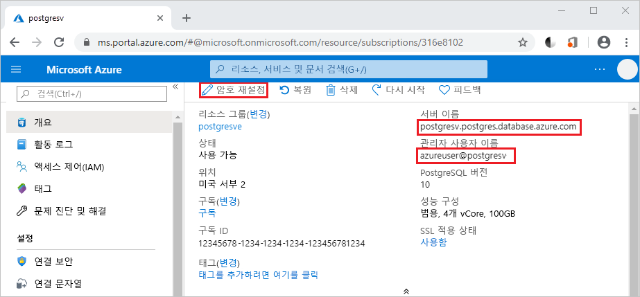

# <a name="azure-database-for-postgresql---single-server-use-python-to-connect-and-query-data"></a>Azure Database for PostgreSQL - 단일 서버: Python을 사용하여 데이터 연결 및 쿼리
이 빠른 시작에서는 [Python](https://python.org)을 사용하여 Azure Database for PostgreSQL에 연결하는 방법을 보여 줍니다. SQL 문을 사용하여 macOS, Ubuntu Linux 및 Windows 플랫폼에서 데이터베이스의 데이터를 쿼리, 삽입, 업데이트 및 삭제하는 방법도 보여 줍니다. 이 문서의 단계에서는 개발자가 Python을 사용하여 개발하는 것에 익숙하고 PostgreSQL용 Azure Database 작업에 익숙하지 않다고 가정합니다.

## <a name="prerequisites"></a>필수 조건
이 빠른 시작에서는 다음과 같은 가이드 중 하나에서 만들어진 리소스를 시작 지점으로 사용합니다.
- [DB 만들기 - 포털](quickstart-create-server-database-portal.md)
- [DB 만들기 - CLI](quickstart-create-server-database-azure-cli.md)

다음 항목도 필요합니다.
- [python](https://www.python.org/downloads/) 설치
- [pip](https://pip.pypa.io/en/stable/installing/) 패키지 설치([python.org](https://python.org)에서 다운로드한 Python 2 >=2.7.9 또는 Python 3 >=3.4 이진 파일을 사용하는 경우 pip가 이미 설치됨)

## <a name="install-the-python-connection-libraries-for-postgresql"></a>PostgreSQL용 Python 연결 라이브러리 설치
데이터베이스를 연결하고 쿼리할 수 있는 [psycopg2](http://initd.org/psycopg/docs/install.html) 패키지를 설치합니다. psycopg2는 가장 일반적인 플랫폼(Linux, OSX, Windows)에 대한 [휠](https://pythonwheels.com/) 패키지 형태로 [PyPI에서 제공](https://pypi.python.org/pypi/psycopg2/)됩니다. 모든 종속 관계를 포함한 모듈의 이진 버전을 가져오려면 pip 설치를 사용합니다.

1. 자신의 컴퓨터에서 명령줄 인터페이스를 시작합니다.
    - Linux에서 Bash 셸을 시작합니다.
    - macOS에서 터미널을 시작합니다.
    - Windows의 [시작] 메뉴에서 [명령 프롬프트]를 시작합니다.
2. 다음과 같은 명령을 실행하여 가장 최신 버전의 pip를 사용하고 있는지 확인합니다.
    ```cmd
    pip install -U pip
    ```

3. 다음 명령을 실행하여 psycopg2 패키지를 설치합니다.
    ```cmd
    pip install psycopg2
    ```

## <a name="get-connection-information"></a>연결 정보 가져오기
PostgreSQL용 Azure Database에 연결하는 데 필요한 연결 정보를 가져옵니다. 정규화된 서버 이름 및 로그인 자격 증명이 필요합니다.

1. [Azure Portal](https://portal.azure.com/)에 로그인합니다.
2. Azure Portal의 왼쪽 메뉴에서 **모든 리소스**를 클릭한 다음, 방금 만든 서버를 검색합니다(예: **mydemoserver**).
3. 서버 이름을 클릭합니다.
4. 서버의 **개요** 패널에 있는 **서버 이름**과 **서버 관리자 로그인 이름**을 기록해 둡니다. 암호를 잊어버리면 이 패널에서 암호를 재설정할 수 있습니다.
 

## <a name="how-to-run-python-code"></a>Python 코드를 실행하는 방법
이 문서에는 각각 특정 기능을 수행하는 총 4가지 샘플 코드가 포함되어 있습니다. 다음 지침에서는 텍스트 파일을 만들고, 코드 블록을 삽입한 후 나중에 실행할 수 있도록 파일을 저장하는 방법을 보여 줍니다. 각 코드 블록당 하나씩 4개의 별도의 파일을 만들어야 합니다.

- 원하는 텍스트 편집기를 사용하여 새 파일을 만듭니다.
- 다음 섹션의 샘플 코드 중 하나를 텍스트 파일에 복사하여 붙여넣습니다. **host**, **dbname**, **user** 및 **password** 매개 변수는 서버 및 데이터베이스를 만들 때 지정한 값으로 바꿉니다.
- 프로젝트 폴더에 .py 확장명으로 파일을 저장합니다(예: postgres.py). Windows에서 실행하는 경우 파일을 저장할 때 UTF-8 인코딩을 선택해야 합니다. 
- 명령 프롬프트, 터미널 또는 Bash 셸을 시작한 후 디렉터리를 프로젝트 폴더로 변경합니다(예: `cd postgres`).
-  코드를 실행하려면 Python 명령 다음에 파일 이름을 입력합니다(예: `Python postgres.py`).

> [!NOTE]
> Python 버전 3부터는 다음 코드 블록을 실행할 때 `SyntaxError: Missing parentheses in call to 'print'` 오류가 표시될 수 있습니다. 이 경우 `print "string"` 명령에 대한 각 호출을 함수 호출(괄호 사용)로 바꾸세요(예: `print("string")`).

## <a name="connect-create-table-and-insert-data"></a>테이블 연결, 생성 및 데이터 삽입
**INSERT** SQL 문이 있는 [psycopg2.connect](http://initd.org/psycopg/docs/connection.html) 함수를 사용하여 데이터를 연결하고 로드하려면 다음 코드를 사용하세요. [cursor.execute](http://initd.org/psycopg/docs/cursor.html#execute) 함수는 PostgreSQL 데이터베이스에 대해 SQL 쿼리를 실행하는 데 사용됩니다. host, dbname, user 및 password 매개 변수는 서버 및 데이터베이스를 만들 때 지정한 값으로 바꾸세요.

```Python
import psycopg2

# Update connection string information obtained from the portal
host = "mydemoserver.postgres.database.azure.com"
user = "mylogin@mydemoserver"
dbname = "mypgsqldb"
password = "<server_admin_password>"
sslmode = "require"

# Construct connection string
conn_string = "host={0} user={1} dbname={2} password={3} sslmode={4}".format(host, user, dbname, password, sslmode)
conn = psycopg2.connect(conn_string) 
print "Connection established"

cursor = conn.cursor()

# Drop previous table of same name if one exists
cursor.execute("DROP TABLE IF EXISTS inventory;")
print "Finished dropping table (if existed)"

# Create table
cursor.execute("CREATE TABLE inventory (id serial PRIMARY KEY, name VARCHAR(50), quantity INTEGER);")
print "Finished creating table"

# Insert some data into table
cursor.execute("INSERT INTO inventory (name, quantity) VALUES (%s, %s);", ("banana", 150))
cursor.execute("INSERT INTO inventory (name, quantity) VALUES (%s, %s);", ("orange", 154))
cursor.execute("INSERT INTO inventory (name, quantity) VALUES (%s, %s);", ("apple", 100))
print "Inserted 3 rows of data"

# Cleanup
conn.commit()
cursor.close()
conn.close()
```

코드가 성공적으로 실행되면 출력은 다음과 같이 나타납니다.


## <a name="read-data"></a>데이터 읽기
[cursor.execute](http://initd.org/psycopg/docs/cursor.html#execute) 함수와 **SELECT** SQL 문을 사용하여 삽입된 데이터를 읽으려면 다음 코드를 사용하세요. 이 함수는 쿼리를 허용하며, [cursor.fetchall()](http://initd.org/psycopg/docs/cursor.html#cursor.fetchall)을 사용하여 반복될 수 있는 결과 집합을 반환합니다. host, dbname, user 및 password 매개 변수는 서버 및 데이터베이스를 만들 때 지정한 값으로 바꾸세요.

```Python
import psycopg2

# Update connection string information obtained from the portal
host = "mydemoserver.postgres.database.azure.com"
user = "mylogin@mydemoserver"
dbname = "mypgsqldb"
password = "<server_admin_password>"
sslmode = "require"

# Construct connection string
conn_string = "host={0} user={1} dbname={2} password={3} sslmode={4}".format(host, user, dbname, password, sslmode)
conn = psycopg2.connect(conn_string) 
print "Connection established"

cursor = conn.cursor()

# Fetch all rows from table
cursor.execute("SELECT * FROM inventory;")
rows = cursor.fetchall()

# Print all rows
for row in rows:
    print "Data row = (%s, %s, %s)" %(str(row[0]), str(row[1]), str(row[2]))

# Cleanup
conn.commit()
cursor.close()
conn.close()
```

## <a name="update-data"></a>데이터 업데이트
[cursor.execute](http://initd.org/psycopg/docs/cursor.html#execute) 함수와 **UPDATE** SQL 문을 사용하여 이전에 삽입된 인벤토리 행을 업데이트하려면 다음 코드를 사용하세요. host, dbname, user 및 password 매개 변수는 서버 및 데이터베이스를 만들 때 지정한 값으로 바꾸세요.

```Python
import psycopg2

# Update connection string information obtained from the portal
host = "mydemoserver.postgres.database.azure.com"
user = "mylogin@mydemoserver"
dbname = "mypgsqldb"
password = "<server_admin_password>"
sslmode = "require"

# Construct connection string
conn_string = "host={0} user={1} dbname={2} password={3} sslmode={4}".format(host, user, dbname, password, sslmode)
conn = psycopg2.connect(conn_string) 
print "Connection established"

cursor = conn.cursor()

# Update a data row in the table
cursor.execute("UPDATE inventory SET quantity = %s WHERE name = %s;", (200, "banana"))
print "Updated 1 row of data"

# Cleanup
conn.commit()
cursor.close()
conn.close()
```

## <a name="delete-data"></a>데이터 삭제
[cursor.execute](http://initd.org/psycopg/docs/cursor.html#execute) 함수와 **DELETE** SQL 문을 사용하여 이전에 삽입된 인벤토리 항목을 삭제하려면 다음 코드를 사용하세요. host, dbname, user 및 password 매개 변수는 서버 및 데이터베이스를 만들 때 지정한 값으로 바꾸세요.

```Python
import psycopg2

# Update connection string information obtained from the portal
host = "mydemoserver.postgres.database.azure.com"
user = "mylogin@mydemoserver"
dbname = "mypgsqldb"
password = "<server_admin_password>"
sslmode = "require"

# Construct connection string
conn_string = "host={0} user={1} dbname={2} password={3} sslmode={4}".format(host, user, dbname, password, sslmode)
conn = psycopg2.connect(conn_string) 
print "Connection established"

cursor = conn.cursor()

# Delete data row from table
cursor.execute("DELETE FROM inventory WHERE name = %s;", ("orange",))
print "Deleted 1 row of data"

# Cleanup
conn.commit()
cursor.close()
conn.close()
```

## <a name="next-steps"></a>다음 단계
> [!div class="nextstepaction"]
> [내보내기 및 가져오기를 사용하여 데이터베이스 마이그레이션](./howto-migrate-using-export-and-import.md)
