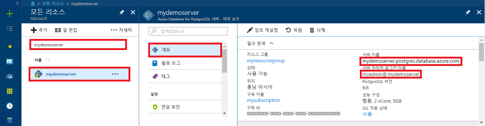

# <a name="azure-database-for-postgresql-use-ruby-to-connect-and-query-data"></a>PostgreSQL용 Azure Database: Ruby를 사용하여 데이터 연결 및 쿼리
이 빠른 시작에서는 [Ruby](https://www.ruby-lang.org) 애플리케이션을 사용하여 Azure Database for PostgreSQL에 연결하는 방법을 보여줍니다. SQL 문을 사용하여 데이터베이스의 데이터를 쿼리, 삽입, 업데이트 및 삭제하는 방법을 보여 줍니다. 이 문서의 단계에서는 개발자가 Ruby를 사용하여 개발하는 것에 익숙하고 Azure Database for PostgreSQL 작업에 익숙하지 않다고 가정합니다.

## <a name="prerequisites"></a>필수 조건
이 빠른 시작에서는 다음과 같은 가이드 중 하나에서 만들어진 리소스를 시작 지점으로 사용합니다.
- [DB 만들기 - 포털](quickstart-create-server-database-portal.md)
- [DB 만들기 - Azure CLI](quickstart-create-server-database-azure-cli.md)

## <a name="install-ruby"></a>Ruby 설치
사용자의 컴퓨터에 Ruby를 설치합니다. 

### <a name="windows"></a> Windows
- 최신 버전의 [Ruby](https://rubyinstaller.org/downloads/)를 다운로드하여 설치합니다.
- MSI 설치 관리자 마침 화면에서 "MSYS2 및 개발 도구 체인을 설치하려면 'ridk install' 실행"이라는 상자를 선택합니다. 그런 다음 **마침**을 클릭하여 다음 설치 관리자를 시작합니다.
- Windows용 RubyInstaller2 설치 관리자가 시작됩니다. MSYS2 리포지토리 업데이트를 설치하려면 2를 입력합니다. 완료되고 설치 프롬프트로 돌아오면 명령 창을 닫습니다.
- 시작 메뉴에서 새 명령 프롬프트(cmd)를 시작합니다.
- Ruby 설치를 테스트하여 설치된 버전을 확인합니다(`ruby -v`).
- Gem 설치를 테스트하여 설치된 버전을 확인합니다(`gem -v`).
- `gem install pg` 명령을 실행하여 Gem으로 Ruby용 PostgreSQL 모듈을 빌드합니다.

### <a name="macos"></a>MacOS
- `brew install ruby` 명령을 실행하여 Homebrew로 Ruby를 설치합니다. 자세한 설치 옵션을 보려면 Ruby [설치 설명서](https://www.ruby-lang.org/en/documentation/installation/#homebrew)를 참조하세요.
- Ruby 설치를 테스트하여 설치된 버전을 확인합니다(`ruby -v`).
- Gem 설치를 테스트하여 설치된 버전을 확인합니다(`gem -v`).
- `gem install pg` 명령을 실행하여 Gem으로 Ruby용 PostgreSQL 모듈을 빌드합니다.

### <a name="linux-ubuntu"></a>Linux(Ubuntu)
- `sudo apt-get install ruby-full` 명령을 실행하여 Ruby를 설치합니다. 자세한 설치 옵션을 보려면 Ruby [설치 설명서](https://www.ruby-lang.org/en/documentation/installation/)를 참조하세요.
- Ruby 설치를 테스트하여 설치된 버전을 확인합니다(`ruby -v`).
- `sudo gem update --system` 명령을 실행하여 Gem에 대한 최신 업데이트를 설치합니다.
- Gem 설치를 테스트하여 설치된 버전을 확인합니다(`gem -v`).
- `sudo apt-get install build-essential` 명령을 실행하여 gcc, make 및 기타 빌드 도구를 설치합니다.
- `sudo apt-get install libpq-dev` 명령을 실행하여 PostgreSQL 라이브러리를 설치합니다.
- `sudo gem install pg` 명령을 실행하여 Gem으로 Ruby pg 모듈을 빌드합니다.

## <a name="run-ruby-code"></a>Ruby 코드 실행 
- 코드를 .rb 파일 확장자를 사용하여 텍스트 파일에 저장하고 `C:\rubypostgres\read.rb` 또는 `/home/username/rubypostgres/read.rb`와 같은 프로젝트 폴더에 파일을 저장합니다.
- 코드를 실행하려면 명령 프롬프트 또는 Bash 셸을 시작합니다. 프로젝트 폴더 `cd rubypostgres`로 디렉터리를 변경한 후 `ruby read.rb` 명령을 입력하여 애플리케이션을 실행합니다.

## <a name="get-connection-information"></a>연결 정보 가져오기
PostgreSQL용 Azure Database에 연결하는 데 필요한 연결 정보를 가져옵니다. 정규화된 서버 이름 및 로그인 자격 증명이 필요합니다.

1. [Azure Portal](https://portal.azure.com/)에 로그인합니다.
2. Azure Portal의 왼쪽 메뉴에서 **모든 리소스**를 클릭한 다음, 방금 만든 서버를 검색합니다(예: **mydemoserver**).
3. 서버 이름을 클릭합니다.
4. 서버의 **개요** 패널에 있는 **서버 이름**과 **서버 관리자 로그인 이름**을 기록해 둡니다. 암호를 잊어버리면 이 패널에서 암호를 재설정할 수 있습니다.
 

## <a name="connect-and-create-a-table"></a>테이블 연결 및 생성
**CREATE TABLE** SQL 문 다음에 테이블에 행을 추가하는 **INSERT INTO** SQL 문을 사용하여 테이블을 연결 및 생성하려면 다음 코드를 사용합니다.

이 코드는 [PG::Connection](https://www.rubydoc.info/gems/pg/PG/Connection) 개체와 [new()](https://www.rubydoc.info/gems/pg/PG%2FConnection:initialize) 생성자를 사용하여 PostgreSQL용 Azure Database에 연결합니다. 그런 다음 [exec()](https://www.rubydoc.info/gems/pg/PG/Connection#exec-instance_method) 메서드를 호출하여 DROP, CREATE TABLE 및 INSERT INTO 명령을 실행합니다. 이 코드는 [PG::Error](https://www.rubydoc.info/gems/pg/PG/Error) 클래스를 사용하여 오류를 검사합니다. 그런 다음 종료하기 전에 [close()](https://www.rubydoc.info/gems/pg/PG/Connection#lo_close-instance_method) 메서드를 호출하여 연결을 닫습니다.

`host`, `database`, `user` 및 `password` 문자열은 원하는 값으로 바꾸세요. 
```ruby
require 'pg'

begin
    # Initialize connection variables.
    host = String('mydemoserver.postgres.database.azure.com')
    database = String('postgres')
    user = String('mylogin@mydemoserver')
    password = String('<server_admin_password>')

    # Initialize connection object.
    connection = PG::Connection.new(:host => host, :user => user, :dbname => database, :port => '5432', :password => password)
    puts 'Successfully created connection to database'

    # Drop previous table of same name if one exists
    connection.exec('DROP TABLE IF EXISTS inventory;')
    puts 'Finished dropping table (if existed).'

    # Drop previous table of same name if one exists.
    connection.exec('CREATE TABLE inventory (id serial PRIMARY KEY, name VARCHAR(50), quantity INTEGER);')
    puts 'Finished creating table.'

    # Insert some data into table.
    connection.exec("INSERT INTO inventory VALUES(1, 'banana', 150)")
    connection.exec("INSERT INTO inventory VALUES(2, 'orange', 154)")
    connection.exec("INSERT INTO inventory VALUES(3, 'apple', 100)")
    puts 'Inserted 3 rows of data.'

rescue PG::Error => e
    puts e.message 
    
ensure
    connection.close if connection
end
```

## <a name="read-data"></a>데이터 읽기
**SELECT** SQL 문을 사용하여 데이터를 연결하고 읽으려면 다음 코드를 사용하세요. 

이 코드는 [PG::Connection](https://www.rubydoc.info/gems/pg/PG/Connection) 개체와 [new()](https://www.rubydoc.info/gems/pg/PG%2FConnection:initialize) 생성자를 사용하여 PostgreSQL용 Azure Database에 연결합니다. 그런 다음 [exec()](https://www.rubydoc.info/gems/pg/PG/Connection#exec-instance_method) 메서드를 호출하여 SELECT 명령을 실행하고 결과를 결과 집합에 보관합니다. 결과 집합 컬렉션이 `resultSet.each do` 루프를 사용하여 반복되고, 현재 행 값이 `row` 변수에 보관됩니다. 이 코드는 [PG::Error](https://www.rubydoc.info/gems/pg/PG/Error) 클래스를 사용하여 오류를 검사합니다. 그런 다음 종료하기 전에 [close()](https://www.rubydoc.info/gems/pg/PG/Connection#lo_close-instance_method) 메서드를 호출하여 연결을 닫습니다.

`host`, `database`, `user` 및 `password` 문자열은 원하는 값으로 바꾸세요. 

```ruby
require 'pg'

begin
    # Initialize connection variables.
    host = String('mydemoserver.postgres.database.azure.com')
    database = String('postgres')
    user = String('mylogin@mydemoserver')
    password = String('<server_admin_password>')

    # Initialize connection object.
    connection = PG::Connection.new(:host => host, :user => user, :database => dbname, :port => '5432', :password => password)
    puts 'Successfully created connection to database.'

    resultSet = connection.exec('SELECT * from inventory;')
    resultSet.each do |row|
        puts 'Data row = (%s, %s, %s)' % [row['id'], row['name'], row['quantity']]
    end

rescue PG::Error => e
    puts e.message 
    
ensure
    connection.close if connection
end
```

## <a name="update-data"></a>데이터 업데이트
**UPDATE** SQL 문을 사용하여 데이터를 연결하고 업데이트하려면 다음 코드를 사용하세요.

이 코드는 [PG::Connection](https://www.rubydoc.info/gems/pg/PG/Connection) 개체와 [new()](https://www.rubydoc.info/gems/pg/PG%2FConnection:initialize) 생성자를 사용하여 PostgreSQL용 Azure Database에 연결합니다. 그런 다음 [exec()](https://www.rubydoc.info/gems/pg/PG/Connection#exec-instance_method) 메서드를 호출하여 UPDATE 명령을 실행합니다. 이 코드는 [PG::Error](https://www.rubydoc.info/gems/pg/PG/Error) 클래스를 사용하여 오류를 검사합니다. 그런 다음 종료하기 전에 [close()](https://www.rubydoc.info/gems/pg/PG/Connection#lo_close-instance_method) 메서드를 호출하여 연결을 닫습니다.

`host`, `database`, `user` 및 `password` 문자열은 원하는 값으로 바꾸세요. 

```ruby
require 'pg'

begin
    # Initialize connection variables.
    host = String('mydemoserver.postgres.database.azure.com')
    database = String('postgres')
    user = String('mylogin@mydemoserver')
    password = String('<server_admin_password>')

    # Initialize connection object.
    connection = PG::Connection.new(:host => host, :user => user, :dbname => database, :port => '5432', :password => password)
    puts 'Successfully created connection to database.'

    # Modify some data in table.
    connection.exec('UPDATE inventory SET quantity = %d WHERE name = %s;' % [200, '\'banana\''])
    puts 'Updated 1 row of data.'

rescue PG::Error => e
    puts e.message 
    
ensure
    connection.close if connection
end
```


## <a name="delete-data"></a>데이터 삭제
**DELETE** SQL 문을 사용하여 데이터를 연결하고 읽으려면 다음 코드를 사용하세요. 

이 코드는 [PG::Connection](https://www.rubydoc.info/gems/pg/PG/Connection) 개체와 [new()](https://www.rubydoc.info/gems/pg/PG%2FConnection:initialize) 생성자를 사용하여 PostgreSQL용 Azure Database에 연결합니다. 그런 다음 [exec()](https://www.rubydoc.info/gems/pg/PG/Connection#exec-instance_method) 메서드를 호출하여 UPDATE 명령을 실행합니다. 이 코드는 [PG::Error](https://www.rubydoc.info/gems/pg/PG/Error) 클래스를 사용하여 오류를 검사합니다. 그런 다음 종료하기 전에 [close()](https://www.rubydoc.info/gems/pg/PG/Connection#lo_close-instance_method) 메서드를 호출하여 연결을 닫습니다.

`host`, `database`, `user` 및 `password` 문자열은 원하는 값으로 바꾸세요. 

```ruby
require 'pg'

begin
    # Initialize connection variables.
    host = String('mydemoserver.postgres.database.azure.com')
    database = String('postgres')
    user = String('mylogin@mydemoserver')
    password = String('<server_admin_password>')

    # Initialize connection object.
    connection = PG::Connection.new(:host => host, :user => user, :dbname => database, :port => '5432', :password => password)
    puts 'Successfully created connection to database.'

    # Modify some data in table.
    connection.exec('DELETE FROM inventory WHERE name = %s;' % ['\'orange\''])
    puts 'Deleted 1 row of data.'

rescue PG::Error => e
    puts e.message 
    
ensure
    connection.close if connection
end
```

## <a name="next-steps"></a>다음 단계
> [!div class="nextstepaction"]
> [내보내기 및 가져오기를 사용하여 데이터베이스 마이그레이션](./howto-migrate-using-export-and-import.md)
