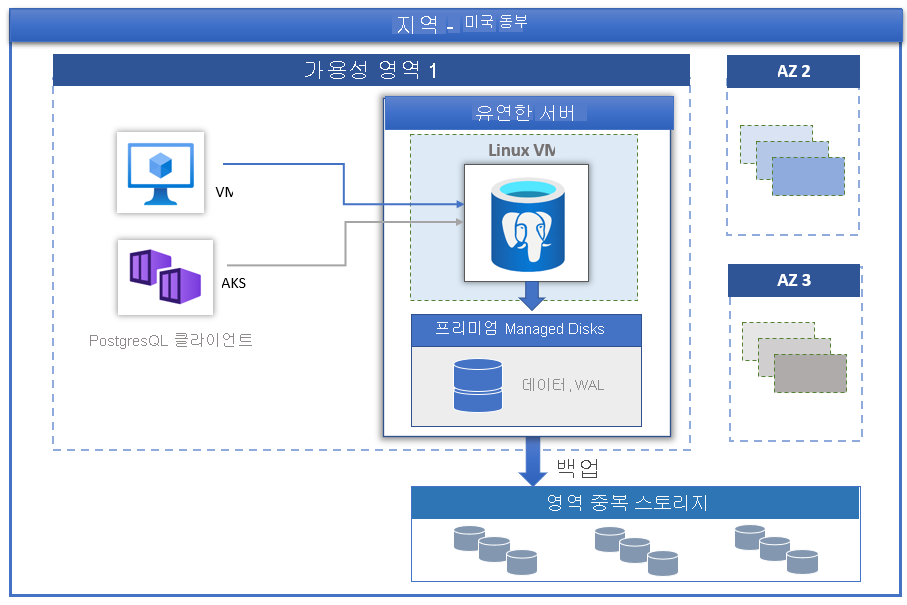

# Azure Database for PostgreSQL - 유연한 서버

PostgreSQL 커뮤니티 버전에서 제공하는 [Azure Database for PostgreSQL](../overview.md)은 세 가지 배포 모드로 사용할 수 있습니다.

- [단일 서버](../overview-single-server.md)
- 유연한 서버(미리 보기)
- 하이퍼스케일(Citus)

이 문서에서는 유연한 서버 배포 모델의 핵심 개념에 대한 개요 및 소개를 제공합니다.

> [!IMPORTANT]
> Azure Database for PostgreSQL - 유연한 서버는 미리 보기로 제공됨

## 개요

Azure Database for PostgreSQL - 유연한 서버는 데이터베이스 관리 기능 및 구성 설정에 대한 보다 세부적인 제어와 유연성을 제공하도록 설계된 완전 관리형 데이터베이스 서비스입니다. 일반적으로 서비스는 사용자 요구 사항에 따라 더 많은 유연성과 서버 구성 사용자 지정을 제공합니다. 유연한 서버 아키텍처를 통해 사용자는 클라이언트 계층으로 데이터베이스 엔진을 배치하여 대기 시간을 줄이고, 단일 가용성 영역 및 여러 가용성 영역에서 고가용성을 선택할 수 있습니다. 또한 유연한 서버는 서버를 중지/시작하는 기능과 전체 컴퓨팅 용량이 지속적으로 필요하지 않는 워크로드에 이상적인 확장 가능한 컴퓨팅 계층을 통해 더 나은 비용 최적화 제어 기능을 제공합니다. 서비스는 현재 PostgreSQL 11 및 12의 커뮤니티 버전을 지원합니다. 서비스는 현재 미리 보기 상태이며, 다양한 [Azure 지역](https://azure.microsoft.com/global-infrastructure/services/)에서 사용할 수 있습니다.

유연한 서버는 다음에 가장 적합합니다.

- 더 나은 제어 및 사용자 지정이 필요한 애플리케이션 개발
- 영역 중복 고가용성
- 관리되는 유지 관리 기간
  
## 고가용성

유연한 서버 배포 모델은 단일 가용성 영역 및 여러 가용성 영역에서 고가용성을 지원하도록 설계되었습니다. 아키텍처는 컴퓨팅과 스토리지를 분리합니다. 데이터베이스 엔진은 Linux 가상 머신에서 실행되는 반면, 데이터 파일은 Azure Storage에 상주합니다. 스토리지는 데이터 내구성을 보장하는 데이터베이스 파일의 세 가지 로컬 중복 동기 복사본을 유지 관리합니다.

계획되거나 계획되지 않은 장애 조치(failover) 이벤트가 발생하는 동안 서버가 다운되면 서비스는 다음과 같은 자동화된 절차를 사용하여 서버의 고가용성을 유지합니다.

1. 새 컴퓨팅 Linux VM이 프로비저닝됩니다.
2. 데이터 파일이 있는 스토리지가 새 가상 머신에 매핑됩니다.
3. 새 가상 머신에서 PostgreSQL 데이터베이스 엔진이 온라인 상태로 전환됩니다.

아래 그림은 VM 및 스토리지 오류에 대한 전환을 보여 줍니다.

 :::image type="content" source="./media/overview/overview-azure-postgres-flex-virtualmachine.png" alt-text="유연한 서버 - VM 및 스토리지 오류":::

영역 중복 고가용성이 구성된 경우 서비스는 동일한 Azure 지역 내에서 가용성 영역에 걸쳐 상시 대기 서버를 프로비저닝하고 유지 관리합니다. 데이터 손실을 방지하기 위해 원본 서버의 데이터 변경 내용이 대기 서버에 동기적으로 복제됩니다. 영역 중복 고가용성을 사용하면 계획되거나 계획되지 않은 장애 조치(failover) 이벤트가 트리거되면 대기 서버가 즉시 온라인 상태가 되고 들어오는 트랜잭션을 처리할 수 있습니다. 이를 통해 아래 그림에 표시된 것처럼 여러 가용성 영역을 지원하는 Azure 지역 내에서 가용성 영역 오류로 인한 서비스 복원력이 가능합니다.

 :::image type="content" source="./media/business-continuity/concepts-zone-redundant-high-availability-architecture.png" alt-text="유연한 서버 - VM 및 스토리지 오류":::

 자세한 내용은 [고가용성 문서](./concepts-high-availability.md)를 참조하세요.

## 관리되는 유지 관리 기간을 사용하여 자동화된 패치

서비스는 기본 하드웨어, OS 및 데이터베이스 엔진의 자동화된 패치를 수행합니다. 패치에는 보안 및 소프트웨어 업데이트가 포함됩니다. PostgreSQL 엔진의 경우 부 버전 업그레이드는 계획된 유지 관리 릴리스의 일부로도 포함됩니다. 사용자는 시스템 관리를 위해 패치 일정을 구성하거나 사용자 지정 일정을 정의할 수 있습니다. 유지 관리 일정 중에 패치가 적용되며 업데이트를 완료하기 위해 패치 프로세스의 일부로 서버를 다시 시작해야 할 수 있습니다. 사용자 지정 일정을 사용하면 사용자가 패치 주기를 예측 가능하도록 설정하고 비즈니스에 최소한의 영향을 주는 유지 관리 기간을 선택할 수 있습니다. 일반적으로 서비스는 연속 통합 및 릴리스의 일부로 월별 릴리스 일정을 따릅니다.

## 자동 백업

유연한 서버 서비스는 자동으로 서버 백업을 만들어 사용자가 로컬로 구성한 ZRS(영역 중복 스토리지)에 저장합니다. 백업을 통해 백업 보존 기간 내의 특정 지점으로 서버를 복원할 수 있습니다. 기본 백업 보존 기간은 7일입니다. 보존 기간은 선택적으로 최대 35일까지 구성할 수 있습니다. 모든 백업은 AES 256비트 암호화를 사용하여 암호화됩니다. 자세한 내용은 [백업](./concepts-backup-restore.md)을 참조하세요.

## 몇 초 이내 성능 및 규모 조정

유연한 서버 서비스는 버스트 가능, 범용 및 메모리 최적화의 세 가지 컴퓨팅 계층으로 제공됩니다. 버스트 가능 계층은 전체 컴퓨팅 용량이 지속적으로 필요하지 않은 저렴한 개발 및 낮은 동시성 워크로드에 가장 적합합니다. 범용 및 메모리 최적화는 높은 동시성, 규모 및 예측 가능한 성능이 필요한 프로덕션 워크로드에 더 적합합니다. 한 달에 몇 달러의 작은 데이터베이스에 첫 번째 애플리케이션을 빌드하고 솔루션의 요구에 맞게 규모를 조정할 수 있습니다.

## 서버 중지/시작으로 TCO 절감

유연한 서버 서비스를 사용하면 요청 시 서버를 중지하고 시작하여 TCO를 낮출 수 있습니다. 서버가 중지되면 컴퓨팅 계층 청구가 즉시 중지됩니다. 이렇게 하면 개발, 테스트 및 시간 제한 예측 가능한 프로덕션 워크로드에 상당한 비용을 절감할 수 있습니다. 서버는 다시 시작하지 않는 한 7일 동안 중지된 상태로 유지됩니다.

## 엔터프라이즈급 보안

유연한 서버 서비스는 미사용 데이터의 스토리지 암호화를 위해 FIPS 140-2 유효성 검사 암호화 모듈을 사용합니다. 백업이 포함된 데이터 및 쿼리를 실행하는 동안 생성된 임시 파일이 암호화됩니다. 서비스는 Azure Storage 암호화에 포함된 AES 256비트 암호화를 사용하며, 키는 시스템에서 관리됩니다(기본값). 서비스는 기본적으로 적용되는 전송 계층 보안(SSL/TLS)을 사용하여 동작 중인 데이터를 암호화합니다. 서비스는 TLS 버전 1.2만 적용하고 지원합니다.

유연한 서버는 Azure 가상 네트워크(VNet 통합)를 사용하여 서버에 대한 모든 프라이빗 액세스를 허용합니다. Azure 가상 네트워크의 서버는 프라이빗 IP 주소를 통해서만 연결할 수 있습니다. VNet 통합을 사용하면 퍼블릭 액세스를 거부하고 퍼블릭 엔드포인트를 사용하여 서버에 연결할 수 없습니다.

## 모니터링 및 경고

유연한 서버 서비스는 기본 제공 성능 모니터링 및 경고 기능을 갖추고 있습니다. 모든 Azure 메트릭의 빈도는 1분이고 각 메트릭은 30일의 기록을 제공합니다. 메트릭에 대한 경고를 구성할 수 있습니다. 서비스는 리소스 사용률을 모니터링하도록 호스트 서버 메트릭을 노출하고, 쿼리 로그를 느리게 구성할 수 있도록 합니다. 이러한 도구를 사용하여 워크로드를 신속하게 최적화하고 최적의 성능을 얻을 수 있도록 서버를 구성할 수 있습니다.

## 마이그레이션

서비스는 커뮤니티 버전의 PostgreSQL을 실행합니다. 이를 통해 전체 애플리케이션 호환이 가능하며, PostgreSQL 엔진에서 개발된 기존 애플리케이션을 유연한 서버로 마이그레이션하기 위한 최소 리팩터링 비용이 필요합니다. 

- **덤프 및 복원** – 사용자가 약간의 가동 중지 시간을 감당할 수 있는 오프라인 마이그레이션의 경우, pg_dump 및 pg_restore 같은 커뮤니티 도구를 사용하여 덤프 및 복원하면 가장 빠른 마이그레이션 방법이 될 수 있습니다. 자세한 내용은 [덤프 및 복원을 사용하여 마이그레이션](https://docs.microsoft.com/azure/postgresql/howto-migrate-using-dump-and-restore)을 참조하세요.
- **Azure Database Migration Service** – 가동 중지 시간을 최소화한 유연한 서버로의 원활하고 간소화된 마이그레이션을 위해 Azure Database Migration Service를 활용할 수 있습니다. [포털을 통한 DMS](https://docs.microsoft.com/azure/dms/tutorial-postgresql-azure-postgresql-online-portal) 및 [CLI를 통한 DMS](https://docs.microsoft.com/azure/dms/tutorial-postgresql-azure-postgresql-online)를 참조하세요. Azure Database for PostgreSQL - 단일 서버에서 유연한 서버로 마이그레이션할 수 있습니다. 자세한 내용은 [DMS 문서](https://docs.microsoft.com/azure/dms/tutorial-azure-postgresql-to-azure-postgresql-online-portal)를 참조하세요.

## 다음 단계

Azure Database for PostgreSQL 유연한 서버 배포 모드에 대한 소개를 읽어 보았습니다. 이제 첫 번째 서버를 만들 준비가 된 것입니다. [Azure Portal을 사용하여 Azure Database for PostgreSQL - 유연한 서버 만들기](./quickstart-create-server-portal.md)

