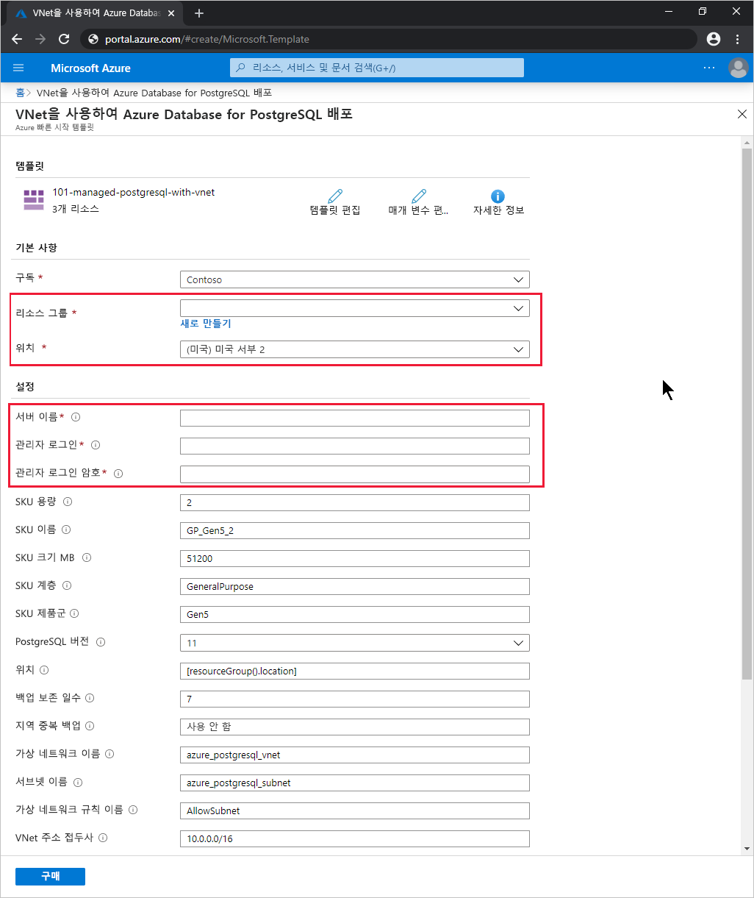

# <a name="quickstart-use-an-arm-template-to-create-an-azure-database-for-postgresql---single-server"></a>빠른 시작: ARM 템플릿을 사용하여 Azure Database for PostgreSQL - 단일 서버 만들기

PostgreSQL용 Azure Database는 클라우드에서 항상 사용 가능한 PostgreSQL 데이터베이스를 실행, 관리 및 크기 조정하는 데 사용하는 관리 서비스입니다. 이 빠른 시작에서는 ARM 템플릿(Azure Resource Manager 템플릿)을 사용하여 Azure Portal, PowerShell 또는 Azure CLI에서 Azure Database for PostgreSQL 단일 서버를 만듭니다.

[!INCLUDE [About Azure Resource Manager](../../includes/resource-manager-quickstart-introduction.md)]

환경이 필수 구성 요소를 충족하고 ARM 템플릿 사용에 익숙한 경우 **Azure에 배포** 단추를 선택합니다. 그러면 Azure Portal에서 템플릿이 열립니다.

[](https://portal.azure.com/#create/Microsoft.Template/uri/https%3a%2f%2fraw.githubusercontent.com%2fAzure%2fazure-quickstart-templates%2fmaster%2f101-managed-postgresql-with-vnet%2fazuredeploy.json)

## <a name="prerequisites"></a>필수 구성 요소

# <a name="portal"></a>[포털](#tab/azure-portal)

활성 구독이 있는 Azure 계정. [체험 계정 만들기](https://azure.microsoft.com/free/)

# <a name="powershell"></a>[PowerShell](#tab/PowerShell)

* 활성 구독이 있는 Azure 계정. [체험 계정 만들기](https://azure.microsoft.com/free/)
* [Azure PowerShell](/powershell/azure/)(코드를 로컬로 실행하려는 경우)

# <a name="cli"></a>[CLI](#tab/CLI)

* 활성 구독이 있는 Azure 계정. [체험 계정 만들기](https://azure.microsoft.com/free/)
* [Azure CLI](/cli/azure/)(코드를 로컬로 실행하려는 경우)

---

## <a name="review-the-template"></a>템플릿 검토

구성된 컴퓨팅 및 스토리지 리소스 세트로 Azure Database for PostgreSQL 서버를 만듭니다. 자세한 내용은 [Azure Database for PostgreSQL의 가격 책정 계층 - 단일 서버](concepts-pricing-tiers.md)를 참조하세요. 서버는 [Azure 리소스 그룹](../azure-resource-manager/management/overview.md) 내에 만듭니다.

이 빠른 시작에서 사용되는 템플릿은 [Azure 빠른 시작 템플릿](https://azure.microsoft.com/resources/templates/101-managed-postgresql-with-vnet/)에서 나온 것입니다.

:::code language="json" source="~/quickstart-templates/101-managed-postgresql-with-vnet/azuredeploy.json" range="001-233" highlight="151,164,178,201,215":::

템플릿에서 정의하는 5개의 Azure 리소스는 다음과 같습니다.

* [**Microsoft.Network/virtualNetworks**](/azure/templates/microsoft.network/virtualnetworks)
* [**Microsoft.Network/virtualNetworks/subnets**](/azure/templates/microsoft.network/virtualnetworks/subnets)
* [**Microsoft.DBforPostgreSQL/servers**](/azure/templates/microsoft.dbforpostgresql/servers)
* [**Microsoft.DBforPostgreSQL/servers/virtualNetworkRules**](/azure/templates/microsoft.dbforpostgresql/servers/virtualnetworkrules)
* [**Microsoft.DBforPostgreSQL/servers/firewallRules**](/azure/templates/microsoft.dbforpostgresql/servers/firewallrules)

Azure Database for PostgreSQL 템플릿 샘플은 [Azure 빠른 시작 템플릿](https://azure.microsoft.com/resources/templates/?resourceType=Microsoft.Dbforpostgresql&pageNumber=1&sort=Popular)에서 찾을 수 있습니다.

## <a name="deploy-the-template"></a>템플릿 배포

# <a name="portal"></a>[포털](#tab/azure-portal)

다음 링크를 선택하여 Azure Portal에서 Azure Database for PostgreSQL 서버 템플릿을 배포합니다.

[](https://portal.azure.com/#create/Microsoft.Template/uri/https%3a%2f%2fraw.githubusercontent.com%2fAzure%2fazure-quickstart-templates%2fmaster%2f101-managed-postgresql-with-vnet%2fazuredeploy.json)

**VNet을 사용하여 Azure Database for PostgreSQL 배포** 페이지에서 다음을 수행합니다.

1. **리소스 그룹**에 대해 **새로 만들기**를 선택하고, 새 리소스 그룹의 이름을 입력한 다음, **확인**을 선택합니다.

2. 새 리소스 그룹을 만든 경우 리소스 그룹 및 새 서버에 대한 **위치**를 선택합니다.

3. **서버 이름**, **관리자 로그인** 및 **관리자 로그인 암호**를 입력합니다.

    

4. 원하는 경우 다른 기본 설정을 변경합니다.

    * **구독**: 서버에 사용하려는 Azure 구독
    * **SKU 용량**: vCore 용량(*2*(기본값), *4*, *8*, *16*, *32* 또는 *64*일 수 있음)
    * **SKU 이름**: 밑줄로 조인된 SKU 계층 접두사, SKU 제품군 및 SKU 용량(예: *B_Gen5_1*, *GP_Gen5_2*(기본값) 또는 *MO_Gen5_32*)
    * **SKU 크기(MB)** : Azure Database for PostgreSQL 서버의 스토리지 크기(메가바이트 단위)(기본값: *51200*)
    * **SKU 계층**: 배포 계층(예: *기본*, *범용*(기본값) 또는 *메모리 최적화*)
    * **SKU 제품군**: *Gen4* 또는 *Gen5*(기본값) - 서버 배포용 하드웨어 세대를 나타냄
    * **Postgresql 버전**: 배포할 PostgreSQL 서버 버전(예: *9.5*, *9.6*, *10* 또는 *11*(기본값))
    * **백업 보존 기간(일)** : 원하는 지역 중복 백업 보존 기간(일 단위)(기본값: *7*)
    * **지역 중복 백업**: Geo-DR(지역 재해 복구) 요구 사항에 따라 *사용* 또는 *사용 안 함*(기본값)
    * **가상 네트워크 이름**: 가상 네트워크의 이름(기본값: *azure_postgresql_vnet*)
    * **서브넷 이름**: 서브넷의 이름(기본값: *azure_postgresql_subnet*)
    * **가상 네트워크 규칙 이름**: 서브넷을 허용하는 가상 네트워크 규칙의 이름(기본값: *AllowSubnet*)
    * **Vnet 주소 접두사**: 가상 네트워크에 대한 주소 접두사(기본값: *10.0.0.0/16*)
    * **서브넷 접두사**: 서브넷에 대한 주소 접두사(기본값: *10.0.0.0/16*)

5. 사용 약관을 읽은 다음 **위에 명시된 사용 약관에 동의함**을 선택합니다.

6. **구매**를 선택합니다.

# <a name="powershell"></a>[PowerShell](#tab/PowerShell)

다음 대화형 코드를 사용하여 템플릿을 사용하여 새 Azure Database for PostgreSQL 서버를 만듭니다. 이 코드는 새 서버 이름, 새 리소스 그룹의 이름과 위치 및 관리자 계정의 이름과 암호를 묻는 메시지를 표시합니다.

Azure Cloud Shell에서 코드를 실행하려면 코드 블록의 위쪽 모서리에 있는 **사용해 보세요**를 선택합니다.

```azurepowershell-interactive
$serverName = Read-Host -Prompt "Enter a name for the new Azure Database for PostgreSQL server"
$resourceGroupName = Read-Host -Prompt "Enter a name for the new resource group where the server will exist"
$location = Read-Host -Prompt "Enter an Azure region (for example, centralus) for the resource group"
$adminUser = Read-Host -Prompt "Enter the Azure Database for PostgreSQL server's administrator account name"
$adminPassword = Read-Host -Prompt "Enter the administrator password" -AsSecureString

New-AzResourceGroup -Name $resourceGroupName -Location $location # Use this command when you need to create a new resource group for your deployment
New-AzResourceGroupDeployment -ResourceGroupName $resourceGroupName `
    -TemplateUri https://raw.githubusercontent.com/Azure/azure-quickstart-templates/master/101-managed-postgresql-with-vnet/azuredeploy.json `
    -serverName $serverName `
    -administratorLogin $adminUser `
    -administratorLoginPassword $adminPassword

Read-Host -Prompt "Press [ENTER] to continue: "
```

# <a name="cli"></a>[CLI](#tab/CLI)

다음 대화형 코드를 사용하여 템플릿을 사용하여 새 Azure Database for PostgreSQL 서버를 만듭니다. 이 코드는 새 서버 이름, 새 리소스 그룹의 이름과 위치 및 관리자 계정의 이름과 암호를 묻는 메시지를 표시합니다.

Azure Cloud Shell에서 코드를 실행하려면 코드 블록의 위쪽 모서리에 있는 **사용해 보세요**를 선택합니다.

```azurecli-interactive
read -p "Enter a name for the new Azure Database for PostgreSQL server:" serverName &&
read -p "Enter a name for the new resource group where the server will exist:" resourceGroupName &&
read -p "Enter an Azure region (for example, centralus) for the resource group:" location &&
read -p "Enter the Azure Database for PostgreSQL server's administrator account name:" adminUser &&
read -p "Enter the administrator password:" adminPassword &&
params='serverName='$serverName' administratorLogin='$adminUser' administratorLoginPassword='$adminPassword &&
az group create --name $resourceGroupName --location $location &&
az deployment group create --resource-group $resourceGroupName --parameters $params --template-uri https://raw.githubusercontent.com/Azure/azure-quickstart-templates/master/101-managed-postgresql-with-vnet/azuredeploy.json &&
read -p "Press [ENTER] to continue: "
```

---

## <a name="review-deployed-resources"></a>배포된 리소스 검토

# <a name="portal"></a>[포털](#tab/azure-portal)

다음 단계에 따라 Azure Database for PostgreSQL 서버에 대한 개요를 표시합니다.

1. [Azure Portal](https://portal.azure.com)에서 **Azure Database for PostgreSQL 서버**를 검색하여 선택합니다.

2. 데이터베이스 목록에서 새 서버를 선택합니다. 그러면 새 Azure Database for PostgreSQL 서버에 대한 **개요** 페이지가 표시됩니다.

# <a name="powershell"></a>[PowerShell](#tab/PowerShell)

다음 대화형 코드를 실행하여 Azure Database for PostgreSQL 서버에 대한 세부 정보를 봅니다. 새 서버의 이름을 입력해야 합니다.

```azurepowershell-interactive
$serverName = Read-Host -Prompt "Enter the name of your Azure Database for PostgreSQL server"
Get-AzResource -ResourceType "Microsoft.DbForPostgreSQL/servers" -Name $serverName | ft
Read-Host -Prompt "Press [ENTER] to continue: "
```

# <a name="cli"></a>[CLI](#tab/CLI)

다음 대화형 코드를 실행하여 Azure Database for PostgreSQL 서버에 대한 세부 정보를 봅니다. 새 서버의 이름 및 리소스 그룹을 입력해야 합니다.

```azurecli-interactive
read -p "Enter your Azure Database for PostgreSQL server name: " serverName &&
read -p "Enter the resource group where the Azure Database for PostgreSQL server exists: " resourcegroupName &&
az resource show --resource-group $resourcegroupName --name $serverName --resource-type "Microsoft.DbForPostgreSQL/servers" &&
read -p "Press [ENTER] to continue: "
```

---

## <a name="clean-up-resources"></a>리소스 정리

더 이상 필요하지 않은 경우 리소스 그룹을 삭제합니다. 그러면 리소스 그룹의 리소스도 삭제됩니다.

# <a name="portal"></a>[포털](#tab/azure-portal)

1. [Azure Portal](https://portal.azure.com)에서 **리소스 그룹**을 검색하여 선택합니다.

2. 리소스 그룹 목록에서 리소스 그룹의 이름을 선택합니다.

3. 리소스 그룹의 **개요** 페이지에서 **리소스 그룹 삭제**를 선택합니다.

4. 확인 대화 상자에서 리소스 그룹의 이름을 입력한 다음, **삭제**를 선택합니다.

# <a name="powershell"></a>[PowerShell](#tab/PowerShell)

```azurepowershell-interactive
$resourceGroupName = Read-Host -Prompt "Enter the Resource Group name"
Remove-AzResourceGroup -Name $resourceGroupName
Read-Host -Prompt "Press [ENTER] to continue: "
```

# <a name="cli"></a>[CLI](#tab/CLI)

```azurecli-interactive
read -p "Enter the Resource Group name: " resourceGroupName &&
az group delete --name $resourceGroupName &&
read -p "Press [ENTER] to continue: "
```

---

## <a name="next-steps"></a>다음 단계

템플릿 만들기 프로세스를 안내하는 단계별 자습서는 다음을 참조하세요.

> [!div class="nextstepaction"]
> [ 자습서: 첫 번째 ARM 템플릿 만들기 및 배포](../azure-resource-manager/templates/template-tutorial-create-first-template.md)
