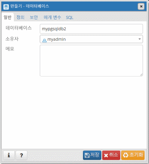

# <a name="quickstart-create-an-azure-database-for-postgresql---single-server-using-powershell"></a>빠른 시작: Azure PowerShell을 사용하여 Azure Database for PostgreSQL - 단일 서버 만들기

이 빠른 시작에서는 PowerShell을 사용하여 Azure 리소스 그룹에서 Azure Database for PostgreSQL 서버를 만드는 방법에 대해 설명합니다. PowerShell을 사용하여 대화형으로 또는 스크립트에서 Azure 리소스를 만들고 관리할 수 있습니다.

## <a name="prerequisites"></a>필수 구성 요소

Azure 구독이 아직 없는 경우 시작하기 전에 [체험](https://azure.microsoft.com/free/) 계정을 만듭니다.

PowerShell을 로컬로 사용하도록 선택하는 경우 이 문서에서는 Az PowerShell 모듈을 설치하고 [Connect-AzAccount](https://docs.microsoft.com/powershell/module/az.accounts/connect-azaccount) cmdlet을 사용하여 Azure 계정에 연결해야 합니다. Az PowerShell 모듈을 설치하는 방법에 대한 자세한 내용은 [Azure PowerShell 설치](https://docs.microsoft.com/powershell/azure/install-az-ps)를 참조하세요.

> [!IMPORTANT]
> Az.PostgreSql PowerShell 모듈이 미리 보기에 있지만 `Install-Module -Name Az.PostgreSql -AllowPrerelease` 명령을 사용하여 Az PowerShell 모듈과 별도로 설치해야 합니다.
> Az.PostgreSql PowerShell 모듈이 일반 공급되면 이후 Az PowerShell 모듈 릴리스에 포함되며 Azure Cloud Shell 내에서 기본적으로 사용할 수 있습니다.

Azure Database for PostgreSQL 서비스를 처음 사용하는 경우 **Microsoft.DBforPostgreSQL** 리소스 공급자를 등록해야 합니다.

```azurepowershell-interactive
Register-AzResourceProvider -ProviderNamespace Microsoft.DBforPostgreSQL
```

[!INCLUDE [cloud-shell-try-it](../../includes/cloud-shell-try-it.md)]

여러 Azure 구독이 있는 경우 리소스에 대한 요금이 청구되는 적절한 구독을 선택합니다. [Set-AzContext](https://docs.microsoft.com/powershell/module/az.accounts/set-azcontext) cmdlet을 사용하여 특정 구독 ID를 선택합니다.

```azurepowershell-interactive
Set-AzContext -SubscriptionId 00000000-0000-0000-0000-000000000000
```

## <a name="create-a-resource-group"></a>리소스 그룹 만들기

[New-AzResourceGroup](https://docs.microsoft.com/powershell/module/az.resources/new-azresourcegroup) cmdlet을 사용하여 [Azure 리소스 그룹](https://docs.microsoft.com/azure/azure-resource-manager/resource-group-overview)을 만듭니다. 리소스 그룹은 Azure 리소스가 그룹으로 배포되고 관리되는 논리 컨테이너입니다.

다음 예제에서는 **myresourcegroup**이라는 리소스 그룹을 **미국 서부** 지역에 만듭니다.

```azurepowershell-interactive
New-AzResourceGroup -Name myresourcegroup -Location westus
```

## <a name="create-an-azure-database-for-postgresql-server"></a>PostgreSQL용 Azure Database 서버 만들기

`New-AzPostgreSqlServer` cmdlet을 사용하여 Azure Database for PostgreSQL 서버를 만듭니다. 서버는 여러 데이터베이스를 관리할 수 있습니다. 일반적으로 각 프로젝트 또는 각 사용자에 대해 별도의 데이터베이스가 사용됩니다.

다음 표에는 `New-AzPostgreSqlServer` cmdlet에 일반적으로 사용되는 매개 변수 및 샘플 값의 목록이 나와 있습니다.

|        **설정**         | **샘플 값** |                                                                                                                                                             **설명**                                                                                                                                                              |
| -------------------------- | ---------------- | ---------------------------------------------------------------------------------------------------------------------------------------------------------------------------------------------------------------------------------------------------------------------------------------------------------------------------------------- |
| Name                       | mydemoserver     | Azure에서 Azure Database for PostgreSQL 서버를 식별하는 전역적으로 고유한 이름을 선택합니다. 서버 이름은 문자, 숫자 및 하이픈(-) 문자만 포함할 수 있습니다. 지정된 모든 대문자는 만들기 프로세스 중에 자동으로 소문자로 변환됩니다. 3-63자여야 합니다. |
| ResourceGroupName          | myresourcegroup  | Azure 리소스 그룹의 이름을 입력합니다.                                                                                                                                                                                                                                                                                            |
| SKU                        | GP_Gen5_2        | SKU의 이름입니다. 축약형 **pricing-tier\_compute-generation\_vCores** 규칙을 따릅니다. Sku 매개 변수에 대한 자세한 내용은 이 표 뒤에 나오는 정보를 참조하세요.                                                                                                                                           |
| BackupRetentionDay         | 7                | 백업을 보존하는 기간입니다. 단위는 일입니다. 범위는 7-35입니다.                                                                                                                                                                                                                                                                       |
| GeoRedundantBackup         | 사용          | 이 서버에 지역 중복 백업을 사용할 것인지 여부를 결정합니다. 기본 가격 책정 계층의 서버에는 이 값을 사용할 수 없으며, 서버를 만든 후에는 변경할 수 없습니다. 허용되는 값은 다음과 같습니다. 사용, 사용 안 함                                                                                                      |
| 위치                   | westus           | 서버에 대한 Azure 지역입니다.                                                                                                                                                                                                                                                                                                         |
| SslEnforcement             | 사용          | 이 서버에 SSL을 사용할 것인지 여부를 결정합니다. 허용되는 값은 다음과 같습니다. 사용, 사용 안 함                                                                                                                                                                                                                                                 |
| StorageInMb                | 51200            | 서버의 스토리지 용량입니다(단위는 메가바이트). 유효한 StorageInMb는 최소 5,120MB이며, 1,024MB씩 증가합니다. 스토리지 크기 제한에 대한 자세한 내용은 [Azure Database for PostgreSQL 가격 책정 계층](./concepts-pricing-tiers.md)을 참조하세요.                                                                               |
| 버전                    | 9.6              | PostgreSQL 주 버전입니다.                                                                                                                                                                                                                                                                                                                 |
| AdministratorUserName      | myadmin          | 관리자 로그인에 대한 사용자 이름입니다. **azure_superuser**, **admin**, **administrator**, **root**, **guest** 또는 **public**을 사용할 수 없습니다.                                                                                                                                                                                            |
| AdministratorLoginPassword | `<securestring>` | 관리자 사용자에 대한 보안 문자열 형식의 암호입니다. 8-128자여야 합니다. 사용자 암호는 다음 범주 중 세 개의 문자를 포함해야 합니다. 영문 대문자, 영문 소문자, 숫자 및 영숫자가 아닌 문자                                       |

**Sku** 매개 변수 값은 다음 예제와 같이 **pricing-tier\_compute-generation\_vCores** 규칙을 따릅니다.

- `-Sku B_Gen5_1`은 기본, 5세대 및 1개 vCore에 매핑됩니다. 이 옵션은 사용 가능한 가장 작은 SKU입니다.
- `-Sku GP_Gen5_32`는 범용, 5세대 및 vCore 32개에 매핑됩니다.
- `-Sku MO_Gen5_2`는 메모리 최적화, 5세대 및 vCore 2개에 매핑됩니다.

유효한 지역별 및 계층별 **Sku** 값에 대한 자세한 내용은 [Azure Database for PostgreSQL 가격 책정 계층](./concepts-pricing-tiers.md)을 참조하세요.

다음 예제에서는 **myadmin**의 서버 관리자 로그인을 사용하여 **myresourcegroup** 리소스 그룹의 **mydemoserver**라는 PostgreSQL 서버를 **미국 서부** 지역에 만듭니다. 이는 2개 vCore 및 지역 중복 백업을 사용하도록 설정된 범용 가격 책정 계층의 5세대 서버입니다. PostgreSQL 서버 관리자 계정의 암호이므로 예제의 첫 번째 줄에 사용되는 암호를 문서화합니다.

> [!TIP]
> 서버 이름은 DNS 이름에 매핑되며 Azure에서 글로벌하게 고유해야 합니다.

```azurepowershell-interactive
$Password = Read-Host -Prompt 'Please enter your password' -AsSecureString
New-AzPostgreSqlServer -Name mydemoserver -ResourceGroupName myresourcegroup -Sku GP_Gen5_2 -GeoRedundantBackup Enabled -Location westus -AdministratorUsername myadmin -AdministratorLoginPassword $Password
```

간단한 컴퓨팅 및 I/O가 워크로드에 적합한 경우 기본 가격 책정 계층을 사용하는 것이 좋습니다.

> [!IMPORTANT]
> 기본 가격 책정 계층에서 만든 서버는 나중에 범용 또는 메모리 최적화로 크기 조정할 수 없으며 지리적으로 복제할 수 없습니다.

## <a name="configure-a-firewall-rule"></a>방화벽 규칙 구성

`New-AzPostgreSqlFirewallRule` cmdlet을 사용하여 Azure Database for PostgreSQL 서버 수준 방화벽 규칙을 만듭니다. 서버 수준 방화벽 규칙을 사용하면 `psql` 명령줄 도구 또는 외부 애플리케이션(예: PostgreSQL Workbench)에서 Azure Database for PostgreSQL 서비스 방화벽을 통해 서버에 연결할 수 있습니다.

다음 예제에서는 특정 192.168.0.1 IP 주소에서 연결하도록 허용하는 **AllowMyIP**라는 방화벽 규칙을 만듭니다. 연결하는 위치에 해당하는 IP 주소 또는 IP 주소 범위로 바꿉니다.

```azurepowershell-interactive
New-AzPostgreSqlFirewallRule -Name AllowMyIP -ResourceGroupName myresourcegroup -ServerName mydemoserver -StartIPAddress 192.168.0.1 -EndIPAddress 192.168.0.1
```

> [!NOTE]
> Azure Database for PostgreSQL에 대한 연결은 포트 5432를 통해 통신합니다. 회사 네트워크 내에서 연결하려고 하면 5432 포트를 통한 아웃바운드 트래픽이 허용되지 않을 수 있습니다. 이 시나리오에서는 IT 부서에서 5432 포트를 여는 경우에만 서버에 연결할 수 있습니다.

## <a name="get-the-connection-information"></a>연결 정보 가져오기

서버에 연결하려면 호스트 정보와 액세스 자격 증명을 제공해야 합니다. 다음 예제를 사용하여 연결 정보를 확인합니다. **FullyQualifiedDomainName** 및 **AdministratorLogin** 값을 적어 둡니다.

```azurepowershell-interactive
Get-AzPostgreSqlServer -Name mydemoserver -ResourceGroupName myresourcegroup |
  Select-Object -Property FullyQualifiedDomainName, AdministratorLogin
```

```Output
FullyQualifiedDomainName                    AdministratorLogin
------------------------                    ------------------
mydemoserver.postgres.database.azure.com       myadmin
```

## <a name="connect-to-postgresql-database-using-psql"></a>psql을 사용하여 PostgreSQL 데이터베이스에 연결

클라이언트 컴퓨터에 PostgreSQL이 설치되어 있는 경우 [psql](https://www.postgresql.org/docs/current/static/app-psql.html) 로컬 인스턴스를 사용하여 Azure PostgreSQL 서버에 연결할 수 있습니다. 이 문서의 코드 샘플에서 **사용해 보세요** 단추를 선택하여 Azure Cloud Shell에서 미리 설치된 버전의 `psql` 명령줄 도구에 액세스할 수도 있습니다. Azure Cloud Shell에 액세스하는 또 다른 방법으로, Azure Portal의 오른쪽 위 도구 모음에서 **>_** 단추를 선택하거나 [shell.azure.com](https://shell.azure.com/)을 방문합니다.

1. `psql` 명령줄 유틸리티를 사용하여 Azure PostgreSQL 서버에 연결합니다.

   ```azurepowershell-interactive
   psql --host=<servername> --port=<port> --username=<user@servername> --dbname=<dbname>
   ```

   예를 들어 다음 명령은 액세스 자격 증명을 사용하여 PostgreSQL 서버 `mydemoserver.postgres.database.azure.com`의 **postgres**라는 기본 데이터베이스에 연결합니다. 암호를 묻는 메시지가 표시되면 선택한 `<server_admin_password>`를 입력합니다.

   ```azurepowershell-interactive
   psql --host=mydemoserver.postgres.database.azure.com --port=5432 --username=myadmin@mydemoserver --dbname=postgres
   ```

   > [!TIP]
   > URL 경로를 사용하여 Postgres에 연결하려는 경우 URL의 사용자 이름에서 @ 기호가 `%40`으로 인코딩됩니다. 예를 들어 psql에 대한 연결 문자열은 `psql postgresql://myadmin%40mydemoserver@mydemoserver.postgres.database.azure.com:5432/postgres`입니다.

1. 서버에 연결되면 프롬프트에서 빈 데이터베이스를 만듭니다.

   ```sql
   CREATE DATABASE mypgsqldb;
   ```

1. 프롬프트에서 다음 명령을 실행하여 새로 만든 **mypgsqldb** 데이터베이스에 대한 연결로 전환합니다.

   ```sql
   \c mypgsqldb
   ```

## <a name="connect-to-the-postgresql-server-using-pgadmin"></a>pgAdmin을 사용하여 PostgreSQL 서버에 연결

pgAdmin은 PostgreSQL에서 사용되는 오픈 소스 도구입니다. [pgAdmin 웹 사이트](https://www.pgadmin.org/)에서 pgAdmin을 설치할 수 있습니다. 사용 중인 pgAdmin 버전이 이 빠른 시작에 사용된 버전과 다를 수 있습니다. 추가 지침이 필요하면 pgAdmin 설명서를 참조하세요.

1. 클라이언트 컴퓨터에서 pgAdmin 애플리케이션을 엽니다.

1. 도구 모음에서 **개체**로 이동하고, 마우스로 **만들기**를 가리킨 다음, **서버**를 선택합니다.

1. **만들기 - 서버** 대화 상자의 **일반** 탭에서 **mydemoserver**와 같이 서버에 대해 고유하고 친숙한 이름을 입력합니다.

   ![[일반] 탭](./media/quickstart-create-postgresql-server-database-using-azure-powershell/9-pgadmin-create-server.png)

1. **만들기 - 서버** 대화 상자의 **연결** 탭에서 설정 테이블을 채웁니다.

   ![[연결] 탭](./media/quickstart-create-postgresql-server-database-using-azure-powershell/10-pgadmin-create-server.png)

    pgAdmin 매개 변수 |값|Description
    ---|---|---
    호스트 이름/주소 | 서버 이름 | 이전에 PostgreSQL 서버용 Azure Database를 만들 때 사용한 서버 이름 값입니다. 예제 서버는 **mydemoserver.postgres.database.azure.com**입니다. 예제에서 표시된 것과 같은 정규화된 도메인 이름( **\*.postgres.database.azure.com**)을 사용합니다. 서버 이름을 잊어버린 경우 이전 섹션의 단계에 따라 연결 정보를 가져옵니다.
    포트 | 5432 | PostgreSQL 서버용 Azure Database에 연결할 때 사용할 포트입니다.
    데이터베이스 유지 관리 | *postgres* | 기본 시스템에서 생성된 데이터베이스 이름입니다.
    사용자 이름 | 서버 관리자 로그인 이름 | 이전에 PostgreSQL 서버용 Azure Database를 만들 때 제공한 서버 관리자 로그인 사용자 이름입니다. 사용자 이름을 잊어버린 경우 이전 섹션의 단계에 따라 연결 정보를 가져옵니다. 형식은 *username\@servername*입니다.
    암호 | 관리자 암호 | 이 빠른 시작의 앞 부분에서 서버를 만들 때 선택한 암호입니다.
    역할 | 비워 둠 | 이 시점에서 역할 이름을 제공할 필요가 없습니다. 필드를 비워 둡니다.
    SSL 모드 | *필수* | pgAdmin의 SSL 탭에서 TLS/SSL 모드를 설정할 수 있습니다. 기본적으로 모든 Azure Database for PostgreSQL 서버는 TLS가 적용된 상태로 만들어집니다. TLS 적용을 해제하려면 [TLS 적용 구성](./concepts-ssl-connection-security.md#configure-enforcement-of-tls)을 참조하세요.

1. **저장**을 선택합니다.

1. 왼쪽 **브라우저** 창에서 **서버** 노드를 확장합니다. 서버를 선택합니다(예: **mydemoserver**). 클릭하여 연결합니다.

1. 서버 노드를 확장한 다음 그 아래 **데이터베이스**를 확장합니다. 목록에는 기존 *postgres* 데이터베이스와 사용자가 만든 다른 데이터베이스가 포함되어야 합니다. Azure Database for PostgreSQL에서는 서버당 여러 개의 데이터베이스를 만들 수 있습니다.

1. **데이터베이스**를 마우스 오른쪽 단추로 클릭하고 **만들기** 메뉴를 선택하고 **데이터베이스**를 선택합니다.

1. **데이터베이스** 필드에 원하는 데이터베이스 이름(예: **mypgsqldb2**)을 입력합니다.

1. 목록 상자에서 데이터베이스에 대한 **소유자**를 선택합니다. 서버 관리자 로그인 이름(예: **my admin**)을 선택합니다.

   

1. **저장**을 선택하여 새로운 빈 데이터베이스를 만듭니다.

1. **브라우저** 창에서 서버 이름 아래의 데이터베이스 목록에서 만든 데이터베이스를 확인할 수 있습니다.

## <a name="clean-up-resources"></a>리소스 정리

이 빠른 시작에서 만든 리소스가 다른 빠른 시작 또는 자습서에 필요하지 않은 경우 다음 예제를 실행하여 해당 리소스를 삭제할 수 있습니다.

> [!CAUTION]
> 다음 예제에서는 지정된 리소스 그룹과 해당 그룹에 포함된 모든 리소스를 삭제합니다.
> 이 빠른 시작의 범위에 속하지 않는 리소스가 지정된 리소스 그룹에 있는 경우에도 해당 리소스가 삭제됩니다.

```azurepowershell-interactive
Remove-AzResourceGroup -Name myresourcegroup
```

리소스 그룹을 삭제하지 않고 이 빠른 시작에서 만든 서버만 삭제하려면 `Remove-AzPostgreSqlServer` cmdlet을 사용합니다.

```azurepowershell-interactive
Remove-AzPostgreSqlServer -Name mydemoserver -ResourceGroupName myresourcegroup
```

## <a name="next-steps"></a>다음 단계

> [!div class="nextstepaction"]
> [PowerShell을 사용하여 Azure Database for PostgreSQL 디자인](tutorial-design-database-using-powershell.md)
