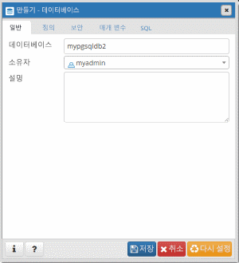

# <a name="quickstart-create-an-azure-database-for-postgresql-using-the-azure-cli"></a>빠른 시작: Azure CLI를 사용하여 PostgreSQL용  Azure Database 만들기
PostgreSQL용  Azure Database는 클라우드에서 항상 사용 가능한 PostgreSQL 데이터베이스를 실행, 관리 및 크기 조정할 수 있게 하는 관리 서비스입니다. 명령줄 또는 스크립트에서 Azure 리소스를 만들고 관리하는 데 Azure CLI가 사용됩니다. 이 빠른 시작에서는 Azure CLI를 사용하여 [Azure 리소스 그룹](https://docs.microsoft.com/azure/azure-resource-manager/resource-group-overview)에서 PostgreSQL용 Azure Database 서버를 만드는 방법을 살펴봅니다.

Azure 구독이 아직 없는 경우 시작하기 전에 [체험](https://azure.microsoft.com/free/) 계정을 만듭니다.

[!INCLUDE [cloud-shell-try-it](../../includes/cloud-shell-try-it.md)]

CLI를 로컬로 설치하여 사용하도록 선택하는 경우 이 문서에서 Azure CLI 버전 2.0 이상을 실행해야 합니다. 설치된 버전을 확인하려면 `az --version` 명령을 실행합니다. 설치 또는 업그레이드해야 하는 경우 [Azure CLI 설치]( /cli/azure/install-azure-cli)를 참조하세요. 

CLI를 로컬로 실행 중인 경우 [az login](/cli/azure/authenticate-azure-cli?view=interactive-log-in) 명령을 사용하여 사용자 계정에 로그인해야 합니다. 해당 구독 이름에 대한 명령 출력에서 **id** 속성을 참고합니다.
```azurecli-interactive
az login
```

구독이 여러 개인 경우 리소스가 과금되어야 할 적절한 구독을 선택합니다. [az account set](/cli/azure/account#az_account_set) 명령을 사용하여 계정에 속한 특정 구독 ID를 선택합니다. 구독에 대한 **az login** 출력의 **id** 속성을 구독 ID 자리 표시자로 바꿉니다.
```azurecli-interactive
az account set --subscription <subscription id>
```

## <a name="create-a-resource-group"></a>리소스 그룹 만들기

[az group create](/cli/azure/group#az_group_create) 명령을 사용하여 [Azure 리소스 그룹](../azure-resource-manager/resource-group-overview.md)을 만듭니다. 리소스 그룹은 Azure 리소스가 그룹으로 배포되고 관리되는 논리 컨테이너입니다. 고유한 이름을 제공해야 합니다. 다음 예제는 `westus` 위치에 `myresourcegroup`이라는 리소스 그룹을 만듭니다.
```azurecli-interactive
az group create --name myresourcegroup --location westus
```

## <a name="create-an-azure-database-for-postgresql-server"></a>PostgreSQL용 Azure Database 서버 만들기

[az postgres server create](/cli/azure/postgres/server#az_postgres_server_create) 명령을 사용하여 [PostgreSQL용 Azure Database 서버](overview.md)를 만듭니다. 서버는 여러 데이터베이스를 포함할 수 있습니다.


**설정** | **샘플 값** | **설명**
---|---|---
이름 | mydemoserver | Azure Database for PostgreSQL 서버를 식별하는 고유한 이름을 선택합니다. 서버 이름은 소문자, 숫자 및 하이픈(-) 문자만 포함할 수 있으며, 3-63자여야 합니다.
resource-group | myresourcegroup | Azure 리소스 그룹의 이름을 입력합니다.
sku-name | GP_Gen4_2 | SKU의 이름입니다. {가격 책정 계층}_{계산 세대}_{vCores} 규칙을 축약형으로 따릅니다. sku-name 매개 변수에 대한 자세한 내용은 아래 표를 참조하세요.
backup-retention | 7 | 백업을 보존하는 기간입니다. 단위는 일입니다. 범위는 7-35입니다. 
geo-redundant-backup | 사용 안 함 | 이 서버에 지역 중복 백업을 사용할 것인지 여부를 결정합니다. 허용되는 값은 다음과 같습니다. 사용, 사용 안 함
location | westus | 서버에 대한 Azure 위치입니다.
ssl-enforcement | 사용 | 이 서버에 ssl을 사용할 것인지 여부를 결정합니다. 허용되는 값은 다음과 같습니다. 사용, 사용 안 함
storage-size | 51200 | 서버의 저장소 용량입니다(단위는 메가바이트). 유효한 저장소 크기는 5120MB이고 1024MB 단위로 증가합니다. 저장소 크기 한도에 대한 자세한 내용은 [가격 책정 계층](./concepts-pricing-tiers.md) 문서를 참조하세요. 
버전 | 9.6 | PostgreSQL 주 버전입니다.
admin-user | myadmin | 관리자 로그인에 대한 사용자 이름입니다. **azure_superuser**, **admin**, **administrator**, **root**, **guest** 또는 **public**을 사용할 수 없습니다.
admin-password | *보안 암호* | 관리자 사용자의 암호입니다. 8-128자여야 합니다. 사용자 암호는 다음 범주 중 세 개의 문자를 포함해야 합니다. 영문 대문자, 영문 소문자, 숫자 및 영숫자가 아닌 문자


sku-name 매개 변수 값은 아래 예에서 같이 {가격 책정 계층}\_{계산 세대}\_{vCores} 규칙을 따릅니다.
+ `--sku-name B_Gen4_1`는 기본, 4세대 및 vCore 1개에 매핑됩니다.
+ `--sku-name GP_Gen5_32`는 범용, 5세대 및 vCore 32개에 매핑됩니다.
+ `--sku-name MO_Gen5_2`는 메모리 최적화, 5세대 및 vCore 2개에 매핑됩니다.

지역당 및 계층당 유효한 값을 이해하려면 [가격 책정 계층](./concepts-pricing-tiers.md) 설명서를 참조합니다.

다음 예제에서는 미국 서부에 `myadmin` 서버 관리자 로그인을 사용하여 `myresourcegroup` 리소스 그룹에 `mydemoserver`라는 PostgreSQL 9.6 서버를 만듭니다. 이 서버는 **vCore**가 2개인 **4세대** **범용** 서버입니다. `<server_admin_password>`를 자신의 고유한 값으로 직접 바꿉니다.
```azurecli-interactive
az postgres server create --resource-group myresourcegroup --name mydemoserver  --location westus --admin-user myadmin --admin-password <server_admin_password> --sku-name GP_Gen4_2 --version 9.6
```

> [!NOTE]
> 워크로드에 가벼운 컴퓨팅 및 I/O가 적합한 경우 기본 가격 책정 계층을 고려합니다. 기본 가격 책정 계층에서 만든 서버는 나중에 범용으로 또는 메모리 최적화되도록 확장할 수 없습니다. 자세한 내용은 [가격 책정 페이지](https://azure.microsoft.com/pricing/details/postgresql/)를 참조하세요.
> 

## <a name="configure-a-server-level-firewall-rule"></a>서버 수준 방화벽 규칙 구성

[az postgres server firewall-rule create](/cli/azure/postgres/server/firewall-rule#az_postgres_server_firewall_rule_create) 명령을 사용하여 Azure PostgreSQL 서버 수준 방화벽 규칙을 만듭니다. 서버 수준 방화벽 규칙을 사용하면 [psql](https://www.postgresql.org/docs/9.2/static/app-psql.html) 또는 [PgAdmin](https://www.pgadmin.org/)과 같은 외부 애플리케이션에서 Azure PostgreSQL 서비스 방화벽을 통해 서버에 연결할 수 있습니다. 

IP 범위를 적용하는 방화벽 규칙을 설정하여 네트워크에서 연결할 수 있습니다. 다음 예제에서는 [az postgres server firewall-rule create](/cli/azure/postgres/server/firewall-rule#az_postgres_server_firewall_rule_create)를 사용하여 단일 IP 주소에 대한 `AllowMyIP` 방화벽 규칙을 만듭니다.
```azurecli-interactive
az postgres server firewall-rule create --resource-group myresourcegroup --server mydemoserver --name AllowMyIP --start-ip-address 192.168.0.1 --end-ip-address 192.168.0.1
```

> [!NOTE]
> Azure PostgreSQL 서버는 5432 포트를 통해 통신합니다. 회사 네트워크 내에서 연결하려는 경우 5432 포트를 통한 아웃바운드 트래픽이 네트워크 방화벽에서 허용되지 않을 수 있습니다. IT 부서에서 포트 5432를 열어 Azure PostgreSQL 서버에 연결할 수 있도록 합니다.

## <a name="get-the-connection-information"></a>연결 정보 가져오기

서버에 연결하려면 호스트 정보와 액세스 자격 증명을 제공해야 합니다.
```azurecli-interactive
az postgres server show --resource-group myresourcegroup --name mydemoserver
```

결과는 JSON 형식입니다. **administratorLogin** 및 **fullyQualifiedDomainName**을 기록해 둡니다.
```json
{
  "administratorLogin": "myadmin",
  "earliestRestoreDate": null,
  "fullyQualifiedDomainName": "mydemoserver.postgres.database.azure.com",
  "id": "/subscriptions/00000000-0000-0000-0000-000000000000/resourceGroups/myresourcegroup/providers/Microsoft.DBforPostgreSQL/servers/mydemoserver",
  "location": "westus",
  "name": "mydemoserver",
  "resourceGroup": "myresourcegroup",
  "sku": {
    "capacity": 2,
    "family": "Gen4",
    "name": "GP_Gen4_2",
    "size": null,
    "tier": "GeneralPurpose"
  },
  "sslEnforcement": "Enabled",
  "storageProfile": {
    "backupRetentionDays": 7,
    "geoRedundantBackup": "Disabled",
    "storageMb": 5120
  },
  "tags": null,
  "type": "Microsoft.DBforPostgreSQL/servers",
  "userVisibleState": "Ready",
  "version": "9.6"
}
```

## <a name="connect-to-postgresql-database-using-psql"></a>psql을 사용하여 PostgreSQL 데이터베이스에 연결

클라이언트 컴퓨터에 PostgreSQL이 설치되어 있는 경우 [psql](https://www.postgresql.org/docs/current/static/app-psql.html) 로컬 인스턴스를 사용하여 Azure PostgreSQL 서버에 연결할 수 있습니다. 이제 psql 명령줄 유틸리티를 사용하여 Azure PostgreSQL 서버에 연결해 보겠습니다.

1. 다음 psql 명령을 실행하여 Azure Database for PostgreSQL 서버에 연결합니다.
```bash
psql --host=<servername> --port=<port> --username=<user@servername> --dbname=<dbname>
```

  예를 들어, 다음 명령은 액세스 자격 증명을 사용하여 **mydemoserver.postgres.database.azure.com** PostgreSQL 서버의 **postgres**라는 기본 데이터베이스에 연결합니다. 암호를 묻는 메시지가 표시되면 선택한 `<server_admin_password>`를 입력합니다.
  
  ```bash
psql --host=mydemoserver.postgres.database.azure.com --port=5432 --username=myadmin@mydemoserver --dbname=postgres
```

2.  서버에 연결되면 프롬프트에서 빈 데이터베이스를 만듭니다.
```sql
CREATE DATABASE mypgsqldb;
```

3.  프롬프트에서 다음 명령을 실행하여 새로 만든 **mypgsqldb** 데이터베이스에 대한 연결로 전환합니다.
```sql
\c mypgsqldb
```

## <a name="connect-to-the-postgresql-server-using-pgadmin"></a>pgAdmin을 사용하여 PostgreSQL 서버에 연결

pgAdmin은 PostgreSQL에서 사용되는 오픈 소스 도구입니다. [pgAdmin 웹 사이트](https://www.pgadmin.org/)에서 pgAdmin을 설치할 수 있습니다. 사용 중인 pgAdmin 버전이 이 빠른 시작에 사용된 버전과 다를 수 있습니다. 추가 지침이 필요하면 pgAdmin 설명서를 참조하세요.

1. 클라이언트 컴퓨터에서 pgAdmin 애플리케이션을 엽니다.

2. 도구 모음에서 **개체**로 이동하고, 마우스로 **만들기**를 가리킨 다음, **서버**를 선택합니다.

3. **만들기 - 서버** 대화 상자의 **일반** 탭에서 **mydemoserver**와 같이 서버에 대해 고유하고 친숙한 이름을 입력합니다.

   ![[일반] 탭](./media/quickstart-create-server-database-azure-cli/9-pgadmin-create-server.png)

4. **만들기 - 서버** 대화 상자의 **연결** 탭에서 설정 테이블을 채웁니다.

   ![[연결] 탭](./media/quickstart-create-server-database-azure-cli/10-pgadmin-create-server.png)

    pgAdmin 매개 변수 |값|설명
    ---|---|---
    호스트 이름/주소 | 서버 이름 | 이전에 PostgreSQL 서버용 Azure Database를 만들 때 사용한 서버 이름 값입니다. 예제 서버는 **mydemoserver.postgres.database.azure.com**입니다. 예제에서 표시된 것과 같은 정규화된 도메인 이름(**\*.postgres.database.azure.com**)을 사용합니다. 서버 이름을 잊어버린 경우 이전 섹션의 단계에 따라 연결 정보를 가져옵니다. 
    포트 | 5432 | PostgreSQL 서버용 Azure Database에 연결할 때 사용할 포트입니다. 
    데이터베이스 유지 관리 | *postgres* | 기본 시스템에서 생성된 데이터베이스 이름입니다.
    사용자 이름 | 서버 관리자 로그인 이름 | 이전에 PostgreSQL 서버용 Azure Database를 만들 때 제공한 서버 관리자 로그인 사용자 이름입니다. 사용자 이름을 잊어버린 경우 이전 섹션의 단계에 따라 연결 정보를 가져옵니다. 형식은 *username@servername*입니다.
    암호 | 관리자 암호 | 이 빠른 시작의 앞 부분에서 서버를 만들 때 선택한 암호입니다.
    역할 | 비워 둠 | 이 시점에서 역할 이름을 제공할 필요가 없습니다. 필드를 비워 둡니다.
    SSL 모드 | *필수* | pgAdmin의 SSL 탭에서 SSL 모드를 설정할 수 있습니다. 기본적으로 모든 Azure Database for PostgreSQL 서버는 SSL이 적용된 상태로 만들어집니다. SSL 적용을 해제하려면 [SSL 적용](./concepts-ssl-connection-security.md)을 참조하세요.
    
5. **저장**을 선택합니다.

6. 왼쪽 **브라우저** 창에서 **서버** 노드를 확장합니다. 서버를 선택합니다(예: **mydemoserver**). 클릭하여 연결합니다.

7. 서버 노드를 확장한 다음 그 아래 **데이터베이스**를 확장합니다. 목록에는 기존 *postgres* 데이터베이스와 사용자가 만든 다른 데이터베이스가 포함되어야 합니다. Azure Database for PostgreSQL에서는 서버당 여러 개의 데이터베이스를 만들 수 있습니다.

8. **데이터베이스**를 마우스 오른쪽 단추로 클릭하고 **만들기** 메뉴를 선택하고 **데이터베이스**를 선택합니다.

9. **데이터베이스** 필드에 원하는 데이터베이스 이름(예: **mypgsqldb2**)을 입력합니다.

10. 목록 상자에서 데이터베이스에 대한 **소유자**를 선택합니다. 서버 관리자 로그인 이름(예: **my admin**)을 선택합니다.

   

11. **저장**을 선택하여 새로운 빈 데이터베이스를 만듭니다.

12. **브라우저** 창에서 서버 이름 아래의 데이터베이스 목록에서 만든 데이터베이스를 확인할 수 있습니다.


## <a name="clean-up-resources"></a>리소스 정리

[Azure 리소스 그룹](../azure-resource-manager/resource-group-overview.md)을 삭제하여 이 빠른 시작에서 만든 모든 리소스를 정리합니다.

> [!TIP]
> 이 컬렉션의 다른 빠른 시작은 이 빠른 시작을 기반으로 구성됩니다. 다음 빠른 시작을 계속 진행하려는 경우 이 빠른 시작에서 만든 리소스를 정리하지 않습니다. 계속하지 않으려는 경우 다음 단계에 따라 이 빠른 시작에서 만든 모든 리소스를 Azure CLI에서 삭제합니다.

```azurecli-interactive
az group delete --name myresourcegroup
```

새로 만든 서버만 삭제하려면 [az postgres server delete](/cli/azure/postgres/server#az_postgres_server_delete) 명령을 실행합니다.
```azurecli-interactive
az postgres server delete --resource-group myresourcegroup --name mydemoserver
```

## <a name="next-steps"></a>다음 단계
> [!div class="nextstepaction"]
> [내보내기 및 가져오기를 사용하여 데이터베이스 마이그레이션](./howto-migrate-using-export-and-import.md)

