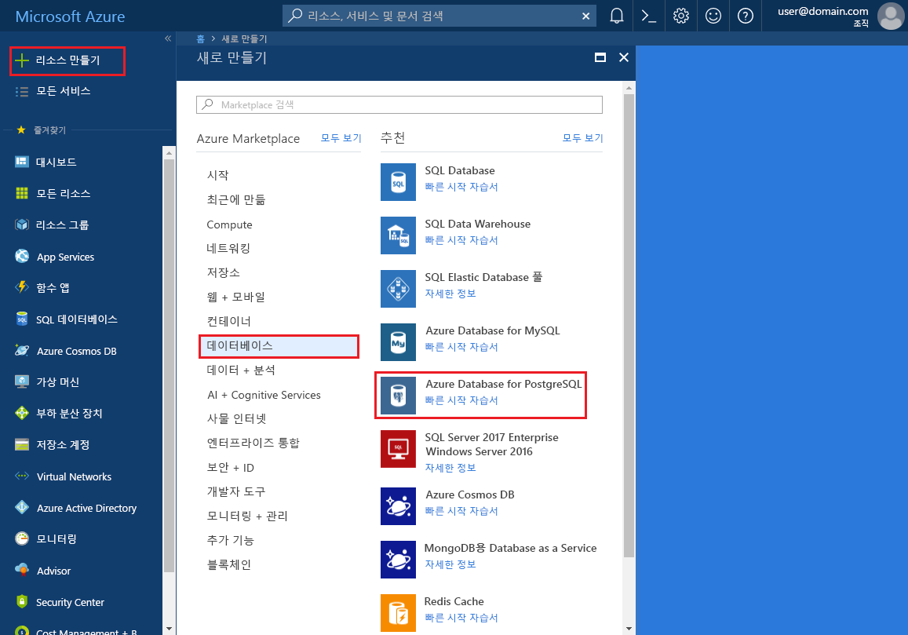
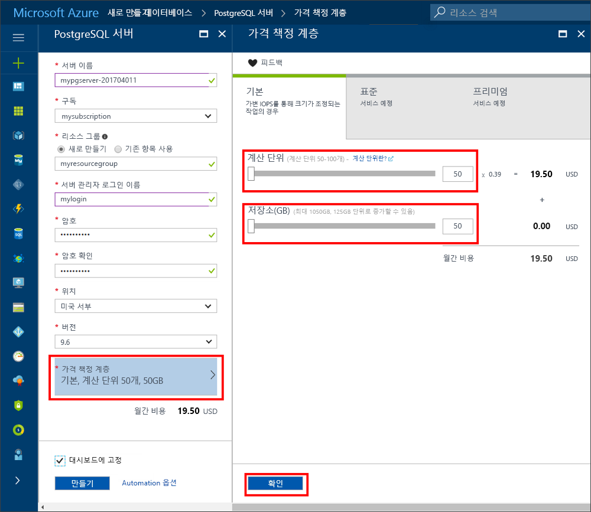
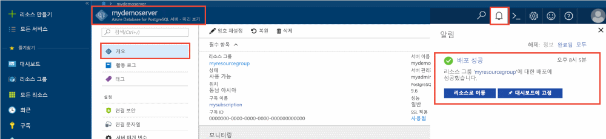
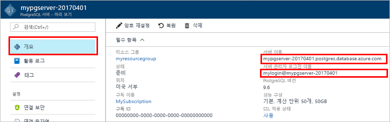
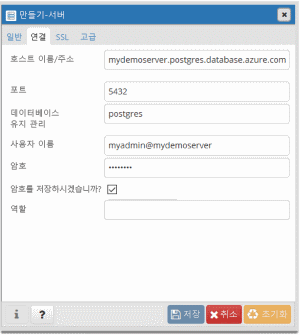
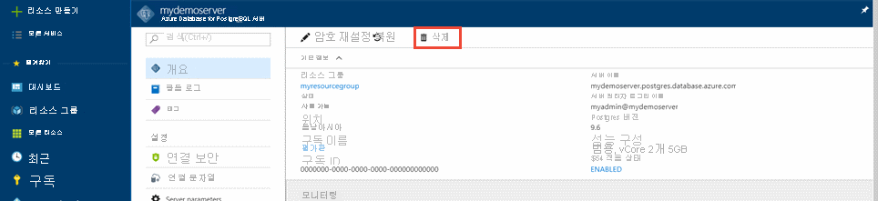

# <a name="create-an-azure-database-for-postgresql-in-the-azure-portal"></a>Azure Portal을 사용하여 PostgreSQL용 Azure Database 만들기

PostgreSQL용 Azure Database는 클라우드에서 항상 사용 가능한 PostgreSQL 데이터베이스를 실행, 관리 및 크기 조정할 수 있게 하는 관리 서비스입니다. 이 빠른 시작에서는 Azure 포털을 사용하여 PostgreSQL용 Azure Database 서버를 만드는 방법을 살펴봅니다.

Azure 구독이 아직 없는 경우 시작하기 전에 [체험](https://azure.microsoft.com/free/) 계정을 만듭니다.

## <a name="log-in-to-the-azure-portal"></a>Azure 포털에 로그인

[Azure 포털](https://portal.azure.com)에 로그인합니다.

## <a name="create-an-azure-database-for-postgresql"></a>PostgreSQL용 Azure Database 만들기

PostgreSQL용 Azure Database 서버는 정의된 [계산 및 저장소 리소스](./concepts-compute-unit-and-storage.md) 집합으로 만들어집니다. 서버는 [Azure 리소스 그룹](../azure-resource-manager/resource-group-overview.md) 내에 만들어집니다.

다음 단계에 따라 PostgreSQL용 Azure Database 서버를 만듭니다.
1.    Azure Portal의 왼쪽 위에 있는 **새로 만들기** 단추를 클릭합니다.
2.    **새로 만들기** 페이지에서 **데이터베이스**를 선택하고, **데이터베이스** 페이지에서 **PostgreSQL용 Azure Database**을 선택합니다.
 

3.    위 이미지와 같이 다음 정보를 사용하여 새 서버 세부 정보 양식을 채웁니다.
    - 서버 이름: **mypgserver-20170401**(서버 이름은 DNS 이름에 매핑되므로 전역적으로 고유해야 합니다.) 
    - 구독: 구독이 여러 개인 경우 리소스가 있거나 요금이 청구되는 적절한 구독을 선택합니다.
    - 리소스 그룹: **myresourcegroup**
    - 서버 관리자 로그인 및 선택한 암호
    - 위치
    - PostgreSQL 버전

  > [!IMPORTANT]
  > 여기에 지정한 서버 관리자 로그인 및 암호는 이 빠른 시작의 뒷부분에 나오는 서버 및 데이터베이스에 로그인해야 합니다. 나중에 사용하기 위해 이 정보를 기억하거나 기록합니다.

4.    **가격 책정 계층**을 클릭하고 새 데이터베이스의 서비스 계층 및 성능 수준을 지정합니다. 이 빠른 시작을 위해 **기본** 계층, **50개 계산 단위** 및 **50GB**의 포함된 저장소를 선택합니다.
 
5.    **확인**을 클릭합니다.
6.    **만들기**를 클릭하여 서버를 프로비전합니다. 프로비전하는 데 몇 분이 걸립니다.

  > [!TIP]
  > 배포를 쉽게 추적할 수 있도록 **대시보드에 고정** 옵션을 선택합니다.

7.    도구 모음에서 **알림**을 클릭하여 배포 프로세스를 모니터링합니다.
 
   
  기본적으로 **postgres** 데이터베이스가 서버 아래에 만들어집니다. [postgres](https://www.postgresql.org/docs/9.6/static/app-initdb.html) 데이터베이스는 사용자, 유틸리티 및 타사 응용 프로그램에서 사용하는 기본 데이터베이스입니다. 

## <a name="configure-a-server-level-firewall-rule"></a>서버 수준 방화벽 규칙 구성

PostgreSQL용 Azure Database 서비스는 서버 수준 방화벽을 만듭니다. 방화벽 규칙을 만들어 특정 IP 주소에 대한 방화벽을 열지 않는 한 이 방화벽은 외부 응용 프로그램과 도구에서 서버 및 서버의 데이터베이스에 연결되지 않도록 방지합니다. 

1.    배포가 완료되면 왼쪽 메뉴에서 **모든 리소스**를 클릭하고 **mypgserver-20170401** 이름을 입력하여 새로 만든 서버를 검색합니다. 검색 결과에 나열된 서버 이름을 클릭합니다. 서버에 대한 **개요** 페이지가 열리고 추가 구성을 위한 옵션이 제공됩니다.
 
 

2.    서버 블레이드에서 **연결 보안**을 선택합니다. 
3.    **규칙 이름** 아래의 텍스트 상자를 클릭하고 연결을 위한 IP 범위를 허용 목록으로 만드는 새 방화벽 규칙을 추가합니다. 이 빠른 시작에서는 **규칙 이름 = AllowAllIps**, **시작 IP = 0.0.0.0** 및 **종료 IP = 255.255.255.255**를 입력하여 모든 IP를 허용한 다음 **저장**을 클릭하겠습니다. IP 범위를 적용하는 방화벽 규칙을 설정하여 네트워크에서 연결할 수 있습니다.

 

4.    **저장**을 클릭한 다음 **X**을 클릭하여 **연결 보안** 페이지를 닫습니다.

  > [!NOTE]
  > Azure PostgreSQL 서버는 5432 포트를 통해 통신합니다. 회사 네트워크 내에서 연결하려는 경우 5432 포트를 통한 아웃바운드 트래픽이 네트워크 방화벽에서 허용되지 않을 수 있습니다. 이 경우 IT 부서에서 5432 포트를 열지 않으면 Azure SQL Database 서버에 연결할 수 없습니다
  >

## <a name="get-the-connection-information"></a>연결 정보 가져오기

Azure Database for PostgreSQL 서버를 만들 때 기본 **postgres** 데이터베이스도 만들어집니다. 데이터베이스 서버에 연결하려면 호스트 정보와 액세스 자격 증명을 제공해야 합니다.

1. Azure Portal의 왼쪽 메뉴에서 **모든 리소스**를 클릭하고 방금 만든 **mypgserver-20170401** 서버를 검색합니다.

  

2. **mypgserver-20170401**서버 이름을 클릭합니다.
3. 서버의 **개요** 페이지를 선택합니다. **서버 이름** 및 **서버 관리자 로그인 이름**을 기록해 둡니다.

 

## <a name="connect-to-postgresql-database-using-psql-in-cloud-shell"></a>Cloud Shell에서 psql을 사용하여 PostgreSQL 데이터베이스에 연결

이제 psql 명령줄 유틸리티를 사용하여 PostgreSQL용 Azure Database 서버에 연결해 보겠습니다. 
1. 위쪽 탐색 창의 터미널 아이콘을 통해 Azure Cloud Shell을 시작합니다.

   

2. 브라우저에서 bash 명령을 입력할 수 있는 Azure Cloud Shell이 열립니다.

   

3. Cloud Shell 프롬프트에서 psql 명령을 사용하여 PostgreSQL용 Azure Database 서버에 연결합니다. 다음 형식은 [psql](https://www.postgresql.org/docs/9.6/static/app-psql.html) 유틸리티를 사용하여 PostgreSQL용 Azure Database 서버에 연결하는 데 사용됩니다.
   ```bash
   psql --host=<myserver> --port=<port> --username=<server admin login> --dbname=<database name>
   ```

   예를 들어 다음 명령은 액세스 자격 증명을 사용하여 **mypgserver-20170401.postgres.database.azure.com** PostgreSQL 서버의 **postgres**라는 기본 데이터베이스에 연결합니다. 메시지가 표시되면 서버 관리자 암호를 입력합니다.

   ```bash
   psql --host=mypgserver-20170401.postgres.database.azure.com --port=5432 --username=mylogin@mypgserver-20170401 --dbname=postgres
   ```
4.  서버에 연결되면 프롬프트에서 빈 데이터베이스를 만듭니다.
```bash
CREATE DATABASE mypgsqldb;
```

5.  프롬프트에서 다음 명령을 실행하여 새로 만든 **mypgsqldb** 데이터베이스에 대한 연결로 전환합니다.
```bash
\c mypgsqldb
```

## <a name="connect-to-postgresql-database-using-pgadmin"></a>pgAdmin을 사용하여 PostgreSQL 데이터베이스에 연결

GUI 도구 _pgAdmin_을 사용하여 Azure PostgreSQL 서버에 연결하려면
1.    클라이언트 컴퓨터에서 _pgAdmin_ 응용 프로그램을 실행합니다. _pgAdmin_은 http://www.pgadmin.org/에서 설치할 수 있습니다.
2.    **빠른 링크** 메뉴에서 **새 서버 추가**를 선택합니다.
3.    **만들기-서버** 대화 상자의 **일반** 탭에서**Azure PostgreSQL 서버**처럼 서버에 대해 고유하면서 익숙한 이름을 입력합니다.

4.    **만들기-서버** 대화 상자의 **연결** 탭에서 지정된 대로 설정을 사용한 다음 **저장**을 클릭합니다.
   
    - **호스트 이름/주소**: mypgserver-20170401.postgres.database.azure.com 
        - 정규화된 서버 이름
    - **포트:** 5432
        - 이 데이터베이스 서버에서 사용하는 포트 번호는 5432입니다.
    - **데이터베이스 유지 관리**: postgres 
        - 기본 시스템에서 생성된 데이터베이스 이름입니다.
    - **사용자 이름:** mylogin@mypgserver-20170401 
        - 이 빠른 시작의 앞 부분에서 구한 서버 관리자 로그인(user@mypgserver)입니다.
    - **암호**: 이 빠른 시작의 앞 부분에서 서버를 만들 때 선택한 암호입니다.
    - **SSL 모드**: 필수
        - 기본적으로 모든 Azure PostgreSQL 서버는 SSL을 실행한 상태에서 만들어집니다.  SSL 실행을 해제하려면 [SSL 적용](./concepts-ssl-connection-security.md)에서 세부 사항을 참조하세요.
5.    **Save**를 클릭합니다.
6.    브라우저 왼쪽 창에서 **서버 그룹**을 확장합니다. **Azure PostgreSQL 서버**를 선택합니다.
7.  연결된 **서버**를 선택한 다음 그 아래의 **데이터베이스**를 선택합니다. 
8.    **데이터베이스**를 마우스 오른쪽 단추로 클릭하여 데이터베이스를 만듭니다.
9.    데이터베이스 이름 **mypgsqldb**를 선택하고 그에 대한 소유자를 서버 관리자 로그인 **mylogin**으로 선택합니다.
10. **저장**을 클릭하여 빈 데이터베이스를 만듭니다.
11. **브라우저**에서 **서버**를 확장합니다. 만든 서버를 확장하고 그 아래에서 **mypgsqldb** 데이터베이스를 확인합니다.
 


## <a name="clean-up-resources"></a>리소스 정리
[Azure 리소스 그룹](../azure-resource-manager/resource-group-overview.md)을 삭제하여 이 빠른 시작에서 만든 모든 리소스를 정리합니다.

> [!TIP]
> 이 컬렉션의 다른 빠른 시작은 이 빠른 시작을 기반으로 구성됩니다. 다음 빠른 시작을 계속 진행하려는 경우 이 빠른 시작에서 만든 리소스를 정리하지 않습니다. 계속하지 않으려는 경우 다음 단계에 따라 이 빠른 시작에서 만든 모든 리소스를 Azure Portal에서 삭제합니다.

1.    Azure Portal의 왼쪽 메뉴에서 **리소스 그룹**과 **myresourcegroup**을 차례로 클릭합니다.
2.    리소스 그룹 페이지에서 **삭제**를 클릭하고 텍스트 상자에 **myresourcegroup**을 입력한 후 삭제를 클릭합니다.

새로 만든 서버만 삭제하려면
1.    Azure Portal의 왼쪽 메뉴에서 PostgreSQL 서버를 클릭한 다음 방금 만든 서버를 검색합니다.
2.    개요 페이지의 맨 위 창에서 삭제 단추를 클릭합니다. 
3.    삭제할 서버 이름을 확인하고 적용되는 항목 아래 데이터베이스를 표시합니다. 텍스트 상자에 **mypgserver 20170401**을 입력한 다음 삭제를 클릭합니다.

## <a name="next-steps"></a>다음 단계
- [내보내기 및 가져오기](./howto-migrate-using-export-and-import.md) 또는 [덤프 및 복원](./howto-migrate-using-dump-and-restore.md)을 사용하여 데이터베이스를 마이그레이션합니다.
- Azure CLI를 사용하여 PostgreSQL용 Azure Database 서버를 만들려면 [PostgreSQL 서버 만들기 - CLI](./quickstart-create-server-database-azure-cli.md)를 참조하세요.
- 기술 개요는 [PostgreSQL용 Azure Database 서비스 정보](./overview.md)를 참조하세요.
