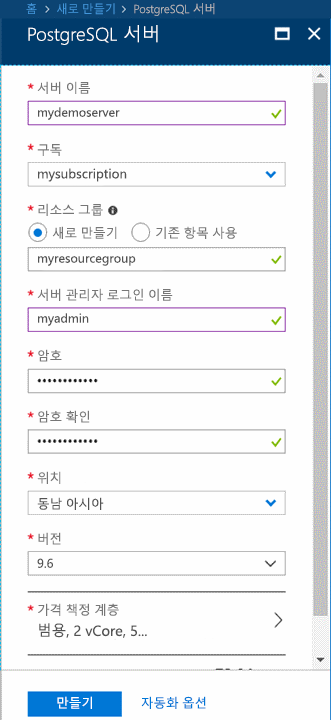
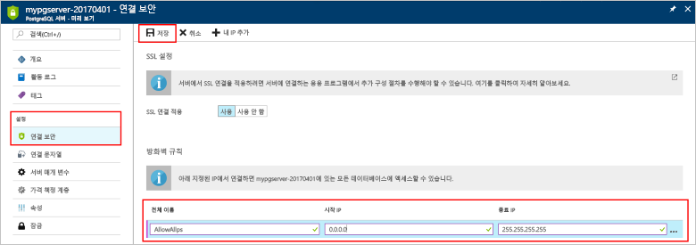

# <a name="quickstart-create-an-azure-database-for-postgresql-server-in-the-azure-portal"></a>빠른 시작: Azure Portal에서 Azure Database for PostgreSQL 서버 만들기

PostgreSQL용 Azure Database는 클라우드에서 항상 사용 가능한 PostgreSQL 데이터베이스를 실행, 관리 및 크기 조정하는 데 사용하는 관리 서비스입니다. 이 빠른 시작에서는 Azure Portal을 사용하여 약 5분 안에 Azure Database for PostgreSQL 서버를 만드는 방법을 보여 줍니다.

Azure 구독이 아직 없는 경우 시작하기 전에 [Azure 체험 계정](https://azure.microsoft.com/free/)을 만듭니다.

## <a name="sign-in-to-the-azure-portal"></a>Azure Portal에 로그인
웹 브라우저를 열고 [포털](https://portal.azure.com/)로 이동합니다. 자격 증명을 입력하여 포털에 로그인합니다. 기본 보기는 서비스 대시보드입니다.

## <a name="create-an-azure-database-for-postgresql-server"></a>PostgreSQL용 Azure Database 서버 만들기

Azure Database for PostgreSQL 서버는 구성된 [계산 및 저장소 리소스](./concepts-pricing-tiers.md) 집합으로 만들어집니다. 서버는 [Azure 리소스 그룹](../azure-resource-manager/resource-group-overview.md) 내에 만들어집니다.

PostgreSQL 서버용 Azure Database를 만들려면 다음 단계를 따릅니다.
1. 포털의 왼쪽 상단 모서리에서 **리소스 만들기** 단추(+)를 선택합니다.

2. **데이터베이스** > **PostgreSQL용 Azure Database**를 차례로 선택합니다.

    ![[PostgreSQL용 Azure Database] 옵션](./media/quickstart-create-database-portal/1-create-database.png)

3. 새 서버 세부 정보 양식을 다음 정보로 작성합니다.

    

    설정|제안 값|설명
    ---|---|---
    서버 이름 |*mydemoserver*|PostgreSQL 서버용 Azure Database를 식별하는 고유한 이름입니다. 사용자가 제공한 서버 이름에 *postgres.database.azure.com* 도메인 이름이 추가됩니다. 서버는 소문자, 숫자 및 하이픈(-) 문자만 포함할 수 있으며, 3-63자 이상이어야 합니다.
    구독|구독 이름|서버에 사용할 Azure 구독입니다. 구독이 여러 개인 경우 해당 리소스에 대해 요금이 청구되는 적절한 구독을 선택합니다.
    리소스 그룹|*myresourcegroup*| 새 리소스 그룹 이름 또는 구독의 기존 이름입니다.
    원본 선택 | *비어 있음* | 새 서버를 처음부터 만들려면 *비어 있음*을 선택합니다. (기존 Azure Database for PostgreSQL 서버의 지역 백업에서 서버를 만든 경우 *백업*을 선택합니다).
    서버 관리자 로그인 |*myadmin*| 서버에 연결할 경우 사용할 사용자 고유의 로그인 계정입니다. 관리자 로그인 이름은 **azure_superuser**, **azure_pg_admin**, **admin**, **administrator**, **root**, **guest** 또는 **public**이 될 수 없습니다. **pg_** 로 시작할 수 없습니다.
    암호 |사용자 암호| 서버 관리자 계정의 새 암호입니다. 8-128자여야 합니다. 암호에는 영어 대문자, 영어 소문자, 숫자(0-9) 및 영숫자가 아닌 문자(!, $, #, % 등)의 세 가지 범주에 속하는 문자가 포함되어야 합니다.
    위치|사용자와 가장 가까운 지역| 사용자에게 가장 가까운 위치입니다.
    버전|최신 주 버전| 다른 특정 요구 사항이 없는 한 최신 PostgreSQL 주 버전입니다.
    가격 책정 계층  | **범용**, **4세대**, **2개 vCore**, **5GB**, **7일**, **지역 중복** | 새 서버에 대한 계산, 저장소 및 백업 구성입니다. **가격 책정 계층**을 선택합니다. 그런 다음, **범용** 탭을 선택합니다. *4세대*, *2개 vCore*, *5GB* 및 *7일*은 **세대 계산**, **vCore**, **저장소** 및 **백업 보존 기간**에 대한 기본 값입니다. 해당 슬라이더를 그대로 둘 수 있습니다. 지역 중복 저장소에서 서버 백업을 사용하도록 설정하려면 **백업 중복 옵션**에서 **지역 중복**을 선택합니다. 이 가격 책정 계층 선택을 저장하려면 **확인**을 선택합니다. 다음 스크린샷은 이러한 선택을 캡처한 것입니다.

    > [!IMPORTANT]
    > 여기에 지정한 서버 관리자 로그인 및 암호는 이 빠른 시작의 뒷부분에 나오는 서버 및 데이터베이스에 로그인해야 합니다. 나중에 사용하기 위해 이 정보를 기억하거나 기록합니다.

    ![[가격 책정 계층] 창](./media/quickstart-create-database-portal/2-pricing-tier.png)

4. **만들기**를 선택하여 서버를 프로비전합니다. 이 작업은 몇 분 정도 걸릴 수 있습니다.

5. 배포 프로세스를 모니터링하려면 도구 모음에서 **알림** 아이콘(벨)을 선택합니다. 배포가 완료되면 Azure Portal 대시보드에서 이 서버에 대한 타일을 서버의 **개요** 페이지에 대한 바로 가기로 만드는 **대시보드에 고정**을 선택할 수 있습니다. **리소스로 이동** 옵션을 선택하면 서버의 **개요** 페이지가 열립니다.

    ![[알림] 창](./media/quickstart-create-database-portal/3-notifications.png)
   
   기본적으로 **postgres** 데이터베이스가 서버 아래에 만들어집니다. [postgres](https://www.postgresql.org/docs/9.6/static/app-initdb.html) 데이터베이스는 사용자, 유틸리티 및 타사 응용 프로그램에서 사용하는 기본 데이터베이스입니다. (다른 기본 데이터베이스는 **azure_maintenance**입니다. 해당 기능은 사용자 작업으로부터 관리되는 서비스 프로세스를 구분하는 것입니다. 이 데이터베이스에 액세스할 수 없습니다.)

## <a name="configure-a-server-level-firewall-rule"></a>서버 수준 방화벽 규칙 구성

PostgreSQL용 Azure Database는 서버 수준에서 방화벽을 만듭니다. 특정 IP 주소에 대한 방화벽을 열기 위한 규칙을 만들지 않는 한, 이 방화벽은 외부 애플리케이션과 도구에서 서버 및 서버의 모든 데이터베이스에 연결되지 않도록 방지합니다. 

1. 배포가 완료되면 서버를 찾습니다. 필요한 경우 검색할 수 있습니다. 예를 들어 왼쪽 메뉴에서 **모든 리소스**를 선택합니다. 서버 이름(예: **mydemoserver**)을 입력하여 새로 만든 서버를 검색합니다. 검색 결과 목록에서 서버 이름을 선택합니다. 서버에 대한 **개요** 페이지가 열리고 추가 구성을 위한 옵션이 제공됩니다.
 
    

2. 서버 페이지에서 **연결 보안**을 선택합니다.

3. **방화벽 규칙** 아래의 **규칙 이름** 열에서 빈 텍스트 상자를 선택하여 방화벽 규칙을 만들기 시작합니다. 

   텍스트 상자에 서버에 액세스하는 클라이언트의 이름, 시작 및 종료 IP 범위를 입력합니다. 단일 IP인 경우 시작 IP 및 종료 IP에 동일한 값을 사용합니다.

   
     

4. **연결 보안** 페이지의 위쪽 도구 모음에서 **저장**을 선택합니다. 계속하기 전에 연결 보안 업데이트가 성공적으로 완료되었다는 알림이 나타날 때까지 기다립니다.

    > [!NOTE]
    > Azure Database for PostgreSQL 서버에 대한 연결은 포트 5432를 통해 통신합니다. 회사 네트워크 내에서 연결하려는 경우 5432 포트를 통한 아웃바운드 트래픽이 네트워크 방화벽에서 허용되지 않을 수 있습니다. 이 경우 IT 부서에서 5432 포트를 열지 않으면 서버에 연결할 수 없습니다.
    >

## <a name="get-the-connection-information"></a>연결 정보 가져오기

PostgreSQL 서버용 Azure Database를 만들 때 **postgres**라는 기본 데이터베이스도 만들어집니다. 데이터베이스 서버에 연결하려면 전체 서버 이름 및 관리자 로그인 자격 증명이 필요합니다. 빠른 시작 문서의 앞부분에서 이러한 값을 기록했을 수도 있습니다. 기록하지 않은 경우에는 포털의 서버 **개요** 페이지에서 서버 이름과 로그인 정보를 쉽게 찾을 수 있습니다.

서버의 **개요** 페이지를 엽니다. **서버 이름** 및 **서버 관리자 로그인 이름**을 기록해 둡니다. 각 필드 위에 커서를 올려 놓으면 텍스트 오른쪽에 복사 기호가 나타납니다. 필요에 따라 복사 기호를 선택하여 값을 복사합니다.

 ![서버 [개요] 페이지](./media/quickstart-create-database-portal/6-server-name.png)

## <a name="connect-to-the-postgresql-database-using-psql"></a>psql을 사용하여 PostgreSQL 데이터베이스에 연결

Azure Database for PostgreSQL 서버 연결하기 위해 사용할 수 있는 여러 애플리케이션이 있습니다. 클라이언트 컴퓨터에 PostgreSQL이 설치되어 있는 경우 [psql](https://www.postgresql.org/docs/current/static/app-psql.html) 로컬 인스턴스를 사용하여 Azure PostgreSQL 서버에 연결할 수 있습니다. 이제 psql 명령줄 유틸리티를 사용하여 Azure PostgreSQL 서버에 연결해 보겠습니다.

1. 셸에서 psql 명령줄을 입력하여 Azure Database for PostgreSQL 서버의 데이터베이스에 연결합니다.

    [psql](https://www.postgresql.org/docs/current/static/app-psql.html) 유틸리티를 사용하여 PostgreSQL 서버용 Azure Database에 연결하려면 다음 형식을 사용합니다.
    ```bash
    psql --host=<yourserver> --port=<port> --username=<server admin login> --dbname=<database name>
    ```

    예를 들어 다음 명령은 예제 서버에 연결합니다.

    ```bash
    psql --host=mydemoserver.postgres.database.azure.com --port=5432 --username=myadmin@mydemoserver --dbname=postgres
    ```

    psql parameter |값|설명
    ---|---|---
    --host | 서버 이름 | 이전에 PostgreSQL 서버용 Azure Database를 만들 때 사용한 서버 이름 값입니다. 표시된 예제 서버는 **mydemoserver.postgres.database.azure.com**입니다. 예제에서 표시된 것과 같은 정규화된 도메인 이름(**\*.postgres.database.azure.com**)을 사용합니다. 서버 이름을 잊어버린 경우 이전 섹션의 단계에 따라 연결 정보를 가져옵니다. 
    --port | 5432 | PostgreSQL 서버용 Azure Database에 연결할 때 사용할 포트입니다. 
    --username | 서버 관리자 로그인 이름 |이전에 PostgreSQL 서버용 Azure Database를 만들 때 제공한 서버 관리자 로그인 사용자 이름입니다. 사용자 이름을 기억하지 못하는 경우 이전 섹션의 단계에 따라 연결 정보를 가져옵니다. 형식은 *username@servername*입니다.
    --dbname | *postgres* | 첫 연결을 위해 만들어진 기본 시스템에서 생성한 데이터베이스 이름입니다. 나중에 사용자 고유의 데이터베이스를 만듭니다.

    사용자 고유의 매개 변수 값을 사용하여 psql 명령을 실행하면 서버 관리자 암호를 입력하라는 메시지가 표시됩니다. 이 암호는 서버를 만들 때 제공한 암호와 동일합니다. 

    psql parameter |제안 값|설명
    ---|---|---
    암호 | 관리자 암호 | 입력한 암호 문자는 Bash 프롬프트에 표시되지 않습니다. 모든 문자가 입력되면 Enter 키를 눌러 인증하고 연결합니다.

    연결되면 psql 유틸리티에 sql 명령을 입력할 수 있는 postgres 프롬프트가 표시됩니다. 초기 연결 출력에서는 사용하는 psql이 Azure Database for PostgreSQL 서버와 다른 버전일 수 있으므로 경고가 표시될 수 있습니다. 
    
    psql 출력의 예:
    ```bash
    psql (9.5.7, server 9.6.2)
    WARNING: psql major version 9.5, server major version 9.6.
        Some psql features might not work.
    SSL connection (protocol: TLSv1.2, cipher: ECDHE-RSA-AES256-SHA384, bits: 256, compression: off)
    Type "help" for help.
   
    postgres=> 
    ```

    > [!TIP]
    > 방화벽이 클라이언트의 IP 주소를 허용하도록 구성되지 않은 경우 다음 오류가 발생합니다.
    > 
    > "psql: FATAL: "<IP address>" 호스트, user "myadmin", database "postgres"에 대한 pg_hba.conf 항목이 없습니다. SSL on FATAL: SSL 연결이 필요합니다. SSL 옵션을 지정하고 다시 시도하세요.
    > 
    > 이 오류를 해결하려면 서버 구성이 문서의 “서버 수준 방화벽 규칙 구성” 섹션에 있는 단계와 일치하는지 확인합니다.

2. 프롬프트에서 다음 명령을 입력하여 "mypgsqldb"라는 빈 데이터베이스를 만듭니다.
    ```bash
    CREATE DATABASE mypgsqldb;
    ```
    이 명령을 완료하는 데 몇 분 정도 걸릴 수 있습니다. 

3. 프롬프트에서 다음 명령을 실행하여 새로 만든 **mypgsqldb** 데이터베이스에 대한 연결로 전환합니다.
    ```bash
    \c mypgsqldb
    ```

4. `\q`를 입력한 다음, Enter 키를 선택하여 psql을 종료합니다. 

psql을 통해 Azure Database for PostgreSQL 서버에 연결하고, 빈 사용자 데이터베이스를 만들었습니다. 다른 일반적인 도구인 pgAdmin을 사용하여 연결하려면 다음 섹션으로 진행합니다.

## <a name="connect-to-the-postgresql-server-using-pgadmin"></a>pgAdmin을 사용하여 PostgreSQL 서버에 연결

pgAdmin은 PostgreSQL에서 사용되는 오픈 소스 도구입니다. [pgAdmin 웹 사이트](https://www.pgadmin.org/)에서 pgAdmin을 설치할 수 있습니다. 사용 중인 pgAdmin 버전이 이 빠른 시작에 사용된 버전과 다를 수 있습니다. 추가 지침이 필요하면 pgAdmin 설명서를 참조하세요.

1. 클라이언트 컴퓨터에서 pgAdmin 응용 프로그램을 엽니다.

2. 도구 모음에서 **개체**로 이동하고, 마우스로 **만들기**를 가리킨 다음, **서버**를 선택합니다.

3. **만들기 - 서버** 대화 상자의 **일반** 탭에서 **mydemoserver**와 같이 서버에 대해 고유하고 친숙한 이름을 입력합니다.

    ![[일반] 탭](./media/quickstart-create-database-portal/9-pgadmin-create-server.png)

4. **만들기 - 서버** 대화 상자의 **연결** 탭에서 설정 테이블을 채웁니다.

   ![[연결] 탭](./media/quickstart-create-database-portal/10-pgadmin-create-server.png)

    pgAdmin 매개 변수 |값|설명
    ---|---|---
    호스트 이름/주소 | 서버 이름 | 이전에 PostgreSQL 서버용 Azure Database를 만들 때 사용한 서버 이름 값입니다. 예제 서버는 **mydemoserver.postgres.database.azure.com**입니다. 예제에서 표시된 것과 같은 정규화된 도메인 이름(**\*.postgres.database.azure.com**)을 사용합니다. 서버 이름을 잊어버린 경우 이전 섹션의 단계에 따라 연결 정보를 가져옵니다. 
    포트 | 5432 | PostgreSQL 서버용 Azure Database에 연결할 때 사용할 포트입니다. 
    데이터베이스 유지 관리 | *postgres* | 기본 시스템에서 생성된 데이터베이스 이름입니다.
    사용자 이름 | 서버 관리자 로그인 이름 | 이전에 PostgreSQL 서버용 Azure Database를 만들 때 제공한 서버 관리자 로그인 사용자 이름입니다. 사용자 이름을 잊어버린 경우 이전 섹션의 단계에 따라 연결 정보를 가져옵니다. 형식은 *username@servername*입니다.
    암호 | 관리자 암호 | 이 빠른 시작의 앞 부분에서 서버를 만들 때 선택한 암호입니다.
    역할 | 비워 둠 | 이 시점에서 역할 이름을 제공할 필요가 없습니다. 필드를 비워 둡니다.
    SSL 모드 | *필수* | pgAdmin의 SSL 탭에서 SSL 모드를 설정할 수 있습니다. 기본적으로 모든 Azure Database for PostgreSQL 서버는 SSL이 적용된 상태로 만들어집니다. SSL 적용을 해제하려면 [SSL 적용](./concepts-ssl-connection-security.md)을 참조하세요.
    
5. **저장**을 선택합니다.

6. 왼쪽 **브라우저** 창에서 **서버** 노드를 확장합니다. 서버를 선택합니다(예: **mydemoserver**). 클릭하여 연결합니다.

7. 서버 노드를 확장한 다음 그 아래 **데이터베이스**를 확장합니다. 목록에는 기존 *postgres* 데이터베이스와 사용자가 만든 다른 데이터베이스가 포함되어야 합니다. Azure Database for PostgreSQL에서는 서버당 여러 개의 데이터베이스를 만들 수 있습니다.

8. **데이터베이스**를 마우스 오른쪽 단추로 클릭하고 **만들기** 메뉴를 선택하고 **데이터베이스**를 선택합니다.

9. **데이터베이스** 필드에 원하는 데이터베이스 이름(예: **mypgsqldb2**)을 입력합니다.

10. 목록 상자에서 데이터베이스에 대한 **소유자**를 선택합니다. 서버 관리자 로그인 이름(예: **my admin**)을 선택합니다.

   

11. **저장**을 선택하여 새로운 빈 데이터베이스를 만듭니다.

12. **브라우저** 창에서 서버 이름 아래의 데이터베이스 목록에서 만든 데이터베이스를 확인할 수 있습니다.


## <a name="clean-up-resources"></a>리소스 정리
빠른 시작에서 만든 리소스는 두 가지 방법 중 하나로 정리할 수 있습니다. 리소스 그룹의 모든 리소스를 포함하고 있는 [Azure 리소스 그룹](../azure-resource-manager/resource-group-overview.md)을 삭제할 수 있습니다. 다른 리소스를 그대로 유지하려면 해당 서버 리소스만 삭제합니다.

> [!TIP]
> 이 컬렉션의 다른 빠른 시작은 이 빠른 시작을 기반으로 하여 빌드됩니다. 빠른 시작을 계속 사용하려면 이 빠른 시작에서 만든 리소스를 정리하지 않습니다. 계속하지 않으려는 경우 다음 단계에 따라 이 빠른 시작에서 만든 리소스를 포털에서 삭제합니다.

새로 만든 서버를 비롯하여 전체 리소스 그룹을 삭제하려면
1. 포털에서 리소스 그룹을 찾습니다. 왼쪽 메뉴에서 **리소스 그룹**을 선택합니다. 그런 다음 리소스 그룹의 이름을 선택합니다(예: **myresourcegroup**).

2. 리소스 그룹 페이지에서 **삭제**를 선택합니다. 텍스트 상자에 리소스 그룹의 이름(예: **myresourcegroup**)을 입력하고 삭제를 확인합니다. **삭제**를 선택합니다.

새로 만든 서버를 삭제하려면
1. 포털에서 서버를 찾습니다(열려 있지 않은 경우). 왼쪽 메뉴에서 **모든 리소스**를 선택합니다. 그런 다음 만든 서버를 검색합니다.

2. **개요** 페이지에서 **삭제**를 선택합니다.

    ![[삭제] 단추](./media/quickstart-create-database-portal/12-delete.png)

3. 삭제하려는 서버 이름을 확인하고, 영향을 받는 데이터베이스를 봅니다. 텍스트 상자에서 서버 이름(예: **mydemoserver**)을 입력합니다. **삭제**를 선택합니다.

## <a name="next-steps"></a>다음 단계
> [!div class="nextstepaction"]
> [내보내기 및 가져오기를 사용하여 데이터베이스 마이그레이션](./howto-migrate-using-export-and-import.md)
