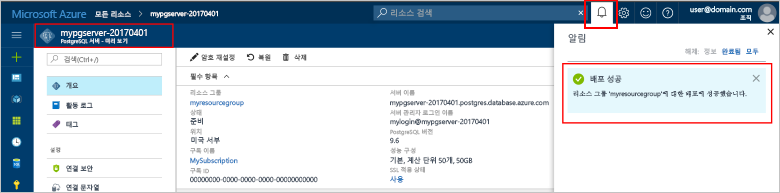
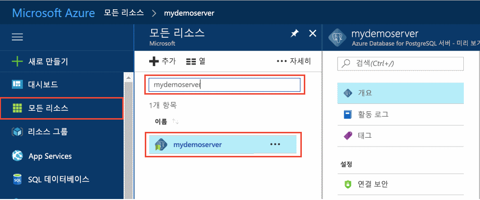
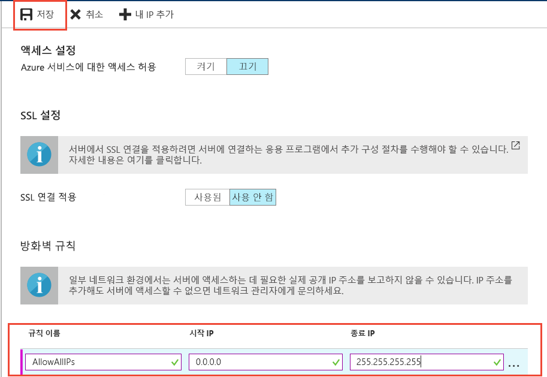
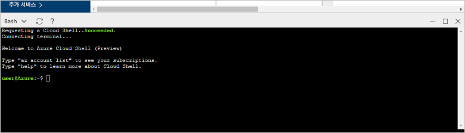

# <a name="design-your-first-azure-database-for-postgresql-using-the-azure-portal"></a>Azure Portal을 사용하여 첫 번째 Azure Database for PostgreSQL 디자인

Azure Database for PostgreSQL은 클라우드에서 항상 사용 가능한 PostgreSQL 데이터베이스를 실행, 관리 및 크기 조정할 수 있게 하는 관리 서비스입니다. Azure Portal을 사용하면 쉽게 서버를 관리하고 데이터베이스를 디자인할 수 있습니다.

이 자습서에서는 Azure Portal을 사용하여 다음을 수행하는 방법에 대해 알아봅니다.
> [!div class="checklist"]
> * Azure Database for PostgreSQL 만들기
> * 서버 방화벽 구성
> * [**psql**](https://www.postgresql.org/docs/9.6/static/app-psql.html) 유틸리티를 사용하여 데이터베이스 만들기
> * 샘플 데이터 로드
> * 쿼리 데이터
> * 데이터 업데이트
> * 데이터 복원

## <a name="prerequisites"></a>필수 조건
Azure 구독이 아직 없는 경우 시작하기 전에 [체험](https://azure.microsoft.com/free/) 계정을 만듭니다.

## <a name="log-in-to-the-azure-portal"></a>Azure 포털에 로그인
[Azure 포털](https://portal.azure.com)에 로그인합니다.

## <a name="create-an-azure-database-for-postgresql"></a>Azure Database for PostgreSQL 만들기

Azure Database for PostgreSQL 서버는 정의된 [계산 및 저장소 리소스](./concepts-compute-unit-and-storage.md) 집합으로 만들어집니다. 서버는 [Azure 리소스 그룹](../azure-resource-manager/resource-group-overview.md) 내에 만들어집니다.

다음 단계에 따라 Azure Database for PostgreSQL 서버를 를 만듭니다.
1.    Azure Portal의 왼쪽 위 모서리에 있는 **+ 새로 만들기** 단추를 클릭합니다.
2.    **새로 만들기** 페이지에서 **데이터베이스**를 선택하고, **데이터베이스** 페이지에서 **Azure Database for PostgreSQL**을 선택합니다.
 

3.    위 이미지와 같이 다음 정보를 사용하여 새 서버 세부 정보 양식을 채웁니다.
    - 서버 이름: **mypgserver-20170401**(서버 이름은 DNS 이름에 매핑되므로 전역적으로 고유해야 합니다.) 
    - 구독: 구독이 여러 개인 경우 리소스가 있거나 요금이 청구되는 적절한 구독을 선택합니다.
    - 리소스 그룹: **myresourcegroup**
    - 서버 관리자 로그인 및 선택한 암호
    - 위치
    - PostgreSQL 버전

  > [!IMPORTANT]
  > 여기에 지정한 서버 관리자 로그인 및 암호는 이 빠른 시작의 뒷부분에 나오는 서버 및 데이터베이스에 로그인해야 합니다. 나중에 사용하기 위해 이 정보를 기억하거나 기록합니다.

4.    **가격 책정 계층**을 클릭하고 새 데이터베이스의 서비스 계층 및 성능 수준을 지정합니다. 이 빠른 시작을 위해 **기본** 계층, **50개 계산 단위** 및 **50GB**의 포함된 저장소를 선택합니다.
 
5.    **확인**을 클릭합니다.
6.    **만들기**를 클릭하여 서버를 프로비전합니다. 프로비전하는 데 몇 분이 걸립니다.

  > [!TIP]
  > 배포를 쉽게 추적할 수 있도록 **대시보드에 고정** 옵션을 선택합니다.

7.    도구 모음에서 **알림**을 클릭하여 배포 프로세스를 모니터링합니다.
 
   
  기본적으로 **postgres** 데이터베이스가 서버 아래에 만들어집니다. [postgres](https://www.postgresql.org/docs/9.6/static/app-initdb.html) 데이터베이스는 사용자, 유틸리티 및 타사 응용 프로그램에서 사용하는 기본 데이터베이스입니다. 

## <a name="configure-a-server-level-firewall-rule"></a>서버 수준 방화벽 규칙 구성

Azure Database for PostgreSQL 서비스는 서버 수준 방화벽을 만듭니다. 방화벽 규칙을 만들어 특정 IP 주소에 대한 방화벽을 열지 않는 한 이 방화벽은 외부 응용 프로그램과 도구에서 서버 및 서버의 데이터베이스에 연결되지 않도록 방지합니다. 

1.    배포가 완료되면 왼쪽 메뉴에서 **모든 리소스**를 클릭하고 **mypgserver-20170401** 이름을 입력하여 새로 만든 서버를 검색합니다. 검색 결과에 나열된 서버 이름을 클릭합니다. 서버에 대한 **개요** 페이지가 열리고 추가 구성을 위한 옵션이 제공됩니다.
 
 

2.    서버 블레이드에서 **연결 보안**을 선택합니다. 
3.    **규칙 이름** 아래의 텍스트 상자를 클릭하고 연결을 위한 IP 범위를 허용 목록으로 만드는 새 방화벽 규칙을 추가합니다. 이 자습서에서는 **규칙 이름 = AllowAllIps**, **시작 IP = 0.0.0.0** 및 **종료 IP = 255.255.255.255**를 입력하여 모든 IP를 허용한 다음 **저장**을 클릭하겠습니다. IP 범위를 적용하는 방화벽 규칙을 설정하여 네트워크에서 연결할 수 있습니다.
 
 

4.    **저장**을 클릭한 다음 **X**을 클릭하여 **연결 보안** 페이지를 닫습니다.

  > [!NOTE]
  > Azure PostgreSQL 서버는 5432 포트를 통해 통신합니다. 회사 네트워크 내에서 연결하려는 경우 5432 포트를 통한 아웃바운드 트래픽이 네트워크 방화벽에서 허용되지 않을 수 있습니다. 이 경우 IT 부서에서 5432 포트를 열지 않으면 Azure SQL Database 서버에 연결할 수 없습니다.
  >


## <a name="get-the-connection-information"></a>연결 정보 가져오기

Azure Database for PostgreSQL 서버를 만들 때 기본 **postgres** 데이터베이스도 만들어집니다. 데이터베이스 서버에 연결하려면 호스트 정보와 액세스 자격 증명을 제공해야 합니다.

1. Azure Portal의 왼쪽 메뉴에서 **모든 리소스**를 클릭하고 방금 만든 **mypgserver-20170401** 서버를 검색합니다.

  

3. **mypgserver-20170401**서버 이름을 클릭합니다.
4. 서버의 **개요** 페이지를 선택합니다. **서버 이름** 및 **서버 관리자 로그인 이름**을 기록해 둡니다.

 


## <a name="connect-to-postgresql-database-using-psql-in-cloud-shell"></a>Cloud Shell에서 psql을 사용하여 PostgreSQL 데이터베이스에 연결

이제 psql 명령줄 유틸리티를 사용하여 Azure Database for PostgreSQL 서버에 연결해 보겠습니다. 
1. 위쪽 탐색 창의 터미널 아이콘을 통해 Azure Cloud Shell을 시작합니다.

   

2. 브라우저에서 bash 명령을 입력할 수 있는 Azure Cloud Shell이 열립니다.

   

3. Cloud Shell 프롬프트에서 psql 명령을 사용하여 Azure Database for PostgreSQL 서버에 연결합니다. 다음 형식은 [psql](https://www.postgresql.org/docs/9.6/static/app-psql.html) 유틸리티를 사용하여 Azure Database for PostgreSQL 서버에 연결하는 데 사용됩니다.
   ```bash
   psql --host=<myserver> --port=<port> --username=<server admin login> --dbname=<database name>
   ```

   예를 들어 다음 명령은 액세스 자격 증명을 사용하여 **mypgserver-20170401.postgres.database.azure.com** PostgreSQL 서버의 **postgres**라는 기본 데이터베이스에 연결합니다. 메시지가 표시되면 서버 관리자 암호를 입력합니다.

   ```bash
   psql --host=mypgserver-20170401.postgres.database.azure.com --port=5432 --username=mylogin@mypgserver-20170401 --dbname=postgres
   ```

## <a name="create-a-new-database"></a>새 데이터베이스 만들기
서버에 연결되면 프롬프트에서 빈 데이터베이스를 만듭니다.
```bash
CREATE DATABASE mypgsqldb;
```

프롬프트에서 다음 명령을 실행하여 새로 만든 **mypgsqldb** 데이터베이스에 대한 연결로 전환합니다.
```bash
\c mypgsqldb
```
## <a name="create-tables-in-the-database"></a>데이터베이스에서 테이블 만들기
이제 Azure Database for PostgreSQL에 연결하는 방법을 알았으므로 몇 가지 기본 작업을 수행하는 방법을 살펴볼 수 있습니다.

먼저 테이블을 만들고 일부 데이터와 함께 로드할 수 있습니다. 인벤토리 정보를 추적하는 테이블을 만들어 보겠습니다.
```sql
CREATE TABLE inventory (
    id serial PRIMARY KEY, 
    name VARCHAR(50), 
    quantity INTEGER
);
```

다음과 같이 입력하면 테이블 목록에서 새로 만든 테이블을 볼 수 있습니다.
```sql
\dt
```

## <a name="load-data-into-the-tables"></a>테이블에 데이터 로드
이제 테이블을 만들었으므로 이 테이블에 일부 데이터를 삽입할 수 있습니다. 열린 명령 프롬프트 창에서 다음 쿼리를 실행하여 데이터 행을 일부 삽입합니다.
```sql
INSERT INTO inventory (id, name, quantity) VALUES (1, 'banana', 150); 
INSERT INTO inventory (id, name, quantity) VALUES (2, 'orange', 154);
```

이제 앞에서 만든 테이블에 두 개의 샘플 데이터 행이 있습니다.

## <a name="query-and-update-the-data-in-the-tables"></a>테이블의 데이터 쿼리 및 업데이트
다음 쿼리를 실행하여 데이터베이스 테이블에서 정보를 검색합니다. 
```sql
SELECT * FROM inventory;
```

또한 테이블의 데이터를 업데이트할 수도 있습니다
```sql
UPDATE inventory SET quantity = 200 WHERE name = 'banana';
```

이에 따라 데이터를 검색할 때 해당 행이 업데이트됩니다.
```sql
SELECT * FROM inventory;
```

## <a name="restore-data-to-a-previous-point-in-time"></a>이전 시점으로 데이터 복원
실수로 이 테이블을 삭제했다고 가정해 보겠습니다. 이 상황은 쉽게 복구할 수 있는 것이 아닙니다. Azure Database for PostgreSQL를 사용하면 특정 시점(마지막 시점에서 최대 7일 전(기본) 및 35일 전(표준))으로 되돌아가 이 시점의 새 서버로 복원할 수 있습니다. 이 새 서버를 사용하여 삭제된 데이터를 복구할 수 있습니다. 다음 단계에서는 테이블이 추가되기 이전 시점으로 샘플 서버를 복원합니다.

1.    서버에 대한 Azure Database for PostgreSQL 페이지의 도구 모음에서 **복원**을 클릭합니다. **복원** 페이지가 열립니다.
  
2.    필요한 정보로 **복원** 양식을 채웁니다.

  
  - **복원 지점**: 데이터베이스를 변경하기 전의 특정 시점을 선택합니다.
  - **대상 서버**: 복원해 두려는 새 서버의 이름을 제공합니다.
  - **위치**: 지역은 선택할 수 없으며, 기본적으로 원본 서버와 동일합니다.
  - **가격 책정 계층:** 서버를 복원할 때 이 값을 변경할 수 없습니다. 원본 서버와 동일합니다. 
3.    **확인**을 클릭하여 서버를 테이블 삭제 이전의 [특정 시점으로 복원](./howto-restore-server-portal.md)합니다. 다른 특정 시점으로 서버를 복원하는 경우 [서비스 계층](./concepts-service-tiers.md)에 대한 보존 기간 내에 있다면 중복된 새 서버를 지정한 시점의 원본 서버로 만들어집니다.

## <a name="next-steps"></a>다음 단계
이 자습서에서는 Azure Portal 및 기타 유틸리티를 사용하여 다음을 수행하는 방법에 대해 알아보았습니다.
> [!div class="checklist"]
> * Azure Database for PostgreSQL 만들기
> * 서버 방화벽 구성
> * [**psql**](https://www.postgresql.org/docs/9.6/static/app-psql.html) 유틸리티를 사용하여 데이터베이스 만들기
> * 샘플 데이터 로드
> * 쿼리 데이터
> * 데이터 업데이트
> * 데이터 복원

다음에는 Azure CLI를 사용하여 유사한 작업을 수행하는 방법에 대해 알아보고, [Azure CLI를 사용하여 첫 번째 Azure Database for PostgreSQL 디자인](tutorial-design-database-using-azure-cli.md) 자습서를 검토합니다.

