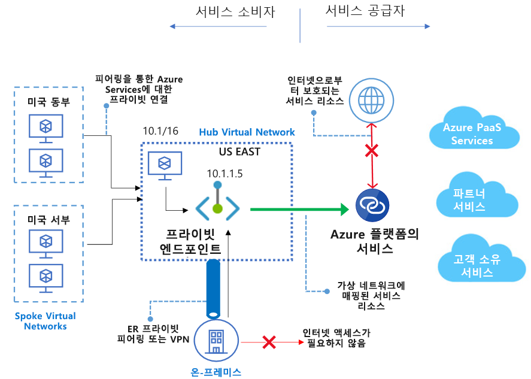

# Azure Private Link란? 
Azure Private Link를 사용하면 가상 네트워크의 [프라이빗 엔드포인트](private-endpoint-overview.md)를 통해 Azure PaaS Services(예: Azure Storage 및 SQL Database)와 Azure 호스팅 고객 소유/파트너 서비스에 액세스할 수 있습니다.

가상 네트워크와 서비스 사이의 트래픽은 Microsoft 백본 네트워크를 통해 이동합니다. 서비스를 공용 인터넷에 더 이상 노출할 필요가 없습니다. 가상 네트워크에 자체 [프라이빗 링크 서비스](private-link-service-overview.md)를 만들어서 고객에게 제공할 수도 있습니다. Azure Private Link를 사용한 설치 및 소비는 Azure PaaS, 고객 소유 및 공유 파트너 서비스에서 일관적입니다.

> [!IMPORTANT]
> Azure Private Link가 이제 일반 공급됩니다. 프라이빗 엔드포인트 및 Private Link 서비스(표준 부하 분산 장치 뒤의 서비스)가 모두 일반 공급됩니다. 다른 Azure PaaS는 다른 일정에 따라 Azure Private Link에 온보딩됩니다. 아래 [가용성](https://docs.microsoft.com/azure/private-link/private-link-overview#availability) 섹션에서 Private Link의 Azure PaaS에 대한 정확한 상태를 확인하세요. 알려진 제한은 [프라이빗 엔드포인트](private-endpoint-overview.md#limitations) 및 [Private Link Service](private-link-service-overview.md#limitations)를 참조하세요. 

## 주요 이점
Azure Private Link는 다음과 같은 이점이 있습니다.  
- **Azure 플랫폼에서 서비스에 비공개로 액세스**: 원본 또는 대상의 공용 IP 주소 없이 Azure 서비스에 가상 네트워크를 연결할 수 있습니다. 서비스 공급자는 자체 가상 네트워크에서 서비스를 렌더링할 수 있으며, 소비자는 로컬 가상 네트워크에서 이러한 서비스에 액세스할 수 있습니다. Private Link 플랫폼은 Azure 백본 네트워크를 통해 소비자와 서비스 간의 연결을 처리합니다. 
 
- **온-프레미스 및 피어링된 네트워크** 프라이빗 엔드포인트를 사용하여 온-프레미스에서 ExpressRoute 프라이빗 피어링, VPN 터널 및 피어링된 가상 네트워크를 통해 Azure에서 실행되는 서비스에 액세스할 수 있습니다. 공용 피어링을 설정하거나 인터넷을 통과하여 서비스에 연결할 필요가 없습니다. Private Link는 워크로드를 Azure로 안전하게 마이그레이션하는 방법을 제공합니다.
 
- **데이터 유출 방지**: 프라이빗 엔드포인트는 전체 서비스가 아닌 PaaS 리소스 인스턴스에 매핑됩니다. 소비자는 특정 리소스에만 연결할 수 있습니다. 서비스의 다른 리소스에 대한 액세스는 차단됩니다. 이 메커니즘은 데이터 유출 위험을 방지합니다. 
 
- **글로벌 환경**: 다른 Azure 지역에서 실행되는 서비스에 비공개로 연결할 수 있습니다. 소비자의 가상 네트워크는 A 지역에 있으며, B 지역의 Private Link 뒤에 있는 서비스에 연결할 수 있습니다.  
 
- **사용자 고유의 서비스로 확장**: 동일한 환경과 기능을 사용하여 자체 서비스를 Azure의 소비자에게 비공개로 렌더링할 수 있습니다. 서비스를 표준 Azure Load Balancer 뒤에 배치하여 Private Link에 사용할 수 있습니다. 그러면 소비자는 자체 가상 네트워크에서 프라이빗 엔드포인트를 사용하여 서비스에 직접 연결할 수 있습니다. 승인 호출 흐름을 사용하여 연결 요청을 관리할 수 있습니다. Azure Private Link는 서로 다른 Azure Active Directory 테넌트에 속한 소비자 및 서비스에 대해 작동합니다. 

## 가용성 
 다음 표에는 Private Link 서비스 및 이러한 서비스를 사용할 수 있는 지역이 나열되어 있습니다. 

|시나리오  |지원되는 서비스  |사용 가능한 지역 | 상태  |
|:---------|:-------------------|:-----------------|:--------|
|고객 소유 서비스용 Private Link |표준 Azure Load Balancer 뒤에 있는 Private Link 서비스 | 모든 공용 지역  | GA   [자세히 알아보기](https://docs.microsoft.com/azure/private-link/private-link-service-overview) |
|Azure PaaS 서비스용 Private Link   | Azure Storage        |  모든 공용 지역      | GA   [자세히 알아보기](/azure/storage/common/storage-private-endpoints)  |
|  | Azure Data Lake Storage Gen2        |  모든 공용 지역      | GA   [자세히 알아보기](/azure/storage/common/storage-private-endpoints)  |
|  |  Azure SQL Database         | 모든 공용 지역      |   GA   [자세히 알아보기](https://docs.microsoft.com/azure/sql-database/sql-database-private-endpoint-overview)      |
|  |Azure Synapse Analytics(SQL Data Warehouse)| 모든 공용 지역 |GA   [자세히 알아보기](https://docs.microsoft.com/azure/sql-database/sql-database-private-endpoint-overview)|
|  |Azure Cosmos DB|  미국 동부, 미국 동부 2, 미국 서부, 미국 서부 2,  미국 중부, 미국 중남부, 미국 중서부, 미국 중북부, 북유럽, 서유럽  |GA   [자세히 알아보기](https://docs.microsoft.com/azure/cosmos-db/how-to-configure-private-endpoints)|
|  |  Azure Database for PostgreSQL - 단일 서버         | 모든 공용 지역      |   GA   [자세히 알아보기](https://docs.microsoft.com/azure/postgresql/concepts-data-access-and-security-private-link)      |
|  |  Azure Database for MySQL         | 모든 공용 지역      |   GA   [자세히 알아보기](https://docs.microsoft.com/azure/mysql/concepts-data-access-security-private-link)     |
|  |  Azure Database for MariaDB         | 모든 공용 지역      |   GA   [자세히 알아보기](https://docs.microsoft.com/azure/mariadb/concepts-data-access-security-private-link)      |
|  |  Azure Key Vault         | 모든 공용 지역      |   GA     [자세히 알아보기](https://docs.microsoft.com/azure/key-vault/private-link-service)   |
|  |Azure Kubernetes Service - Kubernetes API | 모든 공용 지역      |   GA     [자세히 알아보기](https://docs.microsoft.com/azure/aks/private-clusters)   |
|  |Azure Search | 미국 동부, 미국 서부 2, 미국 중남부 |   미리 보기    |
|  |Azure Container Registry | 모든 공용 지역      |   미리 보기   |
|  |Azure App Configuration | 모든 공용 지역      |   미리 보기   |
|  |Azure Backup | 미국 동부, 미국 서부 2, 미국 중남부     |   미리 보기   |
|  |Azure Event Hub | 모든 공용 지역      |   미리 보기    |
|  |Azure Service Bus | 모든 공용 지역      |   미리 보기   |
|  |Azure Relay | 모든 공용 지역      |   미리 보기   |
|  |Azure Event Grid| 모든 공용 지역      |   미리 보기     [자세히 알아보기](https://docs.microsoft.com/azure/event-grid/network-security)   |
|  |Azure Web Apps | 미국 동부, 미국 서부 2, 미국 중남부      |   미리 보기     [자세히 알아보기](https://docs.microsoft.com/azure/app-service/networking/private-endpoint)   |

최신 알림은 [Azure Virtual Network 업데이트 페이지](https://azure.microsoft.com/updates/?product=virtual-network)를 확인하세요.

## 로깅 및 모니터링

Azure Private Link는 Azure Monitor와 통합되었습니다. 이 조합을 통해 다음을 수행할 수 있습니다.

 - 스토리지 계정에 로그를 보관합니다.
 - 이벤트를 Event Hubs로 스트리밍합니다.
 - Azure Monitor 로깅이 가능합니다.

Azure Monitor에서 다음 정보에 액세스할 수 있습니다. 
- **프라이빗 엔드포인트**: 
    - 프라이빗 엔드포인트에서 처리한 데이터(수신/송신)
 
- **Private Link 서비스**:
    - Private Link 서비스에서 처리한 데이터(수신/송신)
    - NAT 포트 가용성  
 
## 가격 책정   
가격 책정에 대한 자세한 내용은 [Azure Private Link 가격 책정](https://azure.microsoft.com/pricing/details/private-link/)을 참조하세요.
 
## FAQ  
FAQ는 [Azure Private Link FAQ](private-link-faq.md)를 참조하세요.
 
## 제한  
제한은 [Azure Private Link 제한](../azure-resource-manager/management/azure-subscription-service-limits.md#private-link-limits)을 참조하세요.

## 서비스 수준 계약
SLA는 [Azure Private Link에 대한 SLA](https://azure.microsoft.com/support/legal/sla/private-link/v1_0/)를 참조하세요.

## 다음 단계

- [빠른 시작: Azure Portal을 사용하여 프라이빗 엔드포인트 만들기l](create-private-endpoint-portal.md)
- [빠른 시작: Azure Portal을 사용하여 Private Link 서비스 만들기](create-private-link-service-portal.md)

 
