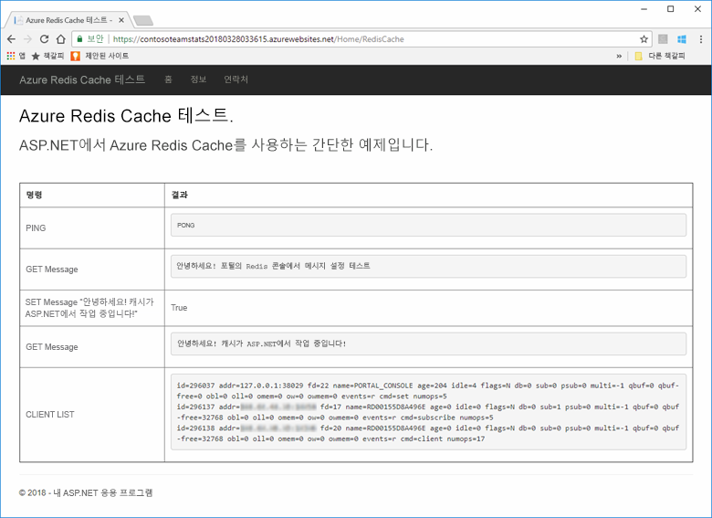
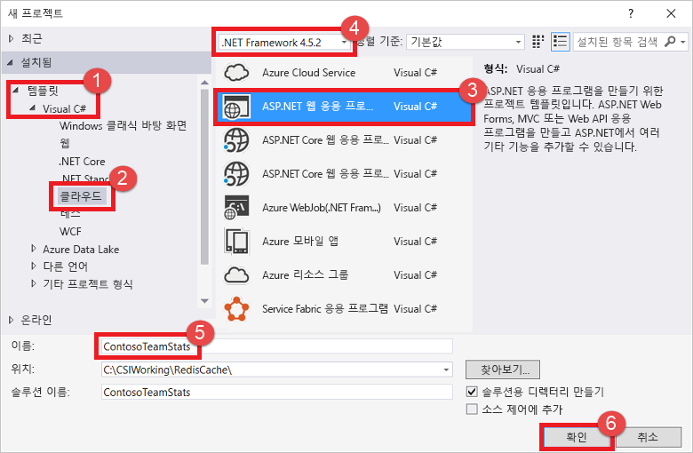
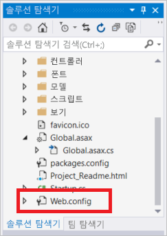
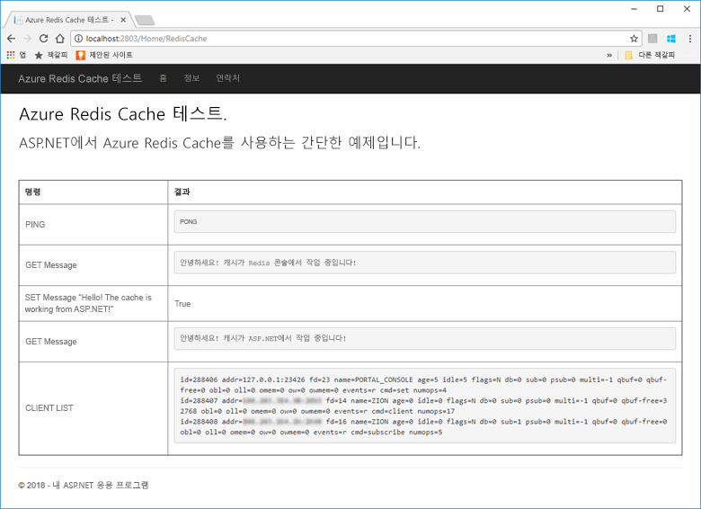
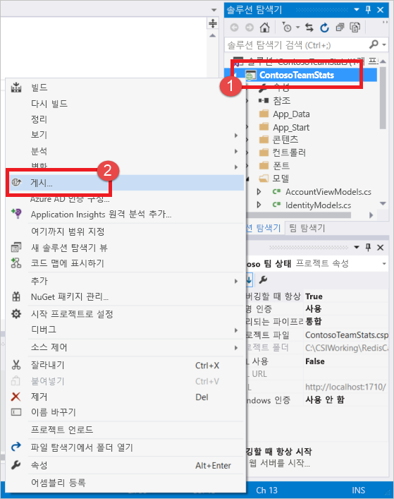
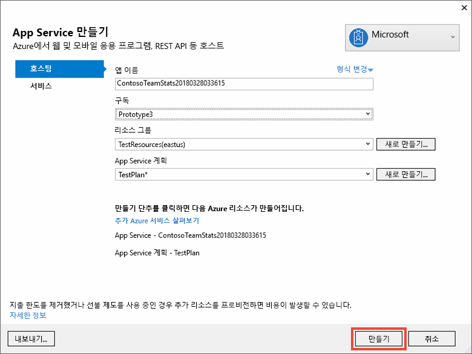
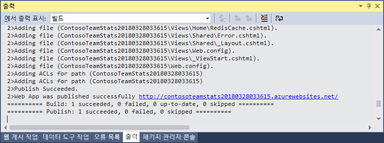
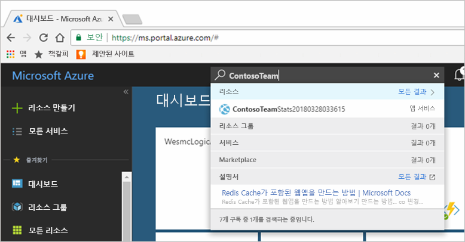
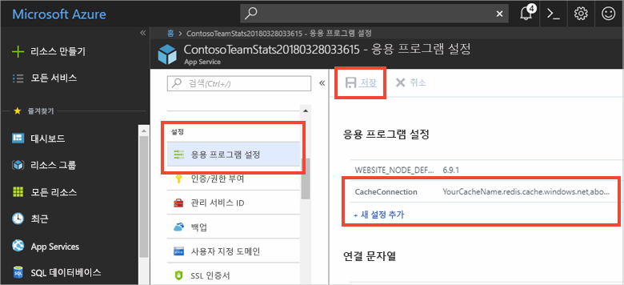
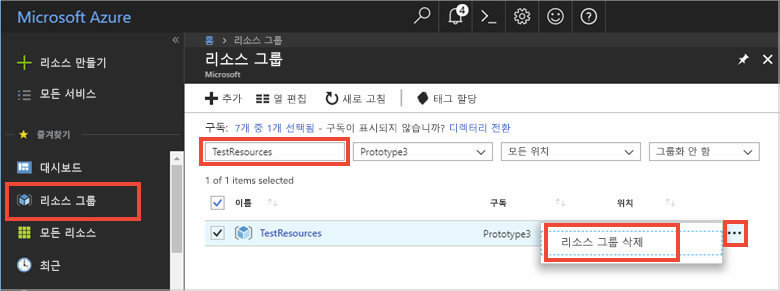

# <a name="quickstart-create-a-aspnet-web-app-with-redis-cache"></a>빠른 시작: Redis Cache를 사용하여 ASP.NET 웹앱 만들기

> [!div class="op_single_selector"]
> * [.NET](cache-dotnet-how-to-use-azure-redis-cache.md)
> * [ASP.NET](cache-web-app-howto.md)
> * [Node.JS](cache-nodejs-get-started.md)
> * [Java](cache-java-get-started.md)
> * [Python](cache-python-get-started.md)
>

## <a name="introduction"></a>소개

이 빠른 시작에서는 Visual Studio 2017을 사용하여 ASP.NET 웹 응용 프로그램을 만들고 Azure App Service에 배포하는 방법을 보여 줍니다. 샘플 응용 프로그램은 Azure Redis Cache에 연결되어 데이터를 저장하고 캐시에서 검색합니다. 빠른 시작을 완료하면 Azure에서 호스팅되며 Azure Redis Cache에서 읽고 쓰는 실행 웹앱을 갖게 됩니다.



## <a name="prerequisites"></a>필수 조건

빠른 시작을 완료하려면 다음 필수 구성 요소가 있어야 합니다.

* 다음 워크로드와 함께 [Visual Studio 2017](https://www.visualstudio.com/downloads/)을 설치합니다.
    * ASP.NET 및 웹 개발
    * Azure 개발

[!INCLUDE [quickstarts-free-trial-note](../../includes/quickstarts-free-trial-note.md)]

## <a name="create-the-visual-studio-project"></a>Visual Studio 프로젝트 만들기

Visual Studio를 열고 **파일**, **새로 만들기**, **프로젝트**를 클릭합니다.



새 프로젝트 대화 상자에서 다음 단계를 수행합니다.

1. **템플릿** 목록에서 **Visual C#** 노드를 확장합니다.
1. **클라우드**를 선택합니다.
1. **ASP.NET 웹 응용 프로그램**을 클릭합니다.
1. **.NET Framework 4.5.2** 이상이 선택되었는지 확인합니다.
1. **이름** 텍스트 상자에서 프로젝트 이름을 지정합니다. 이 예제에서는 **ContosoTeamStats**를 사용합니다.
1. **확인**을 클릭합니다.

새 ASP.NET 웹 응용 프로그램 화면이 나타납니다.


프로젝트 유형으로 **MVC** 를 선택합니다.

**인증** 설정에 **인증 없음**을 지정했는지 확인합니다. Visual Studio의 버전에 따라 다른 기본값을 설정할 수 있습니다. 변경하려면 **인증 변경**을 클릭하고 **인증 없음**을 선택합니다.

**확인**을 클릭하여 프로젝트를 만듭니다.

## <a name="create-a-cache"></a>캐시 만들기

다음으로 앱에 대한 캐시를 만듭니다.

[!INCLUDE [redis-cache-create](../../includes/redis-cache-create.md)]

[!INCLUDE [redis-cache-access-keys](../../includes/redis-cache-access-keys.md)]

컴퓨터에 *CacheSecrets.config*라는 파일을 만들고 이 파일을 샘플 응용 프로그램의 소스 코드에서 체크인하지 않을 위치에 배치합니다. 이 빠른 시작의 경우 *CacheSecrets.config* 파일은 여기에서 *C:\AppSecrets\CacheSecrets.config*에 있습니다.

*CacheSecrets.config* 파일을 편집하여 다음 콘텐츠를 추가합니다.

```xml
<appSettings>
    <add key="CacheConnection" value="<cache-name>.redis.cache.windows.net,abortConnect=false,ssl=true,password=<access-key>"/>
</appSettings>
```

`<cache-name>`을 캐시 호스트 이름으로 바꿉니다.

`<access-key>`를 캐시에 대한 기본 키로 바꿉니다.

> [!TIP]
> 보조 액세스 키는 사용자가 기본 액세스 키를 다시 생성하는 동안 대체 키로 키를 회전하는 기간에 사용됩니다.
>

파일을 저장합니다.

## <a name="update-the-mvc-application"></a>MVC 응용 프로그램 업데이트

이 섹션에서는 Azure Redis Cache에 대해 간단한 테스트를 표시하는 새 보기를 지원하도록 응용 프로그램을 업데이트합니다.

* [캐시에 대한 앱 설정이 포함된 web.config 파일 업데이트](#Update-the-webconfig-file-with-an-app-setting-for-the-cache)
* [StackExchange.Redis 클라이언트를 사용하도록 응용 프로그램 구성](#configure-the-application-to-use-stackexchangeredis)
* [HomeController 및 레이아웃 업데이트](#update-the-homecontroller-and-layout)
* [새 RedisCache 뷰 추가](#add-a-new-rediscache-view)

### <a name="update-the-webconfig-file-with-an-app-setting-for-the-cache"></a>캐시에 대한 앱 설정이 포함된 web.config 파일 업데이트

응용 프로그램을 로컬로 실행하는 경우 *CacheSecrets.config*의 정보는 Azure Redis Cache 인스턴스에 연결하는 데 사용됩니다. 나중에 이 응용 프로그램을 Azure에 배포합니다. 그때 응용 프로그램이 이 파일 대신 캐시 연결 정보를 검색하는 데 사용할 앱 설정을 Azure에서 구성하게 됩니다. *CacheSecrets.config*는 응용 프로그램과 함께 Azure에 배포되지 않으므로 응용 프로그램을 로컬로 테스트하는 동안에만 사용합니다. 캐시 데이터에 대한 악의적인 액세스를 방지하기 위해 이 정보를 최대한 안전하게 유지하려고 합니다.

**솔루션 탐색기**에서 *web.config* 파일을 두 번 클릭하여 엽니다.



*web.config* 파일에서 `<appSetting>` 요소를 찾아 다음과 같은 `file` 특성을 추가합니다. 다른 파일 이름 또는 위치를 사용한 경우, 예제에 나타난 값을 해당 값으로 대체합니다.

* 이전: `<appSettings>`
* 이후: ` <appSettings file="C:\AppSecrets\CacheSecrets.config">`

ASP.NET 런타임은 외부 파일의 내용을 `<appSettings>` 요소의 태그와 병합합니다. 지정된 파일을 찾을 수 없는 경우 런타임에서 파일 특성을 무시합니다. 암호(캐시에 대한 연결 문자열)는 응용 프로그램에 대 한 소스 코드의 일부분으로 포함되지 않습니다. Azure에 웹앱을 배포하는 경우 *CacheSecrests.config* 파일은 배포되지 않습니다.

### <a name="configure-the-application-to-use-stackexchangeredis"></a>StackExchange.Redis를 사용하도록 응용 프로그램 구성

Visual Studio용 [StackExchange.Redis](https://github.com/StackExchange/StackExchange.Redis) NuGet 패키지를 사용하여 앱을 구성하려면 **도구 > NuGet 패키지 관리자 > 패키지 관리자 콘솔**을 클릭합니다.

`Package Manager Console` 창에서 다음 명령을 실행합니다.

```powershell
Install-Package StackExchange.Redis
```

NuGet 패키지는 클라이언트 응용 프로그램이 StackExchange.Redis 캐시 클라이언트를 사용하여 Azure Redis 캐시에 액세스하는 는 데 필요한 어셈블리 참조를 다운로드하고 추가합니다. 강력한 이름의 `StackExchange.Redis` 클라이언트 라이브러리 버전을 사용하려는 경우 `StackExchange.Redis.StrongName` 패키지를 설치합니다.

### <a name="update-the-homecontroller-and-layout"></a>HomeController 및 레이아웃 업데이트

**솔루션 탐색기**에서 **컨트롤러** 폴더를 확장하고 *HomeController.cs* 파일을 엽니다.

파일 맨 위에 다음 두 개의 `using` 문을 추가하여 캐시 클라이언트 및 앱 설정을 지원합니다.

```csharp
using System.Configuration;
using StackExchange.Redis;
```

다음 메서드를 `HomeController` 클래스에 추가하여 새 캐시에 대한 일부 명령을 실행하는 새 `RedisCache` 작업을 지원합니다.

```csharp
    public ActionResult RedisCache()
    {
        ViewBag.Message = "A simple example with Azure Redis Cache on ASP.NET.";

        var lazyConnection = new Lazy<ConnectionMultiplexer>(() =>
        {
            string cacheConnection = ConfigurationManager.AppSettings["CacheConnection"].ToString();
            return ConnectionMultiplexer.Connect(cacheConnection);
        });

        // Connection refers to a property that returns a ConnectionMultiplexer
        // as shown in the previous example.
        IDatabase cache = lazyConnection.Value.GetDatabase();

        // Perform cache operations using the cache object...

        // Simple PING command
        ViewBag.command1 = "PING";
        ViewBag.command1Result = cache.Execute(ViewBag.command1).ToString();

        // Simple get and put of integral data types into the cache
        ViewBag.command2 = "GET Message";
        ViewBag.command2Result = cache.StringGet("Message").ToString();

        ViewBag.command3 = "SET Message \"Hello! The cache is working from ASP.NET!\"";
        ViewBag.command3Result = cache.StringSet("Message", "Hello! The cache is working from ASP.NET!").ToString();

        // Demostrate "SET Message" executed as expected...
        ViewBag.command4 = "GET Message";
        ViewBag.command4Result = cache.StringGet("Message").ToString();

        // Get the client list, useful to see if connection list is growing...
        ViewBag.command5 = "CLIENT LIST";
        ViewBag.command5Result = cache.Execute("CLIENT", "LIST").ToString().Replace(" id=", "\rid=");

        lazyConnection.Value.Dispose();

        return View();
    }
```

**솔루션 탐색기**에서 **Views**>**Shared** 폴더를 확장하고 *_Layout.cshtml* 파일을 엽니다.

다음을

```csharp
@Html.ActionLink("Application name", "Index", "Home", new { area = "" }, new { @class = "navbar-brand" })
```

다음으로 바꿉니다.

```csharp
@Html.ActionLink("Azure Redis Cache Test", "RedisCache", "Home", new { area = "" }, new { @class = "navbar-brand" })
```

### <a name="add-a-new-rediscache-view"></a>새 RedisCache 뷰 추가

**솔루션 탐색기**에서 **뷰** 폴더를 확장한 다음, **Home** 폴더를 마우스 오른쪽 단추로 클릭합니다. **추가** > **뷰...** 를 선택합니다.

뷰 추가 대화 상자에서 뷰 이름으로 **RedisCache**를 입력하고 **추가**를 클릭합니다.

*RedisCache.cshtml* 파일의 코드를 다음 코드로 바꿉니다.

```csharp
@{
    ViewBag.Title = "Azure Redis Cache Test";
}

<h2>@ViewBag.Title.</h2>
<h3>@ViewBag.Message</h3>
<br /><br />
<table border="1" cellpadding="10">
    <tr>
        <th>Command</th>
        <th>Result</th>
    </tr>
    <tr>
        <td>@ViewBag.command1</td>
        <td><pre>@ViewBag.command1Result</pre></td>
    </tr>
    <tr>
        <td>@ViewBag.command2</td>
        <td><pre>@ViewBag.command2Result</pre></td>
    </tr>
    <tr>
        <td>@ViewBag.command3</td>
        <td><pre>@ViewBag.command3Result</pre></td>
    </tr>
    <tr>
        <td>@ViewBag.command4</td>
        <td><pre>@ViewBag.command4Result</pre></td>
    </tr>
    <tr>
        <td>@ViewBag.command5</td>
        <td><pre>@ViewBag.command5Result</pre></td>
    </tr>
</table>
```

## <a name="run-the-app-locally"></a>로컬에서 앱 실행

기본적으로 프로젝트는 테스트 및 디버깅을 위해 [IIS Express](https://docs.microsoft.com/iis/extensions/introduction-to-iis-express/iis-express-overview)에서 앱을 로컬로 호스팅하도록 구성됩니다.

메뉴에 있는 Visual Studio에서 **디버그** > **디버깅 시작**을 클릭하여 테스트 및 디버깅을 위해 앱을 로컬로 빌드하고 시작합니다.

브라우저에서 탐색 모음에서 **Azure Redis Cache 테스트**를 클릭합니다.

아래 예제에서 포털에서 Redis 콘솔을 사용하여 설정되었던 이전에 캐시된 값이 있는 `Message` 키를 볼 수 있습니다. 앱에서 캐시된 값을 업데이트했습니다. 또한 앱에서 `PING` 및 `CLIENT LIST` 명령을 실행했습니다.



## <a name="publish-and-run-in-azure"></a>Azure에서 게시 및 실행

앱을 로컬로 성공적으로 테스트하면 Azure에 앱을 배포하고 클라우드에서 실행합니다.

### <a name="publish-the-app-to-azure"></a>Azure에 앱 게시

Visual Studio의 솔루션 탐색기에서 프로젝트를 마우스 오른쪽 단추로 클릭하고 **게시**를 선택합니다.



**Microsoft Azure App Service**를 클릭하고 **새로 만들기**를 선택한 다음, **게시**를 클릭합니다.


**App Service 만들기** 대화 상자에서 다음과 같이 변경합니다.

| 설정 | 권장되는 값 | 설명 |
| ------- | :---------------: | ----------- |
| **앱 이름** | 기본값 사용 | 앱 이름은 Azure에 배포할 때 앱에 사용하는 호스트 이름이 됩니다. 이름을 고유하게 만들어야 하는 경우 타임스탬프 접미사가 있을 수 있습니다. |
| **구독** | Azure 구독 선택 | 이 구독은 모든 관련된 호스팅 요금이 청구됩니다. 여러 Azure 구독이 있는 경우 원하는 구독이 선택되어 있는지 확인합니다.|
| **리소스 그룹** | 캐시를 만든 것과 동일한 리소스 그룹을 사용합니다. 예를 들어 *TestResourceGroup*입니다. | 리소스 그룹은 모든 리소스를 그룹으로 관리하려는 경우 유용합니다. 나중에 앱을 삭제하려는 경우 그룹만 삭제할 수 있습니다. |
| **App Service 계획** | **새로 만들기**를 클릭하여 *TestingPlan*이라는 새 App Service 계획을 만듭니다. <br />캐시를 만들 때 사용했던 것과 동일한 **위치**를 사용합니다. <br />크기에 대해 **무료**를 선택합니다. | App Service 계획은 실행할 웹앱에 대한 계산 리소스 집합을 정의합니다. |



App Service 호스팅 설정을 구성했으면 **만들기**를 클릭하여 앱에 대한 새 App Service를 만듭니다.

Visual Studio에서 **출력** 창을 모니터링하여 Azure에 대한 게시 상태를 확인합니다. 게시가 성공적으로 완료되면 아래와 같이 App Service에 대한 URL이 기록됩니다.



### <a name="add-the-app-setting-for-the-cache"></a>캐시에 대한 앱 설정 추가

게시가 새 App Service에 대해 완료되면 새 앱 설정을 추가합니다. 이 설정은 캐시 연결 정보를 저장하는 데 사용됩니다. 방금 만든 새 App Service를 찾으려면 Azure Portal의 위쪽에 있는 검색 표시줄에 앱 이름을 입력합니다.



캐시에 연결하는 데 사용할 앱에 대해 **CacheConnection**이란 이름의 새 앱 설정을 추가합니다. 사용자의 *CacheSecrets.config* 파일에서 `CacheConnection`에 대해 구성한 것과 동일한 값을 사용합니다. 키에는 캐시 호스트 이름 및 액세스 키가 포함됩니다.



### <a name="run-the-app-in-azure"></a>Azure에서 앱 실행

브라우저에서 App Service에 대한 URL로 이동합니다. URL은 Visual Studio의 출력 창에 게시 작업의 결과로 표시됩니다. 또한 사용자가 만든 App Service의 개요 페이지의 Azure Portal에도 제공됩니다.

캐시 액세스를 테스트하려면 탐색 모음에서 **Azure Redis Cache 테스트**를 클릭합니다.


## <a name="clean-up-resources"></a>리소스 정리

다음 자습서를 계속 진행하려는 경우 이 빠른 시작에서 만든 리소스를 그대로 두었다가 다시 사용할 수 있습니다.

또는, 빠른 시작 샘플 응용 프로그램 사용을 마친 경우 이 빠른 시작에서 만든 Azure 리소스를 삭제하여 요금이 청구되는 것을 방지할 수 있습니다. 

> [!IMPORTANT]
> 리소스 그룹 삭제는 취소할 수 없으며 해당 리소스 그룹 및 해당 그룹 안에 있는 모든 리소스는 영구적으로 삭제됩니다. 잘못된 리소스 그룹 또는 리소스를 자동으로 삭제하지 않도록 해야 합니다. 유지하려는 리소스가 포함된 기존 리소스 그룹 내에 이 샘플을 호스트하기 위한 리소스를 만든 경우 리소스 그룹을 삭제하는 대신, 해당 블레이드에서 각 리소스를 개별적으로 삭제할 수 있습니다.
>

[Azure 포털](https://portal.azure.com) 에 로그인하고 **리소스 그룹**을 클릭합니다.

**이름을 기준으로 필터링...** 텍스트 상자에 리소스 그룹의 이름을 입력합니다. 이 항목의 지침에서는 *TestResources*라는 리소스 그룹을 사용했습니다. 결과 목록의 리소스 그룹에서 **...** 를 클릭한 다음, **리소스 그룹 삭제**를 클릭합니다.



리소스 그룹을 삭제할지 확인하는 메시지가 표시됩니다. 리소스 그룹의 이름을 입력하여 확인한 후 **삭제**를 클릭합니다.

잠시 후 리소스 그룹 및 해당 그룹에 포함된 모든 리소스가 삭제됩니다.

## <a name="next-steps"></a>다음 단계

다음이 자습서에서는 실제 업무 시나리오에서 Azure Redis Cache를 사용하여 앱의 성능을 향상시킵니다. ASP.NET 및 데이터베이스와 캐시 배제 패턴을 사용하여 순위표 결과를 캐시하도록 이 응용 프로그램을 업데이트합니다.

> [!div class="nextstepaction"]
> [ASP.NET에서 캐시 배제 순위표 만들기](cache-web-app-cache-aside-leaderboard.md)
